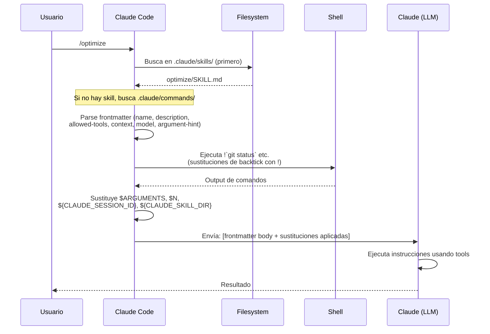
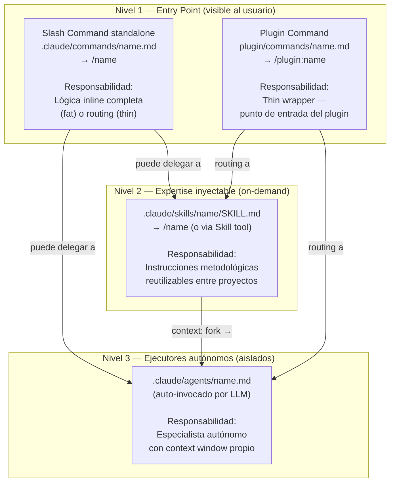
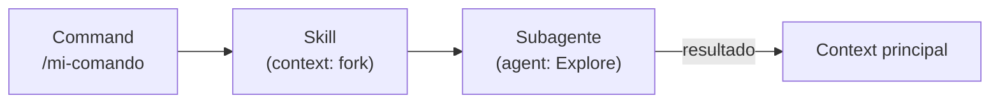
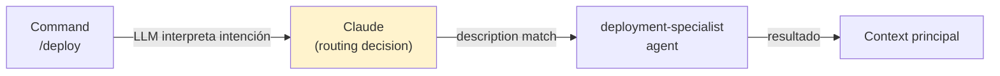
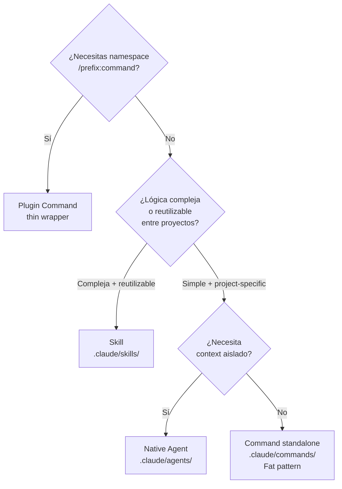
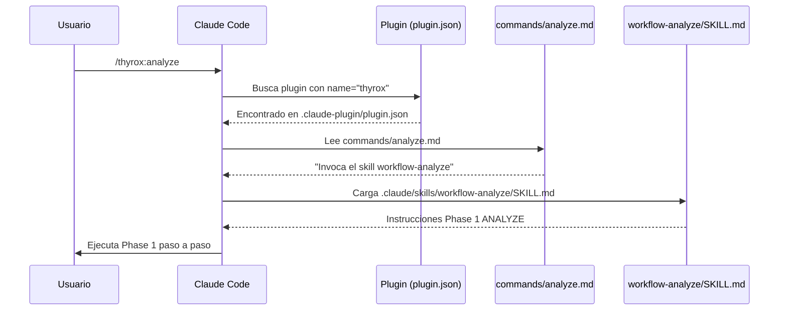

```yml
type: Reference
category: Claude Code Platform — Command Architecture
version: 1.0
purpose: Flujo de ejecución de commands, responsabilidades por componente, y patrones fat vs thin
source: claude-howto deep-review (01-slash-commands, 03-skills, 04-subagents, 07-plugins)
updated_at: 2026-04-14 20:07:24
```

# Command Execution Model — Responsabilidades y Flujo

Referencia de cómo se ejecutan los commands en Claude Code, qué responsabilidad
tiene cada componente, y cuándo usar cada patrón.

> **Relación con otros references:**
> - `skill-vs-agent.md` — cuándo crear un skill vs un agente (decisión estática de diseño)
> - `tool-execution-model.md` — flujos de Edit/Write y permission model
> - `plugins.md` — estructura de plugins y distribución
> Este document cubre: qué ocurre en runtime cuando el usuario escribe `/command`.

---

## Tipos de Commands

Existen cuatro tipos distintos de commands en Claude Code:

| Tipo | Ejemplo | Origen |
|------|---------|--------|
| **Built-in** | `/help`, `/clear`, `/model` | Incluido en el binario de Claude Code |
| **Skill / Legacy Command** | `/optimize`, `/pr` | `.claude/skills/<name>/SKILL.md` o `.claude/commands/<name>.md` |
| **Plugin Command** | `/thyrox:analyze` | `plugin/commands/<name>.md` + `plugin.json::name` |
| **MCP Prompt** | `/mcp__github__list_prs` | Expuesto por un MCP server activo |

> Fuente: `01-slash-commands/README.md:10-16`

### MCP Prompts como Commands

Los MCP servers pueden exponer prompts como slash commands con la sintaxis:

```
/mcp__<server-name>__<prompt-name> [arguments]
```

**Ejemplos:**
```bash
/mcp__github__list_prs
/mcp__github__pr_review 456
/mcp__jira__create_issue "Bug title" high
```

El control de acceso a MCP servers sigue la misma sintaxis de permisos:
- `mcp__github` — acceso completo al server GitHub
- `mcp__github__*` — wildcard a todos los tools del server
- `mcp__github__get_issue` — acceso a un tool específico

> Fuente: `01-slash-commands/README.md:283-302`

---

## Convergencia Commands = Skills (post-merge)

> Fuente: `01-slash-commands/README.md:17`

"Custom slash commands have been merged into skills. Files in `.claude/commands/` still
work, but skills (`.claude/skills/`) are now the recommended approach."

**Implicación práctica:** Un archivo en `.claude/commands/name.md` y un directorio
`.claude/skills/name/SKILL.md` son equivalentes en invocación — ambos responden a `/name`.

**Regla de precedencia:** Si ambos existen para el mismo nombre, **el skill gana**.
Los commands son el formato legacy; los skills son el formato actual.

---

## Flujo de Ejecución — Paso a Paso

Cuando el usuario escribe `/optimize` (o `/thyrox:analyze`):



> Fuente: `01-slash-commands/README.md:326-341`

### Sustituciones disponibles en el body del command/skill

| Variable | Valor |
|----------|-------|
| `$ARGUMENTS` | Todo lo que el usuario escribió después del nombre del comando |
| `$0`, `$1`, `$N` | Argumentos posicionales (base-0) |
| `${CLAUDE_SESSION_ID}` | ID único de la sesión actual |
| `${CLAUDE_SKILL_DIR}` | Path absoluto al directorio del skill |
| `` !`comando bash` `` | Ejecutado en shell; Claude ve el output, no el comando |
| `@path/to/file` | Incluye el contenido del archivo referenciado (contexto estático) |

**Ejemplos de argumentos posicionales:**
```yaml
# /review-pr 456 high → $0="456", $1="high"
Review PR #$0 with priority $1
```

**Ejemplos de file references:**
```markdown
Review the implementation in @src/utils/helpers.js
Compare @src/old-version.js with @src/new-version.js
```

> Fuente: `01-slash-commands/README.md:208-265`

---

## Frontmatter Fields — Referencia Completa

| Campo | Propósito | Default |
|-------|-----------|---------|
| `name` | Nombre del command (se convierte en `/name`) | Nombre del directorio |
| `description` | Descripción breve (guía al LLM para auto-invocar) | Primer párrafo |
| `argument-hint` | Argumentos esperados para auto-completado | Ninguno |
| `allowed-tools` | Tools que el command puede usar sin pedir permiso | Hereda |
| `model` | Modelo específico a usar | Hereda |
| `context` | `fork` para ejecutar en subagente aislado | Ninguno |
| `agent` | Tipo de agente cuando se usa `context: fork` | `general-purpose` |
| `disable-model-invocation` | Si `true`, solo el usuario puede invocar (no Claude automáticamente) | `false` |
| `user-invocable` | Si `false`, oculta el command del menú `/` | `true` |
| `hooks` | Hooks con scope de skill (PreToolUse, PostToolUse, Stop) | Ninguno |

> Fuente: `01-slash-commands/README.md:193-203`

### Control de invocación: `disable-model-invocation` vs `user-invocable`

Estos dos campos controlan **quién puede invocar** el command:

| Campo | Efecto |
|-------|--------|
| `disable-model-invocation: true` | Claude NO puede invocar automáticamente. Solo el usuario. Usar para commands con side effects (deploy, push). |
| `user-invocable: false` | No aparece en el menú `/`. Solo accesible si Claude lo invoca internamente. |

**Ejemplo: command de deploy con side effects**
```yaml
---
name: deploy
description: Deploy to production
disable-model-invocation: true
allowed-tools: Bash(npm *), Bash(git *)
---
Deploy the application to production...
```

> Fuente: `01-slash-commands/README.md:493-511`

---

## Responsabilidades por Componente



| Componente | Lógica propia | Context aislado | Invocación usuario | Invocación auto-LLM |
|------------|:-------------:|:---------------:|:------------------:|:-------------------:|
| Command standalone | Sí (fat) o no (thin) | No | Sí (`/name`) | No |
| Plugin command | Minimal (thin) | No | Sí (`/plugin:name`) | No |
| Skill | Instrucciones declarativas | Con `context: fork` | Sí (`/name`) | Sí |
| Native Agent | System prompt + tools | Siempre | Vía Agent tool | Sí (auto-routing) |

> Fuente: `04-subagents/README.md:1104`

---

## Dos Patrones de Command

### Patrón A — Fat Command (lógica propia)

El command contiene su propio algoritmo completo. No delega a ningún skill ni agente.

**Cuándo usar:**
- Tarea simple y autocontenida
- Pocos pasos, output no verboso
- No necesita reutilización en otros contextos
- No requiere context aislado

**Ejemplo real** (`01-slash-commands/push-all.md`):
```markdown
---
name: Push All
description: Safely stages, commits, and pushes all changes
allowed-tools: Bash, Read
---

## Steps
1. Run: !`git status` and !`git diff HEAD`
2. STOP if you detect .env*, *.key or *_API_KEY with real values
3. Generate commit message following Conventional Commits
4. Ask: "Proceed with push? (yes/no)" — WAIT for explicit 'yes'
5. git add -A && git commit -m "..." && git push
6. Handle errors: [auth failure → instructions] [conflict → rebase] [rejected → explain]
```

Toda la lógica (safety checks, confirmación, error handling) vive en el command.

### Patrón B — Thin Wrapper (routing)

El command articula intención de alto nivel. La lógica real vive en agents o skills del plugin.

**Cuándo usar:**
- Plugin commands (entry point → agentes especializados)
- Commands que invocan skills metodológicos complejos
- Cuando la lógica debe ser reutilizable en otros contextos
- Cuando el output sería verboso y pollutaría el context

**Ejemplo real** (`07-plugins/pr-review/commands/review-pr.md`):
```markdown
---
name: Review PR
description: Start comprehensive PR review with security and testing checks
---

# PR Review
1. Security analysis
2. Test coverage verification
3. Documentation updates
4. Code quality checks
5. Performance impact assessment
```

La lógica real la ejecutan los agentes `security-reviewer`, `test-checker`, `performance-analyzer`
del mismo plugin.

---

## Dos Formas de Delegación desde un Command

### Delegación explícita — `context: fork` en el skill

```yaml
# .claude/skills/mi-skill/SKILL.md
---
context: fork
agent: Explore
---
Investiga $ARGUMENTS exhaustivamente...
```

- El body del skill se convierte en el **task prompt de un subagente**
- El campo `agent` especifica el tipo: `Explore`, `Plan`, `general-purpose`, custom
- El context está garantizadamente aislado — hardcoded en el frontmatter
- El command NO puede evitar el fork — si el skill lo tiene, siempre forkea



### Delegación probabilística — routing por description del agente

```markdown
# commands/deploy.md
Despliega la aplicación siguiendo el deployment checklist completo...
```

```yaml
# .claude/agents/deployment-specialist.md
description: Maneja deploys siguiendo checklist. Usar cuando se necesita deploy a producción.
```

- El LLM lee el command content, infiere la intención
- Busca agentes cuya `description` coincida con la intención
- Decide autónomamente delegar al `deployment-specialist`
- El routing puede fallar si las descriptions son ambiguas



**Diferencia clave:** `context: fork` es determinista. El routing por description es probabilístico — depende de que las descriptions sean claras y no ambiguas.

---

## Plugin Commands vs Commands Standalone

### Namespace

| Tipo | Archivo | Comando resultante |
|------|---------|-------------------|
| Standalone | `.claude/commands/analyze.md` | `/analyze` |
| Plugin | `plugin/commands/analyze.md` + `plugin.json::name="thyrox"` | `/thyrox:analyze` |

El `:` es **exclusivo de plugins**. No existe "project namespace" para commands standalone.

### Responsabilidad

| Aspecto | Standalone | Plugin command |
|---------|-----------|----------------|
| Lógica propia | Sí (fat) o no (thin) | Siempre thin — routing a agentes/skills del plugin |
| Distribución | Manual (copiar archivos) | `/plugin install name` |
| Context isolation | Solo via `context: fork` | Via agentes del plugin |

### Restricciones de seguridad en subagentes de plugin

Los subagentes declarados **dentro de un plugin** (`plugin/agents/*.md`) tienen campos prohibidos:

```
❌ hooks       — no pueden definir lifecycle hooks
❌ mcpServers  — no pueden configurar MCP servers
❌ permissionMode — no pueden override el modelo de permisos
```

Los agentes standalone en `.claude/agents/` no tienen estas restricciones.

> Fuente: `07-plugins/README.md:709-715`, `04-subagents/README.md:730-738`

---

## Scope de Instalación — Global vs Project

Los commands y skills pueden instalarse en dos scopes:

| Scope | Path | Disponibilidad |
|-------|------|----------------|
| **Project** | `.claude/skills/<name>/` o `.claude/commands/<name>.md` | Solo en este proyecto |
| **Global** | `~/.claude/skills/<name>/` o `~/.claude/commands/<name>.md` | En todos los proyectos del usuario |

**Regla de precedencia cuando hay conflicto:** Los commands de proyecto tienen prioridad
sobre los globales.

> Fuente: `01-slash-commands/README.md:449-458`

---

## Bundled Skills (Built-in)

Claude Code incluye 5 skills predefinidos accesibles como commands desde cualquier proyecto:

| Skill | Propósito |
|-------|-----------|
| `/batch <instruction>` | Orquesta cambios en paralelo a gran escala usando worktrees |
| `/claude-api` | Carga referencia de Claude API para el lenguaje del proyecto |
| `/debug [description]` | Habilita debug logging |
| `/loop [interval] <prompt>` | Ejecuta un prompt repetidamente en intervalos |
| `/simplify [focus]` | Revisa archivos modificados para calidad de código |

Estos skills no requieren configuración — vienen con el binario.

> Fuente: `01-slash-commands/README.md:91-100`

---

## Árbol de Decisión: ¿Qué tipo de componente crear?



---

## Ejemplo THYROX — Cadena completa de `/thyrox:analyze`



El command (`analyze.md`) tiene responsabilidad de **descubribilidad y routing**.
El skill (`workflow-analyze/SKILL.md`) tiene responsabilidad de **metodología y ejecución**.

---

## Best Practices

> Fuente: `01-slash-commands/README.md:515-519`

```
✅ DO:   Keep commands focused on single task
✅ DO:   Use $ARGUMENTS for parameterization
✅ DO:   Add argument-hint in frontmatter for discoverability
✅ DO:   Use disable-model-invocation for commands with side effects
✅ DO:   Use ! prefix for dynamic context (shell output in body)
✅ DO:   Organize related files in skill directories
❌ DON'T: Build complex logic that should be in a skill/agent
❌ DON'T: Duplicate logic that already exists in a skill
❌ DON'T: Create commands for one-off tasks (use chat instead)
❌ DON'T: Hardcode sensitive information in command files
❌ DON'T: Skip the description field (breaks auto-invocation)
```

---

## Troubleshooting

### Command not found

- Verificar que el archivo está en `.claude/skills/<name>/SKILL.md` o `.claude/commands/<name>.md`
- Verificar que el campo `name` en frontmatter coincide con el nombre esperado
- Reiniciar la sesión de Claude Code
- Ejecutar `/help` para ver los commands disponibles

### Command no ejecuta como se esperaba

- Agregar instrucciones más específicas al body
- Incluir ejemplos en el skill file
- Verificar `allowed-tools` si el command usa bash
- Probar con inputs simples primero

### Conflicto skill vs command con mismo nombre

Si ambos existen con el mismo nombre, el **skill tiene prioridad**. Eliminar uno o renombrarlo.

> Fuente: `01-slash-commands/README.md:524-544`

---

## Referencias Relacionadas

- [`skill-vs-agent.md`](skill-vs-agent.md) — decisión de diseño: cuándo crear cada tipo
- [`plugins.md`](plugins.md) — estructura de plugins, distribución, manifest
- [`tool-execution-model.md`](tool-execution-model.md) — flujos Edit/Write y permission model
- [`subagent-patterns.md`](subagent-patterns.md) — context isolation, worktree, background agents
- [`agent-spec.md`](agent-spec.md) — spec formal de agentes nativos (campos, naming)
- [`claude-code-components.md`](claude-code-components.md) — referencia oficial de todos los campos
