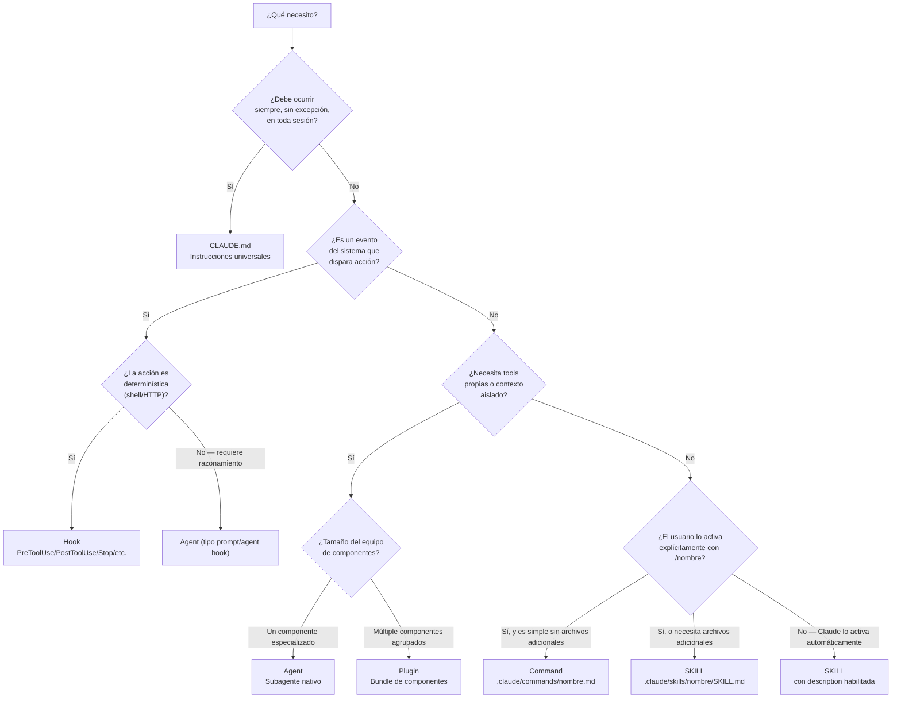

```yml
type: Reference
title: Component Decision — Flowchart SKILL vs CLAUDE.md vs Agent vs Hook vs Plugin vs Command
category: Authoring — Decisión de componente
version: 1.0
created_at: 2026-04-13
owner: thyrox (cross-phase)
purpose: Flowchart para elegir el componente correcto según el tipo de automatización o instrucción
```

# Component Decision — Flowchart SKILL vs CLAUDE.md vs Agent vs Hook vs Plugin vs Command

Guía de decisión para elegir el tipo correcto de componente Claude Code. La pregunta equivocada es "¿qué puedo usar?". La correcta es "¿qué mecanismo hace lo que necesito de forma natural?".

Para profundidad en cada tipo:
- [skill-authoring.md](skill-authoring.md) — crear y mantener SKILLs
- [claude-authoring.md](claude-authoring.md) — crear y mantener CLAUDE.md
- [agent-authoring.md](agent-authoring.md) — crear agentes nativos
- [hook-authoring.md](hook-authoring.md) — crear hooks

---

## 1. Diagrama de decisión



**Regla de desempate:** Si todavía hay ambigüedad después del diagrama, aplicar la regla de las preguntas clave de la sección 5.

---

## 2. Tabla comparativa de los 6 tipos

| Tipo | Cuándo usar | Alcance | Persiste | Disparo | Ejemplo |
|------|-------------|---------|---------|---------|---------|
| **SKILL** | Metodología/conocimiento on-demand | Inline en sesión | No (hasta invocarse) | Model auto o `/nombre` | `workflow-execute`, `api-conventions` |
| **CLAUDE.md** | Instrucciones que aplican SIEMPRE | Toda sesión | Sí — cargado siempre | Automático al inicio | Convenciones de commits, estructura del proyecto |
| **Agent** | Tarea especializada con tools propias o contexto aislado | Propio context window | Opcional (`memory:`) | Auto por routing o `@mention` | `task-executor`, `secure-reviewer` |
| **Hook** | Acción determinística ante evento del sistema | Sistema (no LLM) | No (configurado en settings) | Evento del sistema (PostToolUse, Stop, etc.) | sync-state, pre-flight check, logging |
| **Plugin** | Bundle de múltiples componentes distribuibles | Donde está instalado | No | Según componente incluido | `thyrox` plugin con skills + agents + hooks |
| **Command** | Slash command simple sin archivos adicionales | Inline en sesión | No | `/nombre` explícito del usuario | `/commit`, `/review` (simples) |

**Columna "Persiste":** Se refiere a si el componente mantiene estado entre sesiones. Todos los componentes "persisten" como archivos en git — la columna habla de si mantienen estado de ejecución.

---

## 3. Regla rápida memorizable por tipo

| Tipo | Regla en 1 línea |
|------|-----------------|
| **SKILL** | "Metodología que Claude aplica cuando es relevante" |
| **CLAUDE.md** | "Reglas que aplican en TODA sesión sin excepción" |
| **Agent** | "Especialista autónomo con su propio contexto y herramientas" |
| **Hook** | "Script que corre automáticamente ante un evento del sistema" |
| **Plugin** | "Bundle de componentes para distribuir o agrupar" |
| **Command** | "Atajo slash para el usuario — simple, sin archivos adicionales" |

---

## 4. Casos concretos del proyecto THYROX

### Caso: Sistema de gestión de proyectos (12 stages)

**Componente:** SKILL (`thyrox/SKILL.md`)

Por qué: Es una metodología de trabajo que Claude aplica cuando el usuario trabaja en un WP. No aplica en toda sesión (solo cuando hay trabajo activo). El usuario puede invocarlo directamente. Necesita archivos adicionales (`references/`, `scripts/`).

### Caso: Ejecutar Phase 6 EXECUTE del ciclo PM

**Componente:** SKILL con `disable-model-invocation: true` (`workflow-execute/SKILL.md`)

Por qué: El usuario decide cuándo ejecutar una fase. Claude no debe decidirlo solo. Body extenso que no debe estar en context a menos que se use.

### Caso: Convenciones de commits, estructura del proyecto, glosario

**Componente:** CLAUDE.md

Por qué: Aplica en TODA sesión sin excepción. Claude siempre debe conocer los Conventional Commits y la estructura de `.claude/`.

### Caso: Revisor de seguridad con herramientas restringidas

**Componente:** Agent (`secure-reviewer.md`) con `tools: Read, Grep`

Por qué: Necesita tools propias (solo Read/Grep — sin Write). Se puede ejecutar en paralelo. Contexto aislado del principal.

### Caso: Detectar stack tecnológico del proyecto

**Componente:** Agent (`tech-detector.md`)

Por qué: Tarea acotada que produce output verboso (análisis de archivos). El resultado solo vuelve como resumen.

### Caso: Sincronizar estado cuando Claude escribe un archivo de WP

**Componente:** Hook (`PostToolUse Write` + matcher `/context/work/*`)

Por qué: Debe ocurrir automáticamente cada vez que Claude escribe un archivo WP. Determinístico. No requiere razonamiento del LLM.

### Caso: Interfaz pública `/thyrox:*` commands

**Componente:** Plugin (`.claude-plugin/plugin.json`) + skills internos

Por qué: Bundle de comandos para el usuario final que envuelven los workflow-* skills internos. El plugin crea un namespace presentable (`/thyrox:analyze`, `/thyrox:execute`, etc.).

---

## 5. Casos ambiguos — cómo resolver

### Caso ambiguo: "Guía de estilo de escritura del equipo"

**¿CLAUDE.md o SKILL?**

Preguntas a responder:
1. ¿Aplica en toda sesión sin excepción? Si es "siempre que escribo código o docs del equipo" → sí
2. ¿Es extenso (>100 líneas)? Si sí, el costo de cargar siempre es alto

**Resolución:**
- Si son 5-10 reglas fundamentales que siempre aplican → CLAUDE.md
- Si es una guía extensa de 50+ reglas para contextos específicos → SKILL con `paths:` o `disable-model-invocation: true`
- Patrón híbrido: las 3-5 reglas más críticas en CLAUDE.md + el resto en un SKILL referenciado

### Caso ambiguo: "Validar que los PRs tienen descripción antes de hacer merge"

**¿Hook o Agent?**

Preguntas a responder:
1. ¿La validación es determinística (script)? → Hook
2. ¿Requiere leer el PR y razonar sobre si es suficiente? → Agent o Hook tipo `prompt`

**Resolución:**
- Verificar que existe el campo descripción (regex) → Hook `command`
- Evaluar si la descripción es suficientemente descriptiva → Hook `prompt` o Agent
- Regla general: si puede implementarse como script bash/python sin LLM → Hook `command`

### Caso ambiguo: "Convenciones de la API REST del proyecto"

**¿CLAUDE.md o SKILL?**

**Resolución:**
- Si son 3-4 reglas absolutas (ej: siempre usar versionado `/api/v1/`) → CLAUDE.md
- Si es una guía de 30+ reglas de diseño de API → SKILL con `paths: "src/api/**"`
- Patrón recomendado: reglas no-negociables en CLAUDE.md, guía completa en SKILL con paths

### Caso ambiguo: "Generador de código boilerplate para un nuevo módulo"

**¿Command o SKILL?**

**Resolución:**
- Si el comando genera un archivo simple sin necesidad de archivos de referencia → Command
- Si necesita templates, scripts de validación, o lógica compleja → SKILL
- En la práctica: la mayoría de generadores de código no triviales son SKILLs

---

## 6. Anti-patrones

### Agent como CLAUDE.md (el más costoso)

```yaml
# Anti-patrón: crear un agente para "instrucciones generales"
---
name: general-assistant
description: Asistente general que sigue las convenciones del proyecto
---

Siempre usa TypeScript strict mode.
Siempre escribe tests para código nuevo.
Los commits deben seguir Conventional Commits.
```

**Por qué es un anti-patrón:** Estas instrucciones deben estar en CLAUDE.md. Al ponerlas en un agente, solo aplican cuando el agente está activo. El overhead de crear un subagente para instrucciones universales es injustificado.

### Hook como SKILL (pierde el determinismo)

```yaml
# Anti-patrón: poner lógica de validación en un SKILL
---
name: pre-commit-check
description: Verifica que el código cumple los estándares antes de commitear
---
Antes de hacer commit, verificar:
1. Los tests pasan
2. El linting está limpio
3. No hay secrets hardcoded
```

**Por qué es un anti-patrón:** El SKILL es probabilístico — Claude puede o no activarlo. Si la validación debe ocurrir siempre antes de un commit, usar un Hook `PreToolUse` con matcher `Bash(git commit*)`.

### Plugin cuando basta un Command

Crear un plugin completo para un único slash command simple. Los plugins son overhead significativo (plugin.json, namespace, distribución). Si solo necesitas un comando simple → usar `.claude/commands/nombre.md`.

### SKILL para instrucciones de sesión única

```yaml
# Anti-patrón: SKILL para algo que solo aplica en una tarea puntual
---
name: migration-helper
description: Ayuda a migrar de PostgreSQL 14 a 16
---
```

Si es una tarea de una semana en un proyecto específico, mejor hacerlo como instrucción directa en la conversación o en un documento de trabajo (WP context). Un SKILL permanente para una migración puntual aumenta el noise de skills disponibles.

### Command con archivos adicionales (debería ser SKILL)

```
.claude/commands/deploy.md  →  references otro archivo como "ver deploy-guide.md"
```

Si el command necesita referenciar archivos adicionales, templates o scripts → usar SKILL. Los Commands son para instrucciones auto-contenidas simples.

---

## Referencias

- [skill-authoring.md](skill-authoring.md) — Cómo crear SKILLs efectivos
- [claude-authoring.md](claude-authoring.md) — Cómo estructurar CLAUDE.md
- [agent-authoring.md](agent-authoring.md) — Cómo crear agentes nativos
- [hook-authoring.md](hook-authoring.md) — Cómo crear hooks
- [skill-vs-agent.md](skill-vs-agent.md) — Comparativa detallada SKILL vs Agent con ejemplos de THYROX
- [claude-code-components.md](claude-code-components.md) — Referencia técnica oficial de todos los componentes
- [plugins.md](plugins.md) — Documentación de plugins
