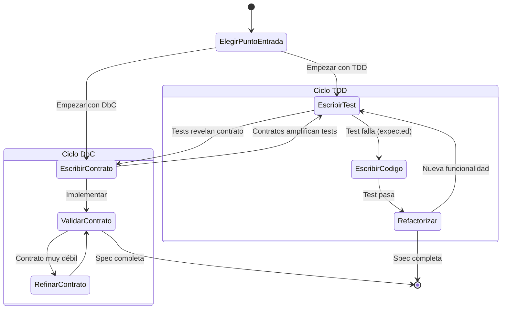
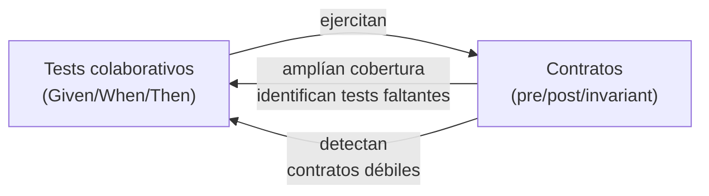
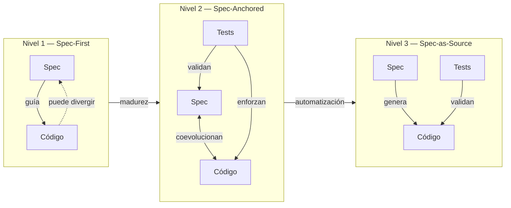
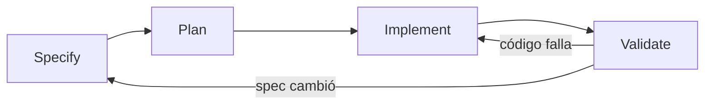

```yml
type: Reference
category: Metodología de Especificación
version: 2.0
purpose: Specification-Driven Development (SDD) — combina TDD y DbC para especificaciones completas y verificables. Incluye tres niveles de rigor y workflow Specify→Plan→Implement→Validate.
source: "Ostroff, Makalsky, Paige — Agile Specification-Driven Development; Spec-Driven Development: From Code to Contract in the Age of AI"
updated_at: 2026-04-14 20:07:55
```

# Specification-Driven Development (SDD)

SDD combina **Test-Driven Development (TDD)** y **Design-by-Contract (DbC)** en un
ciclo único. Los tests y los contratos son dos tipos distintos de especificación —
complementarios, no competidores.

> "Both tests and contracts are different types of specifications, and both are useful
> and complementary for building high quality software."
> — Ostroff, Makalsky, Paige

---

## Los dos tipos de especificación

### Collaborative Specifications (TDD — tests)

Capturan **comportamiento emergente en escenarios concretos**:

```
Given una cuenta con balance $900
When se hace un retiro de $500
Then el balance es $400 y la transacción tuvo éxito
```

**Ventajas:**
- Fáciles de escribir para comportamiento traza (LIFO, secuencias, interacciones)
- Proporcionan punto de cierre claro (el test pasa = unidad lista)
- Amigables para especificaciones colaborativas entre componentes

**Limitaciones:**
- Incompletos: un test cubre un escenario, no todos los inputs posibles
- No documentan precondiciones
- No pueden capturar propiedades universales sin enumerar infinitos casos

### Contractual Specifications (DbC — contratos)

Capturan **comportamiento completo mediante precondiciones, postcondiciones e invariantes**:

```
sort(array):
  require:  count_positive: count > 0
            elements_not_void: ∀i | lower ≤ i ≤ upper • item(i) ≠ Void
  ensure:   sorted: ∀i | lower ≤ i ≤ upper • item(i) ≤ item(i+1)
            count_unchanged: count = old count
```

**Ventajas:**
- Completos: aplican a todos los inputs posibles, no solo a los testeados
- Documentan explícitamente precondiciones
- Actúan como **amplificadores de tests** (los tests ejecutan y validan los contratos)
- Auto-documentan la interfaz de componentes

**Limitaciones:**
- No capturan propiedades traza (ej: LIFO en stacks requiere tests colaborativos)
- Más difíciles de escribir en etapas tempranas cuando los escenarios aún se refinan

---

## El ciclo SDD



**El ciclo no tiene punto de entrada fijo** — puede empezar con tests o con contratos
según el contexto del proyecto.

**Preferencia para empezar con tests:**
1. **Closure** — el test define un punto de cierre claro (pasa = listo)
2. **Collaborative-friendly** — las interacciones entre componentes se capturan mejor con tests que con contratos en etapas tempranas

---

## Sinergias SDD (SDD > max(TDD, DbC))

| TDD le falta | DbC lo tiene |
|-------------|-------------|
| Documentación de diseño | Auto-documentación via contratos |
| Especificación completa de interfaz | Contratos y specs contractuales |

| TDD lo tiene | DbC le falta |
|-------------|-------------|
| Especificaciones colaborativas | Unidades de funcionalidad |
| Tests automatizados | Herramientas sistemáticas de regresión |

**Sinergia clave: Los contratos como amplificadores de tests**



---

## Estructura de una especificación SDD

Una spec SDD completa tiene dos secciones complementarias:

### Sección 1 — Collaborative Specifications

```markdown
## Escenarios (TDD)

### Escenario nominal
Given [estado inicial]
When  [acción]
Then  [resultado esperado]
And   [condición adicional verificable]

### Escenario alternativo
Given [estado inicial con variante]
When  [acción]
Then  [resultado diferente]

### Escenario de error / precondición violada
Given [estado que viola precondición]
When  [acción]
Then  [error explícito, NO comportamiento indefinido]
```

### Sección 2 — Contractual Specifications

```markdown
## Contratos (DbC)

### Precondiciones (require)
- [condición que DEBE ser verdadera antes de la operación]
- [condición 2]

### Postcondiciones (ensure)
- [condición que DEBE ser verdadera después de la operación]
- [relación entre estado antes y después: old value]

### Invariantes (invariant)
- [condición que DEBE ser verdadera SIEMPRE (antes y después)]
```

### Validación de consistencia SDD

Los tests y contratos deben ser **mutuamente consistentes**:

```markdown
## Check SDD
- [ ] Cada precondición tiene al menos un escenario de error que la viola
- [ ] Cada postcondición tiene al menos un escenario nominal que la verifica
- [ ] Los escenarios colaborativos no contradicen los contratos
- [ ] Los contratos no son más débiles que lo que los tests demuestran
- [ ] Las propiedades traza (comportamiento entre llamadas) están en tests, no en contratos
```

---

## Tres niveles de rigor SDD

> Fuente: *Spec-Driven Development: From Code to Contract in the Age of AI*

La adopción de SDD no es binaria. Existen tres niveles progresivos según la madurez
del proyecto y la criticidad del componente:

### Nivel 1 — Spec-First

```
Spec escrita → guía la implementación → puede divergir con el tiempo
```

**Características:**
- La spec se escribe **antes** del código (true spec-first)
- El ciclo TDD clásico (red → green → refactor) toma la spec como punto de partida
- Con el tiempo, la implementación puede divergir de la spec (drift aceptado)
- Apropiado para desarrollo inicial donde los requisitos aún se refinan

**Cuándo usar:** Primera versión de un feature, exploración de diseño, proyectos donde la spec puede cambiar frecuentemente.

### Nivel 2 — Spec-Anchored

```
Spec + código coevolucionan → tests enforzan alineación
```

**Características:**
- Spec y código son **artefactos vivos** que se actualizan juntos
- Los tests ejecutables enforzan que la implementación esté alineada con la spec
- Si un test falla: decidir si actualizar la spec (si el requisito cambió) o el código (si es bug)
- La spec es el "anchor" — el código puede cambiar, pero siempre referenciando la spec

**Cuándo usar:** Features en producción, APIs públicas con versioning, componentes críticos donde la spec es la fuente de verdad pero no necesariamente genera el código.

### Nivel 3 — Spec-as-Source

```
Solo se edita la spec → código generado automáticamente desde contratos
```

**Características:**
- Los contratos DbC son **lo suficientemente precisos** para generar código
- Humanos solo editan la spec; el código es un artefacto derivado
- Requiere herramientas de generación (LLMs, compiladores de contratos, etc.)
- La capa TDD valida el código generado contra los escenarios

**Cuándo usar:** Componentes con interfaces formales bien definidas, código boilerplate o repetitivo, contextos donde los errores de implementación tienen alto costo.

### Comparación de niveles



---

## Workflow 4-fases: Specify → Plan → Implement → Validate

> Estructura universal que aplica a los tres niveles, con variaciones por nivel.



| Fase | Qué ocurre | Equivalente THYROX |
|------|-----------|-------------------|
| **Specify** | Escribir collaborative specs (TDD) + contratos (DbC) | Phase 4: STRUCTURE |
| **Plan** | Mapear specs a tareas de implementación | Phase 5: DECOMPOSE |
| **Implement** | Desarrollar guiado por spec (TDD: red→green→refactor) | Phase 6: EXECUTE |
| **Validate** | Verificar alineación spec-implementación | Phase 7: TRACK |

**Variaciones por nivel:**

| Fase | Spec-First | Spec-Anchored | Spec-as-Source |
|------|-----------|---------------|----------------|
| Specify | Spec completa antes de código | Spec inicial; evoluciona con código | Spec formal con contratos precisos |
| Plan | Extraer tareas de la spec | Mapear specs a tests ejecutables | Definir generador/template |
| Implement | TDD clásico guiado por spec | Código + spec coevolucionan | Generación automática desde spec |
| Validate | Verificar; aceptar drift controlado | Tests enforzan alineación | Regenerar si contratos cambian |

---

## SDD en THYROX — Mapeo de conceptos

| Concepto SDD | Equivalente THYROX |
|-------------|-------------------|
| Collaborative test | `Given/When/Then` en requirements-spec.md |
| Contract (precondición) | `Given` clause — estado previo requerido |
| Contract (postcondición) | `Then` clause — estado posterior garantizado |
| Contract (invariante) | Restricciones que aplican a todos los escenarios del componente |
| Test amplification | Los contratos revelan escenarios Given/When/Then faltantes |
| Nivel Spec-First | Phase 4 antes de Phase 6 — spec guía implementación |
| Nivel Spec-Anchored | Phase 4 + Phase 7 TRACK — spec y código coevolucionan |
| Nivel Spec-as-Source | Futuro: code gen desde contratos DbC |

**Extensión SDD sobre Phase 4 STRUCTURE:**

Phase 4 (workflow-structure) produce requirements-spec con Given/When/Then → esto es **TDD puro** (collaborative tests, Nivel Spec-First). La extensión SDD agrega la **capa contractual** (precondiciones, postcondiciones, invariantes) y, si el proyecto lo requiere, sube al Nivel Spec-Anchored o Spec-as-Source.

---

## Cuándo usar SDD vs Phase 4 puro vs TDD puro

| Contexto | Recomendación | Comando |
|----------|--------------|---------|
| WP de infraestructura / configuración | Phase 4 (TDD puro es suficiente) | `/thyrox:structure` |
| Acceptance criteria rápidos, traza, secuencias | TDD puro | `/thyrox:test-driven-development` |
| Feature con lógica de negocio compleja | SDD completo (TDD + DbC), Nivel Spec-First | `/thyrox:spec-driven` |
| API / interfaz pública de componente | SDD completo, Nivel Spec-Anchored | `/thyrox:spec-driven` |
| Comportamiento con muchas variantes de input | SDD completo (contratos cubren todos los inputs) | `/thyrox:spec-driven` |
| Comportamiento traza / secuencias entre objetos | TDD puro (contratos no capturan esto bien) | `/thyrox:test-driven-development` |
| Generación de código desde specs | SDD, Nivel Spec-as-Source | `/thyrox:spec-driven` |

---

## Árbol de decisión — ¿Qué comando usar?

```mermaid
flowchart TD
    Q1{¿Hay WP activo\ny es Phase 4?}
    Q1 -->|Sí| ST[/thyrox:structure\nPhase 4 completa del WP]
    Q1 -->|No| Q2{¿Lógica de negocio\ncompleja / API pública\n/ múltiples inputs?}

    Q2 -->|Sí| Q3{¿Necesitas\ncontratos DbC?}
    Q2 -->|No| TDD[/thyrox:test-driven-development\nTDD puro]

    Q3 -->|Sí| SDD[/thyrox:spec-driven\nTDD + DbC]
    Q3 -->|No| TDD

    SDD --> Q4{¿Qué nivel?}
    Q4 -->|Primera versión| SF[Spec-First]
    Q4 -->|Feature en prod| SA[Spec-Anchored]
    Q4 -->|Code gen| SS[Spec-as-Source]
```


---

## Mapa de metodologías — Posicionamiento de SDD

> Fuente: *Development Methodologies Reference* — claude-code-ultimate-guide

Dos ejes: **Spec-First vs Code-First** (Y) y **Lean/Solo vs Enterprise/Governed** (X).

```
                      SPEC / PLANNING FIRST
                                ▲
  ── lean · spec ──             │             ── governed · spec ──

  [Doc-Driven]  [SDD]           │    [BDD]  [ATDD]   [Req-Driven]
  [GSD]  [Plan-First]           │ [CDD] [ADR-Driven]  [DDD]  [BMAD]
                                │
  LEAN ─────────────────────────┼────────────────────────────────► ENTERPRISE
                                │
  ── lean · code ──             │             ── governed · code ──

  [Context Eng.]   [TDD]        │       [Multi-Agent]
  [Prompt Eng.]  [Iterative]    │       [Eval-Driven]       [FDD]
  [Ralph Loop]                  │           [JiTTesting]
                                │
                         CODE / EMERGENT
```

**Cómo leerlo:**

- **Arriba-izquierda** — Spec-first lean: `SDD`, `Doc-Driven`, `Plan-First`. Punto de entrada natural para devs solos y equipos pequeños que se alejan del "code first".
- **Arriba-derecha** — Spec-first governed: `BMAD`, `Req-Driven`, `ATDD`, `DDD`. Governance real, pero costoso de instalar. El ROI lo impulsa la complejidad del proyecto y la estabilidad de requisitos, no solo el headcount.
- **Abajo-izquierda** — Code-first lean: el terreno natural de Claude Code. `TDD` + `Ralph Loop` + `Iterative` = workflow core en solitario.
- **Abajo-derecha** — Code-first at scale: `Multi-Agent`, `Eval-Driven`, `JiTTesting` (Meta, 100M+ LoC). Patrones emergentes para equipos de alto volumen.
- **Sobre el eje** — `Plan-First`, `CDD`, `ADR-Driven`, `GSD`: enfoques híbridos que se adaptan a cualquier contexto.

---

## Herramientas SDD — Tooling de referencia

> Fuente: *Development Methodologies Reference* — claude-code-ultimate-guide

Tres herramientas principales han emergido para formalizar SDD en proyectos reales:

| Herramienta | Caso de uso | Docs | Integración Claude |
|-------------|-------------|------|--------------------|
| **Spec Kit** | Greenfield, governance | [github.blog/spec-kit](https://github.blog/ai-and-ml/generative-ai/spec-driven-development-with-ai-get-started-with-a-new-open-source-toolkit/) | `/speckit.constitution`, `/speckit.specify`, `/speckit.plan` |
| **OpenSpec** | Brownfield, gestión de cambios | [github.com/Fission-AI/OpenSpec](https://github.com/Fission-AI/OpenSpec) | `/openspec:proposal`, `/openspec:apply`, `/openspec:archive` |
| **Specmatic** | API contract testing | [specmatic.io](https://specmatic.io) | MCP agent disponible |
| **Spec-to-Code Factory** | Greenfield, enforcement multi-agente | [github.com/SylvainChabaud/spec-to-code-factory](https://github.com/SylvainChabaud/spec-to-code-factory) | Ciclo BREAK→MODEL→ACT→DEBRIEF |

### Spec Kit (Greenfield)

Workflow 5 fases:
1. **Constitution** (`/speckit.constitution`) → guardrails del proyecto
2. **Specify** (`/speckit.specify`) → requisitos
3. **Plan** (`/speckit.plan`) → arquitectura
4. **Tasks** (`/speckit.tasks`) → descomposición
5. **Implement** (`/speckit.implement`) → código

### OpenSpec (Brownfield)

Arquitectura de dos directorios:
```
openspec/
├── specs/      ← Verdad actual (estable)
└── changes/    ← Propuestas (temporales)
```

Workflow: Proposal → Review → Apply → Archive

### Specmatic (API Contracts)

- **Contract as Test**: genera miles de tests automáticamente desde una especificación OpenAPI
- **Contract as Stub**: mock server para desarrollo en paralelo
- **Backward Compatibility**: detecta breaking changes entre versiones

---

## Verificación autónoma — Verification Loops

> Fuente: *Development Methodologies Reference* — claude-code-ultimate-guide, Tier 5: Implementation

**Principio central:** darle a Claude un mecanismo para verificar su propio output.

```
Código generado → Herramienta de verificación → Feedback loop → Mejora
```

> "An agent that can 'see' what it has done produces better results." — Boris Cherny

**Relación con SDD:** En el ciclo Specify → Plan → Implement → **Validate**, los Verification Loops son el mecanismo concreto de la fase Validate. Sin un mecanismo de verificación, Claude no puede converger hacia la solución correcta — itera a ciegas.

**Mecanismos por dominio:**

| Dominio | Herramienta | Qué "ve" Claude |
|---------|-------------|-----------------|
| **Backend** | Tests (unit/integration) | Estado pass/fail, mensajes de error |
| **Frontend** | Browser preview (live reload) | Renderizado visual, layout, interacciones |
| **Tipos** | Compilador TypeScript | Errores de tipo, incompatibilidades |
| **Estilo** | Linters (ESLint, Prettier) | Violaciones de estilo, formato |
| **Performance** | Profilers, benchmarks | Tiempo de ejecución, uso de memoria |
| **Accesibilidad** | axe-core, screen readers | Violaciones WCAG, navegación |
| **Seguridad** | Analizadores estáticos (Semgrep) | Patrones de vulnerabilidad |
| **UX** | User testing, recordings | Problemas de usabilidad, puntos de confusión |

> **Guía oficial Anthropic:** *"Tell Claude to keep going until all tests pass. It will usually take a few iterations."* — [Anthropic Best Practices](https://www.anthropic.com/engineering/claude-code-best-practices)

**Implementación práctica:**
- **Hooks**: `PostToolUse` hook ejecuta verificación después de cada edición
- **Test watchers**: Jest/Vitest en modo watch proveen feedback instantáneo
- **CI/CD gates**: GitHub Actions ejecuta la suite completa
- **Multi-Claude verification**: un Claude codifica, otro revisa

**Anti-patrón:** iteración ciega sin feedback. Sin mecanismo de verificación, Claude adivina.

---

## ATDD en desarrollo agentico

> Fuente: *Development Methodologies Reference* — claude-code-ultimate-guide, Tier 3: Behavior & Acceptance

**ATDD (Acceptance Test-Driven Development)** es especialmente efectivo en desarrollo agentico porque los agentes necesitan condiciones de éxito sin ambigüedad. El flujo mapea limpiamente a tareas de agentes:

1. **Definir acceptance criteria** en Gherkin (legible por humanos, ejecutable por máquinas)
2. **Agente escribe tests fallantes** basados en los escenarios (no en la implementación)
3. **Agente implementa** hasta que los tests pasen

```gherkin
Feature: Password Reset
  Scenario: User resets via email
    Given a registered user with email "user@example.com"
    When they request a password reset
    Then they receive a reset email within 60 seconds
    And the reset link expires after 24 hours
```

Este escenario Gherkin es el **contrato entre intención e implementación**. El agente no puede malinterpretar el alcance porque "done" está definido antes de escribir una línea de código.

> **Aplicado a Claude Code**: Pasar el archivo Gherkin antes de implementar: "Write failing tests for this feature file, then implement until they pass." El rol de escritor de escenarios (humano o agente) fuerza el alcance explícito antes de que comience la ejecución.

**Relación con SDD:** ATDD extiende la capa Collaborative Specifications (TDD) con un proceso colaborativo — los escenarios Gherkin son la versión ejecutable y formal del `Given/When/Then` que SDD ya usa. En proyectos con múltiples stakeholders, ATDD es el mecanismo para escribir esas collaborative specs en conjunto.

### JiTTesting — Tests efímeros para código generado por agentes

TDD/BDD/ATDD asumen que el desarrollador controla el ritmo de autoría. El desarrollo agentico rompe esa suposición: un agente puede generar 200 líneas por hora.

**JiTTesting (Just-in-Time Testing):** tests generados en el momento del PR, diseñados para fallar, descartados después del merge. Sin costo de mantenimiento, sin crecimiento del test suite.

**Mecanismo:**
1. Al momento del PR, un LLM infiere el intent del diff
2. Genera mutantes de código (variantes deliberadamente rotas)
3. Escribe tests que atrapen esos mutantes
4. Ejecuta assessors para filtrar falsos positivos
5. Surfacea solo regresiones reales al engineer
6. Los tests nunca llegan al codebase

**Escala:** Meta lo desplegó en 100M+ LoC: 4x mejora en detección de regresiones, 70% reducción en carga de revisión humana.

**Aproximación hoy:** antes de mergear un PR generado por agente, prompt a Claude: "generate tests that would catch regressions introduced by this diff specifically — I'll run them locally and discard them after the PR closes."

> Referencia: [Just-in-Time Catching Test Generation at Meta](https://arxiv.org/abs/2601.22832) — Harman, 2026.

### Calidad de tests — F.I.R.S.T. y Arrange-Act-Assert

> Fuente: *Clean Code Rules for AI Code Generation* — claude-howto

**F.I.R.S.T.** — cinco propiedades que todo test unitario debe cumplir:

| Propiedad | Significado |
|-----------|-------------|
| **F**ast | Los tests son rápidos; si son lentos, no se ejecutan con frecuencia |
| **I**ndependent | Sin dependencias entre tests; cada uno puede correr en cualquier orden |
| **R**epeatable | Mismo resultado en cualquier entorno (local, CI, producción) |
| **S**elf-validating | Resultado booleano claro: pasa o falla, sin interpretación manual |
| **T**imely | Escritos antes o junto con el código que validan (no después del hecho) |

**Arrange-Act-Assert (AAA)** — estructura interna de cada test:

```
// Arrange — preparar estado inicial
const cuenta = new Cuenta(balance: 900)

// Act — ejecutar la acción
const resultado = cuenta.retirar(500)

// Assert — verificar resultado
expect(resultado.exito).toBe(true)
expect(cuenta.balance).toBe(400)
```

**Relación con SDD:** F.I.R.S.T. aplica tanto a los Collaborative Tests (TDD) como a los tests que amplifican los contratos DbC. AAA mapea directamente a la estructura `Given/When/Then` de las Collaborative Specifications.

**Consejo para Claude:** usar el adjetivo explícito: "Write **failing** tests that don't exist yet. Follow the AAA pattern." Sin "failing", Claude puede escribir tests que ya pasan — lo cual no da cobertura real.

---

## Escribir specs efectivas

> Fuente: Addy Osmani — *How to Write Good Specs for AI Agents* (análisis de 2500+ archivos de configuración)

### Los seis componentes esenciales

| Componente | Qué incluir | Ejemplo |
|------------|-------------|---------|
| **Commands** | Ejecutables con flags | `npm test -- --coverage` |
| **Testing** | Framework, cobertura, ubicaciones | `vitest, 80%, tests/` |
| **Estructura del proyecto** | Directorios explícitos | `src/`, `lib/`, `tests/` |
| **Estilo de código** | Un ejemplo > párrafos de descripción | Mostrar una función real |
| **Git workflow** | Branch, commit, formato de PR | `feat/name`, conventional commits |
| **Boundaries** | Permission tiers | Ver abajo |

### Permission tiers en specs

| Tier | Símbolo | Para |
|------|---------|------|
| Siempre hacer | ✅ | Acciones seguras, sin aprobación (lint, format) |
| Preguntar primero | ⚠️ | Cambios de alto impacto (delete, publish) |
| Nunca hacer | 🚫 | Hard stops (commit secrets, force push main) |

### Curse of Instructions

> ⚠️ La investigación muestra que **más instrucciones = peor adherencia** a cada una.
>
> Solución: servir solo las secciones de spec relevantes por tarea, no el documento completo.

### Specs monolíticas vs modulares

| Tamaño del proyecto | Enfoque |
|--------------------|---------|
| Pequeño (<10 archivos) | Un único archivo de spec |
| Mediano (10-50 archivos) | Spec por secciones, servir por tarea |
| Grande (50+ archivos) | Routing por sub-agente según dominio |

---

## BDD — Desarrollo orientado a comportamiento

> Fuente: *Development Methodologies Reference* — claude-code-ultimate-guide, Tier 3: Behavior & Acceptance

**BDD (Behavior-Driven Development)** va más allá de los tests: es un proceso de colaboración. Tres fases:

1. **Discovery** — Involucrar developers y expertos de negocio para explorar el dominio
2. **Formulation** — Escribir ejemplos `Given/When/Then` en un lenguaje compartido
3. **Automation** — Convertir los ejemplos a tests ejecutables (Gherkin/Cucumber)

```gherkin
Feature: Order Management
  Scenario: Cannot buy without stock
    Given product with 0 stock
    When customer attempts purchase
    Then system refuses with error message
```

**Diferencia clave BDD vs ATDD:**

| | BDD | ATDD |
|--|-----|------|
| Foco | Proceso colaborativo upstream | Criteria de aceptación ejecutables |
| Quién lo escribe | Devs + business experts juntos | "Three Amigos": Business, Dev, Test |
| Cuándo | Durante discovery, antes de spec | Antes del ciclo de implementación |
| Output | Escenarios Gherkin como lenguaje compartido | Tests de aceptación ejecutables |

**Relación con SDD:** BDD es el proceso para escribir las Collaborative Specifications. En proyectos multi-stakeholder, BDD define cómo llegar a los `Given/When/Then` que SDD luego formaliza con contratos DbC.

---

## CDD — Desarrollo orientado a contratos de API

> Fuente: *Development Methodologies Reference* — claude-code-ultimate-guide, Tier 3: Behavior & Acceptance

**CDD (Contract-Driven Development)** usa los contratos de API (especificaciones OpenAPI) como interfaz ejecutable entre equipos. Patrones principales:

- **Contract as Test**: genera automáticamente miles de tests desde una spec OpenAPI
- **Contract as Stub**: mock server que permite desarrollo en paralelo sin dependencias reales entre equipos

```
Equipo A (consumer)    ←→   Contrato OpenAPI   ←→   Equipo B (provider)
  usa Contract Stub                                  valida con Contract Test
```

**Relación con SDD:** CDD es SDD aplicado a boundaries de microservicios. Los contratos OpenAPI son contratos DbC en formato estándar de la industria. Specmatic implementa CDD con integración Claude.

**Cuándo usar:** microservicios con equipos paralelos, APIs públicas, boundaries entre dominios.

---

## Plan-First — Disciplina fundacional

> Fuente: *Development Methodologies Reference* — claude-code-ultimate-guide, Foundational Discipline
> Cita: *"Once the plan is good, the code is good."* — Boris Cherny, creador de Claude Code

**Plan-First no es solo un comando `/plan` — es una disciplina sistemática.** El modelo mental:

- ❌ Sin planificar: 8 iteraciones de "intentar → corregir → reintentar → corregir de nuevo"
- ✅ Con plan: 1 iteración de "planificar → validar → ejecutar limpio"

**Cuándo planificar primero:**

| Complejidad de tarea | ¿Plan primero? | Por qué |
|---------------------|----------------|---------|
| >3 archivos modificados | Si | Las dependencias cruzadas requieren arquitectura |
| >50 líneas cambiadas | Si | Suficiente complejidad para cometer errores |
| Cambios arquitectónicos | Si | Se requiere análisis de impacto |
| Codebase desconocido | Si | Exploración antes de acción |
| Typo / fix obvio | No | El overhead de planificación supera la tarea |
| Cambio de una línea | No | Hacerlo directo |

**Las tres fases del Plan-First:**

1. **Exploración** (Plan Mode via `Shift+Tab`): Claude lee archivos, explora la arquitectura, no puede hacer edits — fuerza pensar antes de actuar. Propone enfoque con trade-offs.
2. **Validación** (revisión humana): el plan expone supuestos y gaps. Más fácil corregir dirección ahora que después de 100 líneas escritas.
3. **Ejecución** (Normal Mode): plan → código se convierte en traducción mecánica. Menos sorpresas, implementación más limpia.

**Workflow Boris Cherny:**
> *"I run many sessions, start in plan mode, then switch into execution once the plan looks right. The signature upgrade is verification — giving Claude a way to test and confirm its own output."*

**Plantilla CLAUDE.md para planning policy:**

```markdown
## Planning Policy
- ALWAYS plan first: API changes, database migrations, new features
- OPTIONAL planning: Bug fixes <10 lines, test additions
- NEVER skip: Changes affecting >2 modules
```

**Relación con SDD:** Plan-First es el puente entre la fase Specify (SDD) y la fase Implement. Un plan bien construido es la traducción de la spec a tareas concretas — equivalente a la fase Plan del workflow Specify → Plan → Implement → Validate.

---

## Eval-Driven Development

> Fuente: *Development Methodologies Reference* — claude-code-ultimate-guide, Tier 5: Implementation

**Eval-Driven Development** es TDD para outputs de LLMs. En lugar de tests de software tradicionales, usa *evals* para validar el comportamiento de agentes y sistemas AI.

**Tipos de evals:**

| Tipo | Mecanismo | Cuándo usar |
|------|-----------|-------------|
| **Code-based** | `output == golden_answer` | Outputs determinísticos |
| **LLM-based** | Otro Claude evalúa el output | Outputs subjetivos o complejos |
| **Human grading** | Revisión humana como referencia | Calibración inicial, casos edge |

**Eval Harness** — infraestructura que ejecuta evaluaciones end-to-end: provee instrucciones y herramientas, ejecuta tareas concurrentemente, registra pasos, califica outputs, agrega resultados.

> Referencia: [Demystifying Evals for AI Agents](https://www.anthropic.com/engineering/demystifying-evals-for-ai-agents) — Anthropic

**Relación con SDD:** Eval-Driven es la extensión natural de SDD para productos LLM-native. Los acceptance criteria del ciclo ATDD/SDD se convierten en evals cuando el componente bajo especificación es un agente o sistema AI, no código determinístico tradicional.

---

## ADR-Driven Development

> Fuente: *Development Methodologies Reference* — claude-code-ultimate-guide

**Patrón:** escribir ADRs en inglés simple → alimentar al skill `implement-adr` → Claude ejecuta de forma nativa.

Los Architecture Decision Records (ADRs) combinados con skills de Claude Code crean un workflow donde las decisiones arquitectónicas dirigen la implementación directamente.

**Workflow:**

```
1. Documentar decisión en formato ADR (contexto, decisión, consecuencias)
2. Crear skill de implementación (genérico o especializado implement-adr)
3. Alimentar ADR como prompt con acceptance criteria claros
4. Claude ejecuta guiado por la decisión arquitectónica del ADR
```

**Plantilla ADR:**

```markdown
# ADR-001: Database Migration Strategy

## Context
Legacy MySQL schema needs migration to PostgreSQL for better JSON support.

## Decision
Use incremental dual-write pattern with feature flags.

## Consequences
- Positive: Zero-downtime migration
- Negative: Temporary code complexity during transition
```

**Beneficios:**

- Documentación y código permanecen sincronizados
- Ejecución nativa sin frameworks externos
- Trazabilidad clara desde decisión hasta implementación
- Los ADRs comunican la intención tanto a humanos como a Claude

**Relación con SDD:** ADR-Driven Development complementa SDD en la capa arquitectónica. Los ADRs son specs contractuales de arquitectura — definen el "qué" y "por qué" de decisiones de diseño, mientras SDD define el "cómo" de componentes individuales.

> Fuente: [Gur Sannikov embedded engineering workflow](https://www.linkedin.com/posts/gursannikov_claudecode-embeddedengineering-aiagents-activity-7423851983331328001-DrFb)

---

## Patrones de combinación

> Fuente: *Development Methodologies Reference* — claude-code-ultimate-guide

Stacks recomendados según contexto:

| Situación | Stack recomendado | Notas |
|-----------|------------------|-------|
| Solo MVP | SDD + TDD | Overhead mínimo, foco en calidad |
| Equipo 5-10, greenfield | Spec Kit + TDD + BDD | Governance + calidad + colaboración |
| Microservicios | CDD + Specmatic | Contract-first, desarrollo en paralelo |
| SaaS existente (100+ features) | OpenSpec + BDD | Change tracking, sin spec drift |
| Alta complejidad / compliance | BMAD + Spec Kit + Specmatic | Governance completo + contratos |
| Producto LLM-native | Eval-Driven + Multi-Agent | Sistemas auto-mejorables |

---

## Referencias

### Fuentes académicas y papers
- Paper 1: Ostroff, Makalsky, Paige — *Agile Specification-Driven Development* (York University / University of York)
- Paper 2: *Spec-Driven Development: From Code to Contract in the Age of AI*
- Harman, 2026 — [Just-in-Time Catching Test Generation at Meta](https://arxiv.org/abs/2601.22832)

### Documentación oficial
- GitHub: [Spec-Driven Development Toolkit](https://github.blog/ai-and-ml/generative-ai/spec-driven-development-with-ai-get-started-with-a-new-open-source-toolkit/)
- Microsoft: [Spec-Driven Development with Spec Kit](https://developer.microsoft.com/blog/spec-driven-development-spec-kit)
- OpenSpec: [github.com/Fission-AI/OpenSpec](https://github.com/Fission-AI/OpenSpec)
- Spec Kit: [github.com/github/spec-kit](https://github.com/github/spec-kit)
- Specmatic: [specmatic.io](https://specmatic.io)
- Specmatic Article: [Spec-Driven Development with GitHub Spec Kit and Specmatic MCP](https://specmatic.io/article/spec-driven-development-api-design-first-with-github-spec-kit-and-specmatic-mcp/)

### Referencias de metodología
- Addy Osmani: [How to Write Good Specs for AI Agents](https://addyosmani.com/blog/good-spec/)
- Addy Osmani: [My AI Coding Workflow in 2026](https://addyosmani.com/blog/ai-coding-workflow/) — Workflow end-to-end: spec-first, context packing, TDD, git checkpoints
- Martin Fowler: [SDD Tools Analysis](https://martinfowler.com/articles/exploring-gen-ai/sdd-3-tools.html)
- InfoQ: [Spec-Driven Development](https://www.infoq.com/articles/spec-driven-development/)
- Kinde: [Beyond TDD - Why SDD is the Next Step](https://kinde.com/learn/ai-for-software-engineering/best-practice/beyond-tdd-why-spec-driven-development-is-the-next-step/)
- Tessl.io: [Spec-Driven Dev with Claude Code](https://tessl.io/blog/spec-driven-dev-with-claude-code/)

### Referencias adicionales
- Steve Kinney: [TDD with Claude](https://stevekinney.com/courses/ai-development/test-driven-development-with-claude)
- Alex Soyes: [BDD Behavior-Driven Development](https://alexsoyes.com/bdd-behavior-driven-development/)
- Fireworks AI: [Eval-Driven Development with Claude Code](https://fireworks.ai/blog/eval-driven-development-with-claude-code)
- Anthropic: [Demystifying Evals for AI Agents](https://www.anthropic.com/engineering/demystifying-evals-for-ai-agents)
- Gur Sannikov: [ADR-Driven embedded workflow](https://www.linkedin.com/posts/gursannikov_claudecode-embeddedengineering-aiagents-activity-7423851983331328001-DrFb)
- Thoughtworks Technology Radar Vol 33 Nov 2025: [Context Engineering](https://www.thoughtworks.com/content/dam/thoughtworks/documents/radar/2025/11/tr_technology_radar_vol_33_en.pdf)

### Comandos y skills THYROX
- [`workflow-structure/SKILL.md`](../skills/workflow-structure/SKILL.md) — Phase 4 STRUCTURE (TDD puro)
- `commands/spec-driven.md` → `/thyrox:spec-driven` — SDD completo (TDD + DbC, tres niveles)
- `commands/test-driven-development.md` → `/thyrox:test-driven-development` — TDD puro
