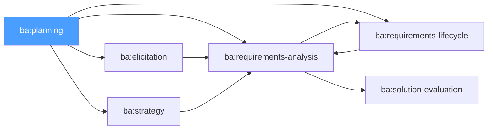

# /ba-planning — BABOK: Business Analysis Planning & Monitoring

> *"Planning is not about predicting the future — it's about creating a framework for making good decisions when the unexpected happens. The BA Plan is the agreement between the BA and the stakeholders about how business analysis will be conducted."*

Ejecuta la Knowledge Area **Business Analysis Planning & Monitoring** de BABOK v3. Define el enfoque del análisis de negocio, planifica el engagement de stakeholders, establece la gobernanza y el seguimiento, y crea la estructura de tracking `ba-progress.md`.

**THYROX Stage:** Stage 5 STRATEGY / Stage 6 SCOPE.

**Outputs clave:** BA Plan · Stakeholder Engagement Approach · Governance Approach · ba-progress.md.

---

## Flujo de navegación BABOK



## Cuándo usar este paso

- Al inicio de cualquier iniciativa de Business Analysis — antes de elicitar, analizar o especificar
- Cuando el BA necesita acordar explícitamente el enfoque de trabajo con los stakeholders clave
- Cuando el proyecto es complejo o tiene múltiples stakeholders con intereses divergentes

## Cuándo NO usar este paso

- En proyectos muy pequeños o de alcance completamente conocido donde la planificación formal sería overhead desproporcionado — en ese caso ir directamente a `ba:elicitation` o `ba:strategy`
- Si el BA Plan ya está definido y aprobado y solo se necesita actualizar el progreso — actualizar `ba-progress.md` directamente

---

## Pre-condición

- Work package activo con descripción inicial del dominio o necesidad de negocio.
- Sponsor o cliente identificado que puede definir las prioridades de análisis.
- Alcance inicial del trabajo de BA acordado (aunque sea preliminar).

---

## BABOK es no-secuencial — cómo navegar

A diferencia de RUP o PMBOK, BABOK no tiene fases secuenciales fijas. Las 6 Knowledge Areas se activan según las necesidades del proyecto:

| Knowledge Area | Skill | Cuándo activar |
|---------------|-------|----------------|
| **Business Analysis Planning & Monitoring** | `ba:planning` | Al inicio — define el marco de trabajo |
| **Elicitation & Collaboration** | `ba:elicitation` | Cuando se necesita recopilar información de stakeholders |
| **Requirements Life Cycle Management** | `ba:requirements-lifecycle` | Cuando hay requisitos que gestionar y trazar |
| **Strategy Analysis** | `ba:strategy` | Cuando se necesita analizar el estado actual y definir el estado futuro |
| **Requirements Analysis & Design Definition** | `ba:requirements-analysis` | Cuando se modelan y especifican requisitos |
| **Solution Evaluation** | `ba:solution-evaluation` | Cuando se evalúa si la solución entregó el valor esperado |

> **Routing Table** — desde ba-planning, los próximos pasos dependen del contexto:

| Situación | Próxima KA recomendada |
|-----------|----------------------|
| Dominio poco conocido — hay que entender el negocio | `ba:elicitation` |
| Existe un problema de negocio claro que analizar | `ba:strategy` |
| Hay requisitos iniciales pero sin modelar | `ba:requirements-analysis` |
| Hay requisitos existentes que gestionar o actualizar | `ba:requirements-lifecycle` |
| Se entregó una solución y hay que evaluar su valor | `ba:solution-evaluation` |

---

## Actividades

### 1. Desarrollar el BA Plan

El Business Analysis Plan define cómo se conducirá el trabajo de BA:

| Elemento | Contenido | Criterio de calidad |
|----------|-----------|---------------------|
| **Approach** | Planificado (upfront) vs Adaptativo (iterativo) según el contexto del proyecto | Justificado según el nivel de incertidumbre del dominio |
| **BA Activities** | Qué técnicas de BA se usarán y cuándo | Mapeadas a las KAs de BABOK que se activarán |
| **Deliverables** | Qué artefactos de BA se producirán | Con destinatarios y criterios de aceptación |
| **Timing** | Cuándo se ejecutará cada actividad de BA | Coordinado con el cronograma del proyecto |
| **Formality** | Nivel de documentación requerido | Proporcional al tamaño y riesgo del proyecto |

**Criterios para elegir el enfoque:**

| Criterio | Enfoque Planificado | Enfoque Adaptativo |
|---------|--------------------|--------------------|
| Dominio del negocio | Bien conocido y estable | Nuevo o cambiante |
| Requisitos | Estables desde el inicio | Emergentes o evolutivos |
| Stakeholders | Disponibilidad limitada | Alta disponibilidad |
| Ciclo del proyecto | Waterfall / RUP | Ágil / Scrum |
| Riesgo de cambios tardíos | Alto costo de cambio | Bajo costo de cambio |

### 2. Stakeholder Engagement Approach

Planificar cómo involucrar a cada stakeholder en las actividades de BA:

| Campo | Descripción |
|-------|-------------|
| **Stakeholder** | Nombre o grupo |
| **Rol** | Sponsor / SME / Usuario final / Regulador / IT / etc. |
| **Influencia** | Alta / Media / Baja |
| **Interés en el BA** | Alta / Media / Baja |
| **Necesidades del BA** | Qué tipo de input puede proveer este stakeholder |
| **Técnica de engagement** | Entrevista / Taller / Revisión / Encuesta |
| **Frecuencia** | Continua / Por fase / Por deliverable |
| **Disponibilidad** | Cuándo y cuánto tiempo tiene disponible |

**RACI para actividades de BA:**

| Actividad de BA | BA | Sponsor | SME | Usuario Final | IT |
|----------------|----|---------|----|---------------|----|
| Elicitar requisitos | R/A | C | C | C | I |
| Validar requisitos | R | A | C | C | C |
| Aprobar especificaciones | I | A | C | I | C |
| Gestionar cambios de requisitos | R/A | C | I | I | C |
| Evaluar la solución | R/A | C | I | C | C |

### 3. Governance Approach

Definir cómo se tomarán las decisiones sobre los requisitos y los cambios:

| Elemento | Descripción |
|----------|-------------|
| **Decisiones del BA** | Qué puede decidir el BA por su cuenta |
| **Decisiones que requieren aprobación** | Qué debe escalar al sponsor o CCB |
| **Change Request process** | Cómo se gestionan los cambios a requisitos aprobados |
| **Priorización** | Quién decide la prioridad relativa de los requisitos |
| **Sign-off** | Quién firma la aprobación de los deliverables de BA |

### 4. Crear ba-progress.md

El archivo `ba-progress.md` es el artefacto de tracking multi-KA para proyectos BABOK:

```markdown
# BABOK Progress — [Nombre del proyecto]

## Estado de Knowledge Areas

| KA | Skill | Estado | Última activación | Artefacto |
|----|-------|--------|------------------|-----------|
| Business Analysis Planning | ba:planning | ✅ Completado | [fecha] | ba-planning.md |
| Elicitation & Collaboration | ba:elicitation | ⬜ No iniciado | — | — |
| Requirements Life Cycle | ba:requirements-lifecycle | ⬜ No iniciado | — | — |
| Strategy Analysis | ba:strategy | ⬜ No iniciado | — | — |
| Requirements Analysis | ba:requirements-analysis | ⬜ No iniciado | — | — |
| Solution Evaluation | ba:solution-evaluation | ⬜ No iniciado | — | — |

## Routing History
[Registro de activaciones y sus razones]

## Requisitos bajo gestión
[Resumen de requisitos identificados, aprobados, pendientes]
```

---

## Criterio de completitud

**BA Plan completo (todos los siguientes):**
1. Enfoque de BA definido (planificado vs adaptativo) con justificación
2. Stakeholder Engagement Approach con todos los stakeholders de influencia alta cubiertos
3. Governance Approach con proceso de decisión y sign-off claros
4. `ba-progress.md` creado con estado inicial de las 6 KAs
5. Acuerdo con el sponsor sobre el nivel de formalidad del trabajo de BA

---

## Artefacto esperado

`{wp}/ba-planning.md`

usar template: [ba-plan-template.md](./assets/ba-plan-template.md)

Tracking multi-KA: usar template: [ba-progress-template.md](./assets/ba-progress-template.md)

---

## Red Flags — señales de BA Planning mal ejecutado

- **BA Plan que promete "análisis completo" sin entender el dominio** — si el BA no conoce el negocio, el plan debe incluir actividades de aprendizaje antes de comprometerse con deliverables
- **Stakeholder Engagement sin considerar disponibilidad** — planificar 10 entrevistas con el CEO en un proyecto donde el CEO tiene 30 minutos por semana es un plan irealizable
- **Governance sin proceso de cambios** — en BA, los cambios de requisitos son inevitables; sin proceso de cambios definido desde el inicio, cada cambio se convierte en una negociación ad hoc
- **ba-progress.md no creado** — sin el tracking multi-KA, el BA no tiene visibilidad de qué áreas han sido trabajadas y qué gaps existen
- **Nivel de formalidad no acordado** — BA que produce especificaciones de 100 páginas cuando el proyecto necesita wireframes y conversaciones está optimizando el output, no el outcome

---

## Estado en now.md

**Al INICIAR este step:**
```yaml
methodology_step: ba:planning
flow: ba
ba_ka: business_analysis_planning
```

**Al COMPLETAR:**
```yaml
methodology_step: ba:planning  # completado
flow: ba
ba_ka: business_analysis_planning
```

## Siguiente paso

Usar la **Routing Table** para seleccionar la siguiente KA según el contexto del proyecto. No hay un "siguiente paso" fijo en BABOK — el BA navega las KAs según las necesidades del trabajo.

---

## Reference Files

### Assets
- [ba-plan-template.md](./assets/ba-plan-template.md) — Template completo del BA Plan: Approach (planificado vs adaptativo), BA Activities, Deliverables, Stakeholder Engagement, RACI, Governance Approach, evaluación de completitud, routing
- [ba-progress-template.md](./assets/ba-progress-template.md) — Tracking multi-KA: tabla de 6 KAs con estado (⬜/🔄/✅/🔁), Routing History, métricas de requisitos bajo gestión

### References
- [ba-approach-techniques.md](./references/ba-approach-techniques.md) — Selección planificado vs adaptativo con criterios, Stakeholder Engagement Matrix 4 cuadrantes, técnicas de estimación de esfuerzo de BA, matriz de decisión de governance, RACI patterns para waterfall y ágil
