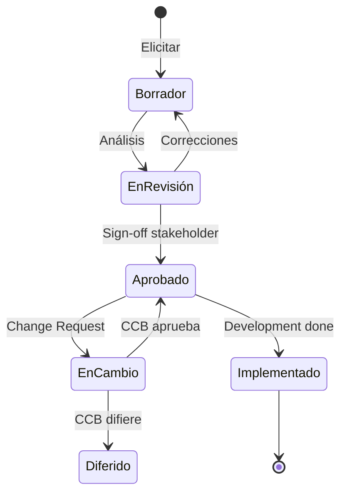

# /ba-requirements-lifecycle — BABOK: Requirements Life Cycle Management

> *"Requirements don't live forever unchanged — they are approved, deferred, modified, superseded, and sometimes retired. Managing this lifecycle is what separates a BA who documents requirements from one who governs them."*

Ejecuta la Knowledge Area **Requirements Life Cycle Management** de BABOK v3. Gestiona el ciclo de vida completo de los requisitos: trazabilidad hacia el origen y hacia la implementación, gestión de cambios, mantenimiento de la Traceability Matrix, control de baselines, y evaluación del impacto de los cambios.

**THYROX Stage:** Stage 7 DESIGN/SPECIFY / Stage 10 IMPLEMENT (continuo).

**Outputs clave:** Traceability Matrix · Requirements Baseline · Change Impact Assessments.

---

## KAs relacionadas — contexto de uso

Esta KA corre en paralelo con otras durante el proyecto:

| KA | Intensidad relativa | Relación |
|----|-------------------|---------|
| **Requirements Life Cycle** | **Alta** (esta KA) | Eje de trazabilidad y gobernanza |
| Requirements Analysis | Alta | Provee los requisitos que esta KA traza |
| Elicitation & Collaboration | Media | Fuente de nuevos requisitos y datos para CRs |
| Strategy Analysis | Baja | Consume la RTM para análisis de impacto estratégico |
| Solution Evaluation | Baja | Lee el estado de la RTM para medir cobertura |

---

## Pre-condición

Requiere requisitos documentados con al menos:
- Identificador único por requisito
- Descripción con suficiente detalle para trazarlo
- Origen (stakeholder o necesidad de negocio que lo originó)

---

## Ciclo de vida de un requisito



## Cuándo usar este paso

- Cuando los requisitos comienzan a aprobarse y necesitan ser rastreados
- Cuando hay solicitudes de cambio sobre requisitos aprobados
- A lo largo de toda la vida del proyecto — esta KA es continua

## Cuándo NO usar este paso

- Si no hay requisitos documentados — primero ir a `ba:elicitation` + `ba:requirements-analysis`
- Si el proyecto es tan pequeño que la trazabilidad formal sería overhead excesivo

---

## Actividades

### 1. Trazabilidad de requisitos

La trazabilidad asegura que cada requisito puede ser rastreado hacia su origen y hacia su implementación:

**Trazabilidad hacia atrás (Backward Traceability):**

```
Objetivo de negocio → Necesidad del stakeholder → Requisito → Caso de uso / Historia
```

**Trazabilidad hacia adelante (Forward Traceability):**

```
Requisito → Componente de diseño → Código / Implementación → Test case
```

**Traceability Matrix (RTM):**

| Req ID | Descripción | Origen (Need) | Prioridad | Componente | Test Case | Estado |
|--------|-------------|---------------|-----------|-----------|-----------|--------|
| REQ-001 | [descripción] | NEED-001 | Must Have | [componente] | TC-001 | Implementado |
| REQ-002 | [descripción] | NEED-002 | Should Have | [componente] | TC-002 | Pendiente |

**Estados del ciclo de vida de un requisito:**

| Estado | Descripción |
|--------|-------------|
| **Identificado** | Capturado en elicitación, sin análisis |
| **Analizado** | Modelado y especificado |
| **Aprobado** | Firmado por el stakeholder relevante |
| **En implementación** | Siendo construido por el equipo técnico |
| **Implementado** | Construido y verificado con tests |
| **Verificado** | Confirmado que cumple la especificación |
| **Validado** | Confirmado que satisface la necesidad original |
| **Diferido** | Pospuesto para una versión futura |
| **Cancelado** | Ya no aplica — documentar por qué |
| **Reemplazado** | Supersedido por otro requisito |

### 2. Gestión de cambios a requisitos

**Proceso de Change Request para requisitos:**

| Paso | Descripción | Responsable |
|------|-------------|-------------|
| **Identificar cambio** | Cualquier stakeholder puede solicitar un cambio | Stakeholder |
| **Documentar el cambio** | CR con descripción, justificación y tipo de cambio | BA |
| **Análisis de impacto** | Evaluar qué otros requisitos, diseño, código y tests se ven afectados | BA + IT |
| **Evaluación de prioridad** | ¿Es crítico para el proyecto actual o puede diferirse? | BA + sponsor |
| **Decisión de governance** | Aprobar / Rechazar / Diferir según el proceso de governance | Sponsor / CCB |
| **Actualizar artefactos** | Si aprobado: actualizar requisito, RTM, y notificar al equipo | BA |

**Análisis de impacto por tipo de cambio:**

| Tipo de cambio | Áreas afectadas típicas | Nivel de impacto |
|---------------|------------------------|-----------------|
| **Cambio de regla de negocio** | Requisitos relacionados, validaciones, flujos de excepción | Medio - Alto |
| **Cambio de alcance** | WBS / sprint backlog, estimaciones, cronograma | Alto |
| **Cambio de prioridad** | Orden de implementación, planning del equipo | Bajo - Medio |
| **Corrección de ambigüedad** | Implementación existente puede requerir ajuste | Variable |
| **Nuevo requisito** | RTM, backlog, capacity del equipo | Medio - Alto |

### 3. Mantenimiento de la Traceability Matrix

La RTM se mantiene viva durante todo el proyecto:

| Evento | Actualización en RTM |
|--------|---------------------|
| Requisito aprobado | Agregar fila con estado "Aprobado" |
| Diseño asignado | Actualizar columna "Componente" |
| Test case creado | Actualizar columna "Test Case" |
| Implementación completada | Cambiar estado a "Implementado" |
| Test pasado | Cambiar estado a "Verificado" |
| Validación por stakeholder | Cambiar estado a "Validado" |
| Cambio aprobado | Actualizar descripción + marcar versión anterior como "Reemplazado" |

### 4. Control de baselines

Una baseline es un snapshot aprobado de los requisitos en un momento dado:

| Tipo de baseline | Cuándo crear | Contenido |
|-----------------|-------------|-----------|
| **Baseline inicial** | Al completar la especificación de los requisitos Must Have | Todos los requisitos aprobados con su estado inicial |
| **Baseline de sprint** (ágil) | Al inicio de cada sprint | Requisitos confirmados para el sprint |
| **Baseline de release** | Al planificar un release | Requisitos que van en el release |

> **Regla:** Modificar requisitos en baseline requiere pasar por el proceso de Change Request. Sin este control, la baseline pierde su valor como punto de referencia.

---

## Routing Table

| Situación | Próxima KA recomendada |
|-----------|----------------------|
| Los requisitos necesitan ser re-analizados por cambios mayores | `ba:requirements-analysis` |
| Se necesita información adicional para evaluar el impacto de un cambio | `ba:elicitation` |
| Se necesita analizar si los cambios afectan la estrategia | `ba:strategy` |
| Se necesita evaluar si la implementación actual cumple los requisitos | `ba:solution-evaluation` |
| El ciclo de vida de los requisitos está bajo control | Continuar en esta KA de forma continua |

---

## Artefacto esperado

`{wp}/ba-requirements-lifecycle.md`

usar template: [requirements-lifecycle-template.md](./assets/requirements-lifecycle-template.md)

---

## Red Flags — señales de Requirements Lifecycle mal gestionado

- **RTM solo en la cabeza del BA** — si la trazabilidad no está documentada, no existe para los efectos prácticos
- **Cambios verbales sin Change Request** — "el sponsor pidió cambiar X en la reunión de ayer y lo cambiamos" sin un CR formal elimina el audit trail y genera inconsistencias
- **Baseline que nunca se crea** — sin baseline no hay punto de referencia para medir el scope creep
- **Requisitos diferidos que nunca se revisan** — los requisitos diferidos deben revisarse periódicamente; si nunca se revisan, se acumula deuda de requisitos que eventualmente aparece como "bugs" del sistema
- **RTM con estados desactualizados** — una RTM donde el 30% de los requisitos tiene estado "Aprobado" cuando ya están implementados es peor que no tener RTM — da falsa confianza

---

## Criterio de completitud (por ciclo)

Esta KA es continua — cada ciclo termina cuando:

| Condición | Acción |
|-----------|--------|
| CR procesado + RTM actualizada + stakeholders notificados | Ciclo completo; continuar monitoring o transicionar |
| No hay CRs activos + todos los requisitos en baseline | Estado estable; activar siguiente KA vía Routing Table |
| Todos los requisitos alcanzan estado "Validado" | Inputs listos para `ba:solution-evaluation` |

---

## Estado en now.md

**Al INICIAR este step:**
```yaml
methodology_step: ba:requirements-lifecycle
flow: ba
ba_ka: requirements_lifecycle_management
```

**Al COMPLETAR (cada ciclo):**
```yaml
methodology_step: ba:requirements-lifecycle  # ciclo completado
flow: ba
ba_ka: requirements_lifecycle_management
```

## Siguiente paso

Usar la **Routing Table** — esta KA es continua durante el proyecto; la "siguiente KA" depende de los eventos que ocurran (nuevas solicitudes de cambio, necesidad de re-elicitar, evaluación de la solución).

---

## Reference Files

### Assets
- [requirements-lifecycle-template.md](./assets/requirements-lifecycle-template.md) — Template completo: RTM con 10 estados del ciclo de vida, baseline actual con versión y aprobador, Change Requests activos con análisis de impacto, métricas de cobertura, routing

### References
- [traceability-matrix.md](./references/traceability-matrix.md) — Construcción RTM paso a paso (4 pasos), template de Change Request completo, máquina de estados del ciclo de vida de requisito, métricas de salud (cobertura backward/forward/tests), señales de RTM problemática, gestión de baselines con versionado
