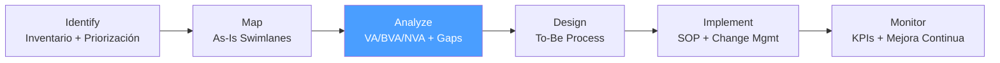

# /bpa-analyze — BPA: Analyze

> *"Waste is anything that does not add value in the eyes of the customer. Making waste visible is the first step to eliminating it."*

Ejecuta la fase **Analyze** de BPA. Clasifica cada actividad del As-Is como VA/BVA/NVA, identifica cuellos de botella y causas raíz, y produce el Gap Analysis que orienta el rediseño.

**THYROX Stage:** Stage 3 DIAGNOSE.

**Tollgate:** Activity Value Analysis y Gap Analysis completados y validados con Process Owner antes de avanzar a bpa:design.

---

## Ciclo BPA — foco en Analyze



## Pre-condición

- `bpa:map` completado — As-Is Process Map validado con Process Owner y ejecutores, con datos de tiempo por actividad.
- Sin datos de tiempo en el mapa, la clasificación VA/NVA es cualitativa — documentar la limitación.

---

## Cuándo usar este paso

- Al tener el mapa As-Is completo y necesitar identificar qué mejorar y por qué
- Para separar síntomas (actividades lentas, con errores) de causas raíz
- Cuando hay múltiples oportunidades de mejora y se necesita priorizar cuál atacar primero en el rediseño

## Cuándo NO usar este paso

- Sin mapa As-Is validado — el análisis sin mapa es especulativo
- Si el objetivo es solo documentar el proceso (no mejorarlo) — bpa:map es suficiente
- Para rediseño puramente tecnológico sin análisis de proceso — la tecnología no resuelve un proceso mal diseñado

---

## Actividades

### 1. Clasificación VA / BVA / NVA

Clasificar cada actividad del mapa As-Is en una de tres categorías:

| Categoría | Definición | Criterio de clasificación |
|-----------|------------|--------------------------|
| **VA — Value Added** | Directamente agrega valor al cliente | El cliente pagaría por este paso si lo supiera; transforma el producto/servicio |
| **BVA — Business Value Added** | Necesario para el negocio pero no agrega valor al cliente | Requerido por regulación, control interno o la empresa — el cliente no lo paga voluntariamente |
| **NVA — Non-Value Added** | Desperdicio — eliminar o reducir | Ni el cliente ni el negocio necesitan este paso; es overhead puro |

*Ver catálogo detallado con ejemplos por industria: [value-classification.md](./references/value-classification.md)*

**Cómo clasificar en práctica:**
1. Tomar el mapa As-Is actividad por actividad
2. Preguntar: *"Si el cliente viera este paso, ¿pagaría por él?"*
   - Sí → VA
   - No, pero es legalmente/operacionalmente requerido → BVA
   - No → NVA
3. Para actividades BVA: verificar si realmente es obligatorio o si se puede simplificar
4. Para actividades NVA: identificar la causa raíz de por qué existe ese desperdicio

**Tipos de desperdicio NVA (basados en Lean):**

| Tipo NVA | Ejemplo en procesos de negocio |
|----------|-------------------------------|
| **Espera** | Solicitud en bandeja sin procesar por 3 días |
| **Retrabajo** | Corrección de errores en documentos por información incompleta |
| **Transporte innecesario** | Enviar documento por email, imprimirlo, firmarlo a mano, escanearlo |
| **Sobreprocessing** | 4 aprobaciones en cadena cuando 2 son suficientes |
| **Inventario** | 200 solicitudes acumuladas esperando procesamiento |
| **Movimiento** | Búsqueda manual de información en múltiples sistemas |
| **Defectos** | Formularios con errores que requieren vuelta al solicitante |

### 2. Análisis cuantitativo — tiempo VA vs. NVA

Con los datos de tiempo del mapa As-Is:

```
% Tiempo VA = (Suma tiempo VA) / (Tiempo de ciclo total) × 100
% Tiempo NVA = (Suma tiempo NVA) / (Tiempo de ciclo total) × 100
Potencial de mejora = % Tiempo NVA + parte de % Tiempo BVA (la porción simplificable)
```

**Interpretación:**
- % VA > 50% — Proceso relativamente eficiente; las mejoras tendrán menor impacto
- % VA entre 20-50% — Oportunidad significativa; el rediseño puede duplicar la eficiencia
- % VA < 20% — Proceso crítico; considerables desperdicios — justifica rediseño radical

### 3. Identificación de cuellos de botella

Un cuello de botella es el paso que limita la velocidad de todo el proceso:

**Señales de cuello de botella:**
- Actividad con tiempo de espera > 2× el tiempo de tarea
- Actividad donde se acumula "inventario" (solicitudes, documentos esperando)
- Actividad con mayor tasa de retrabajo (errores que regresan)
- Paso de aprobación con un solo responsable sin sustituto

**Herramienta: Análisis de tiempo de espera**

| Actividad | Tiempo tarea | Tiempo espera | Ratio espera/tarea | ¿Cuello de botella? |
|-----------|-------------|--------------|-------------------|---------------------|
| [Actividad A] | [X h] | [X h] | [ratio] | Sí / No |

**Root Cause del cuello de botella (5 Whys):**
```
Problema: [descripción del cuello de botella]
¿Por qué 1? [causa inmediata]
¿Por qué 2? [causa de la causa]
¿Por qué 3? [...deeper]
¿Por qué 4? [...]
¿Por qué 5? [causa raíz]
→ Intervención: [qué hay que atacar]
```

### 4. Gap Analysis — As-Is vs. To-Be

El Gap Analysis define la brecha entre el estado actual y el estado objetivo:

| Dimensión | Estado As-Is | Estado To-Be (objetivo) | Gap | Causa Raíz | Intervención |
|-----------|-------------|------------------------|-----|-----------|-------------|
| Tiempo de ciclo | [X días] | [Y días] | [delta] | [causa raíz] | [rediseño / automatización / eliminación] |
| Tasa de error | [X%] | [Y%] | [delta] | [causa raíz] | [control / validación / estandarización] |
| % Actividades NVA | [X%] | [Y%] | [delta] | [causa raíz] | [eliminación / simplificación] |
| Handoffs | [N handoffs] | [M handoffs] | [delta] | [causa raíz] | [integración / reestructuración] |
| Pasos de aprobación | [N] | [M] | [delta] | [causa raíz] | [empoderamiento / eliminación] |

*Ver template completo: [gap-analysis-template.md](./assets/gap-analysis-template.md)*

### 5. Priorización de oportunidades de mejora

No todas las mejoras identificadas tienen el mismo impacto. Priorizar usando:

```
Impacto = (Tiempo ahorrado × Volumen/día × % NVA eliminado) + Impacto en calidad (cualitativo)
Esfuerzo = Complejidad del cambio × Resistencia estimada × Inversión requerida
```

**Matriz impacto / esfuerzo:**

| Oportunidad | Impacto (1-5) | Esfuerzo (1-5) | Cuadrante | Decisión |
|-------------|--------------|---------------|-----------|---------|
| [Eliminar paso NVA X] | 4 | 1 | Quick Win | Implementar primero |
| [Automatizar paso Y] | 5 | 4 | Proyecto mayor | Planificar con recursos |
| [Simplificar aprobación Z] | 3 | 2 | Fill-in | Implementar si hay capacidad |
| [Rediseño de sistema W] | 2 | 5 | Evitar | Descartar o posponer |

---

## Artefacto esperado

`{wp}/bpa-analyze.md` — incluye Activity Value Analysis y Gap Analysis
- [activity-value-analysis-template.md](./assets/activity-value-analysis-template.md)
- [gap-analysis-template.md](./assets/gap-analysis-template.md)

---

## Red Flags — señales de Analyze mal ejecutado

- **Clasificación VA/NVA sin cuestionar el BVA** — Muchas actividades se etiquetan como BVA sin verificar si realmente son obligatorias; el BVA es la categoría más sobreutilizada
- **Gap Analysis sin causa raíz** — Definir el gap ("tardamos 10 días en lugar de 3") sin investigar por qué no lleva a intervenciones efectivas
- **Cuello de botella identificado pero sin 5 Whys** — Saber dónde está el cuello de botella no es suficiente para diseñar la solución
- **% tiempo NVA calculado sin datos reales** — Si los tiempos son estimaciones del equipo sin validación, el % NVA es indicativo, no preciso — documentar la limitación
- **Oportunidades sin priorización** — Listar 15 mejoras posibles sin jerarquizarlas lleva a rediseños dispersos con poco impacto

### Anti-racionalización — excusas comunes para no eliminar NVA

| Racionalización | Por qué es trampa | Respuesta correcta |
|----------------|-------------------|--------------------|
| *"Ese paso siempre se hizo así"* | La antigüedad no es justificación — puede ser un legado de un problema que ya no existe | Preguntar: "¿Qué pasaría si no lo hiciéramos?" Evaluar el riesgo real |
| *"Necesitamos esa aprobación por control"* | Muchas aprobaciones son BVA simplificable, no NVA; verificar si el riesgo justifica el paso | Analizar la tasa real de errores detectados en esa aprobación — si es 0, cuestionar su valor |
| *"El sistema nos obliga a hacer ese paso"* | El sistema es una restricción, no una justificación permanente | Documentar como Technical Debt: el sistema limita la mejora; considerar cambio en bpa:design |

---

## Estado en now.md

**Al INICIAR este step:**
```yaml
methodology_step: bpa:analyze
flow: bpa
```

**Al COMPLETAR** (Activity Value Analysis y Gap Analysis aprobados):
```yaml
methodology_step: bpa:analyze  # completado → listo para bpa:design
flow: bpa
```

## Siguiente paso

Cuando Activity Value Analysis y Gap Analysis están validados con Process Owner → `bpa:design`

---

## Limitaciones

- La clasificación VA/NVA tiene un componente subjetivo — puede requerir debate entre stakeholders para llegar a consenso
- El Gap Analysis define el To-Be en términos de métricas, no de diseño concreto — el diseño detallado ocurre en bpa:design
- En procesos con alta variabilidad, el análisis del flujo nominal puede no reflejar las excepciones, que suelen ser las fuentes de mayor desperdicio
- La identificación de causa raíz vía 5 Whys puede llegar a causas sistémicas (cultura, estructura organizacional) que están fuera del scope del BPA — documentar como out-of-scope si aplica

---

## Reference Files

### Assets
- [activity-value-analysis-template.md](./assets/activity-value-analysis-template.md) — Tabla completa: Activity | Role | Time | VA/BVA/NVA | Issue | Recommendation
- [gap-analysis-template.md](./assets/gap-analysis-template.md) — Dimensiones As-Is vs To-Be con causa raíz e intervención

### References
- [value-classification.md](./references/value-classification.md) — Definición VA/BVA/NVA, criterios de clasificación, tipos de desperdicio NVA y ejemplos por industria
