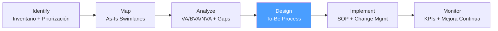

# /bpa-design — BPA: Design

> *"Don't automate a broken process — you'll just break things faster. Eliminate and simplify first, then automate what's left."*

Ejecuta la fase **Design** de BPA. Produce el To-Be Process Map con el proceso rediseñado aplicando los principios Eliminate / Simplify / Integrate / Automate.

**THYROX Stage:** Stage 5 STRATEGY.

**Tollgate:** To-Be Process Map aprobado por Process Owner y sponsor antes de avanzar a bpa:implement.

---

## Ciclo BPA — foco en Design



## Pre-condición

- `bpa:analyze` completado — Activity Value Analysis y Gap Analysis aprobados por Process Owner.
- Lista de oportunidades de mejora priorizadas disponible para guiar el rediseño.
- Restricciones técnicas y regulatorias documentadas (si las hay) antes de comenzar el diseño.

---

## Cuándo usar este paso

- Al tener el análisis As-Is completo y aprobado, listo para diseñar el proceso mejorado
- Cuando las oportunidades identificadas en bpa:analyze justifican un rediseño del flujo (no solo ajustes puntuales)
- Para documentar el To-Be antes de comunicar cambios al equipo e implementar SOPs

## Cuándo NO usar este paso

- Sin bpa:analyze completo — diseñar sin diagnóstico produce soluciones a problemas mal definidos
- Si la mejora es un ajuste menor a una actividad (sin cambio de flujo) — documentarlo directamente en el SOP en bpa:implement
- Si el cambio es 100% tecnológico sin rediseño de proceso — ir a implementación técnica directamente

---

## Actividades

### 1. Revisar insumos del diseño

Antes de diseñar, consolidar:

| Insumo | Fuente | Qué informa el diseño |
|--------|--------|----------------------|
| Activity Value Analysis | bpa:analyze | Qué actividades eliminar (NVA), simplificar (BVA), o preservar (VA) |
| Gap Analysis | bpa:analyze | Qué métricas To-Be deben alcanzar (tiempo de ciclo, tasa de error, etc.) |
| Restricciones | bpa:analyze (sección restricciones) | Qué cambios no son posibles por regulación o tecnología |
| Oportunidades priorizadas | bpa:analyze | Qué Quick Wins y proyectos mayores incluir en este ciclo |

### 2. Aplicar los 4 principios de rediseño

Para cada actividad del mapa As-Is, aplicar el principio más adecuado:

*Ver guía completa de principios con ejemplos: [redesign-principles.md](./references/redesign-principles.md)*

#### Principio 1 — ELIMINATE (Eliminar)

**Cuándo aplicar:** Actividades clasificadas como NVA sin restricción que las obligue a existir.

**Pregunta:** *"¿Qué pasaría si simplemente no lo hiciéramos?"*

**Ejemplos:**
- Eliminar verificaciones duplicadas entre departamentos
- Eliminar reportes que nadie consume
- Eliminar pasos de aprobación para transacciones bajo umbral de riesgo

**Documentar la razón de eliminación** — para cada actividad eliminada, registrar: qué se elimina, por qué era NVA, y por qué es seguro eliminarlo.

#### Principio 2 — SIMPLIFY (Simplificar)

**Cuándo aplicar:** Actividades BVA que son obligatorias pero se pueden ejecutar con menos pasos, tiempo o fricción.

**Pregunta:** *"¿Podemos obtener el mismo resultado con menos esfuerzo?"*

**Ejemplos:**
- Reducir 4 aprobaciones en cadena a 1 aprobación con delegación
- Reemplazar formulario de 20 campos por checklist de 5 ítems críticos
- Condensar 3 reuniones de revisión en 1 checkpoint semanal

#### Principio 3 — INTEGRATE (Integrar)

**Cuándo aplicar:** Actividades fragmentadas en múltiples actores, sistemas o momentos que pueden consolidarse.

**Pregunta:** *"¿Se puede hacer esto en un solo paso, lugar, o actor?"*

**Ejemplos:**
- Unificar el ingreso de datos en un solo sistema en lugar de re-ingresar en 3
- Asignar un solo responsable end-to-end (case manager) en lugar de handoffs entre departamentos
- Consolidar el punto de entrada del proceso para evitar múltiples canales

#### Principio 4 — AUTOMATE (Automatizar)

**Cuándo aplicar:** Actividades VA o BVA repetitivas, con reglas claras, ejecutables por un sistema sin juicio humano.

**Pregunta:** *"¿Tiene este paso reglas claras que un sistema puede ejecutar?"*

**REGLA CRÍTICA:** Automatizar solo después de eliminar y simplificar. Automatizar NVA perpetúa el desperdicio a mayor velocidad.

**Ejemplos:**
- Notificación automática al siguiente actor cuando una tarea se completa
- Validación automática de formularios en el punto de entrada
- Generación automática de documentos desde datos existentes
- Routing automático de solicitudes según tipo y monto

**Cuándo NO automatizar:**
- Actividades con alta variabilidad y juicio humano requerido
- Procesos con volumen muy bajo (costo de automatización > beneficio)
- Actividades que se van a eliminar próximamente

### 3. Construir el To-Be Process Map

Partiendo del mapa As-Is, aplicar los 4 principios para construir el mapa To-Be:

**Pasos:**
1. Copiar el mapa As-Is como base
2. Marcar con color cada actividad según el principio aplicado:
   - 🔴 Rojo — Eliminar
   - 🟡 Amarillo — Simplificar
   - 🔵 Azul — Integrar
   - 🟢 Verde — Automatizar
   - ⬜ Sin color — Unchanged (preservar)
3. Redibujar el flujo resultante eliminando las actividades rojas y aplicando los cambios
4. Verificar que el To-Be cierra las brechas del Gap Analysis

*Ver template del mapa To-Be: [to-be-process-map-template.md](./assets/to-be-process-map-template.md)*

### 4. Calcular el impacto del diseño

Comparar el mapa As-Is vs. To-Be en métricas clave:

| Métrica | As-Is | To-Be estimado | Mejora esperada |
|---------|-------|---------------|----------------|
| N° de actividades total | [N] | [M] | [-K] |
| N° actividades NVA | [N] | [M] | [-K eliminadas] |
| Tiempo de ciclo total | [X días] | [Y días] | [-Z días = X%] |
| N° de handoffs | [N] | [M] | [-K] |
| N° de aprobaciones | [N] | [M] | [-K] |

**Validación con el Gap Analysis:** El To-Be debe alcanzar los objetivos definidos en bpa:analyze. Si no los alcanza, revisar si hay más oportunidades de mejora aplicables.

### 5. Documentar el Change Rationale

Para cada cambio significativo, documentar:

| Cambio | Tipo | As-Is | To-Be | Justificación | Riesgo |
|--------|------|-------|-------|---------------|--------|
| [Descripción del cambio] | Eliminate / Simplify / Integrate / Automate | [cómo era] | [cómo será] | [por qué este cambio] | [qué puede fallar] |

> El Change Rationale es crítico para change management — los ejecutores del proceso necesitan entender el "por qué" del cambio, no solo el "qué".

### 6. Validar el diseño con stakeholders

| Stakeholder | Aspecto a validar | Método |
|-------------|------------------|--------|
| **Process Owner** | El To-Be es operacionalmente viable | Walkthrough del mapa paso a paso |
| **Ejecutores del proceso** | Los cambios son ejecutables con sus capacidades | Sesión de review; preguntar: "¿Ven algún obstáculo?" |
| **IT / Sistemas** | Las automatizaciones propuestas son técnicamente posibles | Review con equipo técnico |
| **Compliance / Legal** | Los cambios no violan regulaciones | Consulta puntual sobre actividades eliminadas o simplificadas |
| **Sponsor** | El diseño alineado con los objetivos del proyecto | Presentación ejecutiva con métricas As-Is vs. To-Be |

---

## Artefacto esperado

`{wp}/bpa-design.md` — incluye To-Be Process Map y Change Rationale
- [to-be-process-map-template.md](./assets/to-be-process-map-template.md)

---

## Red Flags — señales de Design mal ejecutado

- **To-Be que automatizan sin eliminar primero** — Digitalizaron el proceso roto: ahora es igual de ineficiente pero más caro
- **Diseño que ignora restricciones** — To-Be que requiere cambios en sistemas legacy sin evaluar la viabilidad técnica
- **Actividades eliminadas sin justificación** — *"La eliminamos porque era NVA"* no es suficiente — documentar qué pasa si se elimina
- **Diseño creado solo por el analista** — El To-Be diseñado sin los ejecutores del proceso tendrá resistencia en implementación
- **Change Rationale ausente** — Publicar el nuevo proceso sin explicar por qué cambia genera rechazo
- **To-Be que no cierra el Gap** — Diseñar sin verificar que se alcanzan las métricas To-Be del Gap Analysis

### Anti-racionalización — errores comunes en el diseño

| Error | Por qué ocurre | Corrección |
|-------|---------------|-----------|
| *"Automaticemos todo"* | La tecnología se percibe como la solución universal | Primero Eliminate → Simplify → Integrate → luego Automate |
| *"Es demasiado arriesgado eliminar esa aprobación"* | Miedo al cambio disfrazado de gestión de riesgos | Analizar la tasa real de errores detectados por esa aprobación; si es 0, el riesgo es teórico |
| *"El diseño es perfecto pero implementarlo llevará años"* | Diseño ideal sin consideración de implementation capacity | Diseñar el To-Be en versiones: To-Be v1 (quick wins), To-Be v2 (proyectos mayores) |

---

## Estado en now.md

**Al INICIAR este step:**
```yaml
methodology_step: bpa:design
flow: bpa
```

**Al COMPLETAR** (To-Be Process Map aprobado por Process Owner y sponsor):
```yaml
methodology_step: bpa:design  # completado → listo para bpa:implement
flow: bpa
```

## Siguiente paso

Cuando el To-Be Process Map está aprobado con el Change Rationale → `bpa:implement`

---

## Limitaciones

- El diseño To-Be es un modelo — la realidad de implementación puede revelar obstáculos no anticipados
- Las estimaciones de mejora (tiempo de ciclo, etc.) son proyecciones; se validan en bpa:monitor con datos reales
- En entornos con sistemas legacy o restricciones presupuestarias, el To-Be ideal puede requerir múltiples ciclos de implementación
- El diseño de automatizaciones requiere análisis técnico detallado en bpa:implement — evitar especificar implementación técnica en esta fase

---

## Reference Files

### Assets
- [to-be-process-map-template.md](./assets/to-be-process-map-template.md) — Template del mapa To-Be con columna Change Type (Eliminated/Simplified/Integrated/Automated/Unchanged)

### References
- [redesign-principles.md](./references/redesign-principles.md) — Los 4 principios de rediseño con criterios de aplicación, ejemplos por industria y anti-patrones
