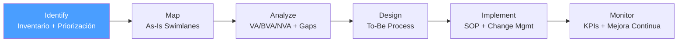

# /bpa-identify — BPA: Identify

> *"You cannot improve what you haven't chosen intentionally. The first act of process excellence is knowing which process deserves your attention most."*

Ejecuta la fase **Identify** de BPA. Produce el Process Inventory priorizado que autoriza el análisis de proceso.

**THYROX Stage:** Stage 1 DISCOVER.

**Tollgate:** Process Inventory con al menos un proceso seleccionado con Priority Score ≥ threshold antes de avanzar a bpa:map.

---

## Ciclo BPA — foco en Identify



## Pre-condición

- **Primer ciclo BPA:** contexto del dominio de negocio disponible — área, departamento o cadena de valor donde se sospecha oportunidad.
- Antes de completar Identify, debe haber al menos una fuente de información sobre procesos: entrevistas con stakeholders, documentación existente, o sesión de discovery con el equipo.

---

## Cuándo usar este paso

- Al iniciar un proyecto de mejora o transformación de procesos de negocio
- Cuando existen múltiples procesos candidatos y se necesita priorizar cuál analizar primero
- Cuando hay señales de ineficiencia (quejas, tiempos elevados, errores frecuentes) pero no está claro en qué proceso está el mayor dolor
- Al inicio de un programa de BPM (Business Process Management) organizacional

## Cuándo NO usar este paso

- Si el proceso a analizar ya está identificado y acordado con stakeholders — ir directamente a bpa:map
- Para mejoras técnicas sin componente de proceso de negocio — usar PDCA o DMAIC según corresponda
- Si la organización no tiene mandato para cambiar procesos — sin autorización, el inventario no tiene tracción

---

## Actividades

### 1. Stakeholder Discovery — identificar fuentes de información

Antes de inventariar procesos, identificar quién sabe sobre ellos:

| Tipo de stakeholder | Rol en BPA | Cómo abordar |
|---------------------|-----------|--------------|
| **Process Owner** | Define el proceso, toma decisiones | Entrevista de 30-60 min; preguntar por problemas y excepciones |
| **Ejecutores del proceso** | Realizan las actividades día a día | Gemba walk o shadowing; observar el proceso real |
| **Clientes internos** | Reciben el output del proceso | Encuesta breve o entrevista; ¿qué les falla del output? |
| **Clientes externos** | Afectados por el resultado final | VOC — ver referencia voice-of-customer |
| **Management** | Tienen visión estratégica y datos de KPIs | Revisión de dashboards y objetivos del área |

**Técnicas de recopilación:**
- Entrevistas semi-estructuradas (preguntas abiertas: *"¿Cuáles son los procesos más dolorosos del área?"*, *"¿Dónde se pierden más horas?"*)
- Revisión de documentación existente (SOPs, manuales, diagramas anteriores)
- Análisis de tickets de soporte / incidencias
- Sesión de brainstorming con el equipo (15-20 min, post-its con nombre de procesos)

### 2. Inventario inicial de procesos

Listar todos los procesos del área en scope sin filtrar aún:

```
Área / dominio: [nombre del área]
Período de relevamiento: [fechas]
Fuentes consultadas: [lista de stakeholders / documentos]

Procesos identificados:
1. [nombre del proceso]
2. [nombre del proceso]
...
```

**Criterios de nomenclatura para procesos:**
- Usar verbo + objeto: "Procesar pedido", "Aprobar solicitud de crédito", "Onboarding de empleado nuevo"
- Evitar nombres de sistemas o herramientas: "Gestionar en SAP" no es un nombre de proceso
- Cada proceso debe tener un output claro y un cliente identificable

### 3. Recopilación de datos para priorización

Para cada proceso identificado, recopilar:

| Dato | Fuente | Por qué importa |
|------|--------|----------------|
| **Owner** | Entrevistas | Sin owner, no hay responsable de implementar cambios |
| **Frecuencia** | Sistemas / estimación del equipo | Frecuencia alta = mayor impacto de mejoras |
| **Volumen/día** | Sistemas transaccionales | Volumen alto amplifica cualquier ineficiencia |
| **Pain Level (1-5)** | Encuesta al equipo ejecutor | Señal directa de dónde hay más fricción |
| **Impacto estratégico** | Management / plan anual | Alineación con objetivos organizacionales |

**Pain Level — escala:**
- **1** — Proceso fluye bien, pocas quejas
- **2** — Molestias menores, workarounds ocasionales
- **3** — Retrasos regulares, quejas frecuentes
- **4** — Impacto operacional significativo, errores frecuentes
- **5** — Crisis recurrentes, escaladas a management

### 4. Scoring y priorización

Calcular Priority Score para cada proceso:

```
Priority Score = (Frecuencia × 0.2) + (Volumen_normalizado × 0.2) + (Pain Level × 0.3) + (Impacto estratégico × 0.3)
```

**Normalización:**
- Frecuencia: Diaria=5, Semanal=4, Quincenal=3, Mensual=2, Trimestral=1
- Volumen: normalizar sobre el máximo del set → valor 1-5
- Impacto estratégico: Crítico=5, Alto=4, Medio=3, Bajo=2, Nulo=1

**Interpretación del score:**
- Score ≥ 4.0 — Alta prioridad: analizar en la presente iniciativa
- Score 2.5–3.9 — Media prioridad: planificar para siguiente ciclo
- Score < 2.5 — Baja prioridad: monitorear, no analizar ahora

### 5. Selección y validación con stakeholders

Con el Process Inventory completado:
1. Presentar top 3-5 procesos con scores a Process Owners y management
2. Validar que los datos de volumen y frecuencia son correctos
3. Confirmar el proceso(s) seleccionado para análisis detallado
4. Documentar motivo de selección en el Process Inventory

### 6. Definir el proceso seleccionado — límites iniciales

Para el proceso seleccionado, definir preliminarmente:

| Elemento | Descripción |
|----------|-------------|
| **Trigger** | ¿Qué evento inicia el proceso? |
| **Output final** | ¿Qué produce el proceso cuando termina? |
| **Cliente del output** | ¿Quién recibe y usa el output? |
| **Límite inicial (start)** | ¿Cuál es la primera actividad del proceso? |
| **Límite final (end)** | ¿Cuál es la última actividad del proceso? |
| **Out of scope** | ¿Qué procesos relacionados NO están incluidos? |

> Estos límites son preliminares — se refinan en bpa:map. Documentarlos evita scope creep durante el mapeo.

---

## Artefacto esperado

`{wp}/bpa-identify.md` — usar template: [process-inventory-template.md](./assets/process-inventory-template.md)

---

## Red Flags — señales de Identify mal ejecutado

- **Process Inventory sin datos reales** — Procesos inventariados sin haber hablado con ejecutores o revisado datos de sistemas son opiniones, no hechos
- **Un solo stakeholder como fuente** — El management puede subestimar el pain de los ejecutores; los ejecutores pueden no conocer el impacto estratégico
- **Scores basados en intuición** — Priority Score sin datos de volumen/frecuencia reales es teatro de priorización
- **Proceso seleccionado por política, no por score** — Si el proceso elegido tiene score bajo pero se selecciona por presión, documentar la razón explícitamente
- **Límites del proceso sin acordar** — Iniciar el mapeo sin límites claros genera desacuerdos durante bpa:map

### Anti-racionalización — excusas comunes para saltarse la priorización

| Racionalización | Por qué es trampa | Respuesta correcta |
|----------------|-------------------|--------------------|
| *"Todos sabemos cuál proceso analizar"* | El consenso informal puede estar sesgado por el último incidente o por el stakeholder más ruidoso | Ejecutar el scoring igualmente — toma 2 horas y previene rework |
| *"No tenemos datos de volumen"* | Estimaciones del equipo son datos suficientes para priorizar — no se necesita precisión estadística | Usar estimaciones con rango: "30-50 transacciones/día" |
| *"El proceso es obvio, lo conocemos"* | El proceso conocido puede no ser el que más duele — la urgencia percibida no siempre coincide con el impacto medible | Inventariar todos igualmente antes de seleccionar |

---

## Estado en now.md

**Al INICIAR este step:**
```yaml
methodology_step: bpa:identify
flow: bpa
```

**Al COMPLETAR** (Process Inventory aprobado y proceso seleccionado):
```yaml
methodology_step: bpa:identify  # completado → listo para bpa:map
flow: bpa
```

## Siguiente paso

Cuando el Process Inventory está validado con stakeholders y el proceso seleccionado está definido con límites → `bpa:map`

---

## Limitaciones

- El scoring es una herramienta de facilitación, no una fórmula exacta — los pesos pueden ajustarse al contexto organizacional
- Un proceso con score alto pero owner sin mandato para cambiar es un proceso de riesgo — documentar el riesgo antes de avanzar
- El inventario solo cubre los procesos que los stakeholders conocen y articulan — procesos informales (workarounds) pueden no aparecer hasta el mapeo
- Identify no reemplaza un análisis de arquitectura de procesos completo (BPM Enterprise Architecture) — es suficiente para iniciar un ciclo de mejora focalizado

---

## Reference Files

### Assets
- [process-inventory-template.md](./assets/process-inventory-template.md) — Template del Process Inventory con columnas de scoring y campos de proceso seleccionado

### References
- [process-prioritization.md](./references/process-prioritization.md) — Cómo calcular Priority Score, normalizar datos, y técnicas de validación con stakeholders
