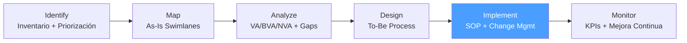

# /bpa-implement — BPA: Implement

> *"A process improvement that no one follows is not an improvement. Adoption is the real deliverable of implementation."*

Ejecuta la fase **Implement** de BPA. Despliega el proceso To-Be mediante piloto controlado, documenta los SOPs y gestiona el cambio para garantizar la adopción del equipo.

**THYROX Stage:** Stage 10 IMPLEMENT.

**Tollgate:** Piloto completado con métricas validadas, SOP publicado y adoptado por el equipo antes de avanzar a bpa:monitor.

---

## Ciclo BPA — foco en Implement



## Pre-condición

- `bpa:design` completado — To-Be Process Map aprobado por Process Owner y sponsor.
- Requisitos de implementación del To-Be documentados (sistemas, capacitación, governance).
- Plan de rollout definido (piloto limitado o implementación directa según el riesgo del cambio).

---

## Cuándo usar este paso

- Cuando el To-Be Process Map está aprobado y listo para operacionalizar
- Para documentar el nuevo proceso como SOP que el equipo seguirá
- Cuando hay cambio de responsabilidades, sistemas, o flujos que requieren training
- Siempre que el riesgo del cambio justifique un piloto antes del despliegue completo

## Cuándo NO usar este paso

- Sin bpa:design aprobado — implementar sin diseño aprobado genera variantes y confusión
- Si el cambio es cosmético (ajuste de nombre o formato sin cambio de flujo) — actualizar el SOP existente directamente
- Sin identificar al equipo ejecutor — implementar sin destinatario produce documentos sin uso

---

## Actividades

### 1. Planificar el piloto

Antes del despliegue completo, validar el To-Be con un grupo controlado:

| Elemento | Decisión |
|---------|---------|
| **¿Se hace piloto?** | Sí si: cambio de flujo significativo, múltiples actores, o componentes tecnológicos nuevos. No si: cambio menor de un solo actor con rollback inmediato |
| **Scope del piloto** | Subconjunto de casos: un equipo, una región, un tipo de solicitud, o un período |
| **Duración** | Suficiente para capturar variabilidad: mínimo 2-4 semanas o 50+ instancias del proceso |
| **Métricas del piloto** | Las mismas métricas del Gap Analysis To-Be: tiempo de ciclo, tasa de error, N° de escaladas |
| **Criterios de éxito** | Definir antes del piloto: ej. "tiempo de ciclo ≤ Y días en ≥ 80% de los casos" |
| **Plan de rollback** | Qué hacer si el piloto falla: cómo regresar al proceso As-Is sin pérdida de datos |

**Roles del piloto:**
- **Facilitador del piloto** — oversee la ejecución, captura incidentes, ajusta el proceso
- **Ejecutores piloto** — el equipo que opera el proceso en el piloto
- **Observador de calidad** — revisa resultados y documenta desviaciones del To-Be

### 2. Preparar al equipo — Training

El equipo no puede ejecutar el nuevo proceso sin comprenderlo:

**Componentes del training:**

| Componente | Descripción | Formato |
|------------|-------------|---------|
| **Comunicación del cambio** | Por qué cambia el proceso — contexto y beneficios | Email/reunión del Process Owner |
| **Walkthrough del To-Be** | Recorrer el nuevo mapa paso a paso con el equipo | Sesión de 1-2 horas con el equipo completo |
| **SOP + Job Aids** | Documentación de referencia que el equipo puede consultar | SOP publicado + guías de 1 página por rol |
| **Sesión de práctica** | Ejercicios con casos de ejemplo antes del go-live | Role play o sandbox en sistema |
| **Q&A y preguntas abiertas** | Espacio para resolver dudas antes de operar el proceso | Sesión de preguntas + canal de soporte durante el piloto |

**Señal de training exitoso:** El ejecutor puede describir con sus palabras cómo funciona el nuevo proceso y sabe exactamente qué hacer en el primer paso.

### 3. Documentar el SOP

El SOP (Standard Operating Procedure) es el documento que estandariza el proceso rediseñado:

*Ver template completo: [sop-template.md](./assets/sop-template.md)*

**Principios del SOP:**
- **Lenguaje del ejecutor** — escrito para quien hace el proceso, no para el analista
- **Pasos numerados** — cada paso con un actor claro y una acción específica
- **Decisiones explícitas** — los gateways del mapa To-Be son puntos de decisión con criterios claros
- **Excepciones documentadas** — qué hacer cuando algo no sigue el flujo nominal
- **Versionado** — el SOP tiene versión, fecha de creación y fecha de revisión

### 4. Ejecutar el piloto

Durante el piloto, el facilitador:
1. Observa la ejecución del nuevo proceso
2. Captura incidentes: pasos donde el equipo duda, hace workarounds, o el flujo no funciona como se esperaba
3. Registra métricas de desempeño: tiempo de ciclo, errores, escaladas
4. Recopila feedback del equipo ejecutor

**Log de incidentes del piloto:**

| Fecha | Step | Incidente | Causa | Ajuste al SOP / proceso |
|-------|------|-----------|-------|------------------------|
| [YYYY-MM-DD] | [Step N] | [descripción] | [causa raíz] | [corrección] |

### 5. Evaluar resultados del piloto y ajustar

Al finalizar el período del piloto:
1. Comparar métricas del piloto vs. objetivos del Gap Analysis
2. Revisar incidentes — ¿hay patrones? ¿Requieren cambios al To-Be?
3. Incorporar ajustes al SOP basados en aprendizajes del piloto
4. Obtener aprobación del Process Owner para el despliegue completo

**Criterios de Go / No-Go del piloto:**

| Criterio | Objetivo | Resultado piloto | Decisión |
|----------|---------|-----------------|---------|
| Tiempo de ciclo | ≤ [Y días] | [Z días] | Go / No-Go |
| Tasa de error | ≤ [X%] | [Y%] | Go / No-Go |
| Satisfacción ejecutores | ≥ [score] | [score] | Go / No-Go |

### 6. Despliegue completo — Go-Live

Después del piloto aprobado:
1. Comunicar fecha de Go-Live a todos los actores del proceso
2. Publicar SOP en el repositorio oficial del equipo
3. Desactivar el proceso As-Is (remover accesos, archivar formularios antiguos)
4. Activar cualquier automatización configurada
5. Establecer un período de soporte intensivo (primera semana post Go-Live)

---

## Artefacto esperado

`{wp}/bpa-implement.md` — incluye plan de piloto, resultados y log de cambios al SOP
- [sop-template.md](./assets/sop-template.md)

---

## Red Flags — señales de Implement mal ejecutado

- **Go-Live sin piloto en procesos complejos** — El riesgo de un fallo en producción supera el costo de 2-4 semanas de piloto
- **SOP escrito por el analista sin revisión del ejecutor** — El ejecutor encuentra ambigüedades en la primera semana que el analista no anticipó
- **Training de 30 minutos para proceso complejo** — El equipo no puede ejecutar correctamente sin práctica
- **No se desactiva el proceso As-Is** — El equipo opera en paralelo el proceso viejo y el nuevo; la ambigüedad genera inconsistencias
- **Métricas del piloto no medidas** — Si no se miden las métricas durante el piloto, no hay evidencia de éxito para justificar el Go-Live
- **Rollback no planificado** — Si el piloto falla, volver al As-Is sin plan genera caos

### Anti-racionalización — excusas comunes para saltar pasos

| Racionalización | Por qué es trampa | Respuesta correcta |
|----------------|-------------------|--------------------|
| *"No necesitamos piloto, el proceso es simple"* | "Simple" es relativo — el ejecutor puede tener una vista diferente | Hacer piloto de 1 semana mínimo; el costo es bajo y el aprendizaje alto |
| *"El SOP lo hace el equipo después del Go-Live"* | Sin SOP previo, el equipo ejecuta de memoria y diverge rápidamente | El SOP debe existir antes del training; el training sin SOP no es replicable |
| *"El equipo ya conoce el proceso"* | El equipo conoce el As-Is, no el To-Be — son procesos diferentes | El training es sobre el nuevo proceso, no sobre el proceso que ya conocen |

---

## Estado en now.md

**Al INICIAR este step:**
```yaml
methodology_step: bpa:implement
flow: bpa
```

**Al COMPLETAR** (piloto exitoso, SOP publicado, Go-Live completado):
```yaml
methodology_step: bpa:implement  # completado → listo para bpa:monitor
flow: bpa
```

## Siguiente paso

Cuando el piloto es aprobado, el SOP está publicado y el Go-Live completado → `bpa:monitor`

---

## Limitaciones

- La adopción no es inmediata — esperar 2-4 semanas de curva de aprendizaje post Go-Live antes de medir desempeño estable
- El SOP es un documento vivo — debe actualizarse cuando el proceso cambia o cuando el piloto revela mejoras
- Los cambios tecnológicos (automatizaciones, nuevos sistemas) tienen su propio ciclo de implementación IT que puede ser más largo que el piloto del proceso
- El plan de rollback tiene un tiempo límite — después de cierto punto, volver al As-Is es más costoso que resolver los problemas del To-Be

---

## Reference Files

### Assets
- [sop-template.md](./assets/sop-template.md) — Template de SOP con Purpose, Scope, Roles, Steps numerados, Exceptions y Review Date

### References
- [change-management-guide.md](./references/change-management-guide.md) — Cómo comunicar cambios de proceso, plan de training, gestión de resistencia y plan de rollback
