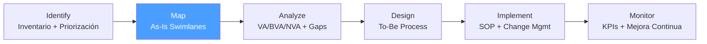

# /bpa-map — BPA: Map

> *"The map is not the territory — but without a map, everyone in the room has a different territory in their head."*

Ejecuta la fase **Map** de BPA. Produce el As-Is Process Map que documenta cómo funciona el proceso hoy, incluyendo actores, pasos, decisiones, tiempos y handoffs.

**THYROX Stage:** Stage 2 BASELINE.

**Tollgate:** As-Is Process Map validado con Process Owner y al menos un ejecutor del proceso antes de avanzar a bpa:analyze.

---

## Ciclo BPA — foco en Map



## Pre-condición

- `bpa:identify` completado — Process Inventory aprobado con proceso seleccionado y límites definidos.
- Process Owner y al menos dos ejecutores del proceso disponibles para sesiones de mapeo.

---

## Cuándo usar este paso

- Para documentar el proceso tal como es hoy (As-Is), sin idealizaciones
- Cuando el equipo tiene percepciones diferentes sobre cómo funciona el proceso
- Antes de cualquier rediseño — necesitas saber el estado actual para medir el delta de mejora
- Para identificar handoffs, decisiones y puntos de espera que no son visibles sin un mapa

## Cuándo NO usar este paso

- Si el proceso ya tiene un mapa As-Is reciente (< 6 meses) y validado — revisar si sigue vigente en lugar de volver a mapear desde cero
- Para procesos completamente nuevos (no existe un As-Is) — ir directamente a bpa:design con el To-Be
- Si el scope del proceso es demasiado amplio (> 40 pasos) — dividir en subprocesos y mapear uno a la vez

---

## Actividades

### 1. Preparar la sesión de mapeo

**Participantes necesarios:**
- Process Owner (1 persona — define el propósito del proceso)
- Ejecutores del proceso (2-4 personas — conocen los pasos reales)
- Analista / facilitador (1 persona — conduce la sesión y documenta)

**Materiales:**
- Tablero físico o digital (Miro, Lucidspark, Figma, pizarrón)
- Post-its de 4 colores (uno por actor principal)
- Timer visible para timeboxing de secciones

**Agenda de sesión tipo (2-3 horas):**
| Tiempo | Actividad |
|--------|-----------|
| 0:00–0:15 | Establecer límites del proceso (start → end) y acordar actores / swimlanes |
| 0:15–1:15 | Mapeo de pasos (de izquierda a derecha, siguiendo el flujo nominal) |
| 1:15–1:45 | Identificar variantes, excepciones y caminos alternativos |
| 1:45–2:15 | Añadir tiempos por paso y puntos de espera |
| 2:15–2:30 | Revisar el mapa completo, identificar gaps obvios |

### 2. Definir swimlanes (actores del proceso)

Los swimlanes dividen el proceso horizontalmente por actor:

| Actor | Cuándo crear un swimlane |
|-------|-------------------------|
| **Persona / Rol** | Cuando un rol tiene múltiples pasos a su cargo |
| **Departamento** | Cuando el proceso cruza unidades organizacionales |
| **Sistema / Herramienta** | Cuando un sistema ejecuta pasos sin intervención humana |
| **Cliente** | Cuando el cliente tiene pasos propios en el proceso |

**Regla:** Máximo 6-7 swimlanes. Más actores = mapa ilegible. Si hay más, agrupar roles similares.

**Ejemplo de swimlanes para "Aprobación de crédito":**
- Swimlane 1: Cliente
- Swimlane 2: Ejecutivo Comercial
- Swimlane 3: Analista de Crédito
- Swimlane 4: Comité de Crédito
- Swimlane 5: Sistema CRM

### 3. Mapear el flujo nominal (camino principal)

Empezar por el **happy path** — el proceso cuando todo va bien:

1. Identificar el **trigger** (evento que inicia el proceso)
2. Documentar pasos en orden cronológico, asignados a su swimlane correspondiente
3. Para cada paso, registrar:
   - Nombre de la actividad (verbo + objeto: "Revisar solicitud", "Aprobar crédito")
   - Actor responsable (swimlane)
   - Input necesario
   - Output producido
   - Tiempo aproximado

**Notación BPMN simplificada en el mapa:**
- **Círculo verde** → Evento de inicio (trigger)
- **Rectángulo** → Tarea / actividad
- **Rombo** → Gateway / decisión
- **Círculo rojo** → Evento de fin
- **Flechas** → Flujo de secuencia

*Ver guía completa de notación BPMN: [bpmn-guide.md](./references/bpmn-guide.md)*

### 4. Documentar variantes y excepciones

Después del happy path, identificar:

| Tipo | Pregunta para elicitar | Documentación |
|------|----------------------|---------------|
| **Variante** | *"¿Hay casos donde el proceso va diferente sin que sea un error?"* | Ramificación con gateway (rombo) |
| **Excepción** | *"¿Qué pasa cuando algo sale mal?"* | Flujo alternativo con manejo de error |
| **Workaround** | *"¿Hay pasos que el equipo hace pero no están en el procedimiento oficial?"* | Documentar como parte del As-Is real |

> Los workarounds son señales de oportunidad — indican que el proceso oficial no funciona y el equipo lo compensó de forma informal.

### 5. Añadir datos de tiempo

Para cada paso o grupo de pasos, registrar:

| Tipo de tiempo | Definición | Cómo medir |
|---------------|------------|-----------|
| **Tiempo de tarea** | Tiempo activo trabajando en el paso | Cronómetro en observación / estimación del ejecutor |
| **Tiempo de espera** | Tiempo entre pasos (en bandeja, en cola) | Registro de sistemas / estimación |
| **Tiempo de ciclo total** | Desde trigger hasta output final | Datos de sistemas o estimación sumando todos los pasos |

**Por qué los tiempos importan en bpa:map:**
Sin datos de tiempo, en bpa:analyze no se puede calcular cuánto tiempo de ciclo total es VA (valor agregado) vs. NVA (espera, retrabajo).

### 6. Validar el mapa con ejecutores

Después de la sesión inicial:
1. Compartir el mapa en borrador con los ejecutores del proceso
2. Preguntar: *"¿Hay algo que hacemos pero no aparece en el mapa?"*
3. Preguntar: *"¿Hay algo en el mapa que en realidad no hacemos así?"*
4. Corregir inconsistencias
5. Obtener firma (o confirmación escrita) del Process Owner

> Un mapa no validado con los ejecutores es el modelo mental del analista, no el proceso real.

---

## Artefacto esperado

`{wp}/bpa-map.md` — usar template: [as-is-process-map-template.md](./assets/as-is-process-map-template.md)

---

## Red Flags — señales de Map mal ejecutado

- **Mapa basado solo en entrevistas con management** — El management describe el proceso como debería ser; los ejecutores describen como es realmente. Sin ejecutores, el mapa es el proceso ideal, no el As-Is
- **Mapa sin tiempos** — Un mapa sin datos de tiempo no permite análisis VA/NVA en la siguiente fase
- **Más de 40 pasos en un solo mapa** — Señal de scope demasiado amplio o falta de abstracción. Dividir en subprocesos
- **Workarounds no documentados** — "No mapeamos eso porque técnicamente no debería hacerse así" → trampa: el workaround IS el proceso real
- **Swimlanes con un solo paso** — Si un actor tiene un solo paso, probablemente puede combinarse con otro swimlane
- **Gateways sin ambas salidas documentadas** — Cada rombo de decisión debe tener al menos 2 caminos (Sí/No, Aprobado/Rechazado)

### Anti-racionalización — excusas comunes para mapear el proceso ideal

| Racionalización | Por qué es trampa | Respuesta correcta |
|----------------|-------------------|--------------------|
| *"No mapeamos las excepciones porque son raras"* | Las excepciones raras suelen ser la fuente de los errores más costosos | Mapear excepciones principales; al menos documentar que existen |
| *"El proceso real es el que está en el SOP"* | El SOP documenta el proceso diseñado; el mapa debe documentar el proceso ejecutado | Hacer Gemba walk o shadow de ejecutores; el SOP viene después del rediseño |
| *"Los tiempos son variables, no los podemos estimar"* | Los rangos de tiempo son suficientes para el análisis | Usar rangos: "2-8 horas" y documentar fuente de la estimación |

---

## Estado en now.md

**Al INICIAR este step:**
```yaml
methodology_step: bpa:map
flow: bpa
```

**Al COMPLETAR** (As-Is Process Map validado con Process Owner):
```yaml
methodology_step: bpa:map  # completado → listo para bpa:analyze
flow: bpa
```

## Siguiente paso

Cuando el As-Is Process Map está validado con Process Owner y ejecutores → `bpa:analyze`

---

## Limitaciones

- El mapa As-Is captura el proceso en el momento del mapeo — puede no reflejar variaciones estacionales o por producto/segmento
- La precisión de los tiempos depende de la calidad de los datos de sistemas o de la honestidad de las estimaciones del equipo
- En procesos con alta variabilidad, puede ser necesario mapear 2-3 variantes principales en lugar de un solo mapa
- El mapeo por sesión de taller puede tener sesgo del grupo presente — validar con personas ausentes antes de cerrar

---

## Reference Files

### Assets
- [as-is-process-map-template.md](./assets/as-is-process-map-template.md) — Template con estructura de swimlanes: Actor | Step | Inputs | Outputs | Time | Decision

### References
- [bpmn-guide.md](./references/bpmn-guide.md) — Notación BPMN: Events, Tasks, Gateways, Pools/Lanes, Sequence Flows con ejemplos y errores comunes
