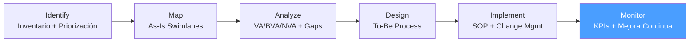

# /bpa-monitor — BPA: Monitor

> *"What you measure improves. What you measure and report improves exponentially."*

Ejecuta la fase **Monitor** de BPA. Establece el dashboard de KPIs, mide el desempeño del proceso To-Be contra el baseline As-Is, identifica desviaciones y dispara ciclos de mejora continua.

**THYROX Stage:** Stage 11 TRACK/EVALUATE.

**Tollgate:** Dashboard de KPIs activo con datos reales por al menos 4 semanas post Go-Live. Desviaciones documentadas y con plan de acción.

---

## Ciclo BPA — foco en Monitor



## Pre-condición

- `bpa:implement` completado — proceso To-Be en producción con Go-Live ejecutado.
- Baseline As-Is documentado en bpa:analyze para comparación.
- Fuentes de datos para las métricas identificadas (sistemas, logs, encuestas).

---

## Cuándo usar este paso

- Inmediatamente después del Go-Live del proceso To-Be — el monitoreo comienza en el primer día
- Para validar que el To-Be alcanza las métricas proyectadas en el Gap Analysis
- Cuando se detectan desviaciones del proceso y se necesita decidir si ajustar el SOP o rediseñar

## Cuándo NO usar este paso

- Antes del Go-Live — el monitoreo requiere datos del proceso en producción
- Si el proceso va a ser reemplazado o discontinuado inmediatamente — no tiene sentido monitorear un proceso transitorio
- Sin fuentes de datos definidas — el monitoreo sin datos es solo percepción subjetiva

---

## Actividades

### 1. Definir los KPIs del proceso

Antes del Go-Live, definir qué métricas se van a trackear:

**Criterios para un buen KPI de proceso:**
- **Ligado al Gap Analysis** — cada KPI corresponde a una brecha identificada en bpa:analyze
- **Medible con datos disponibles** — fuente de datos concreta, no estimaciones
- **Frecuencia de actualización definida** — diaria, semanal, mensual
- **Owner identificado** — quién es responsable de actualizar y actuar sobre el KPI
- **Umbral de alerta** — a partir de qué valor hay que actuar

*Ver guía de definición de KPIs: [process-metrics-guide.md](./references/process-metrics-guide.md)*

**Categorías de KPIs para procesos:**

| Categoría | Ejemplos | Fuente típica |
|-----------|---------|--------------|
| **Tiempo** | Tiempo de ciclo total, tiempo de espera por step | Sistemas transaccionales, timestamps |
| **Calidad** | Tasa de error, tasa de retrabajo, % de excepciones | Sistema de tickets, log de rechazos |
| **Volumen** | N° de transacciones/día, throughput | Sistema transaccional |
| **Eficiencia** | % tiempo VA, N° de handoffs por caso | Calculado desde tiempo y actividades |
| **Satisfacción** | NPS interno (equipo ejecutor), satisfacción del cliente | Encuestas, NPS |
| **Costo** | Costo por transacción, costo de errores/retrabajo | Datos financieros o estimaciones |

### 2. Establecer el baseline y los targets

Para cada KPI, documentar:

| KPI | Baseline As-Is | Target To-Be | Fuente | Frecuencia |
|-----|---------------|-------------|--------|-----------|
| [Nombre del KPI] | [Valor As-Is de bpa:analyze] | [Valor To-Be del Gap Analysis] | [Sistema/método] | [Diaria/Semanal/Mensual] |

**Regla:** Si el baseline no está disponible en bpa:analyze, medirlo durante las primeras 2 semanas post Go-Live usando el nuevo proceso pero con el As-Is como referencia.

### 3. Configurar el dashboard de seguimiento

El dashboard de proceso es el artefacto central de bpa:monitor:

*Ver template completo: [process-kpi-dashboard-template.md](./assets/process-kpi-dashboard-template.md)*

**Cadencia de revisión del dashboard:**

| Frecuencia | Contenido | Audiencia |
|-----------|-----------|---------|
| **Semanal** | Estado de KPIs clave, alertas activas, incidents de la semana | Process Owner + equipo ejecutor |
| **Mensual** | Tendencias, comparación vs. baseline, decisiones de mejora | Process Owner + management |
| **Trimestral** | Evaluación completa del proceso, decisión de nuevo ciclo BPA si aplica | Sponsor + management |

### 4. Identificar y gestionar desviaciones

Una desviación es cuando un KPI supera su umbral de alerta:

**Tipos de desviación:**

| Tipo | Descripción | Acción |
|------|-------------|--------|
| **Desviación puntual** | KPI fuera del umbral en una sola medición | Investigar la causa del incidente específico; ajustar si es sistémico |
| **Desviación tendencial** | KPI empeora gradualmente durante varias semanas | Análisis de causa raíz; posible ajuste de SOP o rediseño de paso |
| **Desviación de adopción** | El proceso se ejecuta diferente al SOP | Refuerzo de training; investigar por qué el SOP no se sigue |

**Protocolo de respuesta a desviación:**
1. Documentar la desviación (fecha, KPI, valor observado vs. umbral)
2. Clasificar: puntual vs. tendencial
3. Si puntual: investigar el caso específico en 48h
4. Si tendencial: convocar sesión de análisis con Process Owner en 1 semana
5. Decidir: ajustar SOP, reforzar training, o iniciar nuevo ciclo bpa → bpa:analyze

### 5. Ciclo de mejora continua

bpa:monitor no es el fin del BPA — es el punto de partida de la mejora continua:

```
Go-Live → Monitor (4+ semanas) → ¿KPIs en target? 
    → Sí, estables → Revisar en siguiente ciclo trimestral
    → No → Desviación puntual → Ajuste de SOP
    → No → Desviación tendencial → Nuevo ciclo bpa:analyze → bpa:design → bpa:implement
    → Sí, pero se identifican nuevas oportunidades → Nuevo ciclo bpa:identify
```

**Señales de que se necesita un nuevo ciclo BPA completo:**
- El proceso alcanzó su target pero el negocio cambió (nuevo producto, nueva regulación, nuevo sistema)
- Han transcurrido 12 meses y el proceso no ha sido revisado
- El equipo tiene nuevas mejoras identificadas con score de priorización ≥ 4.0

### 6. Evaluación final del ciclo BPA

Al cierre del ciclo de monitoreo (típicamente 3-6 meses post Go-Live):

| Pregunta de evaluación | Fuente de respuesta |
|-----------------------|---------------------|
| ¿Se alcanzaron los targets del Gap Analysis? | Dashboard de KPIs |
| ¿Cuánto mejoró el tiempo de ciclo vs. baseline As-Is? | Métricas de tiempo |
| ¿El equipo adoptó el nuevo proceso? | Métricas de adopción |
| ¿Qué nuevas oportunidades de mejora se identificaron? | Feedback del equipo + desviaciones |
| ¿Vale la pena un nuevo ciclo BPA? | Evaluación de impacto vs. esfuerzo |

---

## Artefacto esperado

`{wp}/bpa-monitor.md` — incluye KPI dashboard y log de desviaciones
- [process-kpi-dashboard-template.md](./assets/process-kpi-dashboard-template.md)

---

## Red Flags — señales de Monitor mal ejecutado

- **Dashboard sin actualización regular** — Un dashboard desactualizado es peor que no tener dashboard (da falsa seguridad)
- **KPIs sin owner** — Si nadie es responsable de actualizar y actuar sobre un KPI, no mejora
- **Desviaciones sin plan de acción** — Documentar que hay un problema sin plan de acción es registrar el fracaso, no gestionarlo
- **Monitoreo solo de resultados finales** — Medir solo el output final (tiempo de ciclo total) sin medir los pasos intermedios no permite identificar dónde está el problema
- **Ciclo de mejora que no se inicia** — Si las desviaciones tendenciales no generan un nuevo ciclo BPA, el proceso seguirá degradándose

### Anti-racionalización — excusas comunes para no monitorear

| Racionalización | Por qué es trampa | Respuesta correcta |
|----------------|-------------------|--------------------|
| *"No tenemos datos automatizados"* | Los datos manuales son un punto de partida válido | Medir manualmente en una muestra semanal hasta automatizar |
| *"El proceso está funcionando bien"* | Sin datos, "bien" es percepción, no hecho | Los datos pueden confirmar que funciona bien — o revelar problemas invisibles |
| *"El equipo ya se adaptó, no hace falta seguir midiendo"* | La adaptación inicial no garantiza la estabilidad en el tiempo | El monitoreo continuo detecta degradación gradual antes de que sea un problema grave |

---

## Estado en now.md

**Al INICIAR este step:**
```yaml
methodology_step: bpa:monitor
flow: bpa
```

**Al COMPLETAR el ciclo inicial de monitoreo** (4+ semanas de datos, desviaciones gestionadas):
```yaml
methodology_step: bpa:monitor  # ciclo activo — revisión continua
flow: bpa
```

## Siguiente paso

bpa:monitor es continuo. Los puntos de decisión son:
- **Desviación tendencial** → nuevo ciclo `bpa:analyze`
- **Nuevas oportunidades con score ≥ 4.0** → nuevo ciclo `bpa:identify`
- **12 meses sin revisión** → nuevo ciclo BPA completo

---

## Limitaciones

- Las primeras 4 semanas post Go-Live pueden mostrar métricas distorsionadas por la curva de aprendizaje — esperar estabilización antes de evaluar si se alcanzan los targets
- Los datos de sistemas pueden tener latencia (no siempre se puede medir en tiempo real)
- El monitoreo no reemplaza la supervisión cualitativa — combinar KPIs con feedback directo del equipo ejecutor
- Si el proceso tiene alta estacionalidad (ej: procesos de cierre mensual), 4 semanas puede no capturar la variabilidad completa

---

## Reference Files

### Assets
- [process-kpi-dashboard-template.md](./assets/process-kpi-dashboard-template.md) — Template del dashboard: KPI | Baseline | Target | Current | Trend | Owner | Action

### References
- [process-metrics-guide.md](./references/process-metrics-guide.md) — Cómo definir KPIs de proceso, calcular baseline, establecer umbrales de alerta y configurar ciclos de revisión
