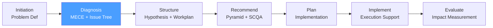

# /cp-diagnosis — Consulting Process: Diagnosis

> *"MECE — Mutually Exclusive, Collectively Exhaustive. No overlaps. No gaps. Every branch of the Issue Tree must satisfy this test or the decomposition is incomplete."*

Executes the **Diagnosis** phase of the McKinsey-style Consulting Process. Produces the Issue Tree that structures the problem space, and a data gathering plan to populate each branch with evidence.

**THYROX Stage:** Stage 2 BASELINE.

**Gate:** Issue Tree reviewed and approved by the engagement lead before proceeding to cp:structure.

---

## Consulting Process Cycle — focus on Diagnosis



## Pre-condition

- **cp:initiation complete:** Problem Definition Document signed off by client sponsor.
- Diagnostic question is agreed and documented.
- At minimum 3 stakeholder interviews completed.

---

## When to use this step

- After cp:initiation, when the problem is framed and the team needs to decompose it into analyzable components
- When the problem space is complex and multiple potential causes exist simultaneously
- When you need to decide which analyses to run and in which order

## When NOT to use this step

- If the problem is simple and the cause is already known — go to cp:structure with that hypothesis
- If you are re-entering Diagnosis to revise a tree — re-read the existing Issue Tree first
- Without a signed Problem Definition Document from cp:initiation

---

## Activities

### 1. MECE — the fundamental principle

MECE stands for **Mutually Exclusive, Collectively Exhaustive**. Every issue tree decomposition must satisfy both properties at every level.

**Mutually Exclusive (ME):** No overlap between branches.

```
MECE split of "Revenue":
  ✅ Volume × Price   (distinct components; Volume × Price = Revenue)
  ❌ B2B Revenue + Enterprise Revenue  (enterprise is a subset of B2B — overlap)
```

**Collectively Exhaustive (CE):** Branches together cover 100% of the space.

```
MECE split of "Customers":
  ✅ Existing + New   (all customers are either existing or new)
  ❌ Large + Medium   (small customers are missing — not exhaustive)
```

**The MECE test — apply at every level:**

| Test | Question to ask | Failure signal |
|------|----------------|---------------|
| **ME** | Can any item in Branch A also appear in Branch B? | If yes → there is overlap; redefine the branches |
| **CE** | If I add up all branches, do they cover everything? | If no → there is a gap; add a branch or reframe the parent |

See full MECE guide with examples: [mece-guide.md](./references/mece-guide.md)

### 2. Issue Tree types

There are two types of Issue Trees, chosen based on what the team knows at Diagnosis stage:

**Type 1: Hypothesis-Driven (top-down)**

Use when: you have strong initial hypotheses and want to test them efficiently.

```
Diagnostic Question: "Why is operating margin declining?"
  ├── H1: Revenue problem (price or volume)?
  │     ├── Pricing too low vs market?
  │     └── Volume declining in key segments?
  └── H2: Cost problem (fixed or variable)?
        ├── Fixed costs increased disproportionately?
        └── Variable costs per unit rising?
```

Advantage: faster; focuses team on the highest-value analyses.
Risk: confirmation bias if hypotheses are wrong from the start.

**Type 2: Diagnostic (bottom-up)**

Use when: the problem is poorly understood and many potential causes exist.

```
Diagnostic Question: "Why is operating margin declining?"
  ├── Revenue drivers
  │     ├── Pricing
  │     ├── Volume
  │     └── Mix
  ├── Cost drivers
  │     ├── COGS
  │     ├── SG&A
  │     └── D&A
  └── Balance sheet effects
        ├── Working capital changes
        └── Asset utilization
```

Advantage: comprehensive; less likely to miss a driver.
Risk: slower; may analyze branches that are not relevant.

**Hybrid approach (most common in practice):** Start with a diagnostic tree to ensure completeness (CE test), then collapse branches based on hypotheses to prioritize analysis.

### 3. Building the Issue Tree — step by step

**Step 1:** Write the diagnostic question at the top of the tree.

**Step 2:** Identify the highest-level decomposition (Level 1 branches). Apply the MECE test.
- Common Level 1 splits: revenue vs cost; internal vs external; short-term vs long-term; by product/geography/customer segment.

**Step 3:** Decompose each Level 1 branch into Level 2 nodes. Apply the MECE test at Level 2.

**Step 4:** Continue decomposing until you reach "leaf nodes" — specific, answerable questions that can be addressed with data.

**Step 5:** For each leaf node, define: (a) the analysis needed to answer it; (b) the data required; (c) priority (high/med/low).

**Depth guideline:**
- Level 1: 3-5 branches
- Level 2: 2-4 sub-branches per Level 1
- Level 3: 2-3 sub-branches per Level 2 (go deeper only if needed)
- Leaf nodes: specific enough that a single analysis can answer them

### 4. Issue Tree notation

Document the Issue Tree in structured markdown:

```markdown
## Issue Tree: [Diagnostic Question]

**Level 1: [Branch A]**
  - Level 2: [A.1 — specific issue]
    - Level 3: [A.1.a — leaf node: answerable with data X]
    - Level 3: [A.1.b — leaf node: answerable with data Y]
  - Level 2: [A.2 — specific issue]
    - Level 3: [A.2.a — leaf node]

**Level 1: [Branch B]**
  - Level 2: [B.1 — specific issue]
    - Level 3: [B.1.a — leaf node]
```

### 5. Data gathering plan

For each leaf node in the Issue Tree, define a data gathering action:

| Leaf node | Analysis type | Data source | Method | Owner | Deadline |
|-----------|--------------|-------------|--------|-------|----------|
| [Issue X] | Quantitative / Qualitative | [Internal DB / Interviews / Market data] | [SQL query / Interview / Benchmark] | [Name] | [Date] |

**Data gathering principles:**
- **Start with existing data** — internal data (P&L, CRM, ops data) is faster and cheaper than primary research
- **Prioritize by hypothesis** — gather data for your highest-confidence hypotheses first; if confirmed, you may not need to gather all data
- **Design analyses before gathering data** — know what analysis you will run before collecting; avoids gathering data you don't need
- **Signal vs noise** — not all data answers the question; define the specific metric and threshold that would move the needle

### 6. Client interview plan

Structured interviews are the primary source of qualitative data in Diagnosis:

| Interview objective | Stakeholder | Format | Key questions | Owner |
|--------------------|-------------|--------|--------------|-------|
| [Understand process X] | [Name / Function] | 60-min 1:1 | [3-4 key questions] | [Name] |
| [Validate hypothesis H1] | [Name / Function] | 30-min focused | [2-3 key questions] | [Name] |

**Interview design principle:** Each interview should be designed to answer a specific branch of the Issue Tree — not a generic conversation.

### 7. MECE audit — before advancing

Before signing off on the Issue Tree, run the full MECE audit:

| Audit check | Pass / Fail | Notes |
|-------------|------------|-------|
| Level 1 branches are mutually exclusive | | |
| Level 1 branches are collectively exhaustive | | |
| Level 2 branches under each Level 1 are ME | | |
| Level 2 branches under each Level 1 are CE | | |
| Every leaf node is specific enough to be answered by one analysis | | |
| Every leaf node has a defined data source and owner | | |
| Issue Tree covers 100% of the diagnostic question | | |

---

## Expected Artifact

`{wp}/cp-diagnosis.md` — use template: [issue-tree-template.md](./assets/issue-tree-template.md)

---

## Red Flags — signs of Diagnosis done poorly

- **"Other" as a branch** — any branch labeled "Other" breaks CE; if you need an "other" bucket, the decomposition is incomplete
- **Tree branches overlap** — if the same revenue loss appears in both "pricing" and "mix" branches, the ME test fails
- **Tree goes too deep too fast** — Level 4 and Level 5 nodes before Level 2 is fully explored means the team is drilling into one branch while missing others
- **Leaf nodes are not answerable** — if a leaf node requires 6 months of data collection to answer, it's not a leaf — break it down further
- **No data gathering plan** — an Issue Tree without a plan to populate it is a theoretical exercise, not a diagnosis
- **MECE audit skipped** — "it looks right" is not a MECE audit; the test must be explicit at every level
- **Tree reflects the org chart** — decomposing by department (Sales, Marketing, Operations) is rarely MECE from a business-problem perspective; it reflects silos, not the economics of the problem

### Anti-rationalization — common excuses for skipping MECE discipline

| Rationalization | Why it's a trap | Correct response |
|----------------|----------------|-----------------|
| *"MECE is theoretical — real problems are messier"* | MECE is not about clean theory; it's about not missing drivers or double-counting | Run the ME test and CE test explicitly; update the tree until it passes |
| *"We'll gather the data first and build the tree later"* | Data without a tree produces analysis without structure — you'll analyze what you have, not what you need | Build the tree first; let it drive the data gathering plan |
| *"The tree is too complicated — clients won't understand it"* | The tree is a working tool for the consulting team, not a client deliverable | Simplify only the tree you present; keep the full tree internally |
| *"We already know the answer — the tree is just a formality"* | If you already know the answer, use a hypothesis-driven tree to test it; confirmed hypotheses are more credible than asserted ones | State the hypothesis explicitly and design analyses to validate or kill it |

---

## Estado en now.md

**Al INICIAR este step:**
```yaml
methodology_step: cp:diagnosis
flow: cp
```

**Al COMPLETAR** (Issue Tree approved by engagement lead):
```yaml
methodology_step: cp:diagnosis  # completado → listo para cp:structure
flow: cp
```

## Siguiente paso

When Issue Tree is approved and data gathering plan is assigned → `cp:structure`

---

## Limitations

- The Issue Tree is a hypothesis about problem structure — it may need to be revised as data comes in; plan for one revision cycle
- MECE is harder in qualitative problem spaces (culture, leadership) than quantitative ones; apply the principles with judgment
- Data availability constrains the leaf nodes that can be answered — if a key source is unavailable, document it as a constraint and use proxy data
- Client interviews produce qualitative data subject to bias; triangulate with quantitative data before concluding

---

## Reference Files

### Assets
- [issue-tree-template.md](./assets/issue-tree-template.md) — Structured template for building and documenting the Issue Tree with MECE audit checklist and data gathering plan

### References
- [mece-guide.md](./references/mece-guide.md) — Complete MECE guide: ME test, CE test, common MECE splits, anti-patterns, examples by problem type (revenue, cost, operations, strategy)
