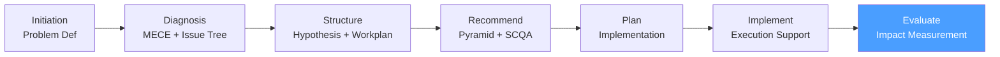

# /cp-evaluate — Consulting Process: Evaluate

> *"Impact measurement closes the loop: it validates that the recommendation was right, the implementation was effective, and the client can sustain the results without consulting support."*

Executes the **Evaluate** phase of the McKinsey-style Consulting Process. Measures the realized impact of the recommendations against the projected benefit, captures lessons learned, and formally closes the engagement.

**THYROX Stage:** Stage 11 TRACK/EVALUATE.

**Gate:** Impact assessment reviewed with client sponsor and engagement formally closed.

---

## Consulting Process Cycle — focus on Evaluate



## Pre-condition

- **cp:implement complete:** Implementation workstreams have reached their planned completion or the engagement contract has ended.
- Sufficient time has elapsed to measure impact (typically 3-6 months post-implementation for operational metrics; 12 months for financial impact).
- Baseline measurements from cp:structure / cp:plan are available for comparison.

---

## When to use this step

- At the natural end of the consulting engagement, after implementation is complete
- At a defined evaluation checkpoint (e.g., 6 months post-implementation) agreed in the Implementation Plan
- When the client wants to validate whether the benefit projected in the recommendation was realized
- Before a potential follow-on engagement — evaluation clarifies what worked and what remains to be done

## When NOT to use this step

- Too early — measuring impact before implementation is complete produces misleading results; allow adequate time for changes to take effect
- Without baseline data from earlier phases — if no baseline was established, impact cannot be measured rigorously
- If the client does not authorize impact measurement — some clients consider financial data confidential; agree on measurement scope upfront

---

## Activities

### 1. Impact measurement — realized vs projected

The central output of Evaluate is a structured comparison of realized impact against the projected benefit from the recommendation.

**Impact measurement framework:**

| Metric | Baseline (pre-implementation) | Target (from recommendation) | Realized (measured) | Variance | % of target achieved |
|--------|-------------------------------|------------------------------|---------------------|----------|---------------------|
| [Primary CTQ — e.g., Operating margin %] | [Baseline value] | [Target] | [Actual] | [Actual − Target] | [%] |
| [Secondary metric 1] | | | | | |
| [Secondary metric 2] | | | | | |
| **Financial benefit ($)** | 0 | [$ projected] | [$ realized] | | |

**Measurement methodology:**

1. Define the measurement period: 3-6 months post-implementation for operational metrics; 12 months for P&L impact
2. Use the same data source as the baseline (for comparability)
3. Apply the same calculation method as defined in cp:structure
4. Isolate implementation effect: control for external factors (market changes, seasonality) where possible

**Attribution note:** Not all benefit can be attributable solely to the consulting engagement. Document:
- Total observed improvement
- External factors that may have contributed (or reduced) the improvement
- Consulting-attributable portion (conservative estimate)

### 2. Workstream-level evaluation

Evaluate each implementation workstream separately:

| Workstream | Planned outcome | Realized outcome | Status | Notes |
|-----------|----------------|-----------------|--------|-------|
| WS1: [Name] | [Specific deliverable + metric] | [Actual] | Exceeded / Met / Partial / Not met | [Explanation] |
| WS2: [Name] | | | | |
| WS3: [Name] | | | | |

**For each partially met or not met workstream:**
- Root cause of shortfall (execution gap vs assumption gap vs external factor)
- Residual opportunity (what remains to be captured)
- Recommendation: complete in next engagement, hand off to client, or close

### 3. Adoption and sustainability assessment

Impact measurement alone is not sufficient — the changes must be sustained after the consulting team exits.

**Sustainability checklist:**

| Dimension | Assessment | Evidence | Risk level |
|-----------|-----------|----------|-----------|
| **Process adoption** | % of transactions following new process | [Data] | High / Med / Low |
| **Capability** | Client team can operate without consulting support | [Observed / Tested] | |
| **Governance** | Internal governance (steering committee or equivalent) is functioning | [Meeting cadence confirmed] | |
| **Measurement** | Client owns the metrics and reports on them internally | [Dashboard / Report handover confirmed] | |
| **Culture** | Behavior change is internalized, not just policy | [Survey / Observation] | |

If any dimension shows High risk → document as recommendation for follow-on action by client.

### 4. Lessons learned — what worked and what didn't

Lessons learned are critical for two audiences: the consulting team (for future engagements) and the client (for future initiatives).

**Lessons learned structure:**

| Category | Observation | Impact | Recommendation for future |
|----------|------------|--------|--------------------------|
| **Initiation** | [Was the problem framed correctly?] | [Effect on engagement] | [How to improve] |
| **Diagnosis** | [Was the Issue Tree correct?] | [Did we analyze the right things?] | |
| **Structure** | [Were hypotheses right? Analysis plan effective?] | | |
| **Recommendation** | [Was the recommendation adopted? Any resistance?] | | |
| **Plan** | [Was the Implementation Plan realistic?] | [Timeline adherence] | |
| **Implement** | [What blockers were encountered? How resolved?] | [Implementation quality] | |
| **Client factors** | [What did the client do particularly well? What created friction?] | | |
| **Consulting team** | [What would we do differently on a similar engagement?] | | |

### 5. Engagement closure — formal close

**Closure checklist:**

| Item | Complete | Date |
|------|---------|------|
| Final impact assessment presented to sponsor | | |
| All deliverables formally handed over to client | | |
| All client data access revoked | | |
| All consulting team access to client systems removed | | |
| Final invoice issued | | |
| Consulting team debriefed (internal lessons learned) | | |
| Client feedback collected | | |
| Engagement summary documented in firm knowledge base | | |

**Final presentation to sponsor — closure deck structure:**

| Section | Content |
|---------|---------|
| **Engagement summary** | Original diagnostic question + recommendation stated |
| **Impact measurement** | Realized vs projected benefit; % achieved |
| **What worked well** | 2-3 specific successes with evidence |
| **What could be improved** | 1-2 honest observations; constructive tone |
| **Residual opportunities** | What remains; recommendation on whether to pursue |
| **Sustainability assessment** | Client's ability to maintain results without consulting support |
| **Next steps (if any)** | Follow-on engagement options; or formal close |
| **Thank you** | Team acknowledgment |

### 6. Client feedback — the hard conversation

A structured client feedback conversation is part of professional closing. It is also a quality gate for the consulting firm.

**Client feedback questions:**

| Question | Scale |
|---------|-------|
| The engagement answered the original diagnostic question | 1-5 |
| The recommendation was specific and actionable | 1-5 |
| The team was effective in supporting implementation | 1-5 |
| The projected financial benefit was realistic | 1-5 |
| The team communicated clearly and kept us informed | 1-5 |
| **Overall engagement satisfaction** | 1-5 |
| What would you do differently on a similar engagement? | Open |
| Would you recommend this team to a colleague? | Y / N / Maybe |

---

## Expected Artifact

`{wp}/cp-evaluate.md` — use template: [impact-assessment-template.md](./assets/impact-assessment-template.md)

---

## Red Flags — signs of Evaluate done poorly

- **Measuring too early** — measuring operational metrics 4 weeks after implementation produces noise, not signal; agree on the measurement timeline upfront
- **No baseline for comparison** — "things are better" is not a measurement; if cp:structure didn't establish a baseline, reconstruct it before measuring
- **Attributing all improvement to the engagement** — taking credit for market tailwinds or unrelated initiatives damages credibility; be conservative in attribution
- **Skipping sustainability assessment** — measuring impact at close without assessing whether changes will hold is incomplete; 6-month post-exit check is best practice
- **Not collecting client feedback** — client feedback is how consulting teams improve; avoiding it is a form of quality avoidance

### Anti-rationalization

| Rationalization | Why it's a trap | Correct response |
|----------------|----------------|-----------------|
| *"The client knows the engagement was successful — we don't need to measure"* | Quantified impact builds the evidence base for future engagements and internal knowledge management | Conduct the measurement regardless of perceived success |
| *"We can't isolate the engagement's impact from external factors"* | Perfect attribution is not possible; conservative estimation with documented assumptions is sufficient | Estimate range, document methodology, be transparent about external factors |
| *"The lessons learned session is a formality"* | Lessons learned that are not documented are forgotten within 90 days | Conduct a structured debrief; document in firm knowledge base |

---

## Estado en now.md

**Al INICIAR este step:**
```yaml
methodology_step: cp:evaluate
flow: cp
```

**Al COMPLETAR** (Impact assessment reviewed; engagement formally closed):
```yaml
methodology_step: cp:evaluate  # completado → cp cycle CLOSED
flow: cp
```

## Siguiente paso

When impact assessment is complete and engagement is formally closed → CP cycle is complete.

If residual opportunities exist → client may initiate a new engagement starting at `cp:initiation`.

---

## Limitations

- Impact measurement requires that changes have had sufficient time to take effect; premature measurement underestimates impact
- External factors (macroeconomic changes, competitive moves, management changes) affect outcomes independently of the engagement; document but do not overweight
- The client's willingness to share internal financial data for impact measurement varies; negotiate access in the Problem Definition Document, not at close

---

## Reference Files

### Assets
- [impact-assessment-template.md](./assets/impact-assessment-template.md) — Full impact assessment template with baseline/target/realized comparison table, workstream evaluation, sustainability assessment, lessons learned framework, and engagement closure checklist

### References
- [impact-measurement-guide.md](./references/impact-measurement-guide.md) — Guide to measuring consulting impact: measurement timing, attribution methodology, controlling for external factors, and constructing a credible impact narrative
