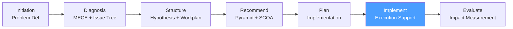

# /cp-implement — Consulting Process: Implement

> *"During implementation, the consultant's role shifts from expert to advisor: the client executes, the consultant provides structure, removes blockers, and keeps the program anchored to the original recommendation."*

Executes the **Implement** phase of the McKinsey-style Consulting Process. Supports the client's execution of the approved Implementation Plan through workstream management, issue escalation, steering committee facilitation, and progress tracking.

**THYROX Stage:** Stage 10 IMPLEMENT.

**Gate:** All workstream owners confirm execution is complete, OR the engagement contract ends — whichever comes first.

---

## Consulting Process Cycle — focus on Implement



## Pre-condition

- **cp:plan complete:** Implementation Plan approved by client sponsor.
- Workstream owners are named and committed.
- Budget and resources are allocated.
- Governance cadence (steering committee, working sessions) is scheduled.

---

## When to use this step

- When the consulting engagement includes implementation support (not just advisory)
- When the client needs structured program management to execute the recommendation
- When the implementation spans multiple workstreams that require coordination

## When NOT to use this step

- If the engagement is advisory only (recommendations handed off without implementation support) — the engagement ends at cp:plan
- If the client has a strong internal PMO that will own execution without consulting involvement — transition and monitor only
- If the implementation is < 4 weeks — skip formal implementation structure and use a simplified task tracker

---

## Activities

### 1. Implementation kickoff

The kickoff meeting launches execution and establishes the governance cadence. It is distinct from the recommendation presentation — this meeting is operational.

**Kickoff meeting agenda:**

| Topic | Duration | Purpose |
|-------|----------|---------|
| Program overview | 15 min | Recap recommendation and implementation plan; confirm scope and goals |
| Workstream assignments | 20 min | Each workstream owner introduces their team and first actions |
| Governance cadence | 10 min | Confirm steering committee, working session, status report cadence |
| RAG reporting protocol | 10 min | Define Green / Amber / Red criteria and escalation process |
| Blockers and dependencies | 15 min | Identify known blockers on Day 1; assign owners to resolve |
| Communication plan | 10 min | Confirm how and when the broader organization will be informed |

### 2. Weekly execution rhythm

**Standard weekly cadence:**

| Activity | Day | Duration | Participants | Output |
|----------|-----|----------|------------|--------|
| Working session | Monday | 60-90 min | Workstream teams + client counterparts | Updated task status; blockers surfaced |
| Consulting team sync | Wednesday | 30 min | Consulting team only | Internal view of risks; strategy alignment |
| Status report | Friday | Written | Sponsor | RAG status + key decisions needed |

**RAG status definitions:**

| Status | Definition | Action |
|--------|-----------|--------|
| **Green** | On track — no blockers; milestones will be met | Continue; note in status report |
| **Amber** | At risk — a blocker exists but a resolution path is known | Surface to working session; escalate if unresolved in 5 business days |
| **Red** | Off track — milestone will be missed or blocker has no clear resolution | Escalate immediately to sponsor; convene emergency working session |

### 3. Steering committee facilitation

The steering committee meets monthly to review progress, approve decisions, and remove senior-level blockers.

**Steering committee deck structure:**

| Section | Slides | Content |
|---------|--------|---------|
| **Summary** | 1 | Overall RAG; milestones this month; decisions needed |
| **Workstream status** | 1-2 | RAG by workstream; completed vs planned; next milestones |
| **Impact tracking** | 1 | Realized impact vs plan ($ or %) |
| **Key decisions** | 1 | 2-3 decisions needed from steering committee; options + recommendation |
| **Risks** | 1 | Top 3 risks this period; mitigation status |
| **Next period** | 1 | Key actions next 30 days; milestones |

**Decision documentation:**

Every decision made in steering committee must be documented:

```
Decision: [What was decided]
Date: [YYYY-MM-DD]
Context: [Why this decision was needed]
Options considered: [Brief — 2-3 options]
Decision made: [Which option and why]
Owner: [Who implements]
Deadline: [When]
```

### 4. Blocker management

Blockers are impediments that prevent a workstream from progressing. The consultant's role is to surface, categorize, and resolve or escalate blockers.

**Blocker categories:**

| Category | Example | Resolution owner |
|----------|---------|-----------------|
| **Resources** | Key person pulled off the program | Sponsor decision |
| **Data access** | System access not granted | IT / Steering committee |
| **Decision** | Policy decision pending executive approval | Sponsor |
| **Technical** | System configuration issue | Client IT + consulting team |
| **Political** | Department refusing to adopt new process | Change management + Sponsor |

**Blocker escalation protocol:**

1. Surface in working session — assign resolution owner and deadline
2. If unresolved in 5 days → Amber status; include in weekly status report
3. If unresolved in 10 days → Red status; escalate to sponsor with 2-3 resolution options
4. If sponsor cannot resolve → convene emergency steering committee

### 5. Change management execution

During implementation, the consultant monitors adoption and escalates resistance:

**Adoption tracking:**

| Metric | Baseline | Week 4 | Week 8 | Week 12 | Target |
|--------|---------|--------|--------|---------|--------|
| % staff trained on new process | 0% | [Actual] | [Actual] | [Actual] | 100% |
| % of transactions following new protocol | 0% | [Actual] | [Actual] | [Actual] | 90% |
| Manager adoption score (survey) | — | — | [Actual] | [Actual] | ≥ 4/5 |

**Resistance signals to watch for:**

- Working around the new process rather than using it
- Managers not enforcing new protocols with their teams
- Training completion rate < 80% at 60-day mark
- Survey scores showing confusion or disagreement with the change
- Informal conversations where staff express doubt about the program

When resistance signals appear → escalate to sponsor; revisit communication and training plan.

### 6. Course corrections — when the plan needs to change

Implementation plans are built on assumptions. When assumptions prove wrong, the plan must be formally updated — not silently adjusted.

**When to trigger a formal course correction:**

- A P1 workstream milestone will miss by > 30 days
- Realized impact tracking shows < 50% of planned benefit at mid-point
- A key hypothesis that underpinned the recommendation is invalidated during implementation
- A significant external change (market, regulation, leadership) alters the context

**Course correction process:**

1. Document the change: what assumption proved wrong, what data shows this
2. Assess options: 3 options minimum (accelerate, adjust scope, stop)
3. Recommend: apply Pyramid logic — answer first, then arguments
4. Approve: steering committee makes the formal decision
5. Update: revise the Implementation Plan; date-stamp the revision

---

## Expected Artifact

`{wp}/cp-implement.md` — use template: [implementation-tracker-template.md](./assets/implementation-tracker-template.md)

---

## Red Flags — signs of Implement done poorly

- **No steering committee in first 30 days** — if steering committee hasn't met within 30 days of kickoff, governance is not real
- **Blockers aging beyond 2 weeks without escalation** — old unresolved blockers are the leading indicator of implementation failure
- **Impact tracking not set up** — if the team is not tracking realized benefits against the projected $-amount, the sponsor will lose confidence
- **Consulting team doing client work** — the consultant's role is to support and advise, not to implement; consultants doing client work creates dependency
- **No change management check-ins** — if adoption metrics are not being tracked, resistance will be invisible until it's too late

### Anti-rationalization

| Rationalization | Why it's a trap | Correct response |
|----------------|----------------|-----------------|
| *"The client's team is doing fine — we don't need weekly check-ins"* | Weekly rhythm is the early warning system; skipping it means problems surface too late | Maintain the cadence even when things are going well; reduce frequency only at client's formal request |
| *"That blocker is the client's problem to solve"* | All blockers are the program's problem until resolved; the consultant facilitates resolution, not just documents the problem | Bring 2-3 resolution options to every blocker escalation; don't just flag the problem |
| *"The plan is too rigid — we should adapt without formal process"* | Silent adaptation creates ambiguity about what the plan actually is; formal course corrections keep the sponsor informed | Document every material change to the plan formally |

---

## Estado en now.md

**Al INICIAR este step:**
```yaml
methodology_step: cp:implement
flow: cp
```

**Al COMPLETAR** (All workstreams complete or engagement contract ends):
```yaml
methodology_step: cp:implement  # completado → listo para cp:evaluate
flow: cp
```

## Siguiente paso

When implementation is complete or the contract period ends → `cp:evaluate`

---

## Limitations

- The consulting team's authority during implementation is advisory, not managerial — ultimately the client executes; the consultant enables
- Scope creep during implementation is common; maintain scope discipline and use formal course correction process for any expansion
- In long engagements (> 12 months), consulting team continuity matters; team changes mid-engagement create knowledge gaps — plan for handovers

---

## Reference Files

### Assets
- [implementation-tracker-template.md](./assets/implementation-tracker-template.md) — Implementation tracker with workstream status, RAG reporting, blocker log, decision log, and steering committee deck outline

### References
- [steering-committee-guide.md](./references/steering-committee-guide.md) — Steering committee facilitation guide: agenda structure, decision documentation, escalation protocols, and techniques for managing difficult governance conversations
