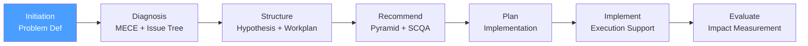

# /cp-initiation — Consulting Process: Initiation

> *"The right problem statement is the solution to 50% of consulting problems. A vague or misframed problem wastes the client's money and the consultant's credibility."*

Executes the **Initiation** phase of the McKinsey-style Consulting Process. Produces the Problem Definition Document that formally scopes the engagement and aligns the consulting team with the client.

**THYROX Stage:** Stage 1 DISCOVER.

**Gate:** Problem Definition Document signed off by client sponsor before proceeding to Diagnosis.

---

## Consulting Process Cycle — focus on Initiation



## Pre-condition

- **First cycle:** Client contact established; a business situation or challenge has been described informally.
- At minimum one conversation with the client sponsor has occurred before completing Initiation.
- The engagement has a named client sponsor who can approve the Problem Definition Document.

---

## When to use this step

- At the start of any management consulting engagement — internal or external
- When a stakeholder presents a business challenge that requires structured analysis
- When the scope of work is unclear and must be negotiated before work begins
- When multiple problem interpretations are possible and the team needs a shared framing

## When NOT to use this step

- If the problem statement is already agreed and a workplan exists — go to cp:structure
- For quick tactical requests with no ambiguity in scope (< 1 week of work)
- If you are re-entering an engagement mid-stream — read existing Problem Definition Document first

---

## Activities

### 1. Client Problem Exploration — listen before framing

Before writing anything, conduct structured client interviews to surface the real problem. Clients often present symptoms, not root causes. The consultant's first job is to ask the right questions.

**Exploration protocol:**

| Question type | Example questions |
|--------------|-------------------|
| **Situation** | "What is happening in your business right now? Describe the situation in your own words." |
| **Complication** | "What changed? When did this become an urgent issue? What are the consequences if nothing changes?" |
| **Decision** | "What decision are you trying to make? What would a successful outcome look like in 6 months?" |
| **Constraints** | "What can't we change? What resources are available? Are there political sensitivities we should know?" |
| **History** | "What has already been tried? Why didn't it work?" |

> Rule: Listen for 80% of the first meeting. Resist the urge to propose solutions — the consultant who proposes solutions in the first meeting has not listened enough.

### 2. Problem Framing — the diagnostic question

Convert the client's narrative into a single, precise diagnostic question. This question drives the entire engagement.

**Structure of a good diagnostic question:**

```
"How can [client organization] achieve [desired outcome] 
given [key constraints] in [timeframe]?"
```

| ✅ Good diagnostic question | ❌ Bad diagnostic question |
|----------------------------|--------------------------|
| *"How can RetailCo increase operating margin from 4% to 7% within 18 months without reducing headcount?"* | *"How do we fix our cost problem?"* |
| Specific outcome with numbers | Vague, no measurable target |
| Explicit constraints stated | No constraints defined |
| Timeframe included | No timeframe |
| Testable — we'll know if we answered it | Open-ended, can't be resolved |

### 3. Stakeholder Map

Identify all parties with a stake in the problem or solution. Use a power/interest matrix to prioritize engagement.

**Power/Interest Matrix:**

| | High Interest | Low Interest |
|--|--------------|-------------|
| **High Power** | Manage closely (key sponsors, decision-makers) | Keep satisfied (approvers, budget holders) |
| **Low Power** | Keep informed (affected teams, users) | Monitor (peripheral stakeholders) |

**For each key stakeholder, document:**

| Stakeholder | Role | Power | Interest | Stance toward change | Key concern |
|-------------|------|-------|----------|---------------------|-------------|
| [Name / Title] | [Sponsor / Decision-maker / User] | High/Med/Low | High/Med/Low | Champion / Neutral / Skeptic | [What matters most to them] |

See full stakeholder interview guide: [stakeholder-engagement.md](./references/stakeholder-engagement.md)

### 4. Scope Definition — in and out

Explicitly define what the engagement will and will not cover. Unscoped engagements expand indefinitely.

| In Scope | Out of Scope |
|----------|-------------|
| [Business areas, decisions, geographies, time horizons explicitly included] | [What will not be analyzed, decided, or implemented in this engagement] |

**Scope boundary principles:**
- If in doubt, put it **out of scope** — it's easier to expand later than to contract
- Every out-of-scope item should be explicit, not implicit
- Scope changes after kickoff require a formal amendment to the Problem Definition Document

### 5. Success Criteria — how we know we've succeeded

Define measurable success criteria before work begins. Vague success criteria guarantee disputes at delivery.

| Criterion | Measurement | Threshold | Timeline |
|-----------|------------|-----------|----------|
| [What we will deliver] | [How it will be measured] | [What counts as success] | [By when] |

### 6. Engagement Structure

Define how the engagement will operate:

| Element | Decision |
|---------|----------|
| **Duration** | [Total weeks / months] |
| **Team composition** | [Consulting team roles + client counterparts] |
| **Workstreams** | [High-level work areas — detailed in cp:structure] |
| **Governance** | [Steering committee, working sessions, reporting cadence] |
| **Deliverables** | [Final and interim deliverables] |
| **Constraints** | [Budget, access limitations, data availability, political sensitivities] |

### 7. Engagement Hypotheses — initial hypotheses (tentative)

At initiation, form 2-3 tentative hypotheses about what the answer might be. These are not commitments — they guide early data gathering and will be validated or killed in cp:structure.

```
H1: [Hypothesis 1 — e.g., "The margin problem is primarily driven by underpricing in Segment X"]
H2: [Hypothesis 2 — e.g., "Cost structure is not the primary driver"]
H3: [Hypothesis 3 — e.g., "The fastest lever is revenue mix, not cost reduction"]
```

> These hypotheses are provisional. The value of stating them early is that they force the team to think about what evidence would confirm or reject them — shaping the analytical agenda.

### 8. Problem Definition Document — formal artifact

| Section | Content |
|---------|---------|
| **Client & Engagement** | Client name, sponsor, engagement title, date |
| **Context** | Business situation in 3-5 sentences |
| **Diagnostic Question** | The single question this engagement will answer |
| **Scope** | In scope / out of scope |
| **Stakeholders** | Power/interest map with key contacts |
| **Success Criteria** | Measurable outcomes and thresholds |
| **Engagement Structure** | Duration, team, governance, deliverables |
| **Initial Hypotheses** | 2-3 tentative hypotheses to test |
| **Constraints** | Budget, timeline, access, political |
| **Sign-off** | Client sponsor signature / approval |

---

## Expected Artifact

`{wp}/cp-initiation.md` — use template: [problem-definition-document-template.md](./assets/problem-definition-document-template.md)

---

## Red Flags — signs of Initiation done poorly

- **Diagnostic question mentions a solution** — *"How do we implement SAP?"* is a solution, not a problem; the real question is *"How do we reduce order processing time?"*
- **No client sponsor sign-off** — if no one has approved the problem framing, the team may spend weeks solving the wrong problem
- **Scope not written down** — verbal scope agreements always lead to disputes; if it's not in the document, it's not agreed
- **Success criteria are qualitative only** — *"improve client satisfaction"* without a number cannot be evaluated at the end
- **Stakeholder map is missing skeptics** — mapping only supporters creates blind spots; the skeptics and blockers matter most
- **Initial hypotheses absent** — entering Diagnosis without any hypothesis is less efficient; the hypothesis-driven approach requires tentative answers from day one
- **Team has not met the client** — producing a Problem Definition Document without speaking to the client is a desk exercise, not a consulting engagement

### Anti-rationalization — common excuses for skipping discipline

| Rationalization | Why it's a trap | Correct response |
|----------------|----------------|-----------------|
| *"We all know what the problem is"* | Assumption of shared understanding is the most common source of misalignment | Write it down and have the sponsor sign it |
| *"The scope will become clearer as we work"* | Underdefined scope guarantees scope creep and budget overruns | Define scope now; expand formally only with written amendment |
| *"We don't have time for stakeholder mapping"* | Skipping stakeholder mapping means discovering blockers at presentation time | 90-minute workshop with the client team is sufficient |
| *"Initial hypotheses might bias us"* | Working without hypotheses is less efficient, not more objective | Hypotheses are provisional — state them with low confidence, update them with data |

---

## Estado en now.md

**Al INICIAR este step:**
```yaml
methodology_step: cp:initiation
flow: cp
```

**Al COMPLETAR** (Problem Definition Document signed off):
```yaml
methodology_step: cp:initiation  # completado → listo para cp:diagnosis
flow: cp
```

## Siguiente paso

When Problem Definition Document is approved by client sponsor → `cp:diagnosis`

---

## Limitations

- Initiation produces problem framing; if the client's situation changes materially during the engagement, it may be necessary to revisit the diagnostic question
- Stakeholder mapping at initiation is a snapshot — stakeholders' positions evolve as work progresses
- The Problem Definition Document is a living document for the first two phases; it becomes frozen once cp:structure is approved
- In internal consulting engagements, "client sponsor" may be a senior leader rather than an external party — the approval gate still applies

---

## Reference Files

### Assets
- [problem-definition-document-template.md](./assets/problem-definition-document-template.md) — Template for the Problem Definition Document with all sections, including diagnostic question, stakeholder map, scope, success criteria, and engagement structure

### References
- [stakeholder-engagement.md](./references/stakeholder-engagement.md) — Stakeholder identification, power/interest matrix, interview protocol, and engagement strategies for skeptics and blockers
