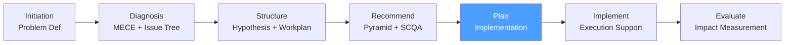

# /cp-plan — Consulting Process: Plan

> *"A recommendation without an implementation plan is advice. An implementation plan without quick wins is a roadmap that loses momentum before it starts."*

Executes the **Plan** phase of the McKinsey-style Consulting Process. Produces the Implementation Plan that translates the approved recommendation into a structured execution roadmap with workstreams, milestones, quick wins, resource plan, and change management approach.

**THYROX Stage:** Stage 6 SCOPE.

**Gate:** Implementation Plan approved by client sponsor before beginning cp:implement.

---

## Consulting Process Cycle — focus on Plan



## Pre-condition

- **cp:recommend complete:** Recommendation deck presented and approved by client sponsor.
- Client has made a formal decision to proceed with the recommended approach.
- At least the primary recommendation is unambiguous (one clear path forward).

---

## When to use this step

- Immediately after the client approves the recommendation
- When the recommendation has multiple workstreams that need coordination
- When you need to structure quick wins to build momentum before long-term changes take effect
- When the change management dimension is significant (people, culture, process changes)

## When NOT to use this step

- Without sponsor approval of the recommendation — planning before approval wastes resources
- If implementation will be fully managed by the client without consulting support — hand off the plan and transition to a monitoring role
- For recommendations that are purely analytical output with no operational implementation

---

## Activities

### 1. Workstream definition — translating recommendation to execution

Each key argument from the recommendation deck becomes an implementation workstream. The structure mirrors the Pyramid:

```
Recommendation
├── Workstream 1: [Arg 1 implemented — e.g., Discount Governance]
│   ├── Initiative 1.1: [Policy definition]
│   ├── Initiative 1.2: [System configuration]
│   └── Initiative 1.3: [Training]
├── Workstream 2: [Arg 2 implemented — e.g., Mix Optimization]
│   ├── Initiative 2.1: [Segment repricing]
│   └── Initiative 2.2: [Sales incentive alignment]
└── Workstream 3: [Arg 3 implemented — e.g., Monitoring]
    ├── Initiative 3.1: [Dashboard build]
    └── Initiative 3.2: [Governance cadence]
```

**Workstream design checklist:**

| Check | Pass / Fail |
|-------|------------|
| Each workstream maps to a recommendation argument | |
| Workstreams are MECE (no duplicated initiatives) | |
| Each workstream has a single owner (client-side) | |
| Each initiative is specific enough to be assigned and tracked | |

### 2. Quick wins — first 90 days

Quick wins are initiatives that deliver visible impact within 90 days and require minimal investment. They are critical for two reasons:
1. They demonstrate the recommendation is working before the full impact arrives
2. They build organizational confidence and momentum

**Criteria for a quick win:**

| Criterion | Threshold |
|-----------|-----------|
| Time to impact | ≤ 90 days from approval |
| Investment required | Low (no major system changes, minimal headcount) |
| Impact visibility | Measurable and visible to leadership |
| Reversibility | Can be adjusted if it doesn't work (low risk) |

**Quick win identification process:**

1. Review each workstream initiative
2. Ask: "Can this be done in 90 days with existing resources?"
3. Ask: "Will the impact be visible to the sponsor within 90 days?"
4. If both yes → flag as quick win
5. Sequence quick wins first in the milestone plan

### 3. Implementation roadmap — phase structure

Organize the implementation into 3 phases:

**Phase 1 — Foundation (Months 1-3):**
- Quick wins
- Governance structures established
- Data and measurement baselines set
- Change management kickoff

**Phase 2 — Execution (Months 4-9):**
- Full workstream implementation
- Steering committee cadence established
- Mid-point impact assessment
- Course corrections

**Phase 3 — Sustainability (Months 10-18):**
- Handover from consulting to client ownership
- Process embedded in standard operations
- Performance management anchored
- Engagement close

### 4. Resource and investment plan

| Resource type | What | Quantity / Effort | Cost estimate | Source |
|--------------|------|-------------------|--------------|--------|
| **Client team** | [Owner, project manager, workstream leads] | [FTEs, % of time] | [Opportunity cost] | Internal |
| **Technology** | [Systems to configure, build, or procure] | [Licenses, builds] | [$X] | Procurement |
| **External support** | [Consulting support during implementation] | [Days] | [$X] | [Consulting fee] |
| **Training** | [Training programs for affected staff] | [Hours × people] | [$X] | [Internal / external] |
| **Total investment** | | | **$X** | |

**Return on investment:**

| Metric | Value |
|--------|-------|
| Total investment | $X |
| Expected annual benefit | $Y |
| Payback period | N months |
| 3-year NPV (at X% discount rate) | $Z |

### 5. Change management — the human dimension

Most implementation failures are not technical — they are human. Change management addresses resistance, communication, and capability.

**Change management framework:**

| Dimension | Questions | Actions |
|-----------|----------|---------|
| **Awareness** | Do affected people know why this is changing? | Communication plan: why, what, when |
| **Desire** | Do they want to change (or at least accept it)? | Stakeholder engagement; address concerns |
| **Knowledge** | Do they know how to work in the new way? | Training plan by role |
| **Ability** | Can they actually do it? | Practice, coaching, tools |
| **Reinforcement** | Will the new behavior be sustained? | Incentives, performance management, governance |

**Stakeholder communication plan:**

| Audience | Message | Channel | Frequency | Owner |
|----------|---------|---------|-----------|-------|
| Senior leadership | [Strategic rationale + progress] | Steering committee | Monthly | [Name] |
| Middle management | [What changes, what doesn't, support available] | All-hands + 1:1 | Biweekly during transition | [Name] |
| Frontline staff | [Process changes + training available] | Team meetings + intranet | At each phase change | [Name] |

### 6. Risk and contingency plan

| Risk | Probability | Impact | Early warning signal | Contingency |
|------|------------|--------|---------------------|-------------|
| Key owner turnover | Med | High | Sponsor flags leadership change | Re-assign; cross-train backup |
| Data unavailable for measurement | Med | Med | Baseline data not ready by Month 2 | Use proxy metrics; escalate data access |
| Organizational resistance | High | High | Mid-point survey shows < 50% engagement | Accelerate change management; re-engage sponsor |
| Technology implementation delayed | Low | Med | Vendor flags delay in Week 4 | Use manual workaround while tech catches up |

### 7. Governance structure

Define how implementation will be managed:

| Forum | Participants | Frequency | Purpose |
|-------|------------|-----------|---------|
| **Steering committee** | Sponsor, workstream owners, lead consultant | Monthly | Approve decisions, remove blockers |
| **Working session** | Workstream teams, client counterparts | Weekly | Execution updates, issue resolution |
| **Status report** | Sponsor | Biweekly | Written update: RAG status, milestones, risks |
| **Impact review** | Sponsor, Finance | Quarterly | Measure realized benefit vs plan |

---

## Expected Artifact

`{wp}/cp-plan.md` — use template: [implementation-plan-template.md](./assets/implementation-plan-template.md)

---

## Red Flags — signs of Plan done poorly

- **No quick wins in first 90 days** — a plan that delivers nothing visible for 6 months loses sponsor confidence and organizational momentum
- **Workstreams not owned by client-side managers** — consulting-owned workstreams create dependency and don't build client capability
- **Change management is a single slide** — in most implementations, the human dimension is the constraint; treating it as an afterthought guarantees failure
- **No measurement cadence** — a plan with no defined checkpoints produces surprises at the end instead of course corrections during execution
- **Investment plan missing** — approving an implementation plan without a budget creates mid-implementation disputes

### Anti-rationalization

| Rationalization | Why it's a trap | Correct response |
|----------------|----------------|-----------------|
| *"The client knows their business — they'll figure out the details"* | Clients hired consulting for structured execution; handing over an underdefined plan is a quality failure | Define workstreams to initiative level; leave tactical detail to the client |
| *"Quick wins are not strategic — they distract from the real work"* | Quick wins are the strategic lever that sustains organizational commitment to the long-term program | Select quick wins that align with the recommendation, not random easy wins |
| *"Change management is soft stuff — not our focus"* | McKinsey research consistently shows 70% of transformation failures are due to people/culture, not strategy | Address change management formally; it is part of the consulting deliverable |

---

## Estado en now.md

**Al INICIAR este step:**
```yaml
methodology_step: cp:plan
flow: cp
```

**Al COMPLETAR** (Implementation Plan approved by sponsor):
```yaml
methodology_step: cp:plan  # completado → listo para cp:implement
flow: cp
```

## Siguiente paso

When Implementation Plan is approved by client sponsor → `cp:implement`

---

## Limitations

- The Implementation Plan is a plan, not a contract — adjust as conditions change, but document changes formally
- Consulting support during implementation is optional; in some engagements the consulting team hands off the plan and exits; in others they continue for 6-18 months
- Change management estimates are approximate; the actual effort depends heavily on the client's organizational culture and history of change programs

---

## Reference Files

### Assets
- [implementation-plan-template.md](./assets/implementation-plan-template.md) — Full Implementation Plan template with workstreams, milestone roadmap, resource plan, change management approach, risk register, and governance structure

### References
- [change-management-guide.md](./references/change-management-guide.md) — Change management guide for consulting engagements: ADKAR model, communication planning, resistance management, and sustainability mechanisms
