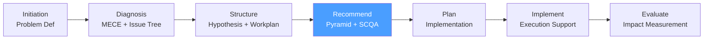

# /cp-recommend — Consulting Process: Recommend

> *"Start with the answer. The Pyramid Principle inverts the academic convention: state the recommendation first, then provide the supporting arguments, then the evidence. Executives make decisions — they need the answer, not the journey."*

Executes the **Recommend** phase of the McKinsey-style Consulting Process. Produces the executive recommendation deck structured using the Pyramid Principle and the SCQA framework.

**THYROX Stage:** Stage 5 STRATEGY.

**Gate:** Recommendation storyline reviewed by engagement lead before finalizing deck for client.

---

## Consulting Process Cycle — focus on Recommend



## Pre-condition

- **cp:structure complete:** Consulting Workplan approved, all P1 and P2 analyses executed.
- Findings from at least 80% of planned analyses are available.
- At least one hypothesis has been confirmed as the primary driver.

---

## When to use this step

- When analyses are complete and findings need to be synthesized into a recommendation
- When you need to structure the recommendation for an executive audience (C-suite, board, steering committee)
- When multiple findings need to be integrated into a single coherent storyline

## When NOT to use this step

- Without completed analyses — synthesizing incomplete findings produces a weak recommendation
- For operational-level communication (working sessions with client counterparts) — use simpler formats
- If the client has already decided — check whether the engagement is advisory or decisional before building a full recommendation deck

---

## Activities

### 1. SCQA — Situation, Complication, Question, Answer

SCQA is the storyline framework that structures the opening of any recommendation. It moves the audience from shared context to the consultant's recommendation.

**The four elements:**

| Element | Definition | Length | Tone |
|---------|-----------|--------|------|
| **Situation** | The current state — facts the audience already agrees with | 2-3 sentences | Neutral, factual |
| **Complication** | What changed, what's wrong, or what's at risk — the tension that creates urgency | 2-3 sentences | Urgent, specific |
| **Question** | The natural question the complication raises in the audience's mind | 1 sentence | Implicit or explicit |
| **Answer** | The recommendation — the direct response to the question | 1-2 sentences | Decisive, direct |

**Example:**

```
Situation: RetailCo has maintained 8% operating margin for six years, consistently
           outperforming the industry average of 5.5%.

Complication: Over the past three years, margin has declined to 4%, driven primarily
              by unmanaged discounting in the SMB segment — discounts averaging 22%
              vs a 10% list price policy — costing the company $18M annually.

Question: [Implicit: How do we restore margin to historical levels?]

Answer: RetailCo should implement a structured discount governance program in SMB,
        which our analysis shows could recover $12-15M in annual margin within 12 months.
```

See full SCQA and Pyramid Principle guide: [pyramid-principle-scqa.md](./references/pyramid-principle-scqa.md)

### 2. The Pyramid Principle — vertical and horizontal logic

The Pyramid Principle (Barbara Minto, McKinsey) structures the recommendation as a pyramid: the answer at the apex, supported by arguments in the middle, supported by evidence at the base.

**Structure of the Pyramid:**

```
                    [ANSWER]
                   /    |    \
          [Arg 1]   [Arg 2]   [Arg 3]
          /  |  \   /  |  \   /  |  \
        E1  E2  E3 E4  E5  E6 E7  E8  E9
```

**Vertical logic** — each level proves the level above:
- Answer: "RetailCo should implement discount governance"
- Arg 1: "Unmanaged discounting is the primary margin driver" → proves this is the right problem
- Evidence for Arg 1: discount waterfall analysis showing 22% avg discount vs 10% policy

**Horizontal logic** — arguments at the same level are MECE:
- Arg 1: The problem is real and quantified (diagnosis)
- Arg 2: Discount governance is the highest-impact solution (alternatives assessed)
- Arg 3: Implementation is feasible within 12 months (feasibility confirmed)

**MECE test for arguments:** The three arguments together should answer the question completely — no overlap, no gaps.

### 3. Vertical logic test

For every argument, ask: "Does this directly support the answer above it?"

| Answer | Argument | Vertical logic test | Pass/Fail |
|--------|----------|---------------------|-----------|
| "Implement discount governance" | "Discounting costs $18M/year" | Does this prove the recommendation? Partially — it shows the problem, not the solution. | Partial — needs pairing with feasibility argument |
| "Implement discount governance" | "Governance programs in comparable companies recovered 70-80% of margin leakage within 12 months" | Does this prove the recommendation is the right action? Yes. | Pass |

### 4. Horizontal logic test (arguments are MECE)

Arguments at the same level must be:
- **ME:** No argument duplicates another (no two arguments make the same point)
- **CE:** Together, the arguments answer the question completely

**Example — bad horizontal logic:**
```
Arg 1: The problem is large ($18M)
Arg 2: The problem is growing
Arg 3: We are losing customers because of the problem
```
These three arguments all support "the problem is serious" — not MECE relative to each other AND they don't address the solution at all.

**Example — good horizontal logic:**
```
Arg 1: Unmanaged discounting is the primary margin driver (diagnosis confirmed)
Arg 2: Discount governance is the most impactful lever among alternatives assessed (solution selected)
Arg 3: Implementation is feasible with existing systems within 12 months (feasibility)
```
Each argument answers a different dimension of "why this recommendation" — MECE.

### 5. Storyline structure — from SCQA to deck

A standard executive recommendation deck follows this flow:

| Slide / section | Content | Pyramid level |
|----------------|---------|--------------|
| **Executive summary** | SCQA + answer + 3 key arguments (1 slide) | Apex |
| **Context** | Situation details — agreed facts | Situation |
| **The problem** | Complication quantified — what's wrong and how much | Complication |
| **What we analyzed** | Issue Tree overview + analytical approach | Process |
| **Finding 1 — [Arg 1 title]** | Evidence supporting argument 1 (2-3 slides) | Evidence |
| **Finding 2 — [Arg 2 title]** | Evidence supporting argument 2 (2-3 slides) | Evidence |
| **Finding 3 — [Arg 3 title]** | Evidence supporting argument 3 (2-3 slides) | Evidence |
| **Recommendation** | Answer restated + 3 arguments summarized | Apex restated |
| **Implementation overview** | High-level plan (detailed in cp:plan) | Supporting |
| **Financials** | Expected impact ($, %) and timeline | Supporting |
| **Risks and mitigations** | Key risks, not exhaustive | Supporting |
| **Next steps** | Decision needed from sponsor | Call to action |

See full slide deck structure template: [recommendation-deck-structure.md](./assets/recommendation-deck-structure.md)

### 6. The executive summary slide — most important slide

The executive summary slide is the single most important slide in the deck. It is often the only slide a senior executive reads before the presentation.

**Structure of the executive summary slide:**

```
Title: "RetailCo should implement discount governance to recover $12-15M margin"

Situation: [1-2 sentences — agreed context]
Complication: [1-2 sentences — the problem with numbers]

Recommendation: [1 sentence — the answer]

Supporting arguments:
• [Arg 1 — 1 sentence with key number]
• [Arg 2 — 1 sentence with key number]
• [Arg 3 — 1 sentence with key number]

Expected impact: $12-15M annual margin recovery within 12 months
Investment required: $0.8M in system and process changes
```

> Rule: If the client reads only the executive summary slide, they should understand the full recommendation, the problem it solves, and why it is the right answer.

### 7. Storyline review — before finalizing deck

| Check | Pass / Fail | Notes |
|-------|------------|-------|
| SCQA flows naturally (S→C→Q→A) | | |
| Answer is stated in the first slide (not at the end) | | |
| 3-5 arguments support the answer (not more, not fewer) | | |
| Arguments are MECE (no overlap, no gap) | | |
| Each argument has at least 2 pieces of evidence | | |
| Vertical logic: each evidence directly supports its argument | | |
| Executive summary slide can stand alone | | |
| No slide presents data without a clear "so what" | | |
| Recommendation is specific and actionable | | |

---

## Expected Artifact

`{wp}/cp-recommend.md` — use template: [recommendation-deck-structure.md](./assets/recommendation-deck-structure.md)

---

## Red Flags — signs of Recommend done poorly

- **"Boiling the ocean" deck** — more than 30 slides, covering every analysis run; the deck should show the best 20% of the work, not all of it
- **Answer buried at the end** — academic structure (data → analysis → conclusion) for an executive audience is a common failure; executives want the answer first
- **Arguments repeat each other** — if Arg 1 and Arg 2 are both saying "the problem is large," only one argument is needed
- **Every slide is a data dump** — slides should have headlines that state the finding ("Discounting costs $18M/year") not descriptive titles ("Discount Analysis")
- **No quantified impact** — a recommendation without a $-amount or %-change is qualitative advice, not a consulting recommendation
- **Risk section is missing** — acknowledging risks demonstrates credibility; omitting them signals overconfidence

### Anti-rationalization

| Rationalization | Why it's a trap | Correct response |
|----------------|----------------|-----------------|
| *"The client needs to see all our analysis to trust us"* | Volume of analysis ≠ quality of recommendation; too much data buries the answer | Show only the analyses that directly support the 3 key arguments |
| *"The conclusion at the end is more persuasive"* | For C-suite audiences, the opposite is true — they want the answer immediately | State the recommendation on slide 1; build the case after |
| *"We can't be too direct — the recommendation is sensitive"* | Indirect recommendations are interpreted as lack of conviction | State the recommendation directly; acknowledge sensitivity in the risk section |

---

## Estado en now.md

**Al INICIAR este step:**
```yaml
methodology_step: cp:recommend
flow: cp
```

**Al COMPLETAR** (Storyline approved by engagement lead):
```yaml
methodology_step: cp:recommend  # completado → listo para cp:plan
flow: cp
```

## Siguiente paso

When recommendation deck is approved by engagement lead → `cp:plan`

---

## Limitations

- The Pyramid Principle is optimized for executive communication; for technical or scientific audiences, a modified inductive structure may be more appropriate
- SCQA assumes the audience agrees with the Situation — if the Situation is disputed, start with data to establish it before introducing the Complication
- Vertical logic can be tested formally; horizontal MECE is more subjective for qualitative problems — get a second opinion from a peer outside the workstream

---

## Reference Files

### Assets
- [recommendation-deck-structure.md](./assets/recommendation-deck-structure.md) — Full slide deck structure template with section-by-section guidance, executive summary template, and storyline review checklist

### References
- [pyramid-principle-scqa.md](./references/pyramid-principle-scqa.md) — Complete Pyramid Principle guide: vertical logic, horizontal MECE, SCQA framework, slide headline writing, and common structural failure modes
