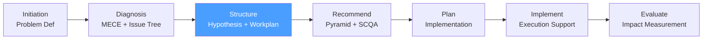

# /cp-structure — Consulting Process: Structure

> *"Don't analyze everything — form a hypothesis and find the data that validates or kills it. The hypothesis-driven approach is the consulting team's primary productivity tool."*

Executes the **Structure** phase of the McKinsey-style Consulting Process. Produces the Consulting Workplan with defined workstreams, analyses, owners, and timelines — grounded in hypotheses derived from the Issue Tree.

**THYROX Stage:** Stage 3 DIAGNOSE.

**Gate:** Consulting Workplan approved by engagement lead before proceeding to analysis execution.

---

## Consulting Process Cycle — focus on Structure



## Pre-condition

- **cp:diagnosis complete:** Issue Tree is MECE-compliant and approved by engagement lead.
- Data gathering plan is assigned (owners and deadlines set).
- Initial data from high-priority leaf nodes has begun to arrive.

---

## When to use this step

- After cp:diagnosis, when the Issue Tree is approved and the team needs to convert leaf nodes into formal hypotheses and analyses
- When the engagement has multiple workstreams that need to be coordinated with clear owners and timelines
- When you need to communicate the analytical plan to the client for alignment before deep analysis begins

## When NOT to use this step

- Without an approved Issue Tree — cp:structure without cp:diagnosis is planning without problem structure
- If the engagement is very small (< 2 weeks, one consultant) — a simplified workplan is sufficient; use the template but skip formal workstream structure

---

## Activities

### 1. From Issue Tree to Hypotheses

Each leaf node in the Issue Tree becomes a hypothesis to test. The hypothesis states your current best guess about what the data will show.

**Hypothesis format:**

```
"We believe [claim about the world] because [initial evidence or logic]. 
If true, we would expect to see [observable data]. 
This would be killed by [evidence that would prove it wrong]."
```

**Example:**

| Leaf node | Hypothesis | Supporting evidence | Kill condition |
|-----------|-----------|---------------------|---------------|
| *"Is margin decline driven by pricing?"* | H1: Price realization declined 8-12% due to unmanaged discounting in SMB segment | Sales data shows discount rate up 15% YoY in SMB | Kill if: discount rate is stable but volume in high-margin segments declined |
| *"Is it a volume issue?"* | H2: Volume is stable in aggregate; mix has shifted to lower-margin products | Revenue flat but COGS up 12% | Kill if: unit volumes in premium segments are also declining |
| *"Is it a cost issue?"* | H3: Cost structure is not the primary driver; fixed costs are in line with revenue | Fixed costs grew 3% vs revenue growth of 0% | Kill if: COGS per unit increased more than 10% |

> Hypotheses are not commitments — they are bets. The team should be willing to be wrong and follow the data.

See full hypothesis-driven approach guide: [hypothesis-driven-approach.md](./references/hypothesis-driven-approach.md)

### 2. Hypothesis prioritization

Not all hypotheses are equally important. Prioritize based on two dimensions:

**Business impact if true:** How much does this hypothesis matter to the diagnostic question if confirmed?
**Probability of being true:** Based on initial data and domain knowledge, how likely is this hypothesis to hold?

| Priority | Criteria | Action |
|----------|---------|--------|
| **P1 — Analyze first** | High impact AND high probability | Assign best analyst; design analysis before gathering data |
| **P2 — Analyze second** | High impact OR high probability | Queue for second week of analysis |
| **P3 — Analyze if time permits** | Low impact AND low probability | Park unless P1/P2 are inconclusive |

> Rule: A consulting team that finds a P1 hypothesis confirmed early can often stop analyzing P3 hypotheses and move to Recommendation sooner.

### 3. Analysis design — before gathering data

For each P1/P2 hypothesis, design the analysis before gathering data:

| Hypothesis | Analysis name | Type | Key metric | Source | Output |
|-----------|--------------|------|-----------|--------|--------|
| H1 (pricing) | Discount waterfall analysis | Quantitative | Net revenue / List price by segment | CRM + ERP data | Waterfall chart by segment |
| H2 (mix) | Revenue bridge analysis | Quantitative | Revenue by product × margin | Finance data | Bridge chart YoY |
| H3 (cost) | Cost structure benchmarking | Quantitative + Qualitative | COGS% vs industry peers | Internal P&L + public benchmarks | Benchmark table |

**Analysis design questions:**
1. What is the specific question this analysis answers?
2. What is the exact metric we will calculate?
3. What data do we need and where does it live?
4. What visualization will make the finding clear?
5. What threshold makes the finding actionable? (e.g., "if discount rate > 15% → H1 confirmed")

### 4. Workstream structure

Group related hypotheses and analyses into workstreams. Each workstream has:
- A single owner (from consulting team or client counterpart)
- A specific set of hypotheses to test
- A defined output for the final deliverable

**Workstream design principles:**
- 3-5 workstreams per engagement (fewer for short engagements, more for complex ones)
- Workstreams should be MECE relative to each other (no overlapping analyses)
- Each workstream should produce at least one "chapter" of the final recommendation deck
- A client team member should be embedded in each workstream (facilitates buy-in)

### 5. Consulting Workplan — the master document

The Workplan maps every hypothesis to an analysis, an owner, a deliverable, and a deadline.

| Workstream | Hypothesis | Analysis | Owner | Data source | Deliverable | Deadline |
|-----------|-----------|----------|-------|------------|-------------|----------|
| WS1: Revenue | H1: Pricing | Discount waterfall | [Name] | CRM + ERP | Slide: pricing waterfall chart | Week 2 |
| WS1: Revenue | H2: Mix | Revenue bridge | [Name] | Finance | Slide: bridge YoY | Week 2 |
| WS2: Cost | H3: Cost structure | Benchmarking | [Name] | Internal + public | Slide: benchmark table | Week 3 |
| WS3: Market | H4: Market share | Share analysis | [Name] | Industry data | Slide: market share chart | Week 3 |

See full template: [consulting-workplan-template.md](./assets/consulting-workplan-template.md)

### 6. Milestone and checkpoint plan

| Milestone | Date | Description | Audience |
|-----------|------|------------|---------|
| Kickoff meeting | Week 1 | Share Problem Definition Document + Workplan with client | Client team + Sponsor |
| Mid-engagement update | Week [X] | Share preliminary findings on P1 hypotheses | Working session with client counterparts |
| Pre-read delivery | [Date] | Final deck pre-read sent to sponsor | Client Sponsor |
| Final presentation | [Date] | Recommendations presented to steering committee | Steering committee |

### 7. Structural integrity check — before advancing

| Check | Pass / Fail | Notes |
|-------|------------|-------|
| Every leaf node in the Issue Tree has a hypothesis | | |
| Every hypothesis has a designed analysis with defined metric | | |
| Every analysis has an assigned owner and deadline | | |
| Workstreams are MECE (no overlapping analyses) | | |
| Workplan covers all P1 and P2 hypotheses | | |
| Milestone plan aligns with client availability and engagement timeline | | |
| Client has reviewed and approved the Workplan | | |

---

## Expected Artifact

`{wp}/cp-structure.md` — use template: [consulting-workplan-template.md](./assets/consulting-workplan-template.md)

---

## Red Flags — signs of Structure done poorly

- **Hypotheses are not falsifiable** — if a hypothesis cannot be killed by any data, it's a belief, not a hypothesis
- **Analysis designed after data gathered** — post-hoc analysis is reverse-engineered to confirm what you already believe; design the analysis first
- **Workstreams by team member, not by topic** — workstreams structured around who's available (not around the problem) produce siloed analyses that don't synthesize well
- **No owner for each analysis** — shared ownership = no ownership; every analysis has exactly one responsible person
- **Workplan not shared with client** — a Workplan the client hasn't seen creates surprises; present it in the kickoff meeting
- **Milestone dates are aspirational** — if the client has a board meeting that constrains the final presentation date, the Workplan must work backwards from that date, not from ideal analysis time

### Anti-rationalization

| Rationalization | Why it's a trap | Correct response |
|----------------|----------------|-----------------|
| *"We'll know the hypotheses once we see the data"* | Data without hypotheses produces observation, not analysis | Form hypotheses first, even low-confidence ones; update after data |
| *"We don't need a workplan for a small engagement"* | Even a 2-week engagement needs clear owner / deliverable / deadline for each analysis | Use simplified workplan; skip workstream structure but keep owner + deadline |
| *"The client will find the workplan too detailed"* | Clients generally appreciate seeing the analytical rigor | Present high-level version; keep detailed version internally |

---

## Estado en now.md

**Al INICIAR este step:**
```yaml
methodology_step: cp:structure
flow: cp
```

**Al COMPLETAR** (Workplan approved by engagement lead and shared with client):
```yaml
methodology_step: cp:structure  # completado → análisis en ejecución → listo para cp:recommend
flow: cp
```

## Siguiente paso

When analyses are complete and findings are ready to synthesize → `cp:recommend`

---

## Limitations

- The Workplan is a plan, not a contract — hypotheses may be revised as data comes in; document revisions in the Workplan with dates
- Analysis timelines depend on data availability; if key data is delayed, reprioritize rather than wait
- Not all hypotheses need to be confirmed — a confirmed "H3 is NOT the driver" is a valuable finding that narrows the problem space

---

## Reference Files

### Assets
- [consulting-workplan-template.md](./assets/consulting-workplan-template.md) — Full Consulting Workplan template with workstreams, hypothesis table, analysis design, milestone plan, and structural integrity checklist

### References
- [hypothesis-driven-approach.md](./references/hypothesis-driven-approach.md) — Complete guide to the hypothesis-driven approach: hypothesis formation, prioritization matrix, analysis design before data gathering, and how to kill a hypothesis gracefully
