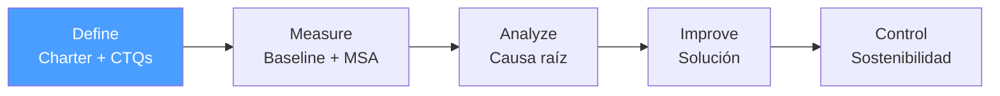

# /dmaic-define — DMAIC: Define

> *"Define the problem correctly and you're 50% done. A vague problem statement is the root cause of most failed improvement projects."*

Ejecuta la fase **Define** de DMAIC. Produce el Project Charter aprobado que autoriza el proyecto de mejora.

**THYROX Stage:** Stage 3 DIAGNOSE.

**Tollgate:** Project Charter aprobado por sponsor antes de avanzar a Measure.

---

## Ciclo DMAIC — foco en Define



## Pre-condición

- **Primer ciclo:** work package activo con descripción inicial del problema y sponsor identificado.
- Antes de completar Define, el VOC debe estar recopilado con al menos una técnica de elicitación directa.

---

## Cuándo usar este paso

- Al iniciar un proyecto de mejora de proceso con metodología Six Sigma
- Cuando el problema requiere análisis estadístico riguroso (no solo un ciclo PDCA)
- Cuando el impacto en el negocio justifica un proyecto formal con sponsor y equipo

## Cuándo NO usar este paso

- Para mejoras simples que se pueden resolver en un ciclo PDCA — DMAIC es overhead para problemas pequeños
- Si el problema ya tiene causa raíz confirmada → ir directamente a Improve (o PDCA:Do)
- Sin sponsor identificado — DMAIC requiere autorización y recursos; sin sponsor, el proyecto no tiene tracción

---

## Actividades

### 1. VOC — Voice of Customer (CRÍTICO)

El VOC es el insumo fundamental de Define. Sin VOC real, los CTQs son supuestos del equipo, no necesidades del cliente.

**Técnicas de recopilación VOC:**

| Técnica | Cuándo usar | Cómo ejecutar |
|---------|-------------|---------------|
| **Entrevistas directas** | Siempre que sea posible; mayor profundidad | Preguntas abiertas: "¿Qué es más importante para usted?", "¿Cuándo se siente insatisfecho?" |
| **Encuestas / cuestionarios** | Base de clientes grande; validar hipótesis | Likert 1-5 o NPS; incluir preguntas de importancia + satisfacción |
| **Análisis de quejas y reclamos** | Datos históricos disponibles | Categorizar y cuantificar frecuencia por tipo |
| **Gemba (observación directa)** | Proceso operacional; comportamiento real vs declarado | Ir donde el cliente usa el producto/servicio; observar sin intervenir |
| **Focus groups** | Explorar percepciones; antes de encuesta masiva | 6-8 participantes; moderador neutral |
| **Datos de soporte / tickets** | Datos ya recopilados por la organización | Analizar categorías de problemas reportados; no sustituto de VOC directo |

Ver catálogo detallado de las 6 técnicas con protocolos y limitaciones: [voc-techniques.md](./references/voc-techniques.md)

**Conversión VOC → CTQ:**

```
VOC (qué dice el cliente) → Necesidad (qué necesita realmente) → CTQ (cómo se mide)
```

| VOC | Necesidad | CTQ |
|-----|-----------|-----|
| *"Los pedidos llegan tarde"* | Entrega puntual | % pedidos en fecha prometida |
| *"Nunca sé en qué estado está mi pedido"* | Visibilidad del estado | % pedidos con tracking actualizado ≤ 4h |
| *"El producto llega dañado"* | Integridad del producto | % pedidos sin daño visible |

> Sin datos VOC directos, documentar explícitamente que los CTQs son hipótesis del equipo y planificar validación con clientes reales en la fase Measure.

### 2. VOB — Voice of Business

Complementario al VOC. Las necesidades del negocio también definen el alcance del proyecto:

| Dimensión VOB | Pregunta | Ejemplo |
|---------------|----------|---------|
| **Financiera** | ¿Cuánto cuesta el problema al negocio? | $45K/mes en créditos por entregas tardías |
| **Operacional** | ¿Qué métricas internas están fuera de objetivo? | % on-time delivery = 82% vs objetivo 95% |
| **Regulatoria** | ¿Hay cumplimiento en riesgo? | SLA contractual con cliente clave al 90% |
| **Estratégica** | ¿Afecta objetivos del plan anual? | Retención de clientes en riesgo |

> El VOC dice qué quiere el cliente; el VOB dice qué puede y necesita hacer el negocio. Los CTQs se definen en la intersección.

### 3. Problem Statement — sin causas asumidas

El Problem Statement describe el síntoma observable con datos:

| ✅ Buen Problem Statement | ❌ Mal Problem Statement |
|--------------------------|------------------------|
| *"El 18% de los pedidos se entrega fuera del plazo prometido (datos ene-mar 2026), generando $45K en créditos mensuales"* | *"El área de logística es ineficiente"* |
| Tiene número (18%, $45K) | Sin magnitud cuantitativa |
| Tiene período de tiempo | Vago y subjetivo |
| Describe síntoma, no causa | *"El sistema ERP es lento"* — asume causa |
| Tiene impacto en negocio | Sin conexión a consecuencia medible |

> Regla: si el Problem Statement menciona una solución o una causa, está mal — es hipótesis, no problema.

### 4. CTQ — Critical to Quality

CTQs son los atributos del proceso que el cliente considera críticos, derivados del VOC:

| CTQ | Unidad de medida | Especificación objetivo | Fuente VOC |
|-----|-----------------|------------------------|------------|
| [CTQ 1] | [métrica] | [umbral] | [técnica VOC usada] |
| [CTQ 2] | [métrica] | [umbral] | [técnica VOC usada] |

### 5. SIPOC — mapa de alto nivel del proceso

| S — Suppliers | I — Inputs | P — Process | O — Outputs | C — Customers |
|---------------|-----------|------------|-------------|--------------|
| ¿Quién provee las entradas? | ¿Qué entra al proceso? | ¿Cuáles son los pasos principales (5-7 max)? | ¿Qué produce el proceso? | ¿Quién recibe los outputs? |

**Cómo construir el SIPOC:**
1. Empezar por el **Process** — definir los 5-7 pasos de alto nivel
2. Definir los **Outputs** — qué produce ese proceso
3. Definir los **Customers** — quién usa esos outputs
4. Definir los **Inputs** — qué necesita el proceso para funcionar
5. Definir los **Suppliers** — quién provee esos inputs

### 6. Goal Statement — objetivo medible

```
Reducir [métrica CTQ] de [baseline] a [meta] para [fecha], 
manteniendo [otras métricas críticas] por encima de [umbral].
```

Ejemplo: *"Reducir el % de pedidos entregados fuera de plazo de 18% a menos de 5% para 2026-07-01, sin incrementar el costo de logística por unidad."*

### 7. Business Case — justificación formal

| Elemento | Contenido |
|----------|-----------|
| Impacto financiero actual | Costo del problema en $/período |
| Beneficio esperado | $/período si se alcanza el Goal Statement |
| Inversión estimada | Recursos, tiempo, costo del equipo |
| ROI estimado | Beneficio / Inversión |
| Riesgo de no hacer nada | ¿Qué pasa si el problema continúa? |

### 8. Scope — in / out

| In Scope | Out of Scope |
|----------|-------------|
| [Procesos, sistemas, áreas incluidos] | [Qué no se va a tocar] |

> Scope demasiado amplio = proyecto que nunca termina. El SIPOC ayuda a delimitar el scope.

### 9. RACI del proyecto

| Rol | Responsable (R) | Aprobador (A) | Consultado (C) | Informado (I) |
|-----|----------------|--------------|----------------|--------------|
| **Sponsor** | Aprueba charter | | | Recibe informes de avance |
| **Black Belt / Green Belt** | Lidera el proyecto | | | |
| **Process Owner** | Ejecuta acciones de mejora | | Revisa soluciones | |
| **Equipo técnico** | Implementa cambios técnicos | | | |
| **Clientes afectados** | | | Validan CTQs | Comunicación de resultados |

> Un RACI incompleto en Define significa que cuando hay decisiones difíciles en Improve o Control, no habrá claridad sobre quién decide.

### 10. Project Charter — documento formal

| Campo | Contenido |
|-------|-----------|
| Proyecto | Nombre del proyecto |
| Sponsor | Quién autoriza y provee recursos |
| Team / RACI | Green Belt, Black Belt, miembros con roles |
| Problem Statement | Ver actividad 3 |
| Goal Statement | Ver actividad 6 |
| Business Case | Ver actividad 7 |
| Scope | In / Out (actividad 8) |
| CTQs | Con fuente VOC (actividad 4) |
| SIPOC | Ver actividad 5 |
| Timeline | Fechas estimadas por fase DMAIC |

---

## Artefacto esperado

`{wp}/dmaic-define.md` — usar template: [dmaic-project-charter-template.md](./assets/dmaic-project-charter-template.md)

---

## Red Flags — señales de Define mal ejecutado

- **CTQs sin VOC real** — CTQs decididos en sala sin hablar con clientes son hipótesis, no requisitos
- **Problem Statement que menciona una solución** — *"Necesitamos un nuevo sistema"* es solución, no problema
- **CTQs sin número** — un CTQ sin métrica no se puede medir en Measure
- **SIPOC con demasiados pasos** — si el proceso tiene 20+ pasos en el SIPOC, el scope es demasiado amplio
- **Business case sin números** — *"mejorará la satisfacción del cliente"* no justifica un proyecto DMAIC
- **Scope que incluye todo** — garantiza que el proyecto se alargue indefinidamente
- **Charter sin sponsor real** — si el sponsor es nominal, el proyecto no tendrá respaldo cuando necesite recursos
- **Sin RACI definido** — cuando hay decisiones difíciles, la falta de RACI genera parálisis

### Anti-racionalización — excusas comunes para saltarse la disciplina

| Racionalización | Por qué es trampa | Respuesta correcta |
|----------------|-------------------|--------------------|
| *"Los CTQs son obvios, no necesitamos VOC"* | Los CTQs sin VOC real son suposiciones del equipo, no necesidades del cliente | Validar con al menos 3 fuentes de voz del cliente antes de declarar CTQs |
| *"El sponsor está muy ocupado, avanzamos sin su aprobación"* | Sin tollgate formal, el proyecto no tiene autorización real y puede ser cancelado o redirigido | Agendar un checkpoint de 30 minutos — el tollgate es no-negociable |
| *"El scope es amplio, pero lo iremos acotando"* — | Un scope sin límites claros crece indefinidamente; Define es el único momento de establecer límites | Definir explícitamente qué está fuera de scope en el Charter |
| *"El problem statement menciona la solución, pero todos entendemos qué queremos"* | Mezclar problema y solución cierra opciones antes de Analyze; puede invalidar el DMAIC completo | Reescribir el problem statement sin mencionar causas ni soluciones |

---

## Estado en now.md

**Al INICIAR este step:**
```yaml
methodology_step: dmaic:define
flow: dmaic
```

**Al COMPLETAR** (Project Charter aprobado por sponsor):
```yaml
methodology_step: dmaic:define  # completado → listo para dmaic:measure
flow: dmaic
```

## Siguiente paso

Cuando el Project Charter está aprobado por el sponsor → `dmaic:measure`

---

## Limitaciones

- Define produce el alcance del proyecto; si el scope cambia significativamente durante Measure o Analyze, puede ser necesario regresar a revisar el charter
- La calidad del SIPOC depende del conocimiento del proceso — si el equipo no conoce bien el proceso, considerar Gemba walks o entrevistas antes de completar Define
- El tollgate (aprobación del sponsor) no es un formalismo; sin él, el proyecto no tiene autorización real para continuar
- VOC de un solo tipo de técnica puede tener sesgo — combinar datos cualitativos (entrevistas) con cuantitativos (encuestas/quejas) para mayor validez

---

## Reference Files

### Assets
- [dmaic-project-charter-template.md](./assets/dmaic-project-charter-template.md) — Template del Project Charter con VOC, CTQs, SIPOC, Goal Statement, Business Case, RACI y Timeline

### References
- [voc-techniques.md](./references/voc-techniques.md) — 6 técnicas de recopilación VOC con protocolos, limitaciones y conversión VOC→CTQ
- [sipoc-guide.md](./references/sipoc-guide.md) — Guía de construcción SIPOC: orden correcto, 5 pasos, errores comunes, uso para delimitar scope
