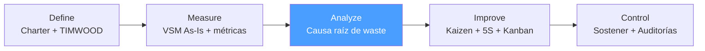

# /lean-analyze — Lean: Analyze

> *"Don't jump to solutions. Every Kaizen event aimed at the wrong root cause is waste itself — the waste of improvement effort."*

Ejecuta la fase **Analyze** del ciclo Lean. Produce el análisis de causa raíz de los desperdicios identificados en el VSM As-Is, con priorización de los wastes de mayor impacto.

**THYROX Stage:** Stage 3 DIAGNOSE.

**Tollgate:** Causas raíz de los 2-3 wastes dominantes validadas y priorizadas antes de avanzar a lean:improve.

---

## Ciclo Lean — foco en Analyze



## Pre-condición

- **VSM As-Is aprobado** con métricas de flujo documentadas (lean:measure completo).
- Baseline establecido: Lead Time, Process Efficiency, WIP, Takt Time.
- Desperdicios TIMWOOD identificados en el VSM con sus localizaciones en el proceso.

---

## Cuándo usar este paso

- Al iniciar el análisis de causas raíz de los wastes encontrados en el VSM
- Cuando el equipo tiene tentación de saltar directamente a soluciones — Analyze es el freno necesario
- Para validar que los desperdicios identificados tienen causas sistémicas, no solo incidentes aislados

## Cuándo NO usar este paso

- Sin VSM As-Is aprobado — el análisis de causa raíz sin mapa de proceso es especulación
- Si las causas son ya conocidas y validadas → documentarlas directamente y pasar a lean:improve
- Para análisis de variación estadística de defectos → usar DMAIC Analyze con regresión/ANOVA

---

## Actividades

### 1. TIMWOOD Diagnostic Checklist — diagnóstico estructurado

Evaluar cada tipo de waste con preguntas diagnósticas específicas sobre el proceso:

**Transportation (Transporte innecesario)**

| Pregunta diagnóstica | Sí/No | Evidencia |
|---------------------|-------|-----------|
| ¿Los materiales/documentos se mueven más de 2 veces entre pasos? | | |
| ¿Hay handoffs entre áreas/equipos sin criterio de calidad en la entrega? | | |
| ¿Existe doble registro del mismo dato en diferentes sistemas? | | |
| ¿Algún paso recibe inputs de más de 3 fuentes diferentes? | | |

**Inventory (Inventario excesivo)**

| Pregunta diagnóstica | Sí/No | Evidencia |
|---------------------|-------|-----------|
| ¿Hay colas visibles con más de 10 items esperando procesamiento? | | |
| ¿El WIP actual es mayor de 3× el takt time × capacidad? | | |
| ¿Existe stock de seguridad cuya justificación nadie recuerda? | | |
| ¿Los tiempos de espera en el VSM superan el 30% del lead time? | | |

**Motion (Movimiento innecesario)**

| Pregunta diagnóstica | Sí/No | Evidencia |
|---------------------|-------|-----------|
| ¿Los operadores buscan herramientas/datos más de 2 veces por hora? | | |
| ¿El layout del área de trabajo requiere desplazamientos para completar una tarea? | | |
| ¿Hay información en múltiples sistemas que requiere navegar para completar un paso? | | |

**Waiting (Espera)**

| Pregunta diagnóstica | Sí/No | Evidencia |
|---------------------|-------|-----------|
| ¿Los tiempos de aprobación/revisión superan 24 horas frecuentemente? | | |
| ¿Hay dependencias entre equipos que generan esperas recurrentes? | | |
| ¿Los operadores están idle esperando inputs de upstream más del 15% de su tiempo? | | |
| ¿El cuello de botella del VSM tiene CT > Takt Time? | | |

**Overproduction (Sobreproducción)**

| Pregunta diagnóstica | Sí/No | Evidencia |
|---------------------|-------|-----------|
| ¿Se producen reportes/documentos que nadie lee? | | |
| ¿Se fabrican lotes más grandes de lo que el siguiente paso puede procesar? | | |
| ¿El sistema es push (producir según forecast) en lugar de pull (producir según demanda real)? | | |

**Overprocessing (Sobreprocesamiento)**

| Pregunta diagnóstica | Sí/No | Evidencia |
|---------------------|-------|-----------|
| ¿Hay pasos de revisión/aprobación redundantes? | | |
| ¿Existen formularios con campos que nunca se usan? | | |
| ¿El producto/servicio tiene funcionalidades que el cliente no solicitó ni usa? | | |
| ¿Hay actividades que se hacen "siempre así" sin razón documentada? | | |

**Defects (Defectos/Reproceso)**

| Pregunta diagnóstica | Sí/No | Evidencia |
|---------------------|-------|-----------|
| ¿Hay pasos explícitos de inspección en el VSM? | | |
| ¿El % de reproceso es > 5%? | | |
| ¿Existen errores recurrentes que generan retrabajo predecible? | | |
| ¿El cliente devuelve items/reporta defectos frecuentemente? | | |

### 2. Priorización de wastes — Matriz de Impacto/Esfuerzo

No todos los wastes merecen el mismo foco. Priorizar basado en impacto en lead time y esfuerzo de eliminación:

| Waste | Impacto en LT (1-5) | Impacto en Costo (1-5) | Esfuerzo de eliminar (1-5) | Prioridad |
|-------|--------------------|-----------------------|--------------------------|-----------|
| [Waste 1] | | | | Alta/Media/Baja |
| [Waste 2] | | | | |
| [Waste 3] | | | | |

**Criterio de priorización:**
- **Alta prioridad:** Impacto LT + Impacto Costo > 6 AND Esfuerzo < 4
- **Media prioridad:** Impacto combinado > 4 OR Esfuerzo < 3
- **Baja prioridad:** Impacto < 4 AND Esfuerzo > 3

### 3. 5 Whys — aplicado a wastes Lean

El análisis 5 Whys se aplica al waste priorizado, no al síntoma genérico.

**Protocolo 5 Whys para Lean:**

```
Waste observado: [Descripción del waste + dato del VSM]

¿Por qué [waste]?          → Causa 1
¿Por qué [Causa 1]?        → Causa 2
¿Por qué [Causa 2]?        → Causa 3
¿Por qué [Causa 3]?        → Causa 4
¿Por qué [Causa 4]?        → Causa raíz (sistémica)
```

**Ejemplo — waste de Espera:**

```
Waste: "El 68% del lead time del proceso de aprobación es tiempo de espera"

Why 1: ¿Por qué hay tanto tiempo de espera?
→ Las aprobaciones no ocurren hasta que el aprobador revisa su email

Why 2: ¿Por qué las aprobaciones dependen de que el aprobador revise email?
→ No existe señal visual de que hay un item pendiente de aprobación

Why 3: ¿Por qué no existe señal visual?
→ El proceso es pull-manual; no hay sistema de gestión de cola

Why 4: ¿Por qué no hay sistema de gestión de cola?
→ El proceso nunca fue diseñado como flujo; cada solicitud se maneja individualmente

Why 5: ¿Por qué cada solicitud se maneja individualmente?
→ CAUSA RAÍZ: El proceso no tiene estándares de flujo ni WIP limits definidos

Acción correctiva → diseñar pull system con señal visual y WIP limit (lean:improve)
```

**Señales de que se llegó a la causa raíz:**
- La causa identificada es sistémica (diseño del proceso, falta de estándar, ausencia de señal)
- Corregir esa causa previene que el waste recurra, no solo lo mitiga
- La causa está bajo control del equipo (no es "el mercado cambia" ni "los clientes exigen más")

### 4. Diagrama de Ishikawa (Fishbone) — 6M aplicado a Lean

Para wastes complejos con múltiples causas posibles, el Fishbone organiza el análisis:

```
                    [6M Categories]
                    
Mano de obra  ──────┐
                    │
Métodos       ──────┤
                    │
Máquinas      ──────┼────────→ [WASTE / PROBLEMA]
                    │
Materiales    ──────┤
                    │
Medición      ──────┤
                    │
Medio Ambiente──────┘
```

**6M adaptadas al contexto Lean:**

| Categoría | Preguntas Lean |
|-----------|---------------|
| **Mano de obra** | ¿Falta de capacitación en el estándar? ¿Carga de trabajo desbalanceada? ¿Rotación frecuente? |
| **Métodos** | ¿El proceso estándar genera el waste? ¿No existe estándar? ¿El estándar no se sigue? |
| **Máquinas** | ¿Equipos/sistemas con alta tasa de falla? ¿Setup times largos? ¿Sin mantenimiento preventivo? |
| **Materiales** | ¿Inputs de mala calidad del proveedor upstream? ¿Especificaciones ambiguas? |
| **Medición** | ¿No se mide el waste? ¿Métricas incorrectas que incentivan el waste? |
| **Medio Ambiente** | ¿Layout del área genera movimientos innecesarios? ¿Entorno caótico sin 5S? |

### 5. Validación de causas raíz

Antes de pasar a lean:improve, validar que las causas identificadas son reales:

| Causa raíz identificada | Método de validación | Resultado |
|------------------------|---------------------|-----------|
| [Causa 1] | Observar Gemba específico / revisar datos | Confirmada / Refutada |
| [Causa 2] | Entrevista con operadores / revisar registros | Confirmada / Refutada |
| [Causa 3] | Experimento controlado / análisis de datos | Confirmada / Refutada |

**Regla de validación:** una causa raíz es válida cuando:
1. Existe evidencia directa de su presencia en el proceso
2. Su eliminación evitaría el waste (verificable por razonamiento lógico o experimento)
3. El equipo operacional la reconoce como real (no solo teórica)

---

## Artefacto esperado

`{wp}/lean-analyze.md` — análisis de causa raíz con TIMWOOD Checklist, 5 Whys y Fishbone para los 2-3 wastes dominantes.

---

## Red Flags — señales de Analyze mal ejecutado

- **5 Whys que termina en "la gente no hace su trabajo"** — las personas no son causas raíz; el proceso o el sistema sí lo son
- **Causas raíz sin validación** — una causa hipotética no validada guía a soluciones equivocadas
- **Analizar todos los wastes con igual profundidad** — Analyze debe ser selectivo; foco en los 2-3 wastes de mayor impacto
- **Fishbone sin datos, solo opiniones** — el diagrama de Ishikawa es un punto de partida; las ramas necesitan evidencia
- **Saltar de síntoma a solución sin 5 Whys** — *"hay esperas → pongamos Kanban"* sin analizar por qué hay esperas
- **Causa raíz que es una persona** — *"el aprobador es lento"* no es una causa sistémica; el diseño del proceso sí lo es

### Anti-racionalizaciones comunes

| Racionalización | Por qué es trampa | Respuesta correcta |
|----------------|-------------------|--------------------|
| *"Ya sabemos la causa, no necesitamos el análisis"* | El conocimiento previo del equipo tiene sesgo; la causa asumida frecuentemente es incorrecta | Hacer 5 Whys incluso si la causa "parece obvia" |
| *"Analizamos todos los wastes del VSM"* | Analyze exhaustivo de todos los wastes dispersa el esfuerzo; lean:improve no puede atacar 7 causas simultáneamente | Priorizar 2-3 wastes con mayor impacto en LT |
| *"El Fishbone lo completamos en la sala de reuniones"* | Las causas en sala son opiniones del equipo; no reflejan el proceso real | Validar cada rama del Fishbone con observación o datos |
| *"La causa raíz es el sistema ERP"* | Culpar al sistema es evitar el análisis real; el ERP es una herramienta — el diseño del proceso es la causa | Preguntar: ¿por qué el proceso depende del ERP de esta manera? |

---

## Estado en now.md

**Al INICIAR este step:**
```yaml
methodology_step: lean:analyze
flow: lean
```

**Al COMPLETAR** (causas raíz validadas y priorizadas):
```yaml
methodology_step: lean:analyze  # completado → listo para lean:improve
flow: lean
```

## Siguiente paso

Cuando las causas raíz de los 2-3 wastes dominantes están validadas → `lean:improve`

---

## Limitaciones

- El análisis 5 Whys puede generar causas raíz diferentes según quién lo facilite; usar un facilitador neutral
- El Fishbone organiza hipótesis, no las valida — siempre requiere un paso de validación posterior
- Si durante Analyze se descubre que el waste dominante es diferente al identificado en Define, actualizar el Charter antes de continuar
- Lean Analyze no sustituye el análisis estadístico: si las causas requieren ANOVA o regresión para validarse → considerar DMAIC

---

## Reference Files

### Assets
- [lean-rca-template.md](./assets/lean-rca-template.md) — Template de análisis de causa raíz: TIMWOOD Checklist, 5 Whys, Fishbone y matriz de priorización de wastes

### References
- [lean-rca-guide.md](./references/lean-rca-guide.md) — Guía de técnicas de causa raíz para Lean: 5 Whys, Fishbone (6M), validación de causas y errores comunes
