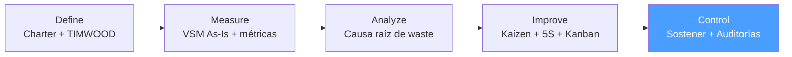

# /lean-control — Lean: Control

> *"Improvement without sustainment is just an experiment. Control is where Lean becomes the new normal — not a one-time event."*

Ejecuta la fase **Control** del ciclo Lean. Sostiene las mejoras implementadas en lean:improve mediante auditorías 5S, standard work, controles visuales, gestión de desviaciones y A3 de sostenibilidad.

**THYROX Stage:** Stage 11 TRACK/EVALUATE.

**Tollgate:** Plan de sostenibilidad activo con métricas en objetivo durante al menos 4 semanas antes de cerrar el ciclo Lean.

---

## Ciclo Lean — foco en Control



## Pre-condición

- **Lean:improve aprobado** — VSM To-Be implementado, Kaizen events ejecutados, Standard Work documentado.
- Métricas post-mejora medidas: Lead Time, Process Efficiency, WIP — con al menos 1 semana de datos.
- Standard Work publicado y accesible para el equipo operacional.

---

## Cuándo usar este paso

- Al iniciar el período de sostenibilidad post-Kaizen (primeras 4-8 semanas)
- Cuando las métricas post-mejora ya están disponibles y se necesita monitorear la adherencia
- Para documentar lecciones aprendidas y propagar mejoras a otros procesos (Yokoten)

## Cuándo NO usar este paso

- Sin Standard Work documentado — Control sin estándar no tiene referencia de qué sostener
- Si las métricas post-mejora muestran que las mejoras no funcionaron — regresar a lean:analyze antes de pasar a Control
- Sin Process Owner comprometido — Control requiere un dueño del proceso que mantenga la disciplina diaria

---

## Actividades

### 1. Verificación de resultados vs baseline

Comparar métricas actuales vs estado As-Is (de lean:measure):

| Métrica | As-Is (Baseline) | Objetivo To-Be | Resultado actual | Delta vs objetivo |
|---------|-----------------|----------------|-----------------|------------------|
| Lead Time total | [X] | [Y] | [Z actual] | [±] |
| Process Efficiency | [X%] | [Y%] | [Z% actual] | [±pp] |
| WIP total | [N] | [N'] | [N actual] | [±] |
| Cycle Time cuello de botella | [X min] | [≤ TT] | [Z actual] | [±] |
| % tiempo en espera | [X%] | [Y%] | [Z% actual] | [±pp] |

**Interpretación de resultados:**

| Resultado | Acción |
|-----------|--------|
| Objetivo alcanzado y sostenido | Continuar con auditorías de frecuencia reducida |
| Objetivo alcanzado pero con variabilidad | Reforzar Standard Work; investigar fuentes de variación |
| Objetivo parcialmente alcanzado | Identificar qué wastes persisten; mini-Kaizen si aplica |
| Sin mejora o regresión | Regresar a lean:analyze — la causa raíz puede no haber sido la correcta |

### 2. Gestión Visual — controles visuales del proceso

Los controles visuales hacen que las desviaciones sean inmediatamente visibles sin necesidad de informes.

**Tipos de controles visuales Lean:**

| Control visual | Propósito | Cómo implementar |
|---------------|-----------|-----------------|
| **Tablero de producción** | Ver si el proceso está al Takt Time | Actualizar cada turno: plan vs real de unidades |
| **Tablero Kanban** | Ver el WIP y detectar cuellos de botella | Columnas con WIP limits; item bloqueado = señal visual |
| **Andon (señal de alerta)** | Detectar desviaciones en tiempo real | Semáforo visual o alarma cuando el proceso se detiene |
| **Marcaciones 5S en el piso/espacio** | Ver inmediatamente si algo está fuera de lugar | Cinta de color, contornos, etiquetas de ubicación |
| **Indicadores de calidad en proceso** | Detectar defectos en el paso donde ocurren | Contador de defectos por turno; gráfica simple de tendencia |
| **Gráfica de control simple** | Monitorear Lead Time o CT en el tiempo | Gráfica de puntos con línea de objetivo y límites de control |

**Principio de gestión visual:** si una persona nueva puede entender el estado del proceso en menos de 30 segundos viendo el área, los controles visuales están bien implementados.

### 3. Auditorías 5S — plan de sostenibilidad

Las auditorías 5S verifican que el estado mejorado se mantiene en el tiempo.

**Frecuencia de auditorías:**

| Período post-Kaizen | Frecuencia de auditoría | Quién audita |
|--------------------|------------------------|-------------|
| Semanas 1-4 | Semanal | Lean Champion |
| Meses 2-3 | Quincenal | Process Owner |
| Mes 4+ | Mensual | Auditor rotativo del equipo |

**Proceso de auditoría 5S:**

1. Usar el checklist estándar: [5s-audit-template.md](./assets/5s-audit-template.md)
2. Puntuar cada S de 1-5 según el checklist
3. Score total 5S = suma de los 5 puntajes (máx. 25)
4. Documentar desviaciones encontradas con fotografía
5. Acordar acciones correctivas con el responsable del área
6. Seguimiento en la próxima auditoría

**Escala de madurez 5S:**

| Score | Nivel | Descripción |
|-------|-------|-------------|
| 21-25 | Excelente | El estándar se mantiene consistentemente |
| 16-20 | Bueno | Algunas desviaciones menores; sin riesgo |
| 11-15 | Aceptable | Desviaciones identificadas; plan de corrección activo |
| 6-10 | En riesgo | El estado mejorado se está perdiendo; mini-Kaizen necesario |
| 1-5 | Crítico | Regresión al estado anterior; escalar a sponsor |

### 4. Standard Work — adherencia y actualización

El Standard Work es el corazón del Control: define qué es "correcto" en el proceso mejorado.

**Verificación de adherencia al Standard Work:**

| Verificación | Frecuencia | Método |
|-------------|-----------|--------|
| ¿Los operadores siguen la secuencia documentada? | Diario (primera semana), luego semanal | Observación directa breve (5-10 min) |
| ¿El Takt Time se cumple en el paso pacemaker? | Por turno | Tablero de producción |
| ¿Los WIP limits se respetan en el Kanban? | Diario | Revisión del tablero Kanban |
| ¿Los nuevos integrantes son entrenados en el estándar? | Al incorporar | Checklist de onboarding al proceso |

**Cuándo actualizar el Standard Work:**

- Cuando el proceso cambia (nuevo equipo, nueva política, nuevo sistema)
- Cuando el equipo identifica una mejora al estándar durante la operación diaria
- Cuando una auditoría revela desviaciones sistemáticas que indican que el estándar es difícil de seguir
- En el ciclo Kaizen siguiente — el Standard Work de hoy es la línea base del próximo Kaizen

### 5. Gestión de desviaciones — respuesta ante regresiones

Una desviación es cuando el proceso se aleja del estándar. La respuesta rápida evita la regresión completa.

**Protocolo de respuesta ante desviación:**

```
Detectar desviación (control visual o auditoría)
    ↓
¿Es una desviación ocasional o patrón recurrente?
    ↓                           ↓
Ocasional                   Patrón recurrente
    ↓                           ↓
Corregir en el momento      Iniciar 5 Whys de regresión
Documentar en log           ¿Causa sistémica nueva?
                                ↓           ↓
                            Sí             No
                            ↓              ↓
                        Mini-Kaizen    Reforzar
                        para nueva     Standard
                        causa raíz     Work
```

**Log de desviaciones:**

| Fecha | Desviación observada | Waste reactivado | Causa probable | Acción tomada | Responsable | Estado |
|-------|---------------------|-----------------|----------------|---------------|-------------|--------|
| [fecha] | [qué pasó] | [TIMWOOD] | [hipótesis] | [acción] | [nombre] | Abierto/Cerrado |

### 6. A3 de sostenibilidad — revisión de resultados

El A3 es una herramienta Lean de gestión y comunicación de mejoras. El A3 de sostenibilidad resume el proyecto Lean completo para el sponsor.

**Estructura del A3 de Lean Control:**

```
┌─────────────────────────────────────────────────────────────────┐
│  A3 — LEAN CONTROL REVIEW                          [Proyecto]   │
│  Fecha: [YYYY-MM-DD]    Responsable: [nombre]                   │
├──────────────────────────┬──────────────────────────────────────┤
│  1. CONTEXTO Y PROBLEMA  │  5. RESULTADOS ALCANZADOS            │
│  [Problem Statement]     │  [Tabla As-Is vs To-Be vs Actual]    │
│                          │                                      │
├──────────────────────────┤                                      │
│  2. ESTADO ACTUAL        │                                      │
│  [VSM As-Is resumido]    ├──────────────────────────────────────┤
│  [Métricas baseline]     │  6. ANÁLISIS DE CAUSA / DESVIACIÓN   │
│                          │  [Si hay gap: ¿por qué?]             │
├──────────────────────────┤                                      │
│  3. OBJETIVO             │                                      │
│  [Goal Statement]        ├──────────────────────────────────────┤
│  [VSM To-Be resumido]    │  7. CONTRAMEDIDAS Y PRÓXIMOS PASOS   │
│                          │  [Acciones de sostenibilidad]        │
├──────────────────────────┤  [Yokoten si aplica]                 │
│  4. ANÁLISIS DE CAUSA    │                                      │
│  [Top wastes + causas    ├──────────────────────────────────────┤
│   raíz clave]            │  8. PLAN DE SEGUIMIENTO              │
│                          │  [Fechas, responsables, KPIs]        │
└──────────────────────────┴──────────────────────────────────────┘
```

### 7. Yokoten — despliegue horizontal de mejoras

Yokoten es la práctica Lean de propagar los aprendizajes de un proceso a otros procesos similares.

**Cuándo aplicar Yokoten:**

- Cuando las mejoras son aplicables a otros procesos similares en la organización
- Cuando el Standard Work desarrollado puede ser la base para otros equipos
- Al cerrar el proyecto Lean — documentar los patrones transferibles

**Proceso de Yokoten:**

1. Identificar procesos similares donde el waste era el mismo tipo
2. Presentar los resultados del Kaizen al Process Owner de esos procesos
3. Adaptar (no copiar directamente) el Standard Work al contexto de cada proceso
4. Agendar un Kaizen event en el proceso receptor si el waste se confirma

---

## Artefacto esperado

`{wp}/lean-control.md` — Plan de sostenibilidad con resultados, controles visuales, frecuencia de auditorías y A3 review.

---

## Red Flags — señales de Control mal ejecutado

- **Sin medición de resultados post-Kaizen** — si no se compararon métricas As-Is vs post-evento, no hay evidencia de mejora sostenida
- **Auditorías 5S que nunca detectan desviaciones** — el auditor no está siendo riguroso o el checklist es demasiado subjetivo
- **Standard Work que nadie sigue** — si el equipo opera diferente al estándar, el estándar está mal diseñado o no fue comunicado
- **Control plan sin dueño asignado** — sin responsable, el monitoreo se abandona en semanas
- **Métricas que regresan al estado As-Is después de 2 meses** — señal de que la causa raíz no fue completamente eliminada
- **A3 completado sin datos reales** — el A3 debe reflejar resultados medidos, no estimados

### Anti-racionalizaciones comunes

| Racionalización | Por qué es trampa | Respuesta correcta |
|----------------|-------------------|--------------------|
| *"El equipo ya sabe el estándar, no necesitamos auditorías"* | Sin auditorías, el proceso regresa gradualmente al estado anterior — es inevitable | Auditorías regulares aunque el equipo "sepa" el estándar |
| *"El A3 es burocracia"* | El A3 es el mecanismo de transferencia de aprendizaje; sin él, el conocimiento del proyecto se pierde | El A3 de 1 página es lo mínimo para documentar el resultado |
| *"Los resultados son buenos, podemos reducir el monitoreo"* | Control reducido prematuramente → regresión; el proceso necesita al menos 4 semanas en objetivo antes de reducir frecuencia | Mantener frecuencia alta durante las primeras 4 semanas mínimo |
| *"Yokoten es opcional"* | Los aprendizajes no propagados son waste de conocimiento | Incluir Yokoten en el cierre del proyecto aunque sea una presentación breve |

---

## Estado en now.md

**Al INICIAR este step:**
```yaml
methodology_step: lean:control
flow: lean
```

**Al COMPLETAR** (métricas en objetivo 4 semanas + Plan de sostenibilidad activo):
```yaml
methodology_step: lean:control  # completado → ciclo lean cerrado
flow: lean
```

## Siguiente paso

Cuando el plan de sostenibilidad está activo y las métricas en objetivo durante 4 semanas → cerrar el WP Lean y documentar en THYROX Stage 12 STANDARDIZE.

---

## Limitaciones

- 4 semanas de sostenibilidad es el mínimo — procesos más complejos pueden necesitar 8-12 semanas antes de reducir la frecuencia de auditorías
- El Yokoten requiere que los procesos receptores tengan Process Owners dispuestos; no se puede imponer
- Si las métricas no alcanzan el objetivo To-Be, revisar si el objetivo era realista o si la causa raíz fue correctamente identificada — puede necesitar otro ciclo Lean
- Control Lean no incluye análisis estadístico de control (SPC, cartas de control con límites estadísticos) — si el proceso requiere control estadístico riguroso, considerar DMAIC Control con cartas de control

---

## Reference Files

### Assets
- [5s-audit-template.md](./assets/5s-audit-template.md) — Checklist de auditoría 5S con los 5 niveles de evaluación y escala de madurez

### References
- [lean-sustainability-guide.md](./references/lean-sustainability-guide.md) — Guía de sostenibilidad Lean: gestión visual, Standard Work, Yokoten, A3 thinking y gestión de desviaciones
