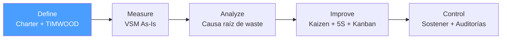

# /lean-define — Lean: Define

> *"You cannot improve what you cannot define. A vague waste statement leads to scattered improvement efforts and no measurable result."*

Ejecuta la fase **Define** del ciclo Lean. Produce el Lean Project Charter aprobado que delimita el problema de desperdicio y autoriza el proyecto de mejora.

**THYROX Stage:** Stage 3 DIAGNOSE.

**Tollgate:** Lean Project Charter aprobado por sponsor antes de avanzar a lean:measure.

---

## Ciclo Lean — foco en Define



## Pre-condición

- **Primer ciclo:** work package activo con descripción inicial del problema y sponsor identificado.
- El problema debe estar relacionado con desperdicio observable, no con variación estadística (si el problema es variación → usar DMAIC).
- VOC recopilado con al menos una técnica de elicitación directa antes de completar Define.

---

## Cuándo usar este paso

- Al iniciar un proyecto Lean de eliminación de desperdicio (MUDA) en un proceso
- Cuando el problema es visible (colas, esperas, movimientos innecesarios, sobreproducción) más que estadístico
- Cuando la mejora puede lograrse con herramientas de flujo (VSM, 5S, Kanban, SMED) sin análisis estadístico profundo
- Cuando el proceso tiene desperdicios obvios que el equipo puede atacar con Kaizen events

## Cuándo NO usar este paso

- Si el problema requiere análisis de variación estadística (Cp, Cpk, ANOVA) → usar DMAIC
- Para mejoras simples de una sola persona sin necesidad de Charter formal → usar PDCA
- Sin sponsor identificado — un proyecto Lean sin autorización no tendrá recursos para los Kaizen events

---

## Actividades

### 1. VOC — Voice of Customer en contexto Lean

En Lean, el VOC define qué es **valor** para el cliente — todo lo que no es valor es desperdicio potencial.

**Técnicas de recopilación VOC:**

| Técnica | Cuándo usar | Enfoque Lean |
|---------|-------------|-------------|
| **Entrevistas directas** | Siempre que sea posible | Preguntar: "¿Qué espera recibir y cuándo?" — define el ritmo (takt time) |
| **Gemba (observación directa)** | Proceso operacional | Ir donde ocurre el trabajo real; observar flujo vs esperas vs movimientos |
| **Análisis de quejas y tiempos** | Datos históricos disponibles | Identificar esperas frecuentes, reprocesos, items devueltos |
| **Encuestas de satisfacción** | Base de clientes grande | Preguntas sobre tiempo de entrega, calidad, disponibilidad |
| **Voz del proceso (métricas)** | Cuando hay datos de proceso | Cycle time, lead time, takt time — traducen VOC a requerimientos de proceso |

**Conversión VOC → Definición de Valor:**

```
VOC (qué dice el cliente) → Qué es Valor → Qué es Desperdicio (todo lo demás)
```

| VOC | Valor definido | Desperdicio identificado |
|-----|---------------|------------------------|
| *"Quiero el pedido en menos de 2 días"* | Entrega en ≤ 2 días | Tiempos de espera > umbral, inventario excesivo |
| *"El producto llega dañado con frecuencia"* | Producto íntegro | Defectos, reproceso, transporte inadecuado |
| *"No sé cuándo llega mi orden"* | Visibilidad del estado | Sobreprocesamiento de comunicación, falta de pull signals |

### 2. Identificación del tipo de waste — TIMWOOD

TIMWOOD es el diagnóstico inicial de desperdicios. Sin identificar el tipo de waste dominante, las mejoras serán dispersas.

| ID | Waste | Definición | Síntoma observable |
|----|-------|-----------|-------------------|
| **T** | Transportation | Mover materiales/información sin necesidad | Múltiples handoffs, documentos que "viajan" entre áreas |
| **I** | Inventory | WIP o stock excesivo sin demanda | Colas acumuladas, materiales esperando procesamiento |
| **M** | Motion | Movimiento innecesario de personas | Buscar herramientas, datos o información repetidamente |
| **W** | Waiting | Tiempo idle entre pasos | Aprobaciones lentas, dependencias bloqueantes |
| **O** | Overproduction | Producir más de lo que el cliente necesita | Reportes no leídos, features no usados |
| **O** | Overprocessing | Más pasos de los que el cliente requiere | Revisiones redundantes, formularios con datos no usados |
| **D** | Defects | Errores que requieren reproceso | Retrabajo, correcciones, rechazos |

> **MUDA 8 (extendido):** Skills/Talent no aprovechado — habilidades del equipo subutilizadas.

**Herramienta de priorización:** identificar los 2-3 desperdicios dominantes en el proceso objetivo para el Charter.

### 3. Problem Statement Lean — orientado a waste

El Problem Statement Lean describe el desperdicio observable con datos de tiempo/cantidad:

| ✅ Buen Problem Statement Lean | ❌ Mal Problem Statement Lean |
|-------------------------------|------------------------------|
| *"El proceso de aprobación de facturas tiene un lead time promedio de 8 días (datos Q1 2026), con 73% del tiempo en espera entre pasos — vs 5 días objetivo"* | *"El proceso es lento"* |
| Tiene desperdicio cuantificado (73% espera) | Sin magnitud del waste |
| Tiene período de tiempo | Vago, sin datos |
| Describe síntoma, no causa | *"Necesitamos automatización"* — asume solución |
| Tiene impacto medible | Sin conexión a lead time o costo |

> Regla Lean: si el Problem Statement propone una herramienta (5S, Kanban, etc.), está mal — la herramienta se elige en lean:improve tras el análisis.

### 4. Goal Statement Lean — reducción de waste medible

```
Reducir [tipo de waste] en [proceso] de [baseline] a [meta] para [fecha],
manteniendo [calidad/costo/otras métricas críticas].
```

Ejemplo: *"Reducir el lead time del proceso de aprobación de facturas de 8 días a 3 días para 2026-07-01, sin incrementar errores de aprobación por encima del 1%."*

### 5. SIPOC — mapa de alto nivel orientado a flujo

El SIPOC en Lean tiene énfasis especial en identificar dónde hay handoffs (fuente de Transportation y Waiting wastes).

| S — Suppliers | I — Inputs | P — Process | O — Outputs | C — Customers |
|---------------|-----------|------------|-------------|--------------|
| ¿Quién provee las entradas? | ¿Qué entra al proceso? | ¿Cuáles son los pasos principales (5-7 max)? | ¿Qué produce el proceso? | ¿Quién recibe los outputs? |

**Notas adicionales para SIPOC Lean:**
- Marcar cada paso P como VA (Value-Added), NVA Necesario, o NVA Puro
- Identificar dónde hay esperas o buffers entre pasos (candidatos a waste mapping en lean:measure)
- El número de handoffs entre proveedores/áreas es un indicador de waste de Transportation

### 6. Lean Project Charter — diferencias vs DMAIC Charter

| Elemento | Lean Charter | DMAIC Charter |
|----------|-------------|--------------|
| **Enfoque** | Reducir tipos de waste (TIMWOOD) específicos | Reducir variación estadística (defectos, Cpk) |
| **Métricas primarias** | Lead time, cycle time, % VA, WIP | DPMO, sigma level, Cp/Cpk |
| **Análisis requerido** | VSM As-Is (visual), TIMWOOD checklist | MSA, análisis de sistemas de medición |
| **Herramientas clave** | 5S, Kanban, SMED, Kaizen events | DOE, ANOVA, regresión, SPC |
| **Horizonte típico** | 4-12 semanas (Kaizen events intensivos) | 4-9 meses (ciclo DMAIC completo) |

| Campo del Lean Charter | Contenido |
|-----------------------|-----------|
| Proyecto | Nombre del proyecto Lean |
| Sponsor | Quién autoriza y provee recursos para Kaizen events |
| Team / RACI | Lean Champion, Process Owner, Kaizen team members |
| Problem Statement | Ver actividad 3 — waste cuantificado |
| Wastes dominantes | Top 2-3 de TIMWOOD identificados en el proceso |
| Goal Statement | Ver actividad 4 — reducción de waste medible |
| Business Case | Costo del waste actual vs beneficio de eliminarlo |
| Scope | In / Out — proceso delimitado para el VSM |
| VOC | Definición de valor desde perspectiva del cliente |
| SIPOC | Mapa de alto nivel con marcado VA/NVA |
| Timeline | Fechas estimadas: Define → Measure → Analyze → Improve → Control |

### 7. Business Case Lean

| Elemento | Contenido |
|----------|-----------|
| Waste actual cuantificado | Lead time extra, horas de reproceso, costo de inventario excesivo |
| Beneficio esperado | Lead time reducido, horas liberadas, costo evitado |
| Inversión estimada | Tiempo del equipo en Kaizen events, herramientas, formación |
| ROI estimado | Beneficio / Inversión |
| Riesgo de no actuar | Qué pasa con la competitividad/costo si el waste continúa |

### 8. RACI del proyecto Lean

| Rol | Responsable (R) | Aprobador (A) | Consultado (C) | Informado (I) |
|-----|----------------|--------------|----------------|--------------|
| **Sponsor** | | Aprueba Charter + recursos Kaizen | | Recibe informes de avance |
| **Lean Champion / Green Belt** | Lidera el proyecto | | | |
| **Process Owner** | Ejecuta cambios en el proceso | | Revisa mejoras propuestas | |
| **Kaizen Team** | Participa en eventos Kaizen | | | |
| **Clientes / Usuarios finales** | | | Validan definición de valor | Resultados |

---

## Artefacto esperado

`{wp}/lean-define.md` — usar template: [lean-project-charter-template.md](./assets/lean-project-charter-template.md)

---

## Red Flags — señales de Define mal ejecutado

- **VOC sin definición de valor** — los desperdicios no pueden identificarse sin saber qué es valor para el cliente
- **Problem Statement que menciona una herramienta** — *"Necesitamos implementar 5S"* es solución, no problema
- **TIMWOOD sin priorización** — atacar todos los wastes a la vez dispersa los esfuerzos y reduce el impacto
- **Goal Statement sin tiempo** — una meta sin fecha no tiene urgencia ni checkpoint de evaluación
- **Scope demasiado amplio** — un VSM de todo el proceso end-to-end de la empresa no es ejecutable
- **Charter sin Lean Champion** — alguien debe liderar los Kaizen events; sin ese rol, el proyecto no avanza
- **Business case sin horas/costo de waste** — *"mejoraremos el proceso"* no justifica destinar al equipo a Kaizen events

### Anti-racionalizaciones comunes

| Racionalización | Por qué es trampa | Respuesta correcta |
|----------------|-------------------|--------------------|
| *"El waste es obvio, no necesitamos VOC"* | El equipo puede definir valor incorrectamente; hay que validar con el cliente | Recopilar VOC antes de declarar qué es waste |
| *"Empecemos el VSM antes de tener el Charter"* | Sin Charter aprobado, el VSM puede ser rechazado o redirigido por el sponsor | Charter primero, VSM en lean:measure |
| *"Identificamos 6 tipos de waste, atacaremos todos"* | Dispersar esfuerzos en todos los wastes genera mejoras menores en todo; concentrarse en 2-3 genera cambio real | Priorizar TIMWOOD y elegir los dominantes |
| *"El scope incluye el proceso completo de la empresa"* | Un VSM de toda la empresa es inmanejable; Lean funciona mejor en procesos delimitados | Delimitar scope a un flujo de valor específico |

---

## Estado en now.md

**Al INICIAR este step:**
```yaml
methodology_step: lean:define
flow: lean
```

**Al COMPLETAR** (Lean Project Charter aprobado por sponsor):
```yaml
methodology_step: lean:define  # completado → listo para lean:measure
flow: lean
```

## Siguiente paso

Cuando el Lean Project Charter está aprobado por el sponsor → `lean:measure`

---

## Limitaciones

- Define en Lean es más rápido que en DMAIC, pero no debe saltarse — un Charter débil genera Kaizen events que no tienen impacto
- Si durante Measure se descubre que el waste dominante es diferente al identificado en Define, revisar el Charter antes de continuar
- El tollgate de aprobación del sponsor no es formalismo — sin él, los Kaizen events no tendrán el respaldo de gestión necesario para implementar cambios
- La elección de Lean vs DMAIC debe hacerse en Define: si aparecen métricas de variación estadística como CTQs principales, considerar cambiar a DMAIC

---

## Reference Files

### Assets
- [lean-project-charter-template.md](./assets/lean-project-charter-template.md) — Template del Lean Project Charter con VOC, TIMWOOD, SIPOC, Goal Statement, Business Case, RACI y Timeline

### References
- [timwood-guide.md](./references/timwood-guide.md) — Guía detallada de los 8 desperdicios TIMWOOD con síntomas, ejemplos y herramientas de identificación
