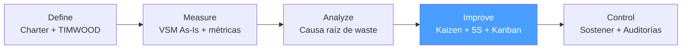

# /lean-improve — Lean: Improve

> *"A Kaizen event without root cause analysis is just rearranging waste. Improve only after Analyze confirms what to change and why."*

Ejecuta la fase **Improve** del ciclo Lean. Diseña e implementa las mejoras Lean sobre las causas raíz validadas: Kaizen events, 5S, Kanban, SMED, Jidoka. Produce el VSM To-Be (estado futuro).

**THYROX Stage:** Stage 10 IMPLEMENT.

**Tollgate:** VSM To-Be aprobado por sponsor e implementación de mejoras completada antes de avanzar a lean:control.

---

## Ciclo Lean — foco en Improve



## Pre-condición

- **Análisis lean:analyze aprobado** con causas raíz de los 2-3 wastes dominantes validadas.
- Priorización de wastes definida con impacto y esfuerzo estimado.
- Sponsor y Process Owner disponibles para autorizar cambios en el proceso.

---

## Cuándo usar este paso

- Al diseñar y ejecutar mejoras concretas sobre causas raíz confirmadas
- Cuando el equipo está listo para un Kaizen event (2-5 días de trabajo intensivo de mejora)
- Cuando la causa raíz apunta a herramientas Lean específicas (desperdicio de movimiento → 5S; esperas → Kanban; setups → SMED)

## Cuándo NO usar este paso

- Sin análisis de causa raíz completo — implementar 5S sin saber que la causa es organización del espacio es azar
- Si las causas raíz apuntan a variación estadística → implementar soluciones DMAIC (SPC, control charts, MSA)
- Sin autorización del Process Owner — los cambios en el proceso requieren buy-in de quien lo opera

---

## Actividades

### 1. VSM To-Be — diseño del estado futuro

El VSM To-Be es el diseño del proceso mejorado, partiendo del VSM As-Is con los wastes eliminados.

**Principios de diseño del To-Be:**

| Principio | Qué implementar | Cuándo aplicar |
|-----------|----------------|----------------|
| **Producir al Takt Time** | Balancear el proceso al ritmo del cliente | Siempre — el Takt Time es el objetivo de todos los pasos |
| **Pull, no push** | Implementar señales Kanban o pull signals | Cuando hay sobreproducción o WIP excesivo |
| **Flujo continuo** | Eliminar buffers entre pasos; pieza a pieza | Cuando los pasos pueden ejecutarse de forma continua |
| **Supermercado (si no hay flujo continuo)** | Kanban de inventario controlado entre pasos | Cuando el flujo continuo no es posible por restricciones de proceso |
| **Programar solo 1 punto del proceso** | Pacemaker: solo un paso recibe la orden del cliente | Para simplificar la gestión del flujo |

**Preguntas de diseño del To-Be:**

1. ¿Cuál es el Takt Time? — define el ritmo objetivo de todos los pasos
2. ¿Dónde se puede implementar flujo continuo? — eliminar buffers entre pasos consecutivos
3. ¿Qué pasos se pueden combinar o eliminar? — reducir NVA
4. ¿Dónde se necesita un supermercado Kanban? — puntos donde el flujo continuo no es posible
5. ¿Cuál es el "pacemaker"? — el paso que recibe la señal de producción del cliente
6. ¿Cómo se nivela la demanda? — Heijunka si hay variabilidad de demanda significativa

**Comparación As-Is vs To-Be:**

| Métrica | As-Is | To-Be objetivo | Mejora esperada |
|---------|-------|----------------|----------------|
| Lead Time | [X días] | [Y días] | [Z%] |
| Process Efficiency | [X%] | [Y%] | [+Z pp] |
| WIP total | [N items] | [N' items] | [Z% reducción] |
| Cycle Time cuello de botella | [X min] | [≤ Takt Time] | Eliminación del cuello |
| % tiempo en espera | [X%] | [Y%] | [Z% reducción] |

### 2. Kaizen Events — ejecución de mejora intensiva

Un Kaizen event es un esfuerzo concentrado de mejora (2-5 días) con el equipo operacional.

**Estructura de un Kaizen Event:**

| Día | Actividades | Output |
|-----|------------|--------|
| **Día 1 — Preparar** | Revisar VSM As-Is, causas raíz, objetivo del evento. Definir el área/proceso a mejorar. | Kaizen Event Charter firmado |
| **Día 2 — Observar y medir** | Gemba walk del área específica. Medir tiempos actuales. Identificar waste concreto. | Datos actuales del área |
| **Día 3 — Idear e implementar** | Brainstorm de soluciones. Elegir las de mayor impacto/menor esfuerzo. Implementar cambios. | Primeras mejoras implementadas |
| **Día 4 — Probar y ajustar** | Probar el proceso con las mejoras. Medir resultados. Ajustar si es necesario. | Métricas post-mejora |
| **Día 5 — Estandarizar y presentar** | Documentar el nuevo estándar. Crear instrucciones de trabajo. Presentar resultados al sponsor. | Standard Work + resultados |

**Roles del Kaizen Event:**

| Rol | Responsabilidad |
|-----|----------------|
| Lean Champion / Facilitador | Facilitar el proceso de mejora; aplicar herramientas Lean |
| Process Owner | Autorizar cambios; asegurar continuidad del proceso durante el evento |
| Kaizen Team (3-7 personas) | Operadores del proceso + soporte técnico; implementar las mejoras |
| Sponsor | Recibir el informe de resultados; aprobar cambios permanentes |

**Principio de selección de Kaizen events:**
- Atacar las causas raíz de los 2-3 wastes con mayor impacto (de lean:analyze)
- Un evento por waste dominante, con foco específico
- La duración depende de la complejidad: 2 días para mejoras de organización, 5 días para rediseño de flujo

### 3. Selección de herramienta Lean por tipo de waste

| Waste dominante | Herramienta principal | Herramienta complementaria |
|----------------|----------------------|---------------------------|
| **Transportation** | Layout optimization, Rediseño de flujo | Value Stream redesign |
| **Inventory** | Kanban, Pull system | Heijunka (nivelación) |
| **Motion** | 5S, Workplace organization | Layout optimization |
| **Waiting** | Balanceo de línea al Takt Time, Kanban | SMED (reducir setup times) |
| **Overproduction** | Kanban, Pull system | Heijunka |
| **Overprocessing** | Eliminación de actividades NVA | Standard Work |
| **Defects** | Jidoka, Poka-yoke | 5S (entorno controlado) |

### 4. 5S — implementación en el área de mejora

Ver guía detallada: [lean-tools-guide.md](./references/lean-tools-guide.md)

**Resumen de aplicación en Kaizen event:**

| Fase | Japonés | Acción en el evento | Tiempo estimado |
|------|---------|--------------------|--------------| 
| **S1 — Clasificar** | Seiri | Red Tag de todo lo innecesario | 2-4 horas |
| **S2 — Ordenar** | Seiton | Asignar ubicación fija; marcar visualmente | 2-4 horas |
| **S3 — Limpiar** | Seiso | Limpiar e inspeccionar | 1-2 horas |
| **S4 — Estandarizar** | Seiketsu | Fotografiar el estado objetivo; crear checklist | 2-3 horas |
| **S5 — Sostener** | Shitsuke | Asignar responsable de área; definir frecuencia de auditoría | 1 hora |

### 5. Kanban — implementación de pull system

Ver guía detallada: [lean-tools-guide.md](./references/lean-tools-guide.md)

**Diseño del Kanban para el proceso mejorado:**

```
Paso de diseño Kanban:

1. Identificar el pacemaker (único punto que recibe señal del cliente)
2. Determinar el Takt Time (ritmo objetivo)
3. Definir el WIP limit por etapa: WIP = TT × demanda máxima en ese paso
4. Diseñar la señal Kanban (tarjeta, tablero, señal electrónica)
5. Implementar el supermercado entre pasos donde hay buffers necesarios
6. Definir el tamaño del lote mínimo (pitch = múltiplo del Takt Time)
```

### 6. SMED — reducción de tiempos de setup

Ver guía detallada: [lean-tools-guide.md](./references/lean-tools-guide.md)

**Aplicar cuando:** el waste de Espera incluye tiempos de setup o cambio de formato/configuración significativos.

**Las 3 fases SMED en el Kaizen event:**

1. **Observar y documentar** (Día 2): grabar el setup actual completo; cronometrar cada actividad
2. **Convertir internas en externas** (Día 3): identificar qué se puede preparar mientras el proceso corre
3. **Reducir tiempos de actividades internas** (Día 3-4): estandarizar, pre-posicionar, paralelizar

### 7. Standard Work — estandarizar la mejora

El Standard Work documenta el proceso mejorado para que la mejora sea repetible y enseñable.

| Componente | Contenido |
|-----------|-----------|
| **Takt Time** | El ritmo objetivo del proceso mejorado |
| **Secuencia de trabajo** | Los pasos en el orden correcto para cumplir el Takt Time |
| **WIP estándar** | El inventario mínimo necesario para que el flujo funcione |
| **Puntos de calidad** | Dónde verificar calidad en el flujo (Jidoka / Poka-yoke) |

---

## Artefacto esperado

`{wp}/lean-improve.md` — VSM To-Be + registro de Kaizen events ejecutados + Standard Work.  
`{wp}/kaizen-event-charter.md` — usar template: [kaizen-event-charter-template.md](./assets/kaizen-event-charter-template.md)  
`{wp}/5s-audit-checklist.md` — usar template: [5s-audit-template.md](./assets/5s-audit-template.md)

---

## Red Flags — señales de Improve mal ejecutado

- **Kaizen event sin charter** — un evento sin objetivo medible no tiene forma de validar el éxito
- **5S implementado como fin en sí mismo** — si 5S no ataca la causa raíz del waste, es cosmético
- **Kanban con WIP limits arbitrarios** — los límites deben calcularse con Takt Time y capacidad real
- **VSM To-Be diseñado en sala sin Gemba** — el estado futuro debe validarse en el proceso real
- **Implementar todas las herramientas simultáneamente** — sobrecarga al equipo y diluye el impacto; una herramienta por waste dominante
- **Standard Work no documentado** — sin documentación, la mejora se pierde cuando el equipo cambia
- **Resultados del Kaizen no medidos** — si no se comparan métricas As-Is vs post-evento, no hay evidencia de mejora

### Anti-racionalizaciones comunes

| Racionalización | Por qué es trampa | Respuesta correcta |
|----------------|-------------------|--------------------|
| *"5S es para manufactura, nosotros somos una oficina"* | 5S aplica a cualquier workspace — físico o digital | Adaptar: archivos digitales, carpetas, wikis también se pueden organizar con 5S |
| *"El Kanban es demasiado complejo para nuestro proceso"* | Kanban puede ser tan simple como un tablero con 3 columnas y límites de WIP | Empezar con el tablero más simple; complejizar si es necesario |
| *"Ya implementamos los cambios, no necesitamos Standard Work"* | Sin estándar documentado, el proceso regresa al estado anterior en 2-4 semanas | Documentar el estándar es la diferencia entre mejora temporal y permanente |
| *"El Kaizen event fue exitoso, pasamos a Control"* | Éxito sin métricas no es éxito; comparar Lead Time As-Is vs post-evento | Medir antes y después; solo si las métricas mejoran el evento fue exitoso |

---

## Estado en now.md

**Al INICIAR este step:**
```yaml
methodology_step: lean:improve
flow: lean
```

**Al COMPLETAR** (VSM To-Be aprobado + Kaizen events ejecutados + Standard Work documentado):
```yaml
methodology_step: lean:improve  # completado → listo para lean:control
flow: lean
```

## Siguiente paso

Cuando el VSM To-Be está aprobado y las mejoras implementadas con Standard Work → `lean:control`

---

## Limitaciones

- Los Kaizen events son intensivos — requieren disponibilidad total del equipo durante los días del evento; coordinar con anticipación
- Las mejoras de flujo pueden tener efectos secundarios no anticipados en procesos upstream/downstream — monitorear durante 2 semanas post-evento
- Si las mejoras requieren cambios de sistemas IT, el lead time de implementación puede exceder el Kaizen event — planificar con IT antes del evento
- Standard Work debe ser revisado en lean:control si las condiciones del proceso cambian

---

## Reference Files

### Assets
- [kaizen-event-charter-template.md](./assets/kaizen-event-charter-template.md) — Template del Kaizen Event Charter con objetivo, scope, equipo, métricas y plan de 5 días
- [5s-audit-template.md](./assets/5s-audit-template.md) — Template de checklist de auditoría 5S con los 5 niveles de evaluación

### References
- [lean-tools-guide.md](./references/lean-tools-guide.md) — Catálogo completo de herramientas Lean: 5S, Kanban, SMED, Jidoka, Heijunka, eliminación de NVA
