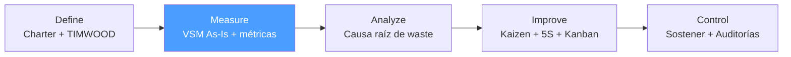

# /lean-measure — Lean: Measure

> *"You cannot eliminate what you cannot see. The Value Stream Map makes waste visible — every queue, delay, and non-value-added step is exposed."*

Ejecuta la fase **Measure** del ciclo Lean. Produce el VSM (Value Stream Map) As-Is con métricas de flujo y cuantificación del waste actual.

**THYROX Stage:** Stage 2 BASELINE.

**Tollgate:** VSM As-Is aprobado con métricas de flujo documentadas antes de avanzar a lean:analyze.

---

## Ciclo Lean — foco en Measure



## Pre-condición

- **Lean Project Charter aprobado** por el sponsor (lean:define completo).
- Scope del proceso delimitado: punto de inicio y fin del flujo de valor identificados.
- Equipo con acceso al proceso real para observación Gemba (no puede hacerse solo desde reuniones).

---

## Cuándo usar este paso

- Al iniciar el mapeo del estado actual de un proceso Lean
- Cuando se necesita una fotografía cuantitativa del flujo: cycle times, lead times, WIP, inventario
- Cuando el Charter aprobado indica que el scope es un flujo de valor delimitado

## Cuándo NO usar este paso

- Sin Charter aprobado — el VSM sin scope delimitado produce un mapa inútil
- Si el proceso no es observable (sin datos históricos ni acceso Gemba) — en ese caso, construir el sistema de medición primero
- Para análisis de variación estadística → usar DMAIC Measure con MSA

---

## Actividades

### 1. Gemba Walk — observación del proceso real

El VSM se construye desde el proceso real, no desde lo que el equipo cree que ocurre.

**Protocolo Gemba:**

| Paso | Acción | Output |
|------|--------|--------|
| 1. Preparar | Definir el punto de inicio y fin del flujo. Llevar papel, cronómetro, cámara. | Checklist de observación |
| 2. Caminar | Seguir el flujo **de derecha a izquierda** (desde el cliente hacia upstream) | Notas de campo |
| 3. Observar sin intervenir | Ver el proceso tal como ocurre; no pedir que lo hagan "bien" | Lista de pasos reales |
| 4. Medir cycle times | Cronometrar cada paso con al menos 5 observaciones | Tabla de cycle times |
| 5. Identificar inventario/WIP | Contar items en espera entre cada paso | Tabla de inventario |
| 6. Mapear flujo de información | ¿Cómo se comunica al proceso qué producir? (push/pull) | Diagrama de flujo de información |

> La caminata Gemba se hace **de derecha a izquierda** porque el flujo de valor va del proveedor al cliente (izquierda a derecha), pero entender el proceso empieza desde la demanda del cliente.

### 2. Métricas de flujo — qué medir

| Métrica | Definición | Cómo calcular | Para qué sirve |
|---------|-----------|--------------|----------------|
| **Cycle Time (CT)** | Tiempo para completar una unidad en un paso | Observación directa: cronometrar inicio→fin de una unidad | Identificar el paso más lento (cuello de botella) |
| **Lead Time (LT)** | Tiempo total desde que el cliente ordena hasta que recibe | LT = suma de CT + tiempos de espera | Medir el impacto total del waste en el cliente |
| **Takt Time (TT)** | Ritmo al que el cliente demanda | TT = Tiempo disponible / Demanda del cliente | Determinar el ritmo objetivo del proceso |
| **Process Efficiency (PE)** | % del lead time que agrega valor | PE = Σ VA time / Lead Time total × 100 | Cuantificar el waste total en el proceso |
| **WIP (Work in Progress)** | Items en proceso simultáneamente | Conteo directo en cada buffer/cola | Identificar inventario y sobreproducción |
| **Uptime / Disponibilidad** | % tiempo que el proceso/equipo está operativo | (Tiempo disponible - Downtime) / Tiempo disponible | Identificar waste de Espera por equipo |

**Takt Time — fórmula:**
```
Takt Time = Tiempo disponible de producción / Demanda del cliente

Ejemplo:
  Tiempo disponible = 480 min/día (1 turno de 8h)
  Demanda = 60 unidades/día
  Takt Time = 480/60 = 8 min/unidad

Interpretación: el proceso debe completar 1 unidad cada 8 minutos para satisfacer la demanda.
Si algún paso tiene CT > 8 min → es el cuello de botella.
```

**Process Efficiency — interpretación:**

| PE | Interpretación |
|----|---------------|
| < 10% | Proceso con waste severo — típico en procesos administrativos no optimizados |
| 10-30% | Waste significativo — oportunidad de mejora alta |
| 30-50% | Proceso moderadamente eficiente — mejoras focalizadas posibles |
| > 50% | Proceso lean — mejoras incrementales |
| > 80% | Proceso muy lean — nivel de manufactura optimizada |

### 3. VSM As-Is — estructura del mapa

El VSM As-Is es la fotografía del estado actual del proceso con todas sus ineficiencias.

**Componentes del VSM:**

```
[Proveedor] → [Paso 1] →▽ [Paso 2] →▽ [Paso 3] → [Cliente]
              CT: Xmin  WIP:N  CT: Xmin  WIP:N  CT: Xmin

▽ = buffer/inventario entre pasos
→ = flujo push (producción sin señal)
○→ = flujo pull (producción por señal kanban)
```

**Iconos VSM estándar:**

| Icono | Significado |
|-------|-------------|
| Caja de proceso | Paso del proceso con CT, uptime, operadores |
| Triángulo (▽) | Inventario / WIP / cola entre pasos |
| Rayo (⚡) | Flujo de información electrónica |
| Línea recta | Flujo de información manual |
| Push arrow (→) | Material empujado (push system) |
| Pull arrow (○→) | Material jalado (pull/kanban system) |

**Datos por caja de proceso:**

| Campo | Dato |
|-------|------|
| Cycle Time | Tiempo observado para completar 1 unidad |
| # Operadores | Personas asignadas a este paso |
| Uptime | % disponibilidad del paso |
| Cambio de turno / SMED | Tiempo de setup si aplica |

**Timeline del VSM (línea de tiempo inferior):**

```
[CT: 5min] [Espera: 2h] [CT: 10min] [Espera: 1h] [CT: 3min]
   VA            NVA         VA           NVA          VA

Lead Time total = 5min + 120min + 10min + 60min + 3min = 198min
VA Time = 5min + 10min + 3min = 18min
Process Efficiency = 18/198 = 9.1%
```

### 4. Identificación visual de wastes en el VSM

Una vez trazado el VSM, mapear los desperdicios encontrados:

| Símbolo Kaizen | Uso |
|----------------|-----|
| ☁ (nube de mejora) | Marcar áreas de waste identificadas para mejora futura |
| ⚡ (rayo) | Kaizen burst — oportunidad de mejora rápida |

**Checklist TIMWOOD sobre el VSM:**

- [ ] **T — Transportation:** ¿Hay handoffs o movimientos innecesarios entre pasos?
- [ ] **I — Inventory:** ¿Hay triángulos ▽ grandes (WIP excesivo) entre pasos?
- [ ] **M — Motion:** ¿Los operadores se mueven frecuentemente para buscar materiales/datos?
- [ ] **W — Waiting:** ¿Hay tiempos de espera > 20% del lead time entre pasos?
- [ ] **O — Overproduction:** ¿Hay producción de más de lo que el siguiente paso necesita?
- [ ] **O — Overprocessing:** ¿Hay pasos que no agregan valor para el cliente?
- [ ] **D — Defects:** ¿Hay pasos de inspección/reproceso visibles en el mapa?

### 5. Baseline de métricas

Documentar el estado actual para comparación post-mejora:

| Métrica | Valor actual (As-Is) | Objetivo (To-Be) | Fuente de dato |
|---------|---------------------|-----------------|----------------|
| Lead Time total | [X días/horas] | [Y días/horas] | Observación Gemba |
| Process Efficiency | [X%] | [Y%] | Cálculo VA/LT |
| WIP total en proceso | [N items] | [N items objetivo] | Conteo físico |
| Takt Time | [X min/unidad] | [mismo — driven by demand] | Cálculo TT |
| % tiempo en espera | [X%] | [Y%] | Cronometrado |
| Cycle Time del cuello de botella | [X min] | [≤ Takt Time] | Cronometrado |

---

## Artefacto esperado

`{wp}/lean-measure.md` — VSM As-Is con métricas de flujo.  
`{wp}/lean-vsm-as-is.md` — usar template: [vsm-as-is-template.md](./assets/vsm-as-is-template.md)

---

## Red Flags — señales de Measure mal ejecutado

- **VSM construido desde reuniones, sin Gemba** — el mapa refleja el proceso imaginado, no el real; los tiempos de espera reales no aparecen
- **Cycle times de un solo paso observado** — un CT de una sola observación no es representativo; mínimo 5 observaciones
- **Takt Time no calculado** — sin TT no se puede identificar el cuello de botella ni diseñar el To-Be
- **VSM sin timeline inferior** — sin la línea VA/NVA no se puede calcular Process Efficiency
- **Process Efficiency > 80% en primer mapa** — generalmente indica que los tiempos de espera entre pasos no fueron medidos correctamente
- **WIP no contado** — inventario entre pasos ignorado subestima el waste de sobreproducción/inventario
- **VSM de todo el proceso end-to-end de la empresa** — scope demasiado amplio; el VSM debe ser del proceso delimitado en el Charter

### Anti-racionalizaciones comunes

| Racionalización | Por qué es trampa | Respuesta correcta |
|----------------|-------------------|--------------------|
| *"Ya conocemos el proceso, no necesitamos Gemba"* | El proceso real siempre difiere del proceso documentado; los tiempos de espera son invisibles sin observación | Hacer al menos 2 horas de Gemba antes de dibujar el VSM |
| *"El VSM se puede hacer en PowerPoint"* | Las herramientas de dibujo no tienen la semántica de iconos VSM; el equipo no reconoce los patrones | Usar papel + post-its primero; luego digitalizar si es necesario |
| *"El PE del 8% es normal para nosotros"* | Un PE bajo no es "normal" — es waste documentado; es la oportunidad de mejora | Usar el PE como argumento del Business Case, no como justificación del status quo |
| *"Mediremos los cycle times después"* | Sin CT y LT reales, no hay baseline; no se puede demostrar mejora post-Kaizen | Los CT deben medirse antes de cerrar Measure |

---

## Estado en now.md

**Al INICIAR este step:**
```yaml
methodology_step: lean:measure
flow: lean
```

**Al COMPLETAR** (VSM As-Is con métricas de flujo aprobado):
```yaml
methodology_step: lean:measure  # completado → listo para lean:analyze
flow: lean
```

## Siguiente paso

Cuando el VSM As-Is está aprobado con métricas de flujo documentadas → `lean:analyze`

---

## Limitaciones

- El VSM es una simplificación del proceso — no captura toda la variabilidad; para análisis de variación detallado usar DMAIC Measure
- El Gemba requiere disponibilidad del equipo operacional; coordinar con anticipación para no interrumpir el proceso
- Takt Time asume demanda estable; si la demanda es muy variable, calcular TT para el período de mayor demanda y para el promedio
- VSMs de procesos de conocimiento (software, servicios profesionales) son más difíciles — los "items" y tiempos son menos visibles; usar tickets/issues como proxy

---

## Reference Files

### Assets
- [vsm-as-is-template.md](./assets/vsm-as-is-template.md) — Template del VSM As-Is con swimlanes, métricas de flujo, timeline VA/NVA y checklist TIMWOOD

### References
- [vsm-guide.md](./references/vsm-guide.md) — Guía completa de Value Stream Mapping: iconos, construcción paso a paso, métricas de flujo y cómo leer el mapa
