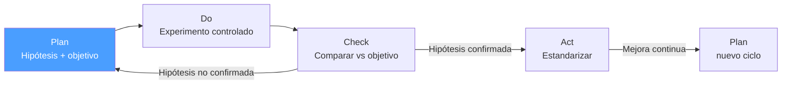

# /pdca-plan — PDCA: Plan

> *"You can't improve what you haven't defined. You can't define without data."*

Ejecuta el paso **Plan** del ciclo PDCA. Produce un plan de mejora con objetivos medibles y una hipótesis verificable.

**THYROX Stage:** Stage 3 DIAGNOSE (primer ciclo, análisis de problema) · Stage 10 IMPLEMENT (ciclos subsiguientes de mejora continua).

---

## Ciclo PDCA — foco en Plan



## Pre-condición

- **Primer ciclo:** work package activo con descripción inicial del problema.
- **Ciclos subsiguientes:** `{wp}/pdca-act.md` del ciclo anterior con lecciones aprendidas y la hipótesis ajustada.

---

## Cuándo usar este paso

- Al iniciar un ciclo PDCA nuevo (primer ciclo o ciclo ajustado tras `pdca:act`)
- Cuando hay un problema recurrente sin causa raíz identificada
- Cuando una métrica de proceso está fuera del objetivo

## Cuándo NO usar este paso

- Si el problema ya está definido y el equipo tiene consenso → ir directo a `pdca:do`
- Si el problema requiere análisis estadístico profundo → considerar DMAIC en su lugar
- Si no hay datos disponibles del proceso → recopilar datos primero, luego planificar
- Si el equipo es de una sola persona sin validación externa → buscar al menos una segunda perspectiva antes de fijar el Problem Statement

---

## Actividades

### 1. Definir el problema — sin asumir causas

Usar la técnica **IS / IS NOT** para delimitar con precisión:

| Dimensión | IS (lo que sí es el problema) | IS NOT (lo que NO es el problema) |
|-----------|-------------------------------|-----------------------------------|
| Qué | ¿Qué está fallando? | ¿Qué no está fallando? |
| Dónde | ¿En qué parte del proceso? | ¿Dónde no ocurre? |
| Cuándo | ¿Desde cuándo? ¿Con qué frecuencia? | ¿Cuándo no ocurre? |
| Magnitud | ¿Cuánto afecta? | ¿Qué no está siendo afectado? |

**Criterio de calidad del Problem Statement:**
- ✅ Describe el síntoma observable con datos: *"El tiempo de respuesta de la API supera 2s en el 30% de requests desde el 2026-03-01"*
- ❌ Asume causa: *"La base de datos está lenta"* — esto es hipótesis, no problema
- ❌ Implica solución: *"Necesitamos escalar los servidores"* — aún no sabemos
- ❌ Sin magnitud: *"La API es lenta"* — no hay baseline

### 2. Analizar la situación actual

Recopilar datos objetivos del estado presente. Mínimo necesario:

| Dato | Propósito |
|------|-----------|
| Métrica actual (con número) | Establece baseline para comparar en Check |
| Frecuencia / volumen del problema | Define magnitud real |
| Tendencia (mejorando / empeorando / estable) | Orienta urgencia |
| Impacto en el cliente / negocio | Justifica el esfuerzo |

> Sin baseline numérico, el paso Check no puede funcionar. Si no tienes datos, la primera acción del Plan es *recopilarlos*.

### 3. Establecer objetivo SMART

| Criterio | Descripción | Ejemplo |
|----------|-------------|---------|
| **S**pecífico | Qué métrica exacta se mueve | Tiempo de respuesta p95 de la API /orders |
| **M**edible | Valor numérico objetivo | De 2.1s a menos de 800ms |
| **A**lcanzable | Realista dado el contexto | Validado con el equipo técnico |
| **R**elevante | Conectado al impacto de negocio | Afecta tasa de conversión en checkout |
| **T**emporal | Fecha límite | Para el 2026-05-01 |

**Objetivo completo:** *"Reducir el tiempo de respuesta p95 del endpoint /orders de 2.1s a menos de 800ms para el 2026-05-01, sin degradar p99."*

### 4. Formular hipótesis de mejora

La hipótesis es la teoría que el Do va a probar. Formato recomendado:

```
Si [acción concreta], entonces [resultado esperado], porque [mecanismo causal].
```

Ejemplo: *"Si agregamos índice compuesto en orders(user_id, created_at), entonces el p95 bajará a < 800ms, porque el query actual hace full table scan sobre 2M registros."*

### 5. Diseñar el plan de mejora

Para cada acción del plan:

| Acción | Responsable | Fecha | Recursos | Criterio de éxito |
|--------|-------------|-------|----------|-------------------|
| Acción 1 | Quién | Cuándo | Qué necesita | Cómo saber que está lista |

Ver guía de construcción de acciones y Gantt mínimo: [action-planning.md](./references/action-planning.md)

---

## Técnicas de apoyo

| Técnica | Usar cuando... |
|---------|---------------|
| **5 Whys** | El síntoma es claro pero la causa no |
| **Fishbone / Ishikawa** | Múltiples causas potenciales; equipo necesita brainstorm estructurado |
| **Pareto 80/20** | Hay muchos defectos/causas; identificar las pocas vitales |
| **IS / IS NOT** | El problema es difuso o el equipo tiene visiones distintas de qué es el problema |
| **5W2H** | Delimitar el contexto completo cuando IS/IS NOT no es suficiente |
| **Diagrama de flujo** | El proceso es complejo o poco conocido por el equipo |

Ver guías paso a paso: [problem-analysis-techniques.md](./references/problem-analysis-techniques.md)

---

## Artefacto esperado

`{wp}/pdca-plan.md` — usar template: [pdca-plan-template.md](./assets/pdca-plan-template.md)

---

## Red Flags

- **"Sabemos cuál es la causa"** sin datos que lo confirmen — es hipótesis, no hecho
- **Objetivo sin número** ("mejorar la velocidad") — no se puede verificar en Check
- **Objetivo sin baseline** — sin punto de partida, no hay referencia para medir mejora
- **Múltiples hipótesis en un solo Plan** — cada ciclo prueba *una* hipótesis
- **Acciones = solución directa** (ej: "escalar servidores") antes de validar la causa raíz
- **Una sola persona define el Problem Statement** sin revisión — el sesgo individual puede distorsionar el IS/IS NOT
- **Copiar el objetivo del ciclo anterior sin ajustar** — si el ciclo anterior no alcanzó el objetivo, el nuevo Plan debe incorporar la lección, no simplemente repetir

### Anti-racionalización — excusas comunes para saltarse la disciplina

| Racionalización | Por qué es trampa | Respuesta correcta |
|----------------|-------------------|--------------------|
| *"Ya sabemos la causa, no necesitamos datos"* | El conocimiento del experto es una hipótesis, no evidencia | Documentar la hipótesis en el IS/IS NOT y validarla con datos en Do |
| *"El objetivo es claro, no hace falta número"* | Sin métrica, el Check no puede verificar si el Plan funcionó | Añadir baseline y target numérico antes de avanzar |
| *"Probamos dos cosas a la vez para ahorrar tiempo"* | Con dos variables, no es posible saber cuál causó el cambio | Un ciclo = una hipótesis; las demás van al backlog |
| *"La solución es obvia, vamos directo a Do"* | Saltar Plan convierte Do en implementación ad hoc sin hipótesis verificable | Completar el Problem Statement e hipótesis aunque sea en 15 minutos |

---

## Estado en now.md

**Al INICIAR este step:**
```yaml
methodology_step: pdca:plan
flow: pdca
```

**Al COMPLETAR** (Plan aprobado, baseline + objetivo SMART + hipótesis definidos):
```yaml
methodology_step: pdca:plan  # completado → listo para pdca:do
flow: pdca
```

## Siguiente paso

Cuando el plan esté definido con baseline + objetivo SMART + hipótesis → `pdca:do`

---

## Limitaciones

- Este skill guía el proceso de planificación; no reemplaza el juicio experto del dominio
- Para problemas con variabilidad estadística compleja, DMAIC ofrece herramientas más robustas
- Si no hay datos históricos disponibles, la primera iteración de Plan puede ser solo *"definir cómo recopilar datos"*

---

## Reference Files

- `assets/pdca-plan-template.md` — Template del artefacto `{wp}/pdca-plan.md` con todas las secciones
- `references/problem-analysis-techniques.md` — Guías paso a paso: 5 Whys, Fishbone 6M/4S, Pareto 80/20, IS/IS NOT, 5W2H
- `references/action-planning.md` — Objetivos SMART con ejemplos, diseño de acciones atómicas, Gantt mínimo, señales de plan débil
