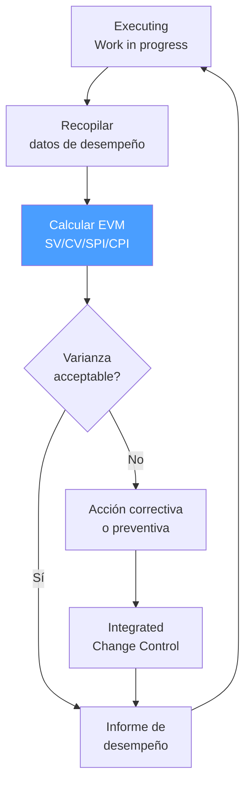

# /pm-monitoring — PMBOK: Monitoring & Controlling

> *"Monitoring without controlling is just watching a car drive off a cliff. The value of performance measurement is not the measurement itself — it's the corrective action it enables before the project goes too far off course."*

Ejecuta el **Grupo de Proceso Monitoring & Controlling** de PMBOK. Mide el rendimiento del proyecto con EVM, gestiona el Control de Cambios Integrado, controla el scope/schedule/cost/quality, e implementa acciones correctivas y preventivas.

**THYROX Stage:** Stage 11 TRACK/EVALUATE (corre en paralelo con Stage 10 IMPLEMENT).

**Outputs clave:** Work Performance Reports · Change Requests · Corrective/Preventive Actions.

---

## Ciclo de Monitoring & Controlling



## Pre-condición

Requiere: `{wp}/pm-planning.md` con:
- Baselines aprobadas: scope baseline, schedule baseline, cost baseline
- EAC inicial calculado para comparar con performance actual

---

## Cuándo usar este paso

- Durante toda la ejecución del proyecto — Monitoring & Controlling corre en paralelo con Executing
- En cada periodo de reporte (semanal, quincenal, mensual)
- Cuando se detecta una varianza significativa respecto a los baselines

## Cuándo NO usar este paso

- Sin baselines aprobadas — sin baseline no hay punto de comparación para medir varianzas
- Sin datos de trabajo completado — EVM sin datos reales es solo proyección

---

## Knowledge Areas activas en Monitoring & Controlling

| Knowledge Area | Proceso de Control |
|---------------|-------------------|
| Integration Management | Monitor and Control Project Work · Perform Integrated Change Control |
| Scope Management | Validate Scope · Control Scope |
| Schedule Management | Control Schedule |
| Cost Management | Control Costs |
| Quality Management | Control Quality |
| Resource Management | Control Resources |
| Communications Management | Monitor Communications |
| Risk Management | Monitor Risks |
| Procurement Management | Control Procurements (si aplica) |
| Stakeholder Management | Monitor Stakeholder Engagement |

---

## Actividades

### 1. Earned Value Management (EVM)

EVM integra scope, schedule y cost en una sola visión de desempeño. Referencia detallada con todas las fórmulas: [references/evm-and-change-control.md](references/evm-and-change-control.md).

**Variables clave:** PV · EV · AC · BAC

**Métricas de varianza:** SV = EV−PV · CV = EV−AC · SPI = EV/PV · CPI = EV/AC
> SPI/CPI = 1.0 perfecto · > 1.0 ahead · < 1.0 behind. Umbral de alerta: < 0.85.

**Métricas de proyección:** EAC = BAC/CPI · ETC = EAC−AC · VAC = BAC−EAC · TCPI = (BAC−EV)/(BAC−AC)
> TCPI > 1.10 → BAC prácticamente inalcanzable; ajustar EAC con el sponsor.

> **ADVERTENCIA:** EVM identifica QUÉ está pasando, no POR QUÉ. El análisis de causas requiere investigación adicional.

### 2. Control Schedule

Además de la perspectiva EVM, controlar el cronograma en términos de actividades y hitos:

| Actividad | Descripción |
|-----------|-------------|
| **Actualizar el cronograma** | Reflejar el progreso real en el cronograma de actividades |
| **Analizar el Critical Path** | Identificar si hay actividades críticas con float negativo |
| **Análisis de compresión** | Si hay retraso: Fast Tracking (actividades en paralelo) o Crashing (agregar recursos) |
| **Forecast to completion** | Proyectar fecha de completion basada en progreso actual |

**Opciones de compresión del cronograma:**

| Técnica | Descripción | Riesgo |
|---------|-------------|--------|
| **Fast Tracking** | Poner actividades en paralelo que estaban en serie | Aumenta el riesgo de retrabajo por dependencias |
| **Crashing** | Agregar recursos al Critical Path para acelerar | Aumenta el costo; rendimientos decrecientes |

### 3. Perform Integrated Change Control

Todo cambio al scope, schedule o cost baseline pasa por el CCB (Change Control Board). Proceso completo y template CR en [references/evm-and-change-control.md](references/evm-and-change-control.md).

**Flujo resumido:** Identificar cambio → Crear Change Request → Evaluar impacto → Presentar al CCB → Decisión (Approve/Reject/Defer) → Implementar si aprobado → Comunicar → Actualizar baselines.

### 4. Control Quality (QC)

Quality Control inspecciona los deliverables para detectar defectos:

| Técnica | Cuándo usar | Output |
|---------|-------------|--------|
| **Inspección** | Todo deliverable antes de entregarlo | Defect log |
| **Testing** | Deliverables de software o sistemas | Test results |
| **Statistical sampling** | Cuando no es viable revisar el 100% (ej: manufactura) | Sample results + inferencia |
| **Checklist verification** | Verificar que todos los criterios de aceptación están cumplidos | Completed checklist |

> **QC detecta defectos; QA previene defectos.** Ambos son necesarios.

### 5. Monitor Risks

En Monitoring & Controlling, el Risk Register se revisa y actualiza periódicamente:

| Actividad | Frecuencia |
|-----------|-----------|
| Revisar estado de riesgos activos | Cada periodo de reporte |
| Verificar si triggers de riesgo se cumplieron | Continuo durante ejecución |
| Identificar nuevos riesgos emergentes | Continuo |
| Actualizar probabilidad/impacto de riesgos existentes | Cuando cambia el contexto |
| Ejecutar planes de respuesta para riesgos materializados | Cuando el riesgo ocurre |

---

## Umbrales de varianza y acciones

| Varianza | Acción requerida |
|---------|-----------------|
| SPI o CPI entre 0.90 y 1.10 | Monitoreo normal — no se requiere acción correctiva urgente |
| SPI o CPI entre 0.85 y 0.90 | Análisis de causa + plan de corrección — reportar al sponsor |
| SPI o CPI < 0.85 | Acción correctiva inmediata + Change Request si impacta baseline + escalación al sponsor |
| TCPI > 1.10 | Revisar EAC con el sponsor — el BAC original puede requerir ajuste formal |

---

## Artefacto esperado

`{wp}/pm-monitoring.md`

usar template: [performance-report-template.md](./assets/performance-report-template.md)

---

## Red Flags — señales de Monitoring mal ejecutado

- **EVM calculado pero sin acciones correctivas** — si el CPI es 0.72 y el PM no reporta ni actúa, el EVM se convierte en un ejercicio de documentación de la crisis, no en una herramienta de control
- **Baselines que se actualizan con cada varianza** — re-baseline cada vez que el proyecto se desvía elimina la capacidad de medir varianza; re-baseline solo se hace con aprobación formal del CCB cuando el proyecto tiene una causa legítima
- **Change Control bypasseado por urgencia** — "no tenemos tiempo para el proceso de change control" es la justificación más común para el scope creep no controlado
- **Riesgos que no se revisan** — el Risk Register de Planning sin actualizaciones durante Executing indica que no se está monitoreando activamente; los riesgos nuevos no se detectan
- **QC solo al final del proyecto** — Quality Control al final es costoso; detectar defectos en el penúltimo sprint antes de la entrega es mucho más caro que detectarlos al terminar cada deliverable

---

## Criterio de completitud

Monitoring & Controlling es **continuo** — no tiene completitud propia sino condiciones de cierre:

| Condición | Acción |
|-----------|--------|
| Todos los deliverables verificados y aceptados por QC | Activar `pm:closing` |
| Varianza crítica (SPI/CPI < 0.85) | Change Request + acción correctiva + continuar Monitoring |
| Todos los contratos cerrados (si aplica) | Iniciar `pm:closing` en paralelo |

---

## Estado en now.md

**Al INICIAR este step:**
```yaml
methodology_step: pm:monitoring
flow: pm
pm_process_group: monitoring_controlling
```

**Activo en paralelo con Executing:**
```yaml
methodology_step: pm:executing+monitoring
flow: pm
pm_process_group: executing+monitoring_controlling
```

**Al COMPLETAR** (todos los deliverables verificados → cierre):
```yaml
methodology_step: pm:monitoring  # completado → activar pm:closing
flow: pm
pm_process_group: monitoring_controlling
```

## Siguiente paso

- Todos los deliverables verificados y aceptados → `pm:closing`
- Varianza crítica detectada → Change Request + acción correctiva + continuar Monitoring

---

## Limitaciones

- EVM requiere que el proyecto tenga un presupuesto y cronograma baseline aprobado con suficiente granularidad para calcular % completado por actividad — sin esta granularidad, el EV es estimado y el EVM pierde precisión
- EVM en proyectos ágiles requiere adaptación: el "% completado" se mide por story points o features completados, no por horas; las métricas SPI/CPI aplican con la misma interpretación
- Las varianzas de schedule en EVM están en unidades monetarias ($), no en días — una varianza de schedule en $ no dice cuántos días está retrasado el proyecto; para eso se necesita el Schedule Network Analysis (Critical Path)

---

## Reference Files

### Assets
- [performance-report-template.md](./assets/performance-report-template.md) — Template de reporte de performance: EVM completo (BAC/PV/EV/AC/SV/CV/SPI/CPI/EAC/ETC/VAC/TCPI), schedule control, QC, risk updates, RAG status

### References
- [evm-and-change-control.md](./references/evm-and-change-control.md) — Fórmulas EVM, interpretación de índices, umbrales de alerta, proceso de Change Control integrado
