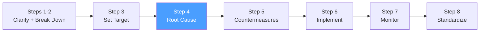

# /pps-analyze — PS8: Analyze Root Cause

> *"Do not be satisfied with just removing the symptom — always ask why the problem occurred and pursue the true root cause."*
> — Toyota Way principle

Ejecuta el **Step 4 del Toyota Business Practices (TBP)**: análisis profundo de causa raíz con 5 Whys y Diagrama Fishbone (Ishikawa), confirmado con datos. Inicia el A3 Report. Produce el Root Cause Analysis Worksheet.

**THYROX Stage:** Stage 3 DIAGNOSE.

**Tollgate:** Causa raíz identificada, confirmada con datos, y registrada en el A3 Report antes de avanzar a pps:countermeasures.

---

## Ciclo PS8 — foco en Step 4



## Pre-condición

- pps:target completado: Target Sheet con baseline y meta SMART aprobada.
- Datos del Gemba disponibles (observaciones, logs, métricas del problema).
- Equipo con conocimiento del proceso involucrado en el análisis.

---

## Cuándo usar este paso

- Siempre — no pasar a pps:countermeasures sin causa raíz confirmada con datos
- Cuando el equipo tiene hipótesis sobre las causas — usar este paso para confirmarlas o refutarlas con evidencia
- Cuando el problema es recurrente y las soluciones anteriores no funcionaron (posible causa raíz no identificada antes)

## Cuándo NO usar este paso

- Si la causa raíz ya es conocida y confirmada con datos → ir directamente a pps:countermeasures
- Para problemas donde no hay acceso a datos — instrumentar primero (retornar a pps:clarify)

---

## Herramientas de análisis

### Herramienta 1: 5 Whys — drill-down secuencial

Los 5 Whys es la técnica central de Toyota para llegar a la causa raíz mediante preguntas iterativas de "¿por qué?":

**Cómo ejecutar los 5 Whys:**

1. **Comenzar con el síntoma** — el Problem Statement de pps:clarify
2. **Preguntar "¿Por qué?" sobre el síntoma** — buscar la causa inmediata con evidencia
3. **Preguntar "¿Por qué?" sobre esa causa** — no la causa del síntoma, sino la causa de la causa
4. **Repetir hasta 5 niveles** — el número exacto varía; detenerse cuando se llega a un factor sistémico accionable
5. **Validar cada "por qué" con datos** — no aceptar suposiciones; cada eslabón debe tener evidencia

| Nivel | Pregunta | Respuesta | Evidencia |
|-------|----------|-----------|-----------|
| **Síntoma** | ¿Qué está pasando? | [Problem Statement] | [datos de pps:clarify] |
| **Why 1** | ¿Por qué [síntoma]? | [causa inmediata] | [dato/observación] |
| **Why 2** | ¿Por qué [causa 1]? | [causa intermedia] | [dato/observación] |
| **Why 3** | ¿Por qué [causa 2]? | [causa más profunda] | [dato/observación] |
| **Why 4** | ¿Por qué [causa 3]? | [causa sistémica] | [dato/observación] |
| **Why 5** | ¿Por qué [causa 4]? | **[causa raíz]** | [dato/observación] |

**Señales de que se llegó a la causa raíz:**
- La respuesta es un factor sistémico (proceso, estándar, capacitación, diseño) — no una persona
- Corregir esta causa evitaría que el problema ocurra de nuevo
- El equipo no puede preguntar "¿por qué?" sin salir del alcance del proyecto

**Señales de que hay más para explorar:**
- La respuesta sigue siendo un síntoma ("porque falla el sistema")
- La respuesta asume una causa sin datos ("porque el equipo no sigue el proceso")
- La respuesta menciona a una persona específica como culpable

Ver template: [five-whys-template.md](./assets/five-whys-template.md)

### Herramienta 2: Fishbone (Ishikawa) — análisis multidimensional

El Diagrama de Causa y Efecto organiza las causas potenciales en categorías estructuradas. Útil cuando hay múltiples hipótesis y se necesita exploración sistemática:

**Las 6M — categorías estándar (versión manufactura/ingeniería):**

| Categoría | Qué incluye | Preguntas guía |
|-----------|-------------|---------------|
| **Manpower** (Personas) | Habilidades, capacitación, motivación, comportamiento | ¿El equipo tiene el conocimiento necesario? ¿Hay variación por persona? |
| **Methods** (Métodos) | Procesos, procedimientos, estándares, instrucciones | ¿El proceso está documentado? ¿Se sigue consistentemente? |
| **Machines** (Máquinas) | Equipos, herramientas, software, infraestructura | ¿Las herramientas funcionan correctamente? ¿Hay fallas de equipamiento? |
| **Materials** (Materiales) | Insumos, datos de entrada, dependencias | ¿Los inputs al proceso tienen la calidad requerida? |
| **Measurements** (Mediciones) | Cómo se mide, calibración, métricas | ¿Las mediciones son precisas y consistentes? ¿Hay sesgo de medición? |
| **Mother Nature** (Entorno) | Condiciones ambientales, contexto externo | ¿El entorno (carga del sistema, temporada, regulaciones) influye? |

**Alternativa 4P — categorías para servicios/software:**

| Categoría | Qué incluye |
|-----------|-------------|
| **People** | Habilidades, capacitación, cultura, comunicación |
| **Processes** | Flujos de trabajo, estándares, procedimientos |
| **Policies** | Reglas, restricciones, gobernanza |
| **Plant/Technology** | Sistemas, infraestructura, herramientas |

**Cómo construir el Fishbone:**
1. Dibujar la "espina" con el problema (efecto) a la derecha
2. Agregar las ramas principales (6M o 4P)
3. Brainstorming de causas potenciales por categoría — sin filtrar todavía
4. Para cada causa potencial, aplicar mini-5 Whys para profundizar
5. Identificar las causas más probables y marcarlas para verificación con datos

Ver template: [fishbone-template.md](./assets/fishbone-template.md)

### Herramienta 3: Confirmación de causa raíz con datos

**No declarar causa raíz sin confirmación:**

| Método de confirmación | Cuándo usar | Cómo aplicar |
|-----------------------|-------------|--------------|
| **Datos históricos** | Hay registros del problema en el tiempo | Correlacionar la causa hipotética con los eventos del problema |
| **Experimento controlado** | Se puede manipular la variable sospechada | Reproducir o eliminar el problema cambiando solo esa variable |
| **Observación directa (Gemba)** | El proceso es observable | Ver directamente si la causa ocurre cuando el problema aparece |
| **Análisis de Pareto** | Hay múltiples causas candidatas | Cuantificar frecuencia de cada causa; el 20% de causas suele explicar el 80% de los efectos |

> Regla TBP: una hipótesis de causa raíz sin datos confirmatorios es solo una opinión. No desarrollar contramedidas sobre opiniones.

---

## Actividades

### 1. Mapear causas potenciales — Fishbone

Ejecutar el análisis Fishbone con el equipo. Generar hipótesis por categoría, sin filtrar en esta etapa.

### 2. Explorar cada causa — 5 Whys

Para cada causa potencial significativa del Fishbone, ejecutar un hilo de 5 Whys para llegar al nivel sistémico.

### 3. Verificar con datos — confirmación

Priorizar las causas más probables y confirmar (o descartar) con evidencia observable o datos históricos.

### 4. Documentar causa raíz confirmada

| Elemento | Detalle |
|----------|---------|
| **Causa raíz identificada** | Descripción clara del factor sistémico |
| **Evidencia de confirmación** | Dato, observación o experimento que lo confirma |
| **Cadena causal** | Síntoma → Why 1 → Why 2 → ... → Causa raíz |
| **Causas descartadas** | Hipótesis que fueron refutadas y por qué |

### 5. Iniciar el A3 Report

El A3 es el artefacto central del proyecto TBP. Comenzar a completar las secciones 1-4:

Ver template: [a3-report-template.md](./assets/a3-report-template.md)

| Sección del A3 | Qué incluir en este paso |
|----------------|--------------------------|
| **1. Background** | Contexto del problema, quién lo reportó, período |
| **2. Current Condition** | Datos del Gemba, baseline, visualización del problema |
| **3. Goal / Target** | Target Sheet de pps:target |
| **4. Root Cause Analysis** | Fishbone + 5 Whys + confirmación con datos |

---

## Artefacto esperado

`{wp}/pps-analyze.md` — Root Cause Analysis Worksheet con Fishbone, 5 Whys y causa raíz confirmada.
`{wp}/a3-report.md` — A3 Report con secciones 1-4 completadas (continúa en pps:countermeasures e pps:implement).

---

## Red Flags — señales de análisis de causa raíz mal ejecutado

- **Causa raíz que es una persona** — TBP busca causas sistémicas, no individuos culpables
- **"¿Por qué?" respondido con suposiciones** — cada eslabón necesita evidencia, no intuición
- **Detenerse en la causa síntoma** — "el sistema falla" no es causa raíz; ¿por qué falla el sistema?
- **Análisis solo en sala de juntas** — sin Gemba, los 5 Whys son ejercicio teórico
- **Causa raíz no confirmada con datos** — hipótesis sin validación lleva a contramedidas inefectivas
- **Un solo hilo de 5 Whys** — los problemas reales suelen tener múltiples causas raíz; el Fishbone ayuda a no perderlas
- **Saltar a soluciones durante el análisis** — el análisis debe completarse antes de proponer contramedidas

### Anti-racionalizaciones comunes

| Racionalización | Por qué es trampa | Respuesta correcta |
|----------------|-------------------|--------------------|
| *"Ya sabemos la causa raíz, no necesitamos el análisis formal"* | Lo que "sabemos" puede ser la causa síntoma — el análisis formal revela causas más profundas | Ejecutar mínimo 3 niveles de 5 Whys aunque la causa "parezca obvia" |
| *"No tenemos tiempo para Fishbone — hagamos lluvia de ideas directamente"* | La lluvia de ideas sin estructura deja puntos ciegos; el Fishbone asegura cobertura sistemática | 30 minutos de Fishbone estructurado es más eficiente que horas de debate no estructurado |
| *"Confirmamos la causa con la opinión del experto"* | Los expertos también tienen sesgos y puntos ciegos — la confirmación requiere datos, no autoridad | Buscar dato o experimento que confirme o refute la hipótesis del experto |

---

## Estado en now.md

**Al INICIAR este step:**
```yaml
methodology_step: pps:analyze
flow: pps
```

**Al COMPLETAR** (causa raíz confirmada con datos, A3 secciones 1-4 completadas):
```yaml
methodology_step: pps:analyze  # completado → listo para pps:countermeasures
flow: pps
```

## Siguiente paso

Cuando la causa raíz está confirmada con datos y registrada en el A3 → `pps:countermeasures`

---

## Limitaciones

- Los 5 Whys pueden bifurcarse — un problema puede tener más de una cadena causal; documentar todas las ramas relevantes
- En problemas complejos, pueden necesitarse más de 5 iteraciones; el número "5" es orientativo, no un límite rígido
- El Fishbone requiere participación de personas con conocimiento real del proceso — si el equipo no conoce el proceso, la técnica produce listas de hipótesis sin valor
- Si la causa raíz identificada está fuera del alcance del proyecto, documentarlo y escalar antes de continuar

---

## Reference Files

### Assets
- [five-whys-template.md](./assets/five-whys-template.md) — Template de 5 Whys con tabla de cadena causal, columna de evidencia y señales de causa raíz alcanzada
- [fishbone-template.md](./assets/fishbone-template.md) — Template de Diagrama Fishbone con categorías 6M y 4P, instrucciones de uso y guía de priorización
- [a3-report-template.md](./assets/a3-report-template.md) — Template completo del A3 Report (central para todo el ciclo PS8): 7 secciones desde Background hasta Standardization

### References
- [five-whys-reference.md](./references/five-whys-reference.md) — Referencia completa de la técnica 5 Whys: origen, proceso, pitfalls y cuándo combinar con otras técnicas
- [root-cause-analysis-guide.md](./references/root-cause-analysis-guide.md) — Guía de Root Cause Analysis: pasos, técnicas de confirmación, análisis de Pareto y métodos de recolección de evidencia
- [fishbone-ishikawa-guide.md](./references/fishbone-ishikawa-guide.md) — Guía del Diagrama Fishbone/Ishikawa: historia, categorías 6M vs 4P, proceso de construcción y uso en TBP
