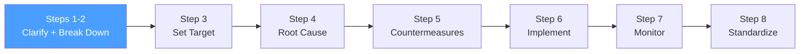

# /pps-clarify — PS8: Clarify + Break Down the Problem

> *"Before you can solve a problem, you must truly see it — not from a desk, but from where the work actually happens."*
> — Toyota TBP philosophy (Go-and-See / Gemba)

Ejecuta los **Steps 1 y 2 del Toyota Business Practices (TBP)**: clarificar el problema real y descomponerlo en sub-problemas priorizables. Produce la Hoja de Clarificación del Problema.

**THYROX Stage:** Stage 1 DISCOVER.

**Tollgate:** Problema clarificado con brecha cuantificada, sub-problemas identificados y punto de priorización elegido antes de avanzar a pps:target.

---

## Ciclo PS8 — foco en Steps 1-2



## Pre-condición

- Work package activo con descripción inicial del problema.
- Sponsor o dueño del proceso identificado.
- Acceso al lugar donde ocurre el problema (Gemba) — físico o equivalente digital.

---

## Cuándo usar este paso

- Al iniciar un proyecto de resolución de problemas estructurado con TBP/Toyota
- Cuando un problema recurrente necesita análisis más profundo que un ciclo PDCA simple
- Cuando la naturaleza exacta del problema no está clara y hay riesgo de resolver el síntoma equivocado
- Para problemas con impacto medible en calidad, costo, entrega o seguridad

## Cuándo NO usar este paso

- Problemas triviales o ya bien entendidos — aplicar directamente una contramedida conocida
- Cuando ya existe causa raíz confirmada → saltar a pps:countermeasures
- Sin acceso al Gemba ni a datos reales — pps sin Go-and-See es solo teoría de escritorio

---

## Filosofía Go-and-See (Gemba)

**Gemba** significa "el lugar real" en japonés — donde el trabajo realmente ocurre. Es el principio fundacional de TBP:

| Principio | Qué significa | Cómo aplicarlo |
|-----------|---------------|----------------|
| **Gemba** | Ve al lugar real | Observa el proceso donde ocurre el problema, no en salas de juntas |
| **Genbutsu** | Observa el objeto real | Examina el output defectuoso, el dato real, el artefacto fallido |
| **Genjitsu** | Entiende los hechos reales | No suposiciones — datos reales, evidencia observable |

> Sin Go-and-See, el "problema" que defines en papel puede no ser el problema real que enfrenta el equipo.

---

## Actividades

### 1. Go-and-See — observar el problema en su contexto real

Antes de cualquier análisis, ir al Gemba:

| Tarea | Cómo |
|-------|------|
| Observar el proceso directamente | Ir donde sucede el trabajo — no confiar solo en reportes |
| Documentar lo observado con datos | Fotos, notas, métricas en el momento — no recuerdos después |
| Hablar con quienes hacen el trabajo | Preguntas abiertas: "¿Qué dificulta su trabajo?", "¿Cuándo falla esto?" |
| Identificar el punto exacto donde aparece el problema | ¿En qué paso del proceso? ¿Con qué frecuencia? ¿Bajo qué condiciones? |

### 2. Definir el estado ideal vs estado actual

El núcleo de la clarificación TBP: la brecha entre lo que debería ser y lo que es.

| Dimensión | Estado Ideal (should be) | Estado Actual (as is) | Brecha |
|-----------|--------------------------|----------------------|--------|
| **Calidad** | [estándar esperado] | [valor medido] | [diferencia] |
| **Tiempo/Velocidad** | [estándar esperado] | [valor medido] | [diferencia] |
| **Costo** | [estándar esperado] | [valor medido] | [diferencia] |
| **Seguridad/Riesgo** | [estándar esperado] | [valor medido] | [diferencia] |

> El estado ideal no es una aspiración vaga — es el estándar definido (SLA, especificación, requisito). Sin estándar, no hay brecha medible.

### 3. Problem Statement — síntoma observable con datos

El Problem Statement describe lo que se puede observar y medir:

| ✅ Buen Problem Statement | ❌ Mal Problem Statement |
|--------------------------|------------------------|
| *"El 23% de los deploys a producción fallan en la etapa de health check (datos: últimas 8 semanas), causando ~4h de rollback manual por incidente"* | *"El proceso de deployment es malo"* |
| Tiene porcentaje y período | Sin magnitud cuantitativa |
| Identifica el síntoma exacto | Vago y subjetivo |
| No asume causa | *"El pipeline CI/CD está mal configurado"* — asume causa |
| Tiene impacto medible | Sin consecuencia observable |

> Regla TBP: si el Problem Statement menciona una causa o una solución, está mal — reescribir.

### 4. Clarificar impacto y afectados

| Dimensión | Detalle |
|-----------|---------|
| **¿Quién está afectado?** | Clientes, usuarios, equipos, procesos downstream |
| **¿Cuál es el impacto medible?** | Costo, tiempo perdido, defectos, riesgo |
| **¿Con qué frecuencia ocurre?** | Eventos/semana, % de ocurrencia, tendencia |
| **¿Desde cuándo ocurre?** | Inicio del problema, si hubo evento disparador |
| **¿Cuál es la urgencia?** | ¿Qué pasa si no se resuelve en 30/60/90 días? |

### 5. Descomponer el problema (Step 2)

Un problema grande y vago se hace resoluble al descomponerlo en sub-problemas específicos:

**Técnicas de descomposición:**

| Técnica | Cuándo usar | Cómo aplicar |
|---------|-------------|--------------|
| **Por proceso** | El problema ocurre en múltiples etapas | Mapear el proceso y localizar en qué etapa aparece cada sub-problema |
| **Por producto/servicio** | El problema varía según el tipo de output | Segmentar por tipo y analizar diferencias |
| **Por tiempo** | El problema varía según cuándo ocurre | Analizar por turno, día, período del mes |
| **Por lugar/área** | El problema varía geográficamente | Comparar entre ubicaciones, equipos, sistemas |
| **Por persona/equipo** | El problema varía según quién lo ejecuta | Analizar diferencias de desempeño — sin culpar, buscando causas sistémicas |

**Tabla de descomposición:**

| # | Sub-problema | Frecuencia | Impacto | Datos que lo soportan |
|---|-------------|-----------|---------|----------------------|
| 1 | [descripción específica] | [veces/período] | [alto/medio/bajo] | [fuente] |
| 2 | [descripción específica] | [veces/período] | [alto/medio/bajo] | [fuente] |

### 6. Priorizar: elegir el punto de priorización

No todos los sub-problemas merecen el mismo esfuerzo. Elegir el punto de enfoque:

| Criterio | Pregunta | Puntaje (1-5) |
|----------|----------|--------------|
| **Impacto** | ¿Cuánto mejora si se resuelve este sub-problema? | |
| **Frecuencia** | ¿Con qué frecuencia ocurre? | |
| **Resolubilidad** | ¿Es tratable con los recursos disponibles? | |
| **Urgencia** | ¿Hay consecuencias inmediatas si no se atiende? | |

> Regla TBP: atacar el sub-problema con mayor impacto primero. Evitar la tentación de empezar por lo más fácil.

### 7. Hoja de Clarificación del Problema — completar

Completar el template: [problem-clarification-template.md](./assets/problem-clarification-template.md)

---

## Artefacto esperado

`{wp}/pps-clarify.md` — Hoja de Clarificación con estado ideal vs actual, brecha cuantificada, impacto, descomposición y sub-problema priorizado.

---

## Red Flags — señales de clarificación mal ejecutada

- **Problema definido sin salir del escritorio** — si nadie fue al Gemba, la clarificación es teoría
- **Estado ideal vago** — "mejor rendimiento" no es un estándar; necesita número
- **Problem Statement que asume causa** — *"el equipo no sigue el proceso"* mezcla síntoma con causa
- **Sub-problemas no descompuestos** — atacar un problema grande sin descomponer lleva a soluciones superficiales
- **Un solo punto de vista** — si solo habló el manager y no quienes hacen el trabajo, la imagen está incompleta
- **Impacto sin datos** — *"es un problema importante"* sin cuantificar no justifica un proyecto TBP completo
- **Urgencia inventada** — presionar artificialmente la urgencia sesga el análisis de priorización

### Anti-racionalizaciones comunes

| Racionalización | Por qué es trampa | Respuesta correcta |
|----------------|-------------------|--------------------|
| *"Ya sabemos cuál es el problema"* | Lo que "sabemos" puede ser el síntoma o la causa asumida, no el problema real | Verificar con datos del Gemba antes de declarar el problema entendido |
| *"No tenemos tiempo para ir a observar"* | Sin Gemba, hay alta probabilidad de resolver el problema equivocado | 30 minutos de observación directa evitan semanas de análisis incorrecto |
| *"El sub-problema más fácil es mejor para ganar momentum"* | El sub-problema más fácil raramente es el de mayor impacto | Priorizar por impacto + datos, no por comodidad |

---

## Estado en now.md

**Al INICIAR este step:**
```yaml
methodology_step: pps:clarify
flow: pps
```

**Al COMPLETAR** (Hoja de Clarificación aprobada con sub-problema priorizado):
```yaml
methodology_step: pps:clarify  # completado → listo para pps:target
flow: pps
```

## Siguiente paso

Cuando la Hoja de Clarificación está completa y el sub-problema está priorizado → `pps:target`

---

## Limitaciones

- Go-and-See es más efectivo con observación directa; en contextos digitales, equivale a revisar logs, dashboards y hablar con usuarios reales
- La descomposición requiere datos reales — si no hay datos, el primer paso es instrumentar el proceso para recopilarlos
- La priorización puede cambiar si aparece nueva información durante el análisis de causa raíz (pps:analyze) — está permitido regresar a re-priorizar

---

## Reference Files

### Assets
- [problem-clarification-template.md](./assets/problem-clarification-template.md) — Template de la Hoja de Clarificación del Problema con secciones: estado ideal vs actual, brecha, impacto, descomposición y priorización

### References
- [gemba-guide.md](./references/gemba-guide.md) — Guía de Go-and-See: principios Gemba/Genbutsu/Genjitsu, protocolo de observación, preguntas clave y errores comunes
