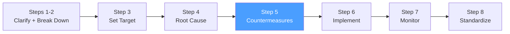

# /pps-countermeasures — PS8: Develop Countermeasures

> *"A countermeasure is not a solution. A solution implies permanence. A countermeasure is the best response we can take given our current understanding — we continue to observe."*
> — Toyota TBP philosophy

Ejecuta el **Step 5 del Toyota Business Practices (TBP)**: generar contramedidas específicas por causa raíz, evaluarlas con la matriz de factibilidad/impacto, priorizarlas y crear el Action Plan. Completa las secciones 5 del A3 Report.

**THYROX Stage:** Stage 5 STRATEGY.

**Tollgate:** Contramedidas priorizadas con responsable y deadline definidos, Action Plan aprobado, A3 sección 5 completada antes de avanzar a pps:implement.

---

## Ciclo PS8 — foco en Step 5



## Pre-condición

- pps:analyze completado: causa raíz identificada y confirmada con datos.
- A3 Report con secciones 1-4 completadas.
- Equipo con autoridad para proponer y validar contramedidas.

---

## Cuándo usar este paso

- Siempre, después de confirmar la causa raíz — no antes
- Cuando hay múltiples causas raíz identificadas que requieren contramedidas distintas
- Para asegurar que cada contramedida ataca una causa raíz específica, no solo el síntoma

## Cuándo NO usar este paso

- Sin causa raíz confirmada — desarrollar contramedidas sobre hipótesis es desperdicio
- Si la contramedida es trivialmente obvia y ya acordada → documentarla directamente en el Action Plan y avanzar a pps:implement

---

## Diferencia clave: Contramedida vs Solución

En TBP se usa el término **contramedida** (countermeasure) deliberadamente, no "solución":

| Contramedida (TBP) | Solución convencional |
|--------------------|----------------------|
| Responde a una causa raíz específica | Puede responder al síntoma |
| Se evalúa y confirma con datos post-implementación | Se asume efectiva |
| Puede ajustarse si no funciona | Se declara "cerrado" |
| Refleja humildad epistémica — podemos estar equivocados | Asume certeza |
| Traza directamente desde la causa raíz | Traza desde el síntoma o intuición |

---

## Actividades

### 1. Generar contramedidas por causa raíz

Para cada causa raíz identificada en pps:analyze, generar múltiples opciones de contramedida:

| Causa Raíz | Contramedida Propuesta | Tipo | Nivel de intervención |
|------------|----------------------|------|----------------------|
| [causa raíz 1] | [opción A] | Preventiva / Correctiva | Proceso / Sistema / Persona |
| [causa raíz 1] | [opción B] | Preventiva / Correctiva | Proceso / Sistema / Persona |
| [causa raíz 2] | [opción C] | Preventiva / Correctiva | Proceso / Sistema / Persona |

**Tipos de contramedidas:**

| Tipo | Cuándo usar | Ejemplo |
|------|-------------|---------|
| **Preventiva** | Elimina la causa para que el problema no ocurra | Agregar validación automática antes de que el defecto se produzca |
| **Correctiva** | Responde al efecto cuando ya ocurrió | Protocolo de rollback estandarizado cuando el deploy falla |
| **Detectiva** | Identifica el problema más rápido para reducir impacto | Alertas automáticas cuando el indicador cruza un umbral |

**Niveles de intervención (de más a menos robusto):**

| Nivel | Descripción | Robustez |
|-------|-------------|----------|
| **Eliminación** | Remover la causa del proceso completamente | ★★★★★ |
| **Sustitución** | Reemplazar el elemento problemático por uno más confiable | ★★★★ |
| **Control de ingeniería** | Diseño que hace imposible el error (poka-yoke) | ★★★★ |
| **Control administrativo** | Procedimientos, estándares, capacitación | ★★★ |
| **Señalización** | Alertas, recordatorios, indicadores visuales | ★★ |

> Preferir contramedidas de nivel alto (eliminación / control de ingeniería) sobre los de nivel bajo (señalización / recordatorio). Las contramedidas de nivel bajo son frágiles y dependen de comportamiento humano consistente.

### 2. Evaluar contramedidas — Matriz de factibilidad/impacto

Para cada contramedida propuesta, evaluar con puntaje 1-5:

| Contramedida | Impacto esperado | Factibilidad | Velocidad | Costo | Puntaje total |
|-------------|-----------------|-------------|-----------|-------|--------------|
| [opción A] | 1-5 | 1-5 | 1-5 | 1-5 | suma |
| [opción B] | 1-5 | 1-5 | 1-5 | 1-5 | suma |
| [opción C] | 1-5 | 1-5 | 1-5 | 1-5 | suma |

**Criterios de evaluación:**

| Criterio | Escala 1-5 |
|----------|-----------|
| **Impacto esperado** | 1 = marginal, 5 = cierra completamente la brecha con el target |
| **Factibilidad** | 1 = requiere recursos fuera del alcance, 5 = completamente en control del equipo |
| **Velocidad** | 1 = meses, 5 = implementable esta semana |
| **Costo** | 1 = muy costoso, 5 = prácticamente sin costo |

### 3. Priorizar — elegir contramedidas a implementar

Seleccionar las contramedidas con mayor puntaje total, considerando:

- **Cobertura**: ¿Las contramedidas seleccionadas cubren todas las causas raíz identificadas?
- **Dependencias**: ¿Hay contramedidas que deben implementarse antes de otras?
- **Balance**: Combinar contramedidas de impacto inmediato (quick wins) con mejoras sistémicas de mayor plazo

### 4. Crear el Action Plan

Para cada contramedida seleccionada, definir:

| # | Causa Raíz | Contramedida | Responsable | Deadline | Métrica de verificación | Estado |
|---|-----------|-------------|-------------|----------|------------------------|--------|
| 1 | [causa raíz] | [descripción específica] | [nombre] | [fecha] | [cómo verificar que funciona] | Pendiente |
| 2 | [causa raíz] | [descripción específica] | [nombre] | [fecha] | [cómo verificar que funciona] | Pendiente |

**Reglas del Action Plan:**
- Una contramedida = un responsable (no "el equipo")
- Deadline específico (fecha, no "pronto")
- Métrica de verificación que conecte con el target de pps:target
- Secuencia clara cuando hay dependencias

Ver template: [countermeasures-matrix-template.md](./assets/countermeasures-matrix-template.md)

### 5. Completar A3 sección 5 — Countermeasures

Agregar al A3 Report la sección de contramedidas:
- Tabla de contramedidas por causa raíz
- Action Plan con responsables y deadlines
- Justificación de por qué se seleccionaron estas contramedidas sobre otras opciones

Ver: [a3-report-template.md](../pps-analyze/assets/a3-report-template.md)

---

## Artefacto esperado

`{wp}/pps-countermeasures.md` — Matriz de contramedidas con evaluación de factibilidad/impacto + Action Plan.
`{wp}/a3-report.md` — A3 Report actualizado con sección 5 completada.

---

## Red Flags — señales de contramedidas mal desarrolladas

- **Contramedida que no conecta con una causa raíz** — si no hay trazabilidad causa raíz → contramedida, la contramedida ataca el síntoma
- **Una sola contramedida propuesta** — sin alternativas, no hay evaluación real; puede ser la primera que se ocurrió, no la mejor
- **Responsable "el equipo"** — difuso, sin accountability; cada tarea necesita una persona responsable
- **Sin métrica de verificación** — no hay forma de saber si la contramedida funcionó
- **Solo contramedidas de nivel bajo** — si todas son "capacitar al equipo" o "agregar un recordatorio", el sistema seguirá fallando
- **Contramedidas que no cubren todas las causas raíz** — si hay 3 causas raíz y solo 1 contramedida, 2 causas quedan sin atender
- **Action Plan sin secuencia cuando hay dependencias** — implementar en orden incorrecto puede invalidar resultados

### Anti-racionalizaciones comunes

| Racionalización | Por qué es trampa | Respuesta correcta |
|----------------|-------------------|--------------------|
| *"Ya sabemos qué hacer — no necesitamos evaluar opciones"* | La contramedida "obvia" puede no ser la más efectiva; la evaluación formal expone alternativas mejores | Generar mínimo 2-3 opciones por causa raíz antes de seleccionar |
| *"Ponemos al equipo como responsable para que todos se sientan dueños"* | La responsabilidad colectiva es responsabilidad de nadie; cuando algo falla, no hay quien responda | Asignar una persona específica por contramedida; el equipo colabora pero hay un dueño |
| *"Las contramedidas de proceso son suficientes — no necesitamos cambios técnicos"* | Las contramedidas administrativas dependen de comportamiento humano consistente; son frágiles | Evaluar si existe una contramedida de nivel técnico (poka-yoke) más robusta |

---

## Estado en now.md

**Al INICIAR este step:**
```yaml
methodology_step: pps:countermeasures
flow: pps
```

**Al COMPLETAR** (Action Plan aprobado, A3 sección 5 completada):
```yaml
methodology_step: pps:countermeasures  # completado → listo para pps:implement
flow: pps
```

## Siguiente paso

Cuando el Action Plan está aprobado con responsables y deadlines → `pps:implement`

---

## Limitaciones

- Las contramedidas seleccionadas son hipótesis de mejora — se confirmarán o ajustarán en pps:evaluate basado en datos reales
- Si durante la implementación se descubre que una contramedida no funciona, regresar a esta etapa para revisar la causa raíz o proponer alternativas
- El Action Plan puede necesitar priorización dura si los recursos son limitados — documentar qué causas raíz quedan sin atender y por qué (deuda técnica de proceso)

---

## Reference Files

### Assets
- [countermeasures-matrix-template.md](./assets/countermeasures-matrix-template.md) — Template de la Matriz de Contramedidas con evaluación de factibilidad/impacto, Action Plan con responsables y deadlines

### References
- [countermeasures-guide.md](./references/countermeasures-guide.md) — Guía de desarrollo de contramedidas TBP: tipos, niveles de intervención, matriz de evaluación y principio poka-yoke
