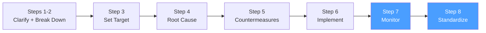

# /pps-evaluate — PS8: Monitor Results + Standardize

> *"Confirming the effect is not the end — it is the beginning of understanding whether your countermeasure was truly effective, and sharing that learning so others don't face the same problem."*
> — Toyota TBP principle

Ejecuta los **Steps 7 y 8 del Toyota Business Practices (TBP)**: confirmar si los resultados mejoraron hasta alcanzar el target, estandarizar las contramedidas exitosas en el proceso permanente y compartir aprendizajes. Cierra el A3 Report.

**THYROX Stage:** Stage 11 TRACK/EVALUATE.

**Tollgate:** Efecto confirmado con datos vs baseline y target, contramedidas exitosas estandarizadas en el proceso, A3 Report completo y cerrado.

---

## Ciclo PS8 — foco en Steps 7-8



## Pre-condición

- pps:implement completado: todas las contramedidas ejecutadas, Implementation Log actualizado.
- A3 Report con secciones 1-6 preliminarmente completadas.
- Datos de medición durante la implementación disponibles.
- Período de medición post-implementación definido en pps:target transcurrido.

---

## Cuándo usar este paso

- Cuando el período de medición definido en pps:target ha transcurrido después de completar la implementación
- Para confirmar formalmente si las contramedidas alcanzaron el target o si es necesario un nuevo ciclo
- Para capturar el aprendizaje y evitar que el mismo problema regrese

## Cuándo NO usar este paso

- Si el período de medición no ha transcurrido — declarar éxito prematuro con datos insuficientes invalida el proyecto
- Si las contramedidas no se implementaron completamente → completar pps:implement primero

---

## Step 7: Monitor Results — confirmar el efecto

### 1. Recopilar datos post-implementación

Reunir los datos del período de medición completo según lo definido en pps:target:

| Métrica | Baseline (pps:target) | Target (pps:target) | Resultado real | Período medición |
|---------|----------------------|---------------------|----------------|-----------------|
| [métrica principal] | [valor] | [valor meta] | [valor actual] | [fechas] |
| [métrica secundaria 1] | [umbral] | ≥ [umbral] | [valor actual] | [fechas] |
| [métrica secundaria 2] | [umbral] | ≥ [umbral] | [valor actual] | [fechas] |

### 2. Análisis de efecto — ¿se alcanzó el target?

| Escenario | Qué significa | Próximo paso |
|-----------|---------------|-------------|
| **Target alcanzado completamente** | Las contramedidas funcionaron según lo esperado | Estandarizar y cerrar |
| **Mejora parcial (50-80% del target)** | Las contramedidas tuvieron efecto pero la causa raíz puede ser más profunda | Documentar mejora lograda, iniciar nuevo ciclo PS8 para la brecha restante |
| **Sin mejora significativa** | Las contramedidas no atacaron la causa raíz real | Regresar a pps:analyze con nueva información |
| **Regresión** | El problema empeoró después de la implementación | Regresar a pps:analyze urgente — posible efecto secundario no anticipado |

### 3. Análisis de variabilidad — ¿es sostenible?

Una mejora puntual no es suficiente — verificar sostenibilidad:

| Período | Valor de la métrica | Observaciones |
|---------|---------------------|---------------|
| Semana 1 post-impl | [valor] | |
| Semana 2 post-impl | [valor] | |
| Semana 3 post-impl | [valor] | |
| Semana 4 post-impl | [valor] | |

> Si hay alta variabilidad semana a semana, el proceso aún no está estabilizado. La estandarización debe incluir mecanismos de control para sostener la mejora.

### 4. Evaluación de efectos secundarios

Verificar que las métricas secundarias no se degradaron:

| Métrica secundaria | Umbral (pps:target) | Resultado | ¿Dentro de umbral? |
|--------------------|---------------------|-----------|-------------------|
| [métrica 2] | ≥ [valor] | [valor real] | ✅ / ❌ |
| [métrica 3] | ≥ [valor] | [valor real] | ✅ / ❌ |

---

## Step 8: Standardize — fijar lo que funcionó

### 5. Identificar contramedidas a estandarizar

No todas las contramedidas implementadas se estandarizan — solo las que demostraron efecto:

| Contramedida | Efecto confirmado | ¿Estandarizar? | Motivo |
|-------------|-------------------|----------------|--------|
| [CM-1] | ✅ / ❌ / parcial | Sí / No | [razón] |
| [CM-2] | ✅ / ❌ / parcial | Sí / No | [razón] |

### 6. Estandarizar en el proceso permanente

Para cada contramedida que se estandariza:

| Elemento de estandarización | Detalle |
|-----------------------------|---------|
| **Actualización de procedimiento** | ¿Qué documento/proceso/código debe actualizarse? |
| **Capacitación** | ¿Quién necesita conocer el nuevo estándar? |
| **Mecanismo de control** | ¿Cómo se asegura que el estándar se mantenga? (verificación, alerta, revisión periódica) |
| **Indicador de sostenibilidad** | ¿Qué métrica monitorea que el estándar se mantiene? |
| **Frecuencia de revisión** | ¿Cuándo revisar si el estándar sigue siendo efectivo? |

**Tipos de estandarización:**

| Tipo | Ejemplo | Durabilidad |
|------|---------|-------------|
| **Documentación del proceso** | Actualizar SOP, runbook, guía de operaciones | Media — requiere que alguien lo lea |
| **Control automatizado** | Agregar validación automática en el pipeline | Alta — no depende de comportamiento humano |
| **Poka-yoke** | Diseño que hace imposible el error | Muy alta — el error no puede ocurrir |
| **Revisión periódica** | Agregar a agenda de revisión mensual | Baja — depende de que la reunión ocurra |
| **Indicador en dashboard** | Métrica visible y alertada automáticamente | Alta — detecta regresiones temprano |

> Preferir estandarización de mayor durabilidad. Los SOPs desactualizados no previenen problemas.

### 7. Compartir aprendizajes

El aprendizaje del proyecto TBP debe transferirse para que otras áreas o equipos se beneficien:

| Audiencia | Qué compartir | Cómo compartir |
|-----------|---------------|----------------|
| **Equipo propio** | Qué funcionó, qué no, por qué | Retrospectiva o sesión de aprendizaje |
| **Equipos con problemas similares** | Causa raíz + contramedidas efectivas | Presentación o documento compartido |
| **Management / Sponsor** | Resultados vs target, ROI de las contramedidas | A3 Report completo |
| **Repositorio de conocimiento** | A3 Report archivado para referencia futura | Base de datos de problemas resueltos |

### 8. Cerrar el A3 Report

Completar las secciones finales del A3:

| Sección | Contenido final |
|---------|----------------|
| **6. Effect Confirmation** | Datos reales vs baseline y target, gráficas de tendencia, análisis de sostenibilidad |
| **7. Follow-up / Standardization** | Contramedidas estandarizadas, mecanismos de control, indicadores de sostenibilidad, próximos pasos si hay brecha residual |

Ver template: [a3-report-template.md](../pps-analyze/assets/a3-report-template.md)

---

## Artefacto esperado

`{wp}/pps-evaluate.md` — Reporte de confirmación de efecto con datos vs target, análisis de sostenibilidad y plan de estandarización.
`{wp}/a3-report.md` — A3 Report completo y cerrado con las 7 secciones.

---

## Red Flags — señales de evaluación mal ejecutada

- **Declarar éxito antes de que transcurra el período de medición** — una semana de buenos resultados puede ser ruido estadístico
- **Evaluar solo la métrica principal, ignorar las secundarias** — el éxito parcial que degrada otras métricas no es éxito
- **Estandarizar contramedidas que no demostraron efecto** — solo estandarizar lo que funcionó; lo demás es overhead
- **Cerrar el A3 sin datos reales** — el A3 cerrado sin confirmación de efecto es solo documentación de intención
- **No compartir aprendizajes** — el conocimiento que no se transfiere se pierde cuando el equipo rota
- **Estandarización solo en documentos** — los SOPs que nadie lee no previenen la regresión
- **Considerar que el proyecto está "terminado" sin mecanismo de control** — sin indicador de sostenibilidad, el problema puede regresar silenciosamente

### Anti-racionalizaciones comunes

| Racionalización | Por qué es trampa | Respuesta correcta |
|----------------|-------------------|--------------------|
| *"El target se alcanzó — cerramos y seguimos"* | Sin estandarización, el proceso puede regresar al estado anterior cuando el proyecto deja de tener atención | Confirmar qué cambios se hicieron permanentes antes de cerrar |
| *"Los aprendizajes están en el A3 — quien quiera puede leerlo"* | Un documento que no se promueve activamente no transfiere conocimiento | Facilitar una sesión de presentación de resultados con los equipos que pueden beneficiarse |
| *"La mejora del 60% es suficiente — no es necesario iniciar otro ciclo"* | Depende del riesgo residual — documentar la brecha y evaluar explícitamente si requiere otro ciclo | Evaluar formalmente la brecha residual y decidir con datos si amerita acción adicional |

---

## Estado en now.md

**Al INICIAR este step:**
```yaml
methodology_step: pps:evaluate
flow: pps
```

**Al COMPLETAR** (A3 cerrado, contramedidas estandarizadas, aprendizajes compartidos):
```yaml
methodology_step: pps:evaluate  # completado — ciclo PS8 finalizado
flow: pps
```

## Siguiente paso

- **Target alcanzado completamente** → Cerrar el WP. Considerar `pps:clarify` para el siguiente problema si hay backlog.
- **Mejora parcial con brecha residual** → Iniciar nuevo ciclo PS8 desde `pps:clarify` para la brecha restante.
- **Sin mejora** → Regresar a `pps:analyze` con la nueva información obtenida durante la implementación.

---

## Limitaciones

- El período de medición debe ser suficientemente largo para distinguir mejora real de variación natural — en procesos con alta variabilidad estacional, considerar múltiples períodos
- La estandarización puede ser difícil si la contramedida requiere cambios en sistemas o procesos fuera del control del equipo — documentar como deuda de proceso y escalar
- Los aprendizajes compartidos tienen vida limitada — considerar mecanismos de revisión periódica (ej: en revisiones anuales de proceso) para que el conocimiento no se pierda

---

## Reference Files

### Assets
- [effect-confirmation-template.md](./assets/effect-confirmation-template.md) — Template de confirmación de efecto con tabla baseline/target/resultado, análisis de sostenibilidad, evaluación de efectos secundarios y plan de estandarización

### References
- [standardization-guide.md](./references/standardization-guide.md) — Guía de estandarización TBP: tipos de estandarización por durabilidad, mecanismos de control, Yokoten (transferencia lateral de aprendizaje) y revisión periódica
