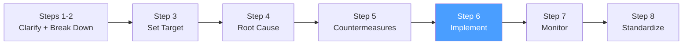

# /pps-implement — PS8: See Countermeasures Through

> *"Planning is important, but the actual results of your actions are what matter. Go and do it — then observe what actually happens."*
> — Toyota TBP principle

Ejecuta el **Step 6 del Toyota Business Practices (TBP)**: llevar las contramedidas a ejecución completa, rastrear el progreso, ajustar en tiempo real cuando los resultados no coinciden con lo esperado y actualizar el A3 Report. Produce el Implementation Log.

**THYROX Stage:** Stage 10 IMPLEMENT.

**Tollgate:** Todas las contramedidas del Action Plan ejecutadas (o documentadas como bloqueadas con justificación), A3 sección 6 iniciada con datos preliminares de efecto.

---

## Ciclo PS8 — foco en Step 6



## Pre-condición

- pps:countermeasures completado: Action Plan con contramedidas priorizadas, responsables y deadlines aprobado.
- A3 Report con secciones 1-5 completadas.
- Equipo con autoridad y recursos para ejecutar las contramedidas.
- Mecanismo de medición listo para capturar datos durante la implementación.

---

## Cuándo usar este paso

- Cuando el Action Plan está aprobado y es momento de ejecutar
- Para rastrear el progreso real vs el plan y detectar desviaciones temprano
- Cuando las contramedidas requieren coordinación entre equipos o áreas

## Cuándo NO usar este paso

- Sin Action Plan aprobado — "implementar" sin plan es solo resolver síntomas aleatoriamente
- Si la causa raíz cambió durante la planificación → regresar a pps:analyze primero

---

## Filosofía de ejecución TBP: "See It Through"

"See countermeasures through" es más que ejecutar tareas de un checklist. TBP exige:

| Principio | Qué significa | Cómo aplicarlo |
|-----------|---------------|----------------|
| **Completitud** | Las contramedidas a medias no confirman ni refutan la hipótesis | Ejecutar cada contramedida completamente antes de evaluar el efecto |
| **Fidelidad** | Ejecutar la contramedida según fue diseñada, no una versión reducida | Si hay obstáculos, escalar — no simplificar la contramedida sin análisis |
| **Observación continua** | Observar el proceso durante la implementación, no solo al final | Gemba durante la ejecución: ¿está pasando lo esperado? |
| **Ajuste fundamentado** | Si algo no funciona, ajustar con datos, no con intuición | Documentar qué se observó, por qué se ajustó y qué se cambió |

---

## Actividades

### 1. Confirmar pre-condiciones de ejecución

Antes de iniciar, verificar que cada contramedida tiene todo lo necesario:

| Contramedida | Responsable | Recursos disponibles | Dependencias resueltas | Métrica de verificación activa |
|-------------|-------------|---------------------|----------------------|-------------------------------|
| [CM-1] | [nombre] | ✅/❌ | ✅/❌ | ✅/❌ |
| [CM-2] | [nombre] | ✅/❌ | ✅/❌ | ✅/❌ |

### 2. Ejecutar contramedidas — secuencia por dependencias

Seguir la secuencia del Action Plan. Para cada contramedida:

1. **Comunicar el cambio** — informar a los afectados antes de implementar
2. **Ejecutar la contramedida** — según el diseño aprobado
3. **Observar el efecto inmediato** — ¿el proceso responde como se esperaba?
4. **Documentar en el Implementation Log** — qué se hizo, cuándo, por quién

### 3. Implementation Log — registro continuo

Registrar la ejecución de cada contramedida:

| # | Contramedida | Fecha inicio | Fecha fin | Responsable | Estado | Observaciones | Ajustes realizados |
|---|-------------|-------------|----------|-------------|--------|---------------|-------------------|
| 1 | [CM-1] | [fecha] | [fecha] | [nombre] | En curso / Completado / Bloqueado | [qué se observó] | [si se ajustó, por qué] |
| 2 | [CM-2] | [fecha] | [fecha] | [nombre] | En curso / Completado / Bloqueado | [qué se observó] | [si se ajustó, por qué] |

**Estados posibles:**

| Estado | Qué significa | Acción requerida |
|--------|---------------|-----------------|
| **Pendiente** | No iniciada | Verificar si hay bloqueador |
| **En curso** | Iniciada, en progreso | Monitorear según cadencia definida |
| **Completado** | Ejecutada completamente | Registrar fecha y observaciones |
| **Bloqueado** | No se puede ejecutar | Documentar bloqueador y escalar |
| **Ajustado** | Se modificó durante ejecución | Documentar el cambio y justificación |

### 4. Manejo de desviaciones — cuando el plan no se cumple

Si una contramedida no produce el efecto esperado o no puede ejecutarse como fue diseñada:

**Árbol de decisiones:**

```
¿La contramedida se ejecutó completamente y el efecto es menor al esperado?
├── SÍ → Regresar a pps:analyze: posible causa raíz adicional no identificada
└── NO → ¿Fue una versión reducida/modificada?
    ├── SÍ → Completar la contramedida según el diseño original antes de evaluar
    └── NO → ¿Hay un bloqueador externo?
        ├── SÍ → Escalar y documentar; ajustar timeline en Action Plan
        └── NO → Investigar por qué la contramedida no funcionó (mini-análisis)
```

### 5. Recolección de datos durante ejecución

Durante la implementación, comenzar a recopilar los primeros datos de efecto:

| Métrica (del Target Sheet) | Baseline (de pps:target) | Semana 1 | Semana 2 | Semana 3 | Tendencia |
|---------------------------|--------------------------|---------|---------|---------|-----------|
| [métrica principal] | [valor] | [valor] | [valor] | [valor] | ↑/↓/→ |

> Estos datos son preliminares — la evaluación formal de efecto ocurre en pps:evaluate. Pero observar la tendencia durante la implementación permite detectar si algo va fundamentalmente mal.

### 6. Actualizar A3 sección 6 — Effect Confirmation (preliminar)

Con los primeros datos de implementación, actualizar el A3 Report:
- Registrar fecha de inicio de cada contramedida
- Agregar gráfica de tendencia preliminar de la métrica principal
- Documentar observaciones del Gemba durante la implementación

Ver: [a3-report-template.md](../pps-analyze/assets/a3-report-template.md)

### 7. Comunicación de avance

Mantener a los stakeholders informados:

| Frecuencia | Audiencia | Contenido |
|-----------|-----------|-----------|
| Semanal | Equipo del proyecto | Implementation Log, bloqueadores, ajustes |
| Cada 2 semanas | Dueño del proceso / Sponsor | Avance vs Action Plan, tendencia preliminar de métricas |
| Al completar | Todos los afectados | Confirmar que las contramedidas están en su lugar |

Ver template: [implementation-log-template.md](./assets/implementation-log-template.md)

---

## Artefacto esperado

`{wp}/pps-implement.md` — Implementation Log con estado de cada contramedida, observaciones y ajustes realizados.
`{wp}/a3-report.md` — A3 Report actualizado con sección 6 preliminar y datos de tendencia.

---

## Red Flags — señales de implementación mal ejecutada

- **Contramedidas "completadas" sin observación de efecto** — marcar una tarea como hecha sin verificar que realmente cambió algo no es implementación TBP
- **Action Plan modificado sin documentación** — si se cambia el plan, documentar por qué; los cambios sin registro son pérdida de aprendizaje
- **Implementación sin comunicación** — cambios en el proceso sin avisar a los afectados generan resistencia y resultados inconsistentes
- **Recolección de datos pausada durante implementación** — los datos del período de implementación son parte de la evaluación
- **Declarar "completado" con contramedidas parcialmente ejecutadas** — una contramedida a medias no confirma la hipótesis de causa raíz
- **Ajustar la contramedida sin mini-análisis** — cambiar el diseño porque "no está funcionando" sin entender por qué puede alejar más de la causa raíz

### Anti-racionalizaciones comunes

| Racionalización | Por qué es trampa | Respuesta correcta |
|----------------|-------------------|--------------------|
| *"Ya implementamos la contramedida, el efecto lo medimos al final"* | Observar durante la implementación detecta problemas antes de que se acumulen | Establecer cadencia de medición semanal desde el día 1 de implementación |
| *"Simplificamos la contramedida porque era muy compleja — el efecto debería ser similar"* | Una contramedida simplificada puede no atacar la causa raíz con suficiente profundidad | Si la contramedida original no es ejecutable, regresar a pps:countermeasures y rediseñarla |
| *"No comunicamos el cambio para no generar resistencia antes de tiempo"* | La implementación sin comunicación crea sorpresa y resistencia peor cuando los afectados la descubren | Comunicar el cambio y el por qué antes de implementar; involucrar a los afectados |

---

## Estado en now.md

**Al INICIAR este step:**
```yaml
methodology_step: pps:implement
flow: pps
```

**Al COMPLETAR** (todas las contramedidas ejecutadas, A3 sección 6 con datos preliminares):
```yaml
methodology_step: pps:implement  # completado → listo para pps:evaluate
flow: pps
```

## Siguiente paso

Cuando todas las contramedidas del Action Plan están ejecutadas y hay datos preliminares de efecto → `pps:evaluate`

---

## Limitaciones

- El período de implementación debe ser suficientemente largo para que el efecto sea observable — contramedidas con efectos a largo plazo pueden requerir semanas antes de ver resultados
- Si el equipo no tiene autoridad para implementar algunas contramedidas, escalar antes de empezar para no bloquear el Action Plan
- La implementación en entornos complejos (producción, múltiples sistemas) puede requerir un período de rollout gradual — documentar la estrategia de rollout en el Implementation Log

---

## Reference Files

### Assets
- [implementation-log-template.md](./assets/implementation-log-template.md) — Template del Implementation Log con tabla de estado por contramedida, columnas de observaciones y ajustes, y sección de datos preliminares de efecto

### References
- [implementation-guide.md](./references/implementation-guide.md) — Guía de ejecución de contramedidas TBP: principios de "see it through", manejo de desviaciones, Gemba durante implementación y comunicación de cambios
