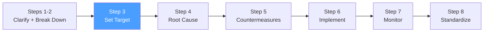

# /pps-target — PS8: Set a Target

> *"A target without measurement is a wish. A measurement without a target is just data. You need both."*
> — Toyota TBP principle

Ejecuta el **Step 3 del Toyota Business Practices (TBP)**: definir el objetivo medible del proyecto de mejora, establecer el baseline cuantificado y fijar la fecha límite. Produce la Target Sheet.

**THYROX Stage:** Stage 2 BASELINE.

**Tollgate:** Target Sheet con baseline, meta SMART, métrica de confirmación y deadline aprobados por el dueño del proceso antes de avanzar a pps:analyze.

---

## Ciclo PS8 — foco en Step 3



## Pre-condición

- pps:clarify completado: Hoja de Clarificación con sub-problema priorizado disponible.
- Estado ideal vs actual definido con brecha cuantificada.
- Datos históricos o capacidad para establecer un baseline medible.

---

## Cuándo usar este paso

- Después de clarificar y descomponer el problema — siempre antes del análisis de causa raíz
- Cuando el equipo necesita acordar explícitamente qué significa "éxito" antes de invertir en análisis
- Para evitar el sesgo post-hoc de declarar éxito basado en los resultados obtenidos, no en los comprometidos

## Cuándo NO usar este paso

- Sin baseline establecido — si no hay datos históricos, el primer paso es instrumentar antes de comprometerse a una meta
- Si el target ya está predefinido por un contrato o regulación — documentarlo y verificar que sea alcanzable con el contexto actual

---

## Actividades

### 1. Establecer el baseline — línea de partida

El baseline es el estado actual cuantificado del problema priorizado en pps:clarify:

| Elemento del baseline | Detalle |
|----------------------|---------|
| **Métrica principal** | La misma métrica que define el problema (ej: % defectos, tiempo de ciclo, # incidentes) |
| **Valor actual** | Número real medido (no estimado) con período de referencia |
| **Período de medición** | Ventana de tiempo de los datos (ej: últimas 8 semanas, Q1 2026) |
| **Fuente de datos** | De dónde viene el dato (sistema, log, observación directa) |
| **Variabilidad** | Rango o desviación estándar si existe — la meta debe considerar la variabilidad natural |

**Tabla de baseline:**

| Métrica | Unidad | Valor actual | Período | Fuente | Variabilidad |
|---------|--------|-------------|---------|--------|-------------|
| [CTQ / KPI del problema] | [%/días/unidades] | [número real] | [fechas] | [sistema/proceso] | [±rango] |

> Si no hay datos históricos: definir cómo se medirá el baseline y pausar la fijación del target hasta tenerlos. Un target sin baseline es solo intuición.

### 2. Definir el target — meta SMART

El target debe ser SMART: Specific, Measurable, Achievable, Relevant, Time-bound.

| Criterio SMART | Pregunta | Validación |
|----------------|----------|------------|
| **Específico** | ¿Qué métrica exactamente va a mejorar? | La misma métrica del baseline |
| **Medible** | ¿Cómo se confirmará el logro? | Método de medición explícito |
| **Alcanzable** | ¿Es realista dado el contexto y recursos? | Benchmarks de referencia, historial de mejoras similares |
| **Relevante** | ¿Conecta con el objetivo del negocio? | Trazar línea desde el target al impacto en el negocio |
| **Temporal** | ¿Cuándo debe alcanzarse? | Fecha específica, no "pronto" |

**Formato del target:**

```
Reducir [métrica] de [baseline] a [meta] para [fecha],
medido por [método de medición],
sin degradar [métricas secundarias] por debajo de [umbral].
```

*Ejemplo:* "Reducir el % de deploys fallidos de 23% a menos de 5% para 2026-07-01, medido en el dashboard de CI/CD, sin incrementar el tiempo promedio de deploy por encima de 12 minutos."

### 3. Verificar alcanzabilidad — benchmarks y referencias

Antes de comprometer el target, verificar que sea alcanzable:

| Fuente de referencia | Qué indica |
|---------------------|------------|
| **Benchmarks de la industria** | ¿Qué logran organizaciones similares? ¿Es el target ambicioso pero posible? |
| **Historial interno** | ¿Ha logrado el equipo mejoras similares antes? ¿En cuánto tiempo? |
| **Capacidad del proceso** | Dado el estado del proceso y los recursos, ¿el target es técnicamente posible? |
| **Restricciones conocidas** | ¿Hay limitaciones (presupuesto, tiempo, equipo) que condicionen el target? |

> Un target demasiado fácil no genera mejora real. Un target imposible desmotiva y lleva a manipulación de datos.

### 4. Definir el método de confirmación de efecto

¿Cómo sabremos que llegamos al target? Definir antes del análisis:

| Elemento | Detalle |
|----------|---------|
| **Métrica de confirmación** | Indicador primario que confirma el logro del target |
| **Métricas secundarias** | Indicadores que NO deben degradarse (evitar sub-optimización) |
| **Método de medición** | Dashboard, reporte manual, observación directa — cómo se mide |
| **Frecuencia de medición** | Diario, semanal, por sprint — cadencia durante la implementación |
| **Período de confirmación** | ¿Cuánto tiempo sostenido para declarar éxito? (ej: 4 semanas sostenidas) |

### 5. Target Sheet — completar

Completar el template: [target-sheet-template.md](./assets/target-sheet-template.md)

La Target Sheet es la referencia que se usará durante todo el proyecto TBP para evaluar si las contramedidas están funcionando.

---

## Artefacto esperado

`{wp}/pps-target.md` — Target Sheet con baseline, meta SMART, método de confirmación, deadline y criterios de éxito.

---

## Red Flags — señales de target mal definido

- **Target sin baseline** — declarar una meta sin saber de dónde se parte es imposible de evaluar
- **Target sin fecha** — "reducir defectos" sin fecha no tiene accountability
- **Target demasiado vago** — "mejorar la calidad" no es medible; necesita número y unidad
- **Target que mueve el arco después** — cambiar la meta una vez iniciado el análisis invalida el proyecto
- **Métricas secundarias no consideradas** — mejorar una métrica degradando otra no es mejora real
- **Target impuesto sin validación de alcanzabilidad** — metas políticas sin base técnica generan manipulación de datos
- **Período de medición insuficiente** — confirmar éxito con una sola semana de datos puede ser ruido estadístico

### Anti-racionalizaciones comunes

| Racionalización | Por qué es trampa | Respuesta correcta |
|----------------|-------------------|--------------------|
| *"El target lo definiremos según los resultados del análisis"* | El target debe definirse antes del análisis para evitar sesgo — si lo definimos después, lo adaptamos al resultado | Fijar target basado en el ideal y el benchmark, no en la comodidad del análisis |
| *"Cualquier mejora es buena"* | Sin target específico, no hay criterio de cuándo el proyecto ha cumplido su propósito | Definir el punto de cierre explícito antes de empezar |
| *"Ponemos un target ambicioso para motivar al equipo"* | Un target técnicamente imposible lleva a manipulación o desmotivación | Anclar en benchmarks y capacidad real; la ambición debe ser desafiante pero alcanzable |

---

## Estado en now.md

**Al INICIAR este step:**
```yaml
methodology_step: pps:target
flow: pps
```

**Al COMPLETAR** (Target Sheet aprobada con baseline y meta SMART):
```yaml
methodology_step: pps:target  # completado → listo para pps:analyze
flow: pps
```

## Siguiente paso

Cuando la Target Sheet está aprobada con baseline y meta SMART → `pps:analyze`

---

## Limitaciones

- El baseline requiere datos reales — si no existen, es necesario instrumentar el proceso primero (puede requerir un ciclo breve de recolección antes de fijar el target)
- El target puede necesitar ajustarse si durante pps:analyze se descubre que el problema tiene una causa raíz de mayor complejidad que la anticipada — documentar el cambio con justificación
- La confirmación de efecto (Step 7) en pps:evaluate usará exactamente las métricas definidas aquí — definirlas con precisión ahora evita ambigüedad después

---

## Reference Files

### Assets
- [target-sheet-template.md](./assets/target-sheet-template.md) — Template de la Target Sheet con baseline, meta SMART, método de confirmación, métricas secundarias y deadline

### References
- [smart-targets-guide.md](./references/smart-targets-guide.md) — Guía de definición de targets SMART: criterios, ejemplos buenos vs malos, validación de alcanzabilidad y benchmarking
