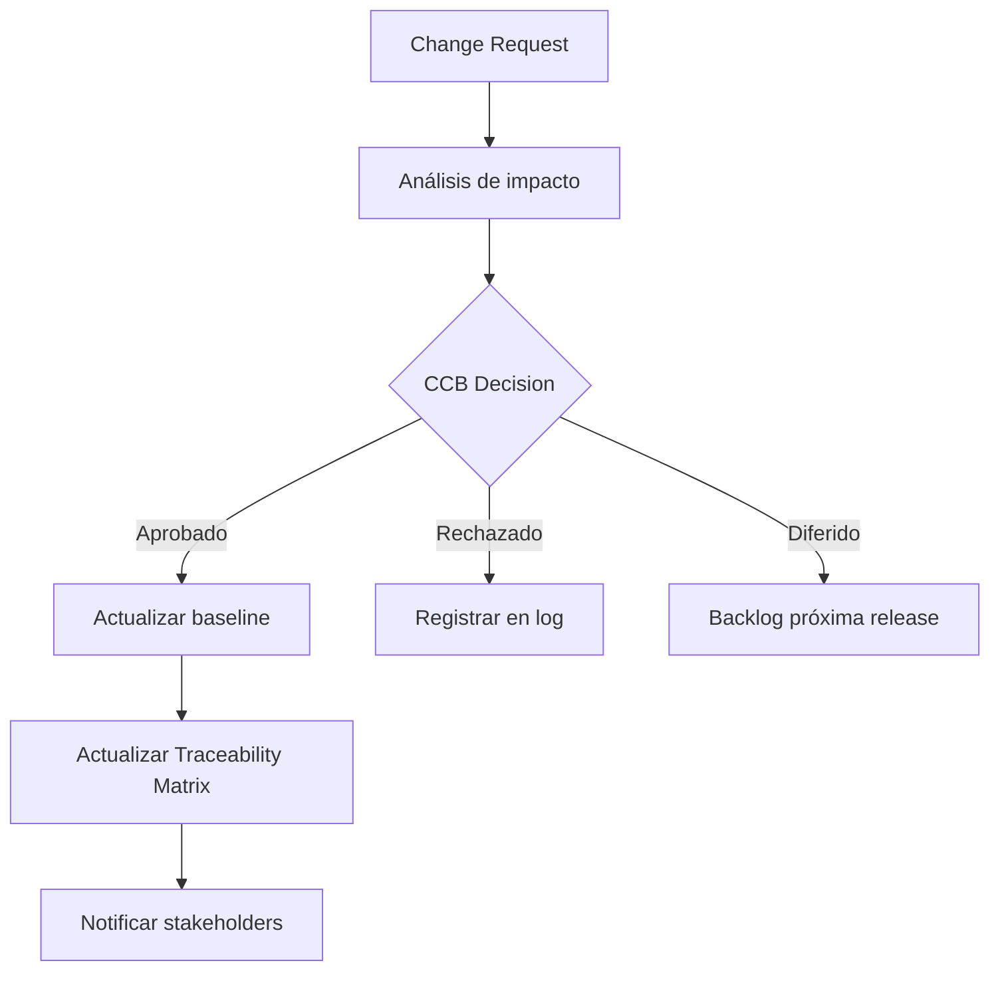

# /rm-management — Requirements Management: Management

> *"A baseline without change control is just a snapshot. Requirements management is the discipline of keeping the snapshot relevant while the world moves on."*

Ejecuta el paso **Management** del ciclo de Requirements Management. Mantiene el baseline de requisitos, gestiona cambios a través del CCB, y asegura la trazabilidad hacia diseño, código y tests.

**THYROX Stage:** Stage 10 IMPLEMENT / Stage 11 TRACK/EVALUATE (activo durante toda la implementación).

---

## Foco en el ciclo RM

| Paso | Intensidad relativa | Rol en el ciclo |
|------|-------------------|----------------|
| Elicitation | Media | Los change requests pueden requerir re-elicitar nuevas necesidades |
| Analysis | Media | Cambios mayores al scope requieren re-análisis de impacto |
| Specification | Media | Los CRs aprobados actualizan el documento de especificación |
| Validation | Media | Cambios significativos requieren re-validación con stakeholders |
| **Management** | **Alta** (este paso) | Gobernanza del baseline — trazabilidad, change control, CCB |

---

## Pre-condición

Requiere: `{wp}/rm-validation.md` con:
- Baseline de requisitos con sign-off formal (`on_approved`)
- Versión 1.0 de la especificación aprobada
- Trazabilidad inicial establecida

---

## Flujo de gestión de cambios (CCB)



## Cuándo usar este paso

- Cuando el baseline de requisitos está aprobado y el desarrollo ha comenzado
- Cuando llega un change request que modifica, agrega o elimina requisitos
- Durante todo el ciclo de desarrollo para mantener la trazabilidad actualizada
- Al cierre del proyecto para archivar el baseline final y las lecciones aprendidas

## Cuándo NO usar este paso

- Antes de tener baseline aprobado — sin baseline, no hay gestión de cambios posible
- Para cambios de diseño que no afectan requisitos — esos cambios van por el proceso de gestión técnica del equipo

---

## Glosario de términos clave

| Término | Definición |
|---------|------------|
| **Baseline** | Versión formalmente aprobada de la especificación de requisitos — punto de referencia para medir cambios |
| **CCB** (Change Control Board) | Comité que evalúa y aprueba/rechaza change requests; composición mínima: analista de RM + project manager + representante del negocio |
| **Change Request (CR)** | Solicitud formal de modificación al baseline; incluye descripción, justificación, impacto estimado |
| **Impact Analysis** | Evaluación de qué partes del sistema (diseño, código, tests, documentación) se ven afectadas por un CR |
| **Forward Traceability** | Req → Design → Code → Test — confirma que cada req fue implementado y testeado |
| **Backward Traceability** | Test → Code → Design → Req — confirma que cada elemento del sistema tiene una justificación en un req |
| **Versioning** | Control de versiones del documento de especificación (v1.0, v1.1, v2.0) |

---

## Actividades

### 1. Proceso CCB — gestión de change requests

El CCB es el mecanismo que previene el scope creep no controlado:

**Flujo de un Change Request:**

```
Solicitud de cambio
→ Registro en CR log (ID único, fecha, solicitante, descripción)
→ Impact Analysis (analista RM)
   → Impacto en especificación (¿qué requisitos cambian?)
   → Impacto en diseño (¿qué arquitectura o diseños se ven afectados?)
   → Impacto en código (¿qué módulos deben modificarse?)
   → Impacto en tests (¿qué test cases deben actualizarse?)
   → Estimación de esfuerzo
→ Presentación al CCB
→ Decisión CCB: Aprobar / Rechazar / Diferir
→ Si aprobado: actualizar baseline (nueva versión), notificar stakeholders
→ Si diferido: agregar al backlog de próxima versión
```

**Composición mínima del CCB:**

| Rol | Contribución |
|-----|-------------|
| **Analista de RM** | Evalúa impacto en requisitos y documentación |
| **Project Manager** | Evalúa impacto en cronograma y presupuesto |
| **Representante del negocio** | Evalúa valor de negocio y prioridad |
| **Tech Lead** (si aplica) | Evalúa factibilidad técnica y esfuerzo |

### 2. Matriz de impacto — análisis del CR

Para cada change request, completar la matriz antes de presentar al CCB:

| Área afectada | Artefactos impactados | Esfuerzo estimado | Riesgo |
|---------------|----------------------|-------------------|--------|
| Especificación | [IDs de req afectados] | [horas] | Bajo/Medio/Alto |
| Diseño | [módulos/componentes] | [horas] | |
| Código | [archivos/módulos] | [horas] | |
| Tests | [test suites/casos] | [horas] | |
| Documentación | [docs afectados] | [horas] | |
| **Total** | | [suma] | |

**Criterio de escalación del CR:**

| Impacto en baseline | Acción |
|--------------------|--------|
| Cambio en ≤ 3 requisitos, esfuerzo ≤ 10% del sprint | Gestionar dentro del ciclo actual |
| Cambio en 4-10 requisitos, esfuerzo 10-30% del total | CCB formal con sponsor informado |
| Cambio en > 10 requisitos o esfuerzo > 30% del total | Nuevo work package / nuevo proyecto |

### 3. Trazabilidad forward y backward

La trazabilidad es el mecanismo que permite saber si cada requisito está implementado y testeado:

**Matriz de trazabilidad:**

| Req ID | Prioridad | Diseño ref | Código ref | Test case ref | Estado |
|--------|-----------|-----------|-----------|--------------|--------|
| REQ-001 | Must Have | DES-001 | src/orders.js:45 | TC-001, TC-002 | ✅ Implementado y testeado |
| REQ-002 | Should Have | DES-003 | — | — | ⏳ Pendiente de implementación |
| REQ-003 | Could Have | — | — | — | 🔵 Diferido para v2 |

**Tipos de trazabilidad:**
- **Forward:** desde req hacia implementación — garantiza que cada req tiene design + code + test
- **Backward:** desde test hacia req — garantiza que cada test tiene una justificación en un req (previene tests sin valor)

> **Regla de trazabilidad:** Ejecutar un review de trazabilidad al inicio de cada sprint/iteración. No al final del proyecto — cuando se descubren los gaps, ya es tarde para corregirlos.

### 4. Gestión visual del backlog de change requests

Usar Kanban como mecanismo de visualización del estado de los CRs activos:

| Columna | Estado |
|---------|--------|
| **Recibido** | CR registrado, aún no analizado |
| **En análisis** | Impact analysis en curso |
| **En CCB** | Presentado al CCB, pendiente de decisión |
| **Aprobado** | CCB aprobó; pendiente de implementación |
| **Implementando** | Cambio en desarrollo |
| **Cerrado** | Implementado, testeado, baseline actualizado |
| **Rechazado / Diferido** | CCB rechazó o difirió a versión futura |

> El Kanban de CRs hace visible la deuda de requisitos — si hay más de 5 CRs en "En análisis" simultáneamente, el equipo de RM está sobrecargado.

### 5. Versionado del baseline

Cuando un CR es aprobado e implementado:

| Tipo de cambio | Versión |
|----------------|---------|
| Corrección de defecto (Wrong, Ambiguous) | v1.0 → v1.0.1 |
| Nuevo req o modificación de req existente | v1.0 → v1.1 |
| Cambio de scope significativo (>10 req) | v1.x → v2.0 |

> Comunicar cada nueva versión del baseline a todos los stakeholders — el equipo de desarrollo necesita saber qué versión de la spec están implementando.

---

## Artefacto esperado

`{wp}/rm-management.md`

usar template: [change-request-template.md](./assets/change-request-template.md)

---

## Red Flags — señales de gestión mal ejecutada

- **Cambios al baseline sin CCB** — cualquier modificación a los requisitos sin pasar por el proceso CCB invalida el baseline
- **Trazabilidad solo al final del proyecto** — cuando se construye la trazabilidad al final, es imposible verificar si cada req fue realmente implementado con la intención correcta
- **CR sin impact analysis** — aprobar cambios sin saber su alcance lleva a scope creep no controlado
- **CCB de una sola persona** — si el mismo analista que escribió los req también aprueba los cambios, no hay control real
- **Baseline cambiado sin comunicación** — si el equipo de desarrollo está trabajando contra una versión diferente de la spec, el trabajo es en vano
- **CRs diferidos indefinidamente** — un backlog de CRs diferidos que nunca se priorizan genera deuda de requisitos; revisar en cada release

---

## Estado en now.md

**Al INICIAR este step:**
```yaml
methodology_step: rm:management
flow: rm
```

**Al COMPLETAR** (baseline estable, trazabilidad completa):
```yaml
methodology_step: rm:management  # completado o activo (proceso continuo)
flow: rm
```

## Siguiente paso

- `on_stable` (baseline estable, todos los CRs cerrados o diferidos formalmente) → cierre del ciclo RM
- `on_change_request` (nuevo CR aprobado que requiere análisis) → `rm:analysis`

---

## Limitaciones

- El proceso CCB añade overhead — en proyectos muy pequeños o con un solo stakeholder, un proceso CCB formal puede ser innecesario; adaptar la formalidad al contexto
- La trazabilidad completa requiere disciplina de todo el equipo (developers, testers, designers) — el analista de RM no puede mantenerla solo
- Los CRs aprobados que aumentan el scope significativamente deben renegociarse con el sponsor (cronograma, presupuesto) — RM no puede aprobar scope sin negociar capacidad

---

## Reference Files

### Assets
- [change-request-template.md](./assets/change-request-template.md) — Template de gestión: baseline status, CR log, CR detallado con impact assessment, Kanban de CRs activos

### References
- [change-control-process.md](./references/change-control-process.md) — CCB composición y quórum, pipeline de CR, impact assessment template, change log format, CR patterns por tipo

### Scripts
- [count-requirements.sh](./scripts/count-requirements.sh) — Cuenta requisitos por estado en la traceability matrix

```bash
# Conteo detallado por estado
bash .claude/skills/rm-management/scripts/count-requirements.sh \
  .thyrox/context/work/YYYY-MM-DD-nombre/rm-management.md

# Solo totales (sin detalle por estado)
bash .claude/skills/rm-management/scripts/count-requirements.sh \
  .thyrox/context/work/YYYY-MM-DD-nombre/rm-management.md --summary
```

**Output:** conteo por estado (10 estados RTM) + métricas de cobertura (% verificado, % implementado) + señales de salud (Propuesto alto, cobertura baja, Diferido acumulado).
