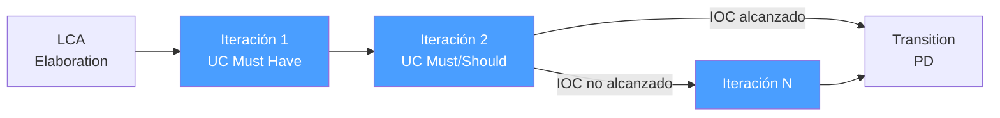

# /rup-construction — RUP: Construction

> **Adaptacion e-comerce v2 (2026-05-21).** En e-comerce el estado y
> la coordinacion intra-sesion **persisten en ``docs/source/``**, en
> los `.md` de la iniciativa. Las salidas de Construction NO viven
> en `{wp}/rup-construction.md` sino mapeadas asi sobre los
> artefactos de
> ``docs/pm/iniciativas/<slug>/``:
>
> - **Iteration Plan** -> ``tareas-<slug>.md`` con T-NNN agrupadas
>   por iteracion en bloques claros (``Iteracion 1``, ``Iteracion 2``,
>   ...). Cada T tiene entregable verificable.
> - **Definition of Done por UC** -> ``decisiones-<slug>.md`` como
>   DEC-NN con criterios formales (flujo principal + alternativos +
>   excepciones + tests + code review + doc).
> - **Iteration Report (retrospectiva, metricas)** ->
>   ``progreso-<slug>.md`` bitacora — una entrada al cierre de cada
>   iteracion con ``Iteracion N — retrospectiva``.
> - **Backlog de deuda tecnica** -> ``progreso-<slug>.md`` seccion
>   "Deuda tecnica" actualizada por iteracion + items P-NN en
>   ``docs/pm/iniciativas/revisar-pendientes-docs/registro-trabajo-no-acabado.md``
>   si la deuda excede el scope de la iniciativa.
> - **Defect log (Severity 1..3)** -> ``progreso-<slug>.md`` seccion
>   "Defectos abiertos" + cross-link a GitHub issues si se usan.
> - **Codigo implementado** -> commits en ``api/`` y/o ``ui/`` con
>   convencion Tim Pope; cada commit cita la T-NNN y la iteracion.
> - **Tests** -> ``api/tests/`` y/o ``ui/src/**/*.test.{js,jsx}`` con
>   nombres conformes a AC-NN del UC.
> - **Milestone IOC alcanzado** -> ``progreso-<slug>.md`` seccion
>   "Milestone IOC alcanzado <YYYY-MM-DDTHH:MM:SS>" con cobertura
>   Must Have, Severity 1 = 0, performance en staging.
>
> Ver `.claude/agents/rup-coordinator.md` para el mapping completo.

> *"Construction is not a single build — it's a series of mini-projects, each delivering a working increment. The architecture from Elaboration is the skeleton; Construction adds the flesh, iteratively."*

Ejecuta la fase **Construction** de RUP. Implementa los Use Cases de forma incremental, mantiene la calidad del código y la arquitectura, gestiona la deuda técnica, y obtiene el milestone **IOC (Initial Operational Capability)** para autorizar Transition.

**THYROX Stage:** Stage 10 IMPLEMENT.

**Milestone:** IOC — Initial Operational Capability.

---

## Ciclo de iteraciones en Construction

## Pre-condición

Requiere que la iniciativa activa en
``docs/pm/iniciativas/<slug>/`` tenga
cierre de Elaboration documentado:

- ``progreso-<slug>.md`` con seccion "Milestone LCA alcanzado".
- ``analisis-<slug>.md`` con Risk List actualizada (top-5 riesgos
  tecnicos mitigados o con plan residual).
- Use Case Model ≥80% en ``docs/source/requisitos/casos-uso/`` (UC
  criticos especificados; Alt + EX completos).
- Architecture Prototype ejecutable en ``api/`` o ``ui/`` (commit
  hash citado en progreso).
- ``tareas-<slug>.md`` con plan de Construction (iteraciones
  declaradas, UC por iteracion, criterios por iteracion).

---

## Cuándo usar este paso

- Cuando el LCA de Elaboration está alcanzado
- Para cada iteración de Construction (repetir hasta alcanzar IOC)
- Cuando una iteración de Construction requiere un nuevo release incremental antes del beta

## Cuándo NO usar este paso

- Sin LCA alcanzado — construir sobre una arquitectura no validada garantiza re-trabajo masivo
- Si la funcionalidad beta está lista y los usuarios pueden evaluarla → ir a `rup:transition`

---

## Tabla de intensidad de disciplinas en Construction

| Disciplina | Intensidad en Construction | Foco principal |
|-----------|---------------------------|----------------|
| Business Modeling | Baja | Solo si hay cambios en el dominio |
| Requirements | Media | Especificar el 20% de UC restante; gestionar cambios |
| Analysis & Design | **Alta** | Diseño detallado por Use Case |
| Implementation | **Alta** | Código de producción por iteración |
| Test | **Alta** | Unit + integration + system tests por iteración |
| Deployment | Media | Build + deploy del incremento |
| Config & Change Mgmt | **Alta** | CI/CD, branching, code reviews |
| Project Management | **Alta** | Seguimiento por iteración, gestión de impedimentos |
| Environment | Baja | Entorno estable desde Elaboration |

---

## Actividades

### 1. Planificar cada iteración

Cada iteración de Construction es un mini-proyecto con entregable funcional:

| Elemento del plan de iteración | Contenido |
|-------------------------------|-----------|
| **UC / Features a implementar** | Lista de Use Cases de la prioridad acordada en el plan de Construction |
| **Criterio de éxito** | ¿Qué define que el incremento está "done"? |
| **Tests de aceptación** | Qué tests deben pasar al final de la iteración |
| **Deuda técnica permitida** | Qué shortcuts son aceptables en esta iteración (documentados) |
| **Definition of Done** | Código + tests + documentación + code review |

### 2. Implementar use cases iterativamente

El orden de implementación en Construction sigue el plan de Elaboration:

**Criterio de prioridad de UC:**
1. Primero: UC de alto riesgo residual que no fue cubierto por el Architecture Prototype
2. Segundo: UC Must Have (críticos para el IOC)
3. Tercero: UC Should Have (si hay capacidad)
4. Diferir: UC Could Have (para versiones futuras o iteraciones posteriores)

**Definition of Done por Use Case:**
- [ ] Flujo principal implementado y testeado
- [ ] Flujos alternativos implementados y testeados
- [ ] Flujos de excepción implementados y testeados
- [ ] Unit tests con cobertura ≥ 80% del código del UC
- [ ] Integration tests si el UC toca múltiples componentes
- [ ] Code review aprobado
- [ ] Documentación técnica actualizada (si el UC añade API pública o cambia el deployment)

### 3. Gestión de deuda técnica

En Construction, la presión de entrega puede generar deuda técnica. Gestionar conscientemente:

| Tipo de deuda | Criterio para aceptar | Acción |
|---------------|----------------------|--------|
| **Deuda intencional** | Shortcut conocido para cumplir el milestone; plan para pagar está documentado | Documentar en el backlog técnico con estimación de costo para pagar |
| **Deuda accidental** | Código que creció sin planificación; detectado en code review | Refactorizar en la siguiente iteración (no acumular) |
| **Deuda de arquitectura** | Violación de una decisión arquitectónica del SAD | Requiere aprobación del arquitecto antes de aceptar |

> **Regla de deuda técnica en Construction:** Documentar toda deuda en el backlog técnico con: qué es, por qué se tomó, cuánto cuesta pagarla, cuándo se pagará. Si la deuda no está documentada, no es "deuda técnica" — es desorden.

### 4. Testing por iteración

No acumular tests para el final — testear cada incremento al completarlo:

| Nivel de test | Responsable | Cuando ejecutar |
|---------------|-------------|----------------|
| **Unit tests** | Developer | Antes del code review |
| **Integration tests** | Developer / QA | Al integrar el UC al sistema |
| **System tests** | QA | Al final de cada iteración |
| **Regression tests** | QA / CI | Con cada commit (automatizado) |
| **Performance tests** | Developer / QA | Cuando el UC toca componentes de alta carga |

### 5. Retrospectiva por iteración

Al final de cada iteración de Construction:

| Dimensión | Pregunta |
|-----------|----------|
| **Velocidad** | ¿Cuántos UC/story points se completaron? ¿Es consistente con el plan? |
| **Calidad** | ¿Cuántos defectos se encontraron? ¿En qué componentes? |
| **Deuda técnica** | ¿Cuánta deuda se acumuló? ¿Es manejable? |
| **Proceso** | ¿Qué impedimentos hubo? ¿Qué funcionó bien? |
| **Riesgos** | ¿Surgieron nuevos riesgos técnicos? |

---

## Aprobación del milestone IOC — roles y responsabilidades

| Rol | Responsabilidad en IOC |
|-----|----------------------|
| **Project Manager** | Presenta el IOC review con métricas de calidad y cobertura de UC |
| **Arquitecto / Tech Lead** | Confirma que la arquitectura del SAD se mantiene íntegra en el sistema construido |
| **QA Lead** | Valida que la tasa de defectos cumple el umbral de calidad para beta |
| **Product Owner / Sponsor** | Evalúa si la funcionalidad beta es suficiente para iniciar Transition |
| **Usuarios beta (representantes)** | Confirman disponibilidad para participar en la fase de Transition |

---

## Criterio de milestone IOC — ¿avanzar a Transition o nueva iteración?

**Avanzar a Transition (todos los siguientes deben cumplirse):**
1. Funcionalidad suficiente para que usuarios beta puedan evaluar el valor del sistema
2. Defectos críticos (Severity 1 — sistema inusable) = 0
3. Deuda técnica documentada, acotada y con plan de resolución (no necesariamente eliminada)
4. Performance cumple los NFR del Vision Document en el entorno de staging
5. Usuario beta / Product Owner aprueba el inicio de Transition

**Nueva iteración de Construction (cualquiera de los siguientes):**
- Funcionalidad insuficiente para uso básico — usuarios beta no pueden evaluar el valor
- Defectos críticos pendientes que hacen el sistema inusable
- Nuevo release incremental requerido antes de poder hacer el beta (features faltantes acordadas)
- Performance no cumple NFR en staging

---

## Artefacto esperado

Los entregables canonicos RUP de Construction se materializan en
artefactos de la iniciativa + commits reales del codigo (ver banner
de adaptacion e-comerce v2 al inicio):

- ``tareas-<slug>.md`` — Iteration Plans 1..N con T-NNN por
  iteracion y entregable verificable.
- ``decisiones-<slug>.md`` — Definition of Done por UC en DEC-NN.
- ``progreso-<slug>.md`` — Bitacora con retrospectiva por
  iteracion + Deuda tecnica + Defectos + "Milestone IOC alcanzado".
- ``api/`` y/o ``ui/`` commits (Tim Pope) que citan T-NNN.
- ``api/tests/`` y/o ``ui/src/**/*.test.{js,jsx}`` con cobertura
  conforme a AC-NN del UC.

Template historico (estilo `.md`):
[construction-report-template.md](./assets/construction-report-template.md).
Conserva la estructura conceptual; al portar a `.md` se reparte
entre los artefactos arriba.

---

## Red Flags — señales de Construction mal ejecutada

- **Tests acumulados al final de Construction** — si los tests solo se ejecutan al final, los defectos se descubren cuando el costo de corrección es máximo
- **Deuda técnica sin documentar** — deuda que "todo el mundo sabe que existe" pero no está en el backlog es deuda que nunca se paga
- **UC de alta complejidad sin retrospectiva** — si un UC tomó 3× lo estimado, la lección no debe perderse
- **Severity 1 abiertos en cada iteración** — si hay defectos críticos en cada iteración, el problema es arquitectural, no de implementación
- **Construction sin iteraciones** — construir todo en una sola iteración larga sin puntos de revisión es un proyecto waterfall disfrazado de RUP
- **Performance no testeada hasta Transition** — si el primer test de performance ocurre en Transition, los problemas de arquitectura ya no pueden corregirse sin costo masivo

---

## Carpetas externas relacionadas en docs/source/

Construction consume y produce contenido en estas carpetas (aparte
de los artefactos de la iniciativa y los commits de codigo):

- ``docs/source/implementacion/`` — material canonico de planning
  de Construction:

  - ``project-charter.md`` — driver de prioridades.
  - ``hoja-ruta-sprints.md`` — roadmap macro de Sprints
    (1..N).
  - ``matriz-prioridad-ucs.md`` — UC priority matrix (Must
    Have / Should / Could) para ordenar las iteraciones.
  - ``grafo-dependencias-modulos.md`` — constraint para
    ordenar la implementacion.
  - ``plantilla-sprint.md`` — template para abrir un sprint
    nuevo.
  - ``sprint-N-*.md`` — sprints ya cerrados (precedent: 8
    sprints existen).
  - ``auditoria-sprint-N-M.md`` — retrospectivas
    cross-sprint.

  Cada iteracion de Construction de la iniciativa puede
  materializarse como un sprint nuevo aqui si el alcance lo
  amerita, o quedar dentro de ``tareas-<slug>.md`` agrupada
  por bloque "Iteracion N" si es mas chica.

- ``docs/source/quality/`` — politica de tests:

  - ``tdd.md`` — TDD canonico del proyecto.
  - ``tests-implementados.md`` — inventario de tests cubiertos.

- ``docs/source/normativa/procedimientos/`` — procedimientos
  operativos:

  - ``proc-tdd.md`` — disciplina TDD aplicable a Construction.
  - ``proc-git-workflow.md`` — git flow para commits Tim Pope.

- ``docs/source/risks-technical-debt/registro-riesgos-y-deuda-tecnica.md``
  — Deuda tecnica project-wide; la deuda especifica de la
  iniciativa va a su ``progreso-<slug>.md``; si excede el scope se
  promueve a un P-NN aqui.

- ``docs/pm/<submodulo>/audits/`` — Si una iteracion
  produce un audit cross-cutting (e.g. cobertura, deuda
  arquitectonica), va a esta carpeta.

- ``docs/pm/<submodulo>/matrices/`` — Trazabilidad
  UC-RF / UC-modulo actualizada al cierre de iteracion.

## Estado activo

En e-comerce **no hay `now.md`**. El estado y la coordinacion
intra-sesion **persisten en ``docs/source/``**, en los `.md` de la
iniciativa. La fase activa se lee del campo ``:estado:`` del
metadata de ``progreso-<slug>.md`` y de la ultima seccion de su
bitacora.

**Al INICIAR Construction:** abrir entrada de bitacora
"Construction iter 1" (o numero subsiguiente) en
``progreso-<slug>.md``. Mantener ``:estado:`` en ``En ejecucion``.
Las T-NNN de la iteracion se sacan del bloque "Iteracion N" del
``tareas-<slug>.md``.

**Al CIERRE de cada iteracion:** agregar una subseccion
``Iteracion N — retrospectiva`` en ``progreso-<slug>.md`` con:
metricas (UCs cerrados, T-NNN cerradas, defectos detectados/cerrados,
deuda tecnica acumulada), lecciones aprendidas, decision de continuar
o cerrar Construction.

**Al COMPLETAR** (IOC alcanzado): agregar seccion
"Milestone IOC alcanzado <YYYY-MM-DDTHH:MM:SS>" en
``progreso-<slug>.md`` con cita de evidencia: cobertura de UCs
Must Have (lista UC con tests verdes), Severity 1 = 0 (defects
abiertos verificados), performance en staging (numeros vs NFR),
build/deploy estable.

## Siguiente paso

- IOC alcanzado → `rup:transition`
- IOC no alcanzado → nueva iteración de `rup:construction`

---

## Limitaciones

- La velocidad de las primeras iteraciones de Construction no es representativa — el equipo acelera a medida que aprende el dominio y la arquitectura; no comprometer fechas basadas en la primera iteración
- La gestión de deuda técnica requiere disciplina del equipo completo, no solo del arquitecto — sin buy-in del equipo, la deuda se acumula silenciosamente
- Los defectos de Severity 1 en staging no garantizan ausencia de defectos en producción — el entorno de producción puede exponer condiciones no replicadas en staging

---

## Reference Files

### Assets
- [construction-report-template.md](./assets/construction-report-template.md) — Template por iteración: plan de iteración, UC implementados, defectos, deuda técnica, métricas, retrospectiva, checklist IOC

### References
- [ioc-criteria.md](./references/ioc-criteria.md) — Criterios de evaluación IOC: funcionalidad Must Have, Severity 1=0, deuda técnica acotada, performance en staging, feature complete checklist por tipo de UC, test coverage thresholds
