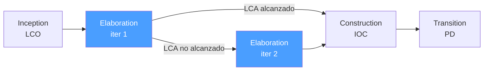

# /rup-elaboration — RUP: Elaboration

> **Adaptacion e-comerce v2 (2026-05-21).** Las salidas de esta fase
> NO viven en `{wp}/rup-elaboration.md`. Se mapean asi sobre los
> artefactos de la iniciativa en
> `docs/pm/iniciativas/<slug>/`:
>
> - **Software Architecture Document (SAD)** -> EXTERNO en
>   ``docs/source/arquitectura-tecnica/`` (modelo 4+1 ya
>   estructurado por proyecto). Cross-link desde
>   ``analisis-<slug>.md``.
> - **Architectural Decision Records (ADRs)** -> EXTERNO en
>   ``docs/source/backend/adr/`` o
>   ``docs/source/frontend/adr/`` segun capa. ``decisiones-<slug>.md``
>   referencia las ADRs creadas.
> - **Architecture Prototype** -> commit hash en ``api/`` o ``ui/``,
>   citado desde ``progreso-<slug>.md``.
> - **Use Case Model 80%** -> EXTERNO en
>   ``docs/source/requisitos/casos-uso/``. ``analisis-<slug>.md``
>   lista los UC ya cubiertos vs pendientes.
> - **Risk List actualizada** -> ``analisis-<slug>.md`` seccion
>   "Riesgos R-NN" — cada riesgo con estado mitigado / residual.
> - **Plan de Construction** -> ``tareas-<slug>.md`` con T-NNN
>   agrupadas por iteracion de Construction.
> - **Milestone LCA alcanzado** -> ``progreso-<slug>.md`` seccion
>   "Milestone LCA" con los 5 criterios + cita de evidencia.
>
> Ver `.claude/agents/rup-coordinator.md` para el mapping completo.

> *"Elaboration is about proving the architecture works — not designing the perfect architecture. An executable prototype that handles the risky scenarios is worth more than a beautiful diagram that hasn't been tested."*

Ejecuta la fase **Elaboration** de RUP. Estabiliza la arquitectura base, especifica los Use Cases críticos, mitiga los riesgos técnicos top-5 con un prototype ejecutable, y obtiene el milestone **LCA (Lifecycle Architecture)** para autorizar Construction.

**THYROX Stage:** Stage 5 STRATEGY / Stage 7 DESIGN/SPECIFY.

**Milestone:** LCA — Lifecycle Architecture.

---

## Ciclo de fases RUP — foco en Elaboration

## Pre-condición

Requiere que la iniciativa activa en
`docs/pm/iniciativas/<slug>/` tenga
documentado el cierre de Inception:

- ``progreso-<slug>.md`` con seccion "Milestone LCO alcanzado".
- ``alcance-<slug>.md`` con Vision Document aprobado.
- ``analisis-<slug>.md`` con Risk List inicial (≥3 riesgos).
- Use Case Model al 10% — UC criticos nombrados en
  ``docs/source/requisitos/casos-uso/`` y cross-linkeados desde
  ``analisis-<slug>.md``.

---

## Cuándo usar este paso

- Cuando el LCO de Inception está alcanzado
- Para establecer la arquitectura que guiará Construction
- Cuando el LCA de una iteración anterior no fue alcanzado y se requiere una iteración adicional

## Cuándo NO usar este paso

- Sin LCO alcanzado — Elaboration sin visión validada construye la arquitectura para el problema equivocado
- Si la arquitectura ya está estabilizada y los riesgos técnicos mitigados → ir a `rup:construction`

---

## Tabla de intensidad de disciplinas en Elaboration

| Disciplina | Intensidad en Elaboration | Foco principal |
|-----------|--------------------------|----------------|
| Business Modeling | Media | Refinamiento del dominio si es necesario |
| Requirements | **Alta** | Especificar 80% del Use Case Model |
| Analysis & Design | **Alta** | SAD, Architecture Prototype |
| Implementation | Media | Architecture Prototype ejecutable |
| Test | Media | Test del Architecture Prototype |
| Deployment | Baja | Planeación del deployment en construcción |
| Config & Change Mgmt | Media | Branching strategy, CI/CD setup |
| Project Management | **Alta** | Plan detallado de Construction |
| Environment | Media | Entorno de desarrollo estable |

> Si Implementation es **Alta** en Elaboration, revisar si el equipo está construyendo features en lugar de probar la arquitectura — es BDUF disfrazado de Elaboration.

---

## Actividades

### 1. Software Architecture Document (SAD)

El SAD es el artefacto central de Elaboration — captura las decisiones arquitectónicas con su justificación:

| Sección del SAD | Contenido | Nivel de detalle en Elaboration |
|-----------------|-----------|--------------------------------|
| **Architectural Goals** | Calidad atributos que guían la arquitectura (performance, security, scalability) | Definidos con métricas |
| **Architectural Constraints** | Tecnologías mandatadas, regulaciones, integraciones fijas | Exhaustivo |
| **Architectural Patterns** | Patterns elegidos (layered, microservices, event-driven, etc.) con justificación | Justificación de cada decisión |
| **Key Subsystems** | Componentes principales y sus responsabilidades | Diagrama de alto nivel |
| **Critical Use Case Realizations** | Cómo los UC arquitecturalmente significativos se implementan | Solo los top UC de Inception |
| **Deployment View** | Dónde corren los componentes | Suficiente para el Architecture Prototype |
| **Architecture Risks Addressed** | Los riesgos técnicos del Risk List y cómo el diseño los mitiga | Cada riesgo crítico debe estar abordado |

> **Regla anti-Architecture Astronaut:** El SAD debe ser la arquitectura mínima suficiente para mitigar los riesgos críticos, no la arquitectura perfecta. Si el SAD tiene > 20 páginas en Elaboration, probablemente está sobrediseñado.

**SAD review y aprobación:**

| Rol | Responsabilidad | Deliverable de confirmación |
|-----|----------------|---------------------------|
| **Arquitecto / Tech Lead** | Crea el SAD y garantiza su completitud | SAD con todas las secciones completas |
| **Equipo de desarrollo** | Revisa la viabilidad técnica de cada decisión | Comentarios y ACK en cada sección |
| **Project Manager** | Verifica que el SAD cubre los riesgos del Risk List | Checklist de cobertura de riesgos |
| **Sponsor / Product Owner** | Aprueba los Quality Attributes y constraints de negocio | Sign-off en la sección Architectural Goals |

### 2. Architecture Prototype — probar, no diseñar

El Architecture Prototype es ejecutable — prueba que la arquitectura funciona bajo las condiciones del escenario más riesgoso:

| Objetivo del prototype | Qué debe probar | Criterio de éxito |
|----------------------|----------------|-------------------|
| **Performance crítica** | El path más cargado del sistema bajo carga realista | Cumple el NFR de performance del Vision Document |
| **Integración riesgosa** | La integración con el sistema externo más complejo | Datos fluyen correctamente end-to-end |
| **Tecnología no probada** | La feature que usa la tecnología menos familiar | Funciona en el equipo en el entorno objetivo |
| **Escalabilidad** | El componente que más crecerá bajo carga | No degrada bajo 2× el volumen esperado |

> El Architecture Prototype NO es un prototipo de UI, un spike de 2h, ni un diagrama. Es código ejecutable que prueba los escenarios de mayor riesgo.

**Matriz de selección de UCs para el Architecture Prototype:**

| Criterio | Puntos | UC X | UC Y | UC Z |
|---------|--------|------|------|------|
| Riesgo técnico (Alto=3, Medio=2, Bajo=1) | 3 | | | |
| Impacto en arquitectura (Alto=3, Medio=2, Bajo=1) | 3 | | | |
| Tecnología nueva o no probada (Sí=2, No=0) | 2 | | | |
| Requisito de performance crítico (Sí=2, No=0) | 2 | | | |
| **Score total (máx 10)** | | | | |

> Incluir en el Architecture Prototype los 1-3 UCs con mayor score. Un score ≥ 7 indica UC obligatorio para el prototype.

### 3. Especificar el Use Case Model al 80%

Para cada Use Case del modelo (priorizando los arquitecturalmente significativos):

| Sección del Use Case | Contenido |
|---------------------|-----------|
| **Nombre** | Verbo + objeto: "Procesar Pago", "Registrar Usuario" |
| **Actor principal** | Quién inicia el UC |
| **Precondiciones** | Estado del sistema antes de que el UC pueda ejecutarse |
| **Flujo principal (Happy Path)** | Pasos numerados del escenario nominal |
| **Flujos alternativos** | Variaciones del flujo principal que también son exitosas |
| **Flujos de excepción** | Qué pasa cuando algo falla |
| **Postcondiciones** | Estado del sistema después de que el UC termina con éxito |

> **80% al final de Elaboration:** Los UC restantes (20%) son los de menor riesgo — se pueden especificar en Construction sin riesgo arquitectural.

### 4. Revisar y actualizar el Risk List

Los riesgos evolucionan. Al final de Elaboration:

| Acción | Criterio |
|--------|----------|
| **Cerrar riesgos** | El Architecture Prototype demostró que el riesgo fue mitigado |
| **Actualizar probabilidad/impacto** | La investigación de Elaboration cambió la evaluación |
| **Agregar nuevos riesgos** | Riesgos descubiertos durante la arquitectura |
| **Escalar riesgos no mitigados** | Si un riesgo crítico sigue abierto al final de Elaboration → considerar nueva iteración |

### 5. Plan de Construction

Al final de Elaboration, el plan de Construction debe tener:

| Elemento | Nivel de detalle |
|----------|-----------------|
| **Iteraciones** | Número de iteraciones y duración de cada una |
| **Features por iteración** | Use Cases y features asignados a cada iteración |
| **Criterio IOC** | Qué funcionalidad mínima habilita la transición a Transition |
| **Equipo** | Roles y asignaciones específicas |
| **Estimación** | ±20% accuracy (mejor que el ±50% de Inception) |

---

## Criterio de milestone LCA — ¿avanzar o nueva iteración?

**Avanzar a Construction (todos los siguientes deben cumplirse):**
1. Architecture Prototype ejecutable estable bajo las cargas del escenario crítico
2. ≥ 80% del Use Case Model especificado (happy + alternate + exception paths)
3. Riesgos técnicos top-5 mitigados o con plan concreto y creíble
4. SAD completo con decisiones arquitectónicas justificadas
5. Plan de Construction con iteraciones definidas y estimación razonable aceptada por el sponsor

**Nueva iteración de Elaboration (cualquiera de los siguientes):**
- Architecture Prototype falla bajo la carga del escenario crítico
- Riesgos técnicos abiertos que bloquean la arquitectura (ej: integración clave sin demostrar)
- Use Cases críticos sin especificar que impactan decisiones arquitectónicas
- Plan de Construction rechazado por sponsor como no realista

---

## Artefacto esperado

Los entregables canonicos RUP de Elaboration se materializan en
artefactos de la iniciativa + archivos externos del proyecto (ver
banner de adaptacion e-comerce v2 al inicio):

- ``analisis-<slug>.md`` — Risk List R-NN actualizada (estado
  mitigado/residual); UC Model 80% como cross-link a
  ``docs/source/requisitos/casos-uso/``.
- ``decisiones-<slug>.md`` — DEC-NN locales + cross-link a ADRs
  arquitectonicas en ``docs/source/{backend,frontend}/adr/``.
- ``docs/source/arquitectura-tecnica/`` — SAD (modelo 4+1).
- ``api/`` o ``ui/`` commits — Architecture Prototype ejecutable.
- ``tareas-<slug>.md`` — Plan de Construction (iteraciones
  declaradas, UCs por iteracion).
- ``progreso-<slug>.md`` — Bitacora + "Milestone LCA alcanzado".

Template historico (estilo `.md`):
[elaboration-report-template.md](./assets/elaboration-report-template.md).
Conserva la estructura conceptual; al portar a `.md` se reparte
entre los artefactos arriba.

---

## Red Flags — señales de Elaboration mal ejecutada

- **Architecture Prototype solo prueba el happy path** — probar solo lo que funciona confirma supuestos, no mitiga riesgos
- **SAD de 50+ páginas** — sobrediseño; la arquitectura mínima suficiente es la correcta en Elaboration
- **LCA declarado sin Architecture Prototype ejecutable** — "confiamos en que la arquitectura funciona" no es LCA
- **Riesgos técnicos abiertos al pasar a Construction** — cada riesgo técnico crítico no mitigado en Elaboration se convierte en una crisis en Construction
- **Use Cases especificados al 100% en Elaboration** — el 20% restante es válido especificarlo en Construction; sobrespecificar en Elaboration retrasa el inicio de Construction
- **"Architecture Astronaut"** — arquitectura sobrediseñada con patrones no justificados por los riesgos reales; la arquitectura debe ser impulsada por los riesgos, no por la estética técnica

### Anti-racionalización — excusas comunes para saltarse la disciplina

| Racionalización | Por qué es trampa | Respuesta correcta |
|----------------|-------------------|--------------------|
| *"El Architecture Prototype toma demasiado tiempo, usamos un diagrama"* | Un diagrama no prueba que la arquitectura funciona bajo carga; el LCA requiere código ejecutable | El prototype puede ser minimal — el criterio es ejecutable, no completo |
| *"Confiamos en la tecnología X, no necesitamos probarla"* | "Confiamos en" es una hipótesis de riesgo, no evidencia; los componentes "confiables" generan sorpresas en Construction | Incluir en el scope del prototype los componentes de mayor riesgo, incluyendo los "conocidos" |
| *"Los UC restantes son simples, especificarlos en Elaboration es overhead"* | Sin el 80% de UCs especificados, el plan de Construction no puede ser realista | Especificar el 80% según prioridad; los UC de bajo riesgo van al 20% de Construction |
| *"Pasamos a Construction para no perder tiempo; ajustamos la arquitectura si hace falta"* | Cambiar la arquitectura en Construction es 5-10× más costoso que en Elaboration | Completar el LCA aunque tome una iteración adicional de Elaboration |

---

## Carpetas externas relacionadas en docs/source/

Elaboration consume y produce contenido en estas carpetas (aparte
de los artefactos de la iniciativa):

- ``docs/source/arquitectura-tecnica/`` — SAD del proyecto con
  vistas Kruchten 4+1 + extras:

  - ``use-case-view/`` — panorama UC.
  - ``design-view/`` — vista logica / diseno.
  - ``process-view/`` — secuencias (checkout-sequence,
    payment-webhook-sequence).
  - ``implementation-view/`` — build-and-release, package-overview.
  - ``deploy-view/`` — standard-topology.
  - Extras del proyecto: ``context-view/``, ``system-view/``,
    ``operational-view/``, ``domain-model/``, ``perspectivas/``.
  - Strategy docs: ``cache-strategy.md``, ``scheduled-tasks.md``,
    ``stack.md``, ``vistas-kruchten.md``.

- ``docs/source/backend/adr/`` y ``docs/source/frontend/adr/`` —
  ADRs arquitectonicas por capa. Plantilla en
  ``docs/pm/plantilla-adr.md``.
- ``docs/pm/decisiones/`` — DEC-DOC (decisiones de
  documentacion); referenciar si una decision RUP afecta la
  estructura doc.
- ``docs/source/requisitos/casos-uso/`` — Use Case Model 80%:
  completar Flujo Principal + Alt + EX + RNF en los UC criticos.
- ``docs/source/requisitos/requisitos-no-funcionales/`` — RNFs
  ya catalogados (RNF-AUDIT-001, RNF-PERF, RNF-SEC-003, etc.).
- ``docs/source/requisitos/metodologia/`` — Guias de UC, plantilla
  UC, especificacion.

## Estado activo

En e-comerce **no hay `now.md`**. El estado y la coordinacion
intra-sesion **persisten en ``docs/source/``**, en los `.md` de la
iniciativa. La fase activa se lee del campo ``:estado:`` del
metadata de ``progreso-<slug>.md`` y de la ultima seccion de su
bitacora.

**Al INICIAR Elaboration:** abrir entrada de bitacora
"Elaboration iter 1" (o numero subsiguiente) en
``progreso-<slug>.md``. Mantener ``:estado:`` en ``En analisis`` o
``En ejecucion`` segun corresponda.

**Al COMPLETAR** (LCA alcanzado): agregar seccion
"Milestone LCA alcanzado <YYYY-MM-DDTHH:MM:SS>" en
``progreso-<slug>.md`` listando los 5 criterios verificados con
cita de evidencia (commit hash del Architecture Prototype, paths de
ADRs creadas, lista de UCs al 80% en
``docs/source/requisitos/casos-uso/``). El ``:estado:`` transiciona
a ``En ejecucion`` si se entra a Construction en la misma
iniciativa.

## Siguiente paso

- LCA alcanzado → `rup:construction`
- LCA no alcanzado → nueva iteración de `rup:elaboration` con lecciones documentadas

---

## Limitaciones

- El Architecture Prototype requiere conocimiento técnico profundo del dominio — si el equipo no tiene experiencia con las tecnologías, puede necesitar spikes adicionales antes de poder probar la arquitectura
- Las métricas de performance del Architecture Prototype son en el entorno de desarrollo, no de producción — escalar con factor conservador
- En proyectos muy pequeños, SAD + Architecture Prototype puede ser overhead; adaptar la formalidad al riesgo real del proyecto

---

## Reference Files

### Assets
- [elaboration-report-template.md](./assets/elaboration-report-template.md) — Template completo: SAD (4+1 views, ADRs), Architecture Prototype, UC Model 80%, Risk List actualizada, Plan de Construction, checklist LCA

### References
- [lca-criteria.md](./references/lca-criteria.md) — Criterios de evaluación LCA: 5 criterios con sub-criterios, distribución 80% UC, estado esperado de riesgos, checklist de concurrencia
- [architecture-baseline.md](./references/architecture-baseline.md) — SAD estructura completa, modelo 4+1 views (lógica/proceso/desarrollo/física/escenarios), ADR format para RUP, guía del Architecture Prototype
