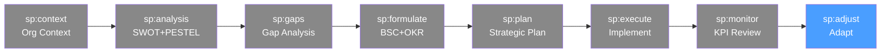

# /sp-adjust — Strategic Planning: Strategy Adjustment

> *"The best strategy is not the one that survives the planning session — it's the one that learns and adapts. Organizations that treat their strategy as a hypothesis to test outperform those that treat it as a plan to execute."*

Cierra el ciclo de planificación estratégica. Evalúa qué funcionó y qué no, actualiza los supuestos estratégicos, refresca OKRs y BSC para el próximo ciclo, y documenta los aprendizajes que alimentarán el siguiente sp:analysis.

**THYROX Stage:** Stage 12 STANDARDIZE.

**Tollgate:** Aprendizajes estratégicos documentados, supuestos actualizados, y decisión explícita sobre el próximo ciclo (continuar estrategia / pivote parcial / rediseño completo).

---

## Ciclo SP — foco en Adjust



## Pre-condición

- **sp:monitor completado** — al menos un ciclo de revisión con KPIs, RAG status y acciones documentadas.
- Datos suficientes para evaluar si los supuestos estratégicos se cumplieron.
- Liderazgo disponible para sesión de aprendizajes y decisiones del próximo ciclo.

---

## Cuándo usar este paso

- Al final del ciclo estratégico (anual o del período definido en sp:context)
- Cuando el monitoreo detecta que los supuestos del Strategy Map resultaron incorrectos
- Ante un cambio de entorno significativo (nuevo competidor disruptivo, cambio regulatorio mayor, crisis económica) que invalide supuestos clave
- Antes de iniciar el próximo ciclo de sp:analysis — los aprendizajes del ciclo actual alimentan el siguiente

## Cuándo NO usar este paso

- Para ajustes tácticos menores de iniciativas → gestionar en sp:monitor con el proceso RAG
- En los primeros 6 meses del ciclo — sin suficientes datos para evaluar supuestos estratégicos
- Como reacción a resultados de un solo trimestre — un mal trimestre no invalida una estrategia; dos o tres sí deben provocar revisión

---

## Actividades

### 1. Evaluar qué funcionó vs. qué no funcionó

La evaluación honesta del ciclo estratégico es el insumo más valioso para el siguiente. Requiere distinguir entre:

| Categoría | Descripción | Ejemplo |
|-----------|------------|---------|
| **Funcionó según lo previsto** | El supuesto se cumplió, la iniciativa produjo el resultado esperado | "NPS aumentó cuando mejoramos el onboarding — hipótesis confirmada" |
| **Funcionó pero por razones inesperadas** | El resultado se logró, pero el mecanismo causal fue distinto al previsto | "El ARR creció pero por expansion, no por adquisición — canales distintos" |
| **No funcionó — ejecución** | El supuesto era correcto pero la ejecución fue deficiente | "La iniciativa de automatización era correcta pero el equipo no tenía la capacidad" |
| **No funcionó — supuesto erróneo** | El supuesto estratégico resultó incorrecto | "Asumimos que bajar el precio aumentaría volumen; el segmento es precio-insensible" |
| **No funcionó — entorno cambió** | El contexto externo cambió y anuló la hipótesis | "La regulación nueva forzó un cambio de producto que invalidó la hoja de ruta" |

Esta distinción es crítica: si la causa es ejecución, se mejora el proceso. Si es supuesto erróneo, se reformula la estrategia.

### 2. Actualizar supuestos estratégicos

Revisar los supuestos del Strategy Map a la luz de los resultados:

| Supuesto original | Estado actual | Evidencia | Acción |
|------------------|--------------|-----------|--------|
| "Si mejoramos el onboarding, el NPS subirá" | Confirmado | NPS 42→65 en cohortes con nuevo onboarding | Mantener y escalar |
| "El churn se reducirá si el NPS supera 60" | Parcialmente confirmado | Churn bajó 5pp pero el efecto es menor de lo esperado | Ajustar hipótesis — NPS no es el único factor de retención |
| "La automatización de QA reduce el cycle time a 2 meses" | Incorrecto | Cycle time mejoró a 3.5 meses — bottleneck fue arquitectura, no QA | Reemplazar supuesto: "Rediseño de arquitectura habilita cycle time <2 meses" |

Ver template: [strategy-refresh-template.md](./assets/strategy-refresh-template.md)

### 3. Decisión sobre el próximo ciclo

Con base en los aprendizajes, el liderazgo debe tomar una decisión explícita:

**Opción A: Continuar la estrategia (refinamiento)**
- Los supuestos fundamentales se confirmaron
- La dirección es correcta; ajustar ejecución y metas
- Refrescar OKRs y presupuesto para el nuevo período

**Opción B: Pivote parcial**
- Algunos supuestos resultaron incorrectos pero el contexto general no cambió
- Mantener la misión y visión, ajustar 1-3 objetivos estratégicos o perspectivas del BSC
- Reformular los OKRs afectados

**Opción C: Rediseño estratégico**
- Los supuestos fundamentales resultaron incorrectos o el entorno cambió materialmente
- Regresar a sp:analysis con el entorno actualizado
- El ciclo actual sirve como baseline enriquecido para el nuevo análisis

**Marco de decisión:**

| Si... | Entonces... |
|-------|------------|
| >70% de los supuestos del Strategy Map se confirmaron | Opción A — refinar |
| 40-70% de los supuestos se confirmaron | Opción B — pivote parcial |
| <40% de los supuestos se confirmaron o el entorno cambió materialmente | Opción C — rediseño |

### 4. Refrescar OKRs para el próximo ciclo

Si la decisión es continuar o pivote parcial:

- Revisar los OKRs que no se lograron — ¿el target era irrealista o la ejecución fue deficiente?
- Ajustar los targets del BSC al nuevo baseline (las mejoras del ciclo actual son el nuevo punto de partida)
- Incorporar las iniciativas incompletas del ciclo anterior en los nuevos OKRs
- Establecer 1-2 OKRs nuevos que aborden los aprendizajes del ciclo anterior

### 5. Actualizar el BSC con nuevos targets

El BSC para el próximo ciclo parte del baseline actualizado al cierre del ciclo actual:

| KPI | Baseline original | Logrado al cierre | Nuevo target (próximo ciclo) | Justificación |
|-----|-------------------|------------------|------------------------------|---------------|
| ARR | $2M | $4.5M | $8M | Aceleración en H2 confirma capacidad |
| NPS | 42 | 65 | 75 | Mejora fue más rápida de lo esperado |
| Cycle time | 6 meses | 3.5 meses | 2 meses | Bottleneck resuelto en arquitectura |
| eNPS | 35 | 40 | 60 | Avance lento — requiere inversión mayor |

### 6. Documentar aprendizajes estratégicos

Los aprendizajes documentados son el activo más valioso del ciclo:

**Formato de aprendizaje estratégico:**
```
Aprendizaje N: [Título]
Contexto: ¿Cuál era el supuesto original?
Evidencia: ¿Qué observamos que confirma o refuta el supuesto?
Implicación: ¿Cómo cambia esto nuestra comprensión del negocio o el mercado?
Acción para el próximo ciclo: ¿Qué haremos diferente?
```

### 7. Trigger de nuevo ciclo

Si la decisión es Opción C (rediseño), iniciar inmediatamente el nuevo ciclo de sp:analysis con el entorno actualizado. Los aprendizajes del ciclo actual son el mejor insumo para el SWOT y PESTEL actualizado.

---

## Artefacto esperado

`{wp}/standardize/strategy-adjustment-[YYYY].md` — usando template: [strategy-refresh-template.md](./assets/strategy-refresh-template.md)

---

## Red Flags — señales de ajuste estratégico mal ejecutado

- **Atribuir todos los fracasos a "ejecución deficiente"** — muchas veces el supuesto era incorrecto; culpar siempre a la ejecución impide aprender de errores estratégicos
- **Cambiar la estrategia cada trimestre** — la sobreajuste produce confusión organizacional; ajustar solo cuando hay evidencia suficiente, no ante cada variación
- **No documentar los aprendizajes** — la memoria organizacional sobre qué funcionó y qué no es valiosa; sin documentación, los mismos errores se repiten
- **Fijar OKRs del próximo ciclo sin actualizar el baseline** — los nuevos targets deben partir del estado actual, no del estado hace 12 meses
- **Sesión de ajuste sin honestidad radical** — si el liderazgo no puede admitir qué no funcionó, el ajuste será superficial y los próximos OKRs reproducirán los mismos errores
- **Omitir la perspectiva del entorno** — si el PESTEL cambió, los ajustes deben reflejar la nueva realidad, no solo las métricas internas

---

## Estado en now.md

**Al INICIAR este step:**
```yaml
methodology_step: sp:adjust
flow: sp
```

**Al COMPLETAR** (aprendizajes documentados + decisión del próximo ciclo tomada):
```yaml
methodology_step: sp:adjust  # completado → ciclo cerrado
flow: sp
```

## Siguiente paso

- **Continuar ciclo (Opción A/B):** Refrescar OKRs y BSC → regresar a `sp:execute` para el nuevo período
- **Rediseño (Opción C):** Regresar a `sp:context` para nuevo ciclo de planificación con entorno actualizado
- **Cerrar WP:** Si el objetivo estratégico del WP fue logrado y no hay nuevo ciclo → cerrar el WP

---

## Limitaciones

- La distinción entre "ejecución deficiente" y "supuesto incorrecto" requiere honestidad y a veces datos difíciles de obtener
- El refresh de OKRs puede generar fatiga organizacional si se hace con demasiada frecuencia — la estabilidad de los objetivos también tiene valor
- Las decisiones de pivote o rediseño son políticamente complejas — requieren el apoyo del board/inversores además del equipo directivo
- Algunos aprendizajes solo son visibles después de 2-3 ciclos de ejecución; la estrategia requiere paciencia con la evidencia

---

## Reference Files

### Assets
- [strategy-refresh-template.md](./assets/strategy-refresh-template.md) — Tabla de revisión: Supuesto | Original | Realidad | Impacto | Acción

### References
- [adaptive-strategy-guide.md](./references/adaptive-strategy-guide.md) — Cuándo y cómo ajustar la estrategia a mitad de ciclo: criterios de decisión, opciones y proceso
