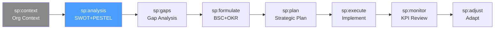

# /sp-analysis — Strategic Planning: Environmental Analysis

> *"Strategy without analysis is just hope. You need to understand where you stand before you can decide where to go."*

Ejecuta el análisis ambiental estratégico completo. Produce el diagnóstico externo e interno que sirve como insumo para la formulación de estrategia (sp:formulate).

**THYROX Stage:** Stage 2 BASELINE.

**Tollgate:** SWOT, PESTEL y Porter's Five Forces completados y validados con stakeholders clave antes de avanzar a sp:gaps.

---

## Ciclo SP — foco en Analysis



## Pre-condición

- **sp:context completado** — el contexto organizacional (misión, visión, stakeholders, período estratégico) debe estar documentado antes de iniciar el análisis.
- Acceso a datos de mercado, competencia e internos de la organización.
- Al menos un stakeholder clave disponible para validar hallazgos.

---

## Cuándo usar este paso

- Al iniciar un ciclo de planificación estratégica (anual o plurianual)
- Cuando la organización necesita entender su posición competitiva actual
- Antes de formular OKRs o un Balanced Scorecard
- Cuando hay cambios significativos en el entorno (nuevo competidor, cambio regulatorio, crisis)

## Cuándo NO usar este paso

- Si el análisis ambiental ya fue completado en los últimos 6 meses y el entorno no ha cambiado — reutilizar y documentar supuestos vigentes
- Para proyectos operacionales sin componente estratégico → usar DMAIC o PDCA
- Si no hay datos suficientes para el análisis — primero completar la recopilación de datos (sp:context)

---

## Actividades

### 1. SWOT — Fortalezas, Debilidades, Oportunidades, Amenazas

El SWOT es el punto de partida del análisis. Combina perspectiva interna (Strengths/Weaknesses) con perspectiva externa (Opportunities/Threats).

**Cuadrante Fortalezas (interno — positivo):**
Factores internos que dan ventaja competitiva. Preguntar: ¿Qué hacemos mejor que la competencia? ¿Qué recursos únicos tenemos?

| Fortaleza | Evidencia | Relevancia estratégica |
|-----------|-----------|----------------------|
| [Ej: Marca reconocida] | [NPS = 72, top 3 del sector] | [Alta — diferenciador de precio] |
| [Ej: Talento técnico especializado] | [15% de empleados con PhD en área clave] | [Alta — barrera de entrada] |

**Cuadrante Debilidades (interno — negativo):**
Factores internos que limitan la competitividad. Preguntar: ¿Dónde perdemos clientes? ¿Qué nos cuesta más que a la competencia?

| Debilidad | Evidencia | Impacto |
|-----------|-----------|---------|
| [Ej: Tecnología legacy] | [70% de sistemas >10 años] | [Alto — limita velocidad de lanzamiento] |
| [Ej: Concentración de clientes] | [Top 3 clientes = 60% revenue] | [Crítico — riesgo de dependencia] |

**Cuadrante Oportunidades (externo — positivo):**
Factores del entorno que la organización puede aprovechar. Fuente: PESTEL + Five Forces.

| Oportunidad | Fuente | Ventana temporal |
|-------------|--------|-----------------|
| [Ej: Crecimiento del segmento SMB en LATAM] | [PESTEL: económico] | [2-3 años] |
| [Ej: Regulación favorece proveedores locales] | [PESTEL: legal] | [Inmediata] |

**Cuadrante Amenazas (externo — negativo):**
Factores del entorno que pueden perjudicar a la organización.

| Amenaza | Fuente | Probabilidad | Impacto |
|---------|--------|-------------|---------|
| [Ej: Entrada de player global con pricing agresivo] | [Five Forces: nuevos entrantes] | [Alta] | [Crítico] |
| [Ej: Escasez de talento en el sector] | [PESTEL: social] | [Media] | [Alto] |

### 2. PESTEL — Análisis del Macro-entorno

Analiza las 6 dimensiones del entorno externo que afectan a la organización.

| Dimensión | Factor identificado | Descripción del impacto | Significancia (Alta/Media/Baja) |
|-----------|--------------------|-----------------------|-------------------------------|
| **Político** | [Ej: Cambio de gobierno] | [Nuevo régimen fiscal para empresas tech] | Alta |
| **Económico** | [Ej: Inflación 8%] | [Presión en márgenes y poder adquisitivo de clientes] | Alta |
| **Social** | [Ej: Trabajo remoto normalizado] | [Oportunidad de expansión sin presencia física] | Media |
| **Tecnológico** | [Ej: Adopción de IA generativa] | [Automatización de procesos clave del sector] | Alta |
| **Ecológico/Ambiental** | [Ej: Regulación ESG] | [Nuevos requisitos de reporte y operación] | Media |
| **Legal** | [Ej: GDPR/protección de datos] | [Cumplimiento obligatorio — costo de adaptación] | Alta |

> Priorizar los factores con significancia Alta para alimentar el SWOT (Oportunidades y Amenazas).

### 3. Porter's Five Forces — Análisis Competitivo

Evalúa la intensidad competitiva y la estructura de rentabilidad del sector.

| Fuerza | Intensidad (1-5) | Factores clave | Implicación estratégica |
|--------|-----------------|----------------|------------------------|
| **Amenaza de nuevos entrantes** | [1-5] | [Barreras de entrada, economías de escala, acceso a capital] | [Ej: Alta → invertir en diferenciación y lealtad] |
| **Poder negociador de proveedores** | [1-5] | [Concentración de proveedores, costos de cambio, sustitutos] | [Ej: Medio → diversificar base de proveedores] |
| **Poder negociador de compradores** | [1-5] | [Volumen de compra, sensibilidad al precio, switching costs] | [Ej: Alto → programas de retención y switching costs] |
| **Amenaza de sustitutos** | [1-5] | [Disponibilidad de alternativas, precio/rendimiento de sustitutos] | [Ej: Media → innovar en propuesta de valor] |
| **Intensidad de la rivalidad** | [1-5] | [Número de competidores, crecimiento del mercado, diferenciación] | [Ej: Alta → competir en nicho vs. war of attrition] |

**Conclusión de Five Forces:** [Síntesis — ¿el sector es estructuralmente atractivo? ¿Dónde están las presiones mayores?]

Ver guía detallada: [five-forces-guide.md](./references/five-forces-guide.md)

### 4. Baseline interno — capacidades, recursos y cultura

Complementa el SWOT con un inventario cuantitativo de capacidades internas.

**Capacidades clave:**
| Capacidad | Nivel actual (1-5) | Benchmark sectorial | Brecha |
|-----------|-------------------|---------------------|--------|
| [Ej: Desarrollo de producto] | 3 | 4 | -1 |
| [Ej: Gestión de clientes] | 4 | 3 | +1 |

**Recursos estratégicos:**
| Recurso | Estado | Comentario |
|---------|--------|-----------|
| Capital financiero | [Ej: $5M disponible] | [Runway 18 meses] |
| Capital humano | [Ej: 120 FTEs] | [15% en roles críticos con alta rotación] |
| Capital tecnológico | [Ej: Stack mixto] | [60% cloud, 40% on-premise legacy] |
| Capital de marca | [Ej: Reconocimiento regional] | [NPS 68 — por encima del sector] |

**Cultura organizacional:**
| Dimensión | Observación | Impacto estratégico |
|-----------|-------------|---------------------|
| Orientación al cambio | [Ej: Resistencia media] | [Factor de riesgo para transformaciones grandes] |
| Colaboración interdepartamental | [Ej: Silos entre producto y ventas] | [Limita go-to-market velocity] |

---

## Artefacto esperado

`{wp}/analyze/environmental-analysis.md` — usar template: [swot-template.md](./assets/swot-template.md) y [pestel-template.md](./assets/pestel-template.md)

---

## Red Flags — señales de análisis mal ejecutado

- **SWOT sin evidencia** — fortalezas y debilidades declaradas sin datos o ejemplos concretos son opiniones, no análisis
- **PESTEL copiado de informes genéricos** — el PESTEL debe ser específico para el sector y geografía de la organización
- **Five Forces sin intensidad cuantificada** — "alta" sin escala (1-5) hace imposible priorizar respuestas estratégicas
- **SWOT con más de 5 items por cuadrante** — señal de falta de priorización; los más importantes se diluyen
- **Oportunidades y amenazas confundidas con debilidades** — oportunidades/amenazas son EXTERNAS; debilidades son INTERNAS
- **Baseline interno sin comparación sectorial** — una capacidad de nivel 3 puede ser excelente o mediocre según el benchmark

### Anti-racionalizaciones comunes

| Racionalización | Por qué es trampa | Respuesta correcta |
|----------------|-------------------|--------------------|
| *"Ya sabemos cómo está el mercado, no necesitamos PESTEL"* | El conocimiento implícito no es análisis — sin documentarlo, no hay base para debatir ni actualizar | Documentar incluso lo "obvio"; el valor está en el proceso colectivo |
| *"Los Five Forces aplican solo a grandes empresas"* | La estructura competitiva afecta a toda organización que opera en un mercado | Adaptar el nivel de detalle al tamaño, pero no omitir el análisis |
| *"El SWOT lo hacemos en una sesión de 2 horas"* | Un SWOT en 2 horas es brainstorming, no análisis — requiere datos previos y validación | Separar recopilación de datos (días) de síntesis en taller (2 horas) |

---

## Estado en now.md

**Al INICIAR este step:**
```yaml
methodology_step: sp:analysis
flow: sp
```

**Al COMPLETAR** (SWOT + PESTEL + Five Forces validados):
```yaml
methodology_step: sp:analysis  # completado → listo para sp:gaps
flow: sp
```

## Siguiente paso

Cuando SWOT, PESTEL y Five Forces están documentados y validados con stakeholders → `sp:gaps`

---

## Limitaciones

- El análisis PESTEL y Five Forces refleja el entorno en un momento específico; en sectores dinámicos, la vigencia puede ser de 6-12 meses
- La calidad del SWOT depende de la honestidad organizacional — culturas que evitan reconocer debilidades producirán SWOTs sesgados
- Porter's Five Forces asume estructura de mercado relativamente estable; en mercados emergentes o en disrupción, la aplicación requiere ajustes
- El baseline interno requiere acceso a datos reales — sin métricas, las capacidades son percepciones

---

## Reference Files

### Assets
- [swot-template.md](./assets/swot-template.md) — Template de 4 cuadrantes para SWOT con estructura de evidencia
- [pestel-template.md](./assets/pestel-template.md) — Template PESTEL con 6 dimensiones: factor, descripción, impacto, significancia

### References
- [five-forces-guide.md](./references/five-forces-guide.md) — Guía de Porter's Five Forces: las 5 fuerzas explicadas con implicaciones estratégicas y escala de intensidad
