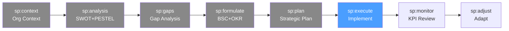

# /sp-execute — Strategic Planning: Strategy Execution

> *"Strategy execution is where most strategies die — not for lack of ambition, but for lack of alignment, accountability, and change management. 70% of strategic plans fail in execution."*

Lanza y gestiona la ejecución de las iniciativas estratégicas. Cascadea los OKRs organizacionales a departamentos y equipos, gestiona el cambio y el compromiso, y establece el seguimiento temprano de progreso.

**THYROX Stage:** Stage 10 IMPLEMENT.

**Tollgate:** Todas las iniciativas con kick-off realizado, OKRs cascadeados a nivel de equipo, y primer check-in de progreso completado.

---

## Ciclo SP — foco en Execute



## Pre-condición

- **sp:plan completado** — plan estratégico aprobado con owners, presupuesto y roadmap.
- Owners de iniciativas comprometidos y con recursos asignados.
- Plan de comunicación de sp:plan definido.

---

## Cuándo usar este paso

- Al iniciar la ejecución de las iniciativas del plan estratégico
- Cuando hay iniciativas aprobadas que necesitan kick-off formal y cascadeo
- Para asegurar que la estrategia se traduce a compromisos de equipo e individuales

## Cuándo NO usar este paso

- Sin plan aprobado — no se puede ejecutar lo que no está definido
- Para la ejecución táctica day-to-day → usar el sistema de gestión de proyectos del equipo (Jira, Linear, etc.)
- Si el equipo no conoce la estrategia — primero completar el plan de comunicación antes del kick-off

---

## Actividades

### 1. Kick-offs de iniciativas

Cada iniciativa estratégica comienza con un kick-off formal que establece:
- El contexto estratégico (por qué esta iniciativa es parte de la estrategia)
- El objetivo y los KPIs de éxito
- El equipo y los roles (RACI simplificado)
- El cronograma de alto nivel y los hitos clave
- El proceso de reporte y escalación

**Agenda típica de kick-off de iniciativa estratégica (90 minutos):**

| Segmento | Duración | Contenido | Facilitador |
|---------|---------|-----------|------------|
| Contexto estratégico | 15 min | ¿Por qué esta iniciativa? ¿Cómo conecta con la estrategia? | Owner de iniciativa |
| Objetivo y KPIs | 15 min | ¿Qué necesitamos lograr y cómo mediremos el éxito? | Owner de iniciativa |
| Roles y RACI | 20 min | ¿Quién hace qué? ¿Quién decide? ¿Quién aprueba? | Owner de iniciativa |
| Cronograma y hitos | 20 min | ¿Cuándo lograremos qué? ¿Cuáles son los hitos críticos? | Owner de iniciativa |
| Dependencias y riesgos | 10 min | ¿Qué puede bloquear el progreso? ¿Cómo escalamos? | Todo el equipo |
| Compromisos y Q&A | 10 min | Confirmar compromisos individuales para el primer sprint | Owner + equipo |

### 2. Cascadeo de estrategia a departamentos y equipos

Los OKRs organizacionales deben traducirse en OKRs de departamento y luego en OKRs individuales.

**Proceso de cascadeo:**
```
Org OKRs (CEO + C-suite) → validados en sp:formulate
  ↓ "¿Cómo contribuye mi departamento a este OKR?"
Dept OKRs (Directores) → creados en sp:execute
  ↓ "¿Cómo contribuye mi equipo a este OKR de departamento?"
Team OKRs (Managers) → creados en sp:execute
  ↓ "¿Cómo contribuyo yo a este OKR de equipo?"
Individual OKRs (Empleados) → opcional, según madurez de la org
```

Ver template: [strategy-cascade-template.md](./assets/strategy-cascade-template.md)

**Reglas del cascadeo:**
- Los OKRs de departamento deben alinearse con (no copiar) los OKRs organizacionales
- Cada KR del nivel superior debe ser soportado por al menos un OKR del nivel inferior
- El cascadeo es una negociación — los equipos contribuyen con sus OKRs al objetivo superior, no los reciben como mandato
- Ciclo de cascadeo: Org OKRs aprobados → 2 semanas para que directores definan dept OKRs → 2 semanas para team OKRs

### 3. Plan de gestión del cambio

La ejecución estratégica siempre implica cambio. Sin gestión del cambio, la resistencia organizacional sabotea las iniciativas.

**Modelo ADKAR de gestión del cambio:**

| Elemento | Pregunta | Acción |
|---------|---------|--------|
| **A**wareness | ¿Saben todos por qué cambiamos? | Comunicación de la estrategia y el contexto |
| **D**esire | ¿Quieren cambiar? | Involucrar a líderes de opinión; WIIFM (what's in it for me) |
| **K**nowledge | ¿Saben cómo cambiar? | Capacitación, herramientas, procesos documentados |
| **A**bility | ¿Pueden cambiar? | Remover barreras; coaching; tiempo y recursos |
| **R**einforcement | ¿Se refuerza el cambio? | Reconocimiento; ajustes de procesos permanentes |

**Plan de gestión del cambio por iniciativa:**

| Iniciativa | Impacto en personas | Resistencia esperada | Plan ADKAR | Owner del cambio |
|-----------|--------------------|--------------------|-----------|-----------------|
| | Alta/Media/Baja | Alta/Media/Baja | [Acciones clave] | |

### 4. Comunicación estratégica en curso

La comunicación de la estrategia no termina con el kick-off — es un proceso continuo.

| Canal | Audiencia | Contenido | Frecuencia | Responsable |
|-------|-----------|-----------|-----------|-------------|
| All-hands mensual | Toda la organización | Progreso de iniciativas + hitos logrados | Mensual | CEO |
| Leadership review | C-suite + Directores | BSC dashboard + OKR check-in | Quincenal | CEO / COO |
| Team meetings | Por departamento | OKRs del equipo + estado de iniciativas | Semanal | Manager |
| Strategy newsletter | Toda la organización | Historia de progreso + logros | Mensual | CMO / Comunicaciones |

### 5. Seguimiento temprano de progreso

En las primeras 4-6 semanas de ejecución, establecer el ritmo de seguimiento:

**Señales de progreso temprano a monitorear:**
| Señal | ¿Cómo medir? | Frecuencia |
|-------|-------------|-----------|
| Kick-offs realizados | % de iniciativas con kick-off completado | Semana 1-2 |
| OKRs cascadeados | % de departamentos con OKRs aprobados | Semana 2-4 |
| Hitos de quick wins | % de quick wins entregados | Semana 4-8 |
| Engagement del equipo | ¿Los managers hablan de la estrategia en sus reuniones? | Quincenal |
| Primeras métricas de KPI | ¿Están las métricas moviéndose en la dirección correcta? | Mensual |

---

## Artefacto esperado

`{wp}/execute/strategy-execution-log.md` — registro de kick-offs, cascadeo de OKRs y seguimiento temprano.
`{wp}/execute/cascade.md` — usando template: [strategy-cascade-template.md](./assets/strategy-cascade-template.md)

---

## Red Flags — señales de ejecución estratégica fallida

- **Iniciativas sin kick-off formal** — los proyectos que comienzan sin kick-off carecen de alineamiento desde el inicio; los primeros problemas generan confusión de roles
- **OKRs cascadeados top-down sin negociación** — los OKRs mandatados (no comprometidos) producen compliance sin ownership real
- **Sin gestión del cambio** — si las iniciativas afectan procesos o comportamientos, la resistencia pasiva es inevitable sin un plan explícito
- **Comunicación estratégica solo en el lanzamiento** — la comunicación única produce "strategy amnesia" en 30-60 días
- **Medir solo KPIs de resultado en los primeros meses** — en la fase de ejecución, los KPIs de proceso (¿estamos haciendo lo que dijimos?) son más útiles que los de resultado (aún no hay tiempo suficiente para verlos)
- **Quick wins que no se comunican** — si los primeros logros no se celebran y comunican, se pierde el momentum organizacional

---

## Estado en now.md

**Al INICIAR este step:**
```yaml
methodology_step: sp:execute
flow: sp
```

**Al COMPLETAR** (kick-offs realizados + OKRs cascadeados + primer check-in):
```yaml
methodology_step: sp:execute  # completado → listo para sp:monitor
flow: sp
```

## Siguiente paso

Cuando las iniciativas tienen kick-off, los OKRs están cascadeados y el primer check-in completado → `sp:monitor`

---

## Limitaciones

- La ejecución estratégica es iterativa — no todo sale según el plan y eso es normal; lo crítico es detectar desviaciones temprano
- El cascadeo de OKRs a organizaciones de más de 200 personas requiere coordinación extensa; puede tardar 4-6 semanas
- La gestión del cambio no es instantánea — el modelo ADKAR es una guía de proceso, no una checklist que se completa en una reunión
- En etapas tempranas, la falta de datos puede hacer que el seguimiento sea cualitativo — documentarlo como tal es mejor que fabricar métricas

---

## Reference Files

### Assets
- [strategy-cascade-template.md](./assets/strategy-cascade-template.md) — Tabla de alineación: Obj Org → Obj Depto → Obj Equipo

### References
- [strategy-communication-guide.md](./references/strategy-communication-guide.md) — Cómo comunicar la estrategia en todos los niveles: mensajes, canales y frecuencia
