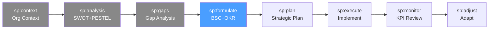

# /sp-formulate — Strategic Planning: Strategy Formulation

> *"Strategy is not a plan. It is a set of choices about where to play and how to win, expressed in objectives, measures, and cause-effect relationships that guide every decision."*

Ejecuta la formulación de la estrategia. Transforma los hallazgos del gap analysis (sp:gaps) en un sistema coherente de objetivos estratégicos, usando el Balanced Scorecard, el Strategy Map y OKRs como instrumentos complementarios.

**THYROX Stage:** Stage 5 STRATEGY.

**Tollgate:** Balanced Scorecard con objetivos en las 4 perspectivas, Strategy Map y OKRs de primer nivel aprobados por el liderazgo antes de avanzar a sp:plan.

---

## Ciclo SP — foco en Formulate



## Pre-condición

- **sp:gaps completado** — brechas cuantificadas y priorizadas con causa raíz documentada.
- Misión y visión organizacional claras (definidas en sp:context).
- Liderazgo disponible para validar objetivos estratégicos antes del tollgate.

---

## Cuándo usar este paso

- Al definir la estrategia para un ciclo de planificación (anual o plurianual)
- Cuando la organización necesita traducir una visión aspiracional en objetivos medibles
- Para alinear iniciativas, recursos y equipos bajo un marco estratégico común
- Cuando hay múltiples iniciativas no coordinadas — el BSC y el Strategy Map fuerzan la priorización

## Cuándo NO usar este paso

- Para mejoras operacionales sin componente estratégico → usar PDCA o DMAIC
- Si el análisis de brechas no está completo — formular estrategia sin entender los gaps es planificación ciega
- Organizaciones con menos de 20 personas pueden usar directamente OKRs sin el aparato completo del BSC

---

## Actividades

### 1. Definir objetivos estratégicos

Los objetivos estratégicos son declaraciones de qué debe lograr la organización para cerrar las brechas identificadas. Deben ser:
- **Estratégicos**, no operacionales — "Aumentar lealtad de clientes" vs. "Responder tickets en <2h"
- **Orientados a resultado** — qué lograr, no qué hacer
- **En cantidad manejable** — entre 3 y 5 por perspectiva BSC; más de 20 en total es imposible de gestionar

### 2. Balanced Scorecard — 4 perspectivas

El BSC organiza los objetivos en 4 perspectivas que crean una narrativa causal de la estrategia:

> **Perspectiva financiera** — ¿qué resultados financieros necesitamos lograr para satisfacer a los accionistas/stakeholders?

| Objetivo | Medida (KPI) | Baseline | Target | Iniciativa principal |
|----------|-------------|----------|--------|---------------------|
| [Ej: Incrementar ARR] | ARR ($) | $2M | $8M | Expansión cuentas enterprise |
| [Ej: Mejorar margen EBITDA] | EBITDA margin | 12% | 25% | Reducción costos + pricing |
| [Ej: Diversificar fuentes de ingreso] | % revenue por segmento | 90% Producto A | 60/40 Producto A/B | Lanzamiento Producto B |

> **Perspectiva cliente** — ¿qué propuesta de valor debemos ofrecer para alcanzar los objetivos financieros?

| Objetivo | Medida (KPI) | Baseline | Target | Iniciativa principal |
|----------|-------------|----------|--------|---------------------|
| [Ej: Aumentar lealtad de clientes] | NPS | 42 | 70 | Programa de customer success |
| [Ej: Expandir en segmento SMB] | # clientes SMB activos | 50 | 200 | Go-to-market SMB |
| [Ej: Mejorar time-to-value] | Días de onboarding | 45 días | 14 días | Rediseño onboarding |

> **Perspectiva procesos internos** — ¿en qué procesos debemos ser excelentes para satisfacer a los clientes?

| Objetivo | Medida (KPI) | Baseline | Target | Iniciativa principal |
|----------|-------------|----------|--------|---------------------|
| [Ej: Acelerar desarrollo de producto] | Cycle time lanzamiento | 6 meses | 2 meses | Adopción de metodología ágil |
| [Ej: Reducir defectos en entrega] | Tasa de defectos en producción | 8% | <1% | Automatización QA |
| [Ej: Escalar soporte sin costos lineales] | Tickets resueltos/FTE | 50/mes | 150/mes | Base de conocimiento + autoservicio |

> **Perspectiva aprendizaje y crecimiento** — ¿qué capacidades, tecnología y cultura necesitamos para ejecutar los procesos?

| Objetivo | Medida (KPI) | Baseline | Target | Iniciativa principal |
|----------|-------------|----------|--------|---------------------|
| [Ej: Desarrollar capacidad de data analytics] | % decisiones basadas en datos | 20% | 80% | Contratación data team + tooling |
| [Ej: Reducir rotación de talento clave] | eNPS / rotación en roles críticos | 35% rotación | <15% | Programa de desarrollo y compensación |
| [Ej: Cultura de innovación] | # experimentos lanzados/trimestre | 2 | 10 | Innovation time + budget |

Ver template completo: [balanced-scorecard-template.md](./assets/balanced-scorecard-template.md)

### 3. Strategy Map — relaciones causa-efecto

El Strategy Map visualiza cómo los objetivos de las 4 perspectivas se conectan causalmente: los objetivos de aprendizaje habilitan los procesos, los procesos habilitan la propuesta de valor al cliente, y la propuesta de valor genera los resultados financieros.

**Estructura del Strategy Map:**

```
[FINANCIERO]
       ↑ "para generar"
[CLIENTE]
       ↑ "para servir a"
[PROCESOS INTERNOS]
       ↑ "habilitados por"
[APRENDIZAJE Y CRECIMIENTO]
```

**Cómo construir el Strategy Map:**
1. Empezar desde abajo: ¿Qué capacidades (L&G) habilitan los procesos críticos?
2. ¿Qué procesos producen la propuesta de valor al cliente?
3. ¿Qué logros con clientes generan los resultados financieros?
4. Trazar flechas de causalidad — cada flecha es una hipótesis estratégica
5. Identificar los eslabones débiles — donde la causalidad es más supuesta que demostrada

Ver guía detallada: [strategy-map-guide.md](./references/strategy-map-guide.md)

### 4. OKRs — Objectives and Key Results

Los OKRs traducen los objetivos estratégicos del BSC en compromisos trimestrales o anuales con resultados específicos y medibles.

**Estructura de un OKR:**
```
Objective: [Declaración aspiracional e inspiradora — QUÉ lograr]
  KR1: [Resultado medible 1 — CÓMO saber si lo logramos] → Target: [número]
  KR2: [Resultado medible 2] → Target: [número]
  KR3: [Resultado medible 3] → Target: [número]
```

**OKRs de nivel organizacional (ejemplo):**

```
O1: Convertirnos en el proveedor preferido del segmento SMB en LATAM
  KR1: Aumentar NPS de clientes SMB de 42 a 65 al Q4
  KR2: Crecer la base de clientes SMB activos de 50 a 200 al cierre del año
  KR3: Reducir churn mensual de clientes SMB de 5% a <2% al Q3

O2: Construir una organización capaz de escalar 4× sin costos lineales
  KR1: Automatizar el 80% de los tickets de soporte de nivel 1 al Q2
  KR2: Reducir cycle time de lanzamiento de 6 meses a 2 meses al Q3
  KR3: Que el 100% del equipo tenga OKRs individuales alineados al Q1

O3: Lograr la salud financiera que nos permita invertir en crecimiento
  KR1: Alcanzar ARR de $4M al cierre del año (desde $2M)
  KR2: Mejorar EBITDA margin de 12% a 18% al Q4
  KR3: Reducir CAC en un 30% antes del Q3 mediante optimización de go-to-market
```

Ver template completo: [okr-template.md](./assets/okr-template.md)

### 5. Definir KPIs estratégicos

Los KPIs del BSC son los indicadores de seguimiento de los OKRs. Cada KPI debe tener:
- **Definición precisa** — qué mide exactamente y cómo se calcula
- **Frecuencia de medición** — semanal, mensual, trimestral
- **Owner** — quién es responsable de reportar el dato
- **Fuente de datos** — de dónde viene el número (no "estimación")

| KPI | Perspectiva BSC | Fórmula | Frecuencia | Owner | Fuente |
|-----|----------------|---------|-----------|-------|--------|
| ARR | Financiero | Σ contratos anualizados activos | Mensual | CFO | CRM |
| NPS | Cliente | % Promotores - % Detractores | Trimestral | CPO | Encuesta NPS |
| Cycle time | Procesos | Fecha merge PR → Fecha release | Por lanzamiento | CTO | Jira/Linear |
| eNPS | L&G | Encuesta empleados (Promotores - Detractores) | Semestral | CHRO | Encuesta interna |

---

## Artefacto esperado

`{wp}/strategy/strategy-formulation.md` — incluir BSC completo, Strategy Map en Mermaid, OKRs y tabla de KPIs.

Usar templates: [balanced-scorecard-template.md](./assets/balanced-scorecard-template.md) y [okr-template.md](./assets/okr-template.md)

---

## Red Flags — señales de formulación mal ejecutada

- **Más de 25 objetivos en el BSC** — el BSC pierde su poder de foco; priorizar a 3-5 por perspectiva
- **OKRs con Key Results que son tareas** — "KR: Lanzar el programa de onboarding" es una tarea, no un resultado; reescribir como "KR: Reducir tiempo de onboarding de 45 a 14 días"
- **Strategy Map sin flechas de causalidad** — una lista de objetivos no es un Strategy Map; las relaciones causa-efecto son lo que crea la narrativa estratégica
- **KPIs sin owner ni fuente de datos** — un KPI que nadie mide ni reporta no existe en la práctica
- **OKRs copiados del año anterior sin revisión** — si las brechas cambiaron, los OKRs deben cambiar
- **BSC solo con perspectiva financiera fuerte** — las otras 3 perspectivas son los inductores del resultado financiero; ignorarlas produce una estrategia unidimensional

---

## Estado en now.md

**Al INICIAR este step:**
```yaml
methodology_step: sp:formulate
flow: sp
```

**Al COMPLETAR** (BSC + Strategy Map + OKRs aprobados):
```yaml
methodology_step: sp:formulate  # completado → listo para sp:plan
flow: sp
```

## Siguiente paso

Cuando BSC, Strategy Map y OKRs están validados por el liderazgo → `sp:plan`

---

## Limitaciones

- El BSC requiere disciplina de seguimiento — sin un proceso de revisión periódica, se convierte en un documento olvidado
- Los OKRs de primer nivel deben ser cascadeados a los equipos en sp:execute — sin cascade, la estrategia queda en el papel
- El Strategy Map es una representación de hipótesis causales — algunas relaciones pueden resultar incorrectas al ejecutar y requerirán ajuste en sp:adjust
- La perspectiva de Aprendizaje y Crecimiento es la más difícil de medir — asegurarse de que los KPIs de L&G sean medibles, no aspiracionales

---

## Reference Files

### Assets
- [balanced-scorecard-template.md](./assets/balanced-scorecard-template.md) — Template BSC: Perspectiva | Objetivo | Medida | Baseline | Target | Iniciativa
- [okr-template.md](./assets/okr-template.md) — Template OKR: Objective + Key Results con estructura y ejemplos

### References
- [strategy-map-guide.md](./references/strategy-map-guide.md) — Guía para construir un Strategy Map con relaciones causa-efecto entre las 4 perspectivas BSC
