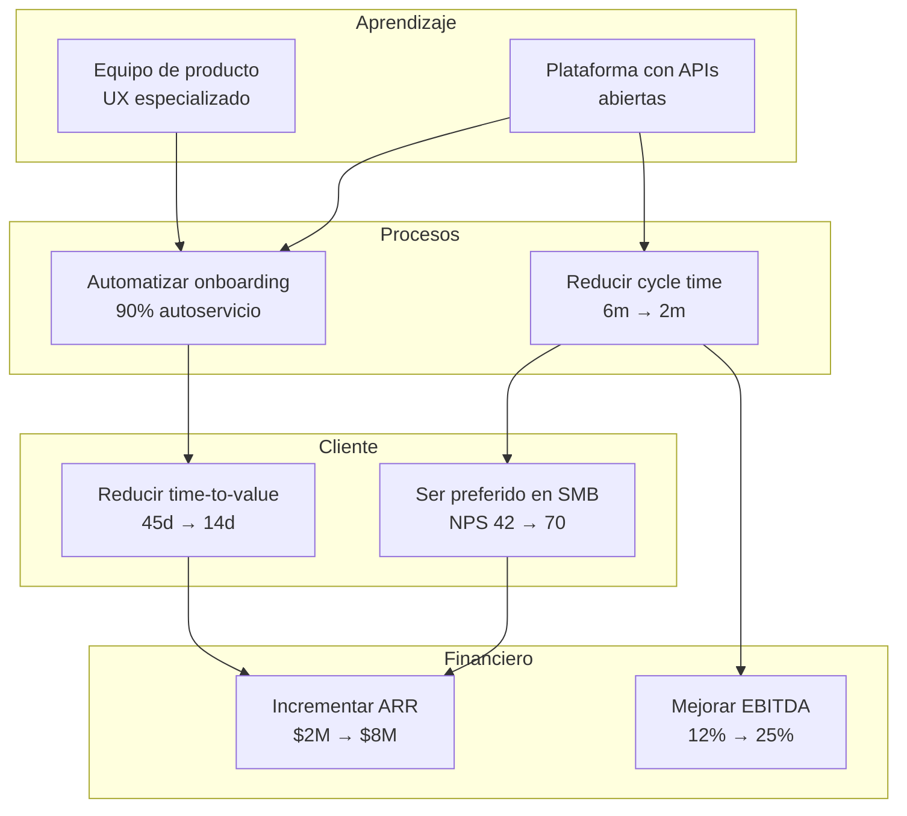

# Strategy Map Guide — Construcción con Lógica Causa-Efecto

## ¿Qué es un Strategy Map?

Un Strategy Map es una representación visual de la estrategia que muestra cómo los objetivos estratégicos de las 4 perspectivas del BSC se conectan causalmente. Desarrollado por Kaplan y Norton como extensión del Balanced Scorecard, el Strategy Map convierte el BSC de un tablero de métricas en una narrativa estratégica.

**Principio fundamental:** La estrategia es una hipótesis. El Strategy Map hace explícita esa hipótesis mostrando qué causa qué: "Si mejoramos [L&G], entonces mejorará [Proceso], lo que producirá [Resultado cliente], lo que generará [Resultado financiero]."

---

## Estructura del Strategy Map

```
┌─────────────────────────────────────────────────┐
│              PERSPECTIVA FINANCIERA              │
│   [Obj F1] → [Obj F2] → [Obj F3]               │
│   (resultados que generamos para stakeholders)   │
└──────────────────────┬──────────────────────────┘
                       │ genera
┌──────────────────────▼──────────────────────────┐
│              PERSPECTIVA CLIENTE                 │
│   [Obj C1] → [Obj C2] → [Obj C3]               │
│   (propuesta de valor que entregamos al cliente) │
└──────────────────────┬──────────────────────────┘
                       │ requiere
┌──────────────────────▼──────────────────────────┐
│           PERSPECTIVA PROCESOS INTERNOS          │
│   [Obj P1] → [Obj P2] → [Obj P3]               │
│   (excelencia operacional que nos diferencia)    │
└──────────────────────┬──────────────────────────┘
                       │ habilitado por
┌──────────────────────▼──────────────────────────┐
│        PERSPECTIVA APRENDIZAJE Y CRECIMIENTO     │
│   [Obj L1] → [Obj L2] → [Obj L3]               │
│   (activos intangibles que construimos)          │
└─────────────────────────────────────────────────┘
```

---

## Cómo construir el Strategy Map — 6 pasos

### Paso 1: Clarificar la proposición de valor

Antes de mapear, definir la proposición de valor diferenciadora. Las estrategias genéricas de Porter como base:
- **Excelencia operacional** — mejor precio/costo; procesos estandarizados y eficientes
- **Liderazgo de producto** — mejor producto/innovación; I+D y velocidad de lanzamiento
- **Intimidad con el cliente** — mejor solución personalizada; relación profunda y servicio

La proposición de valor determina qué perspectivas del BSC tienen más peso en el mapa.

### Paso 2: Definir los objetivos de la perspectiva Financiero

Empezar desde el "destino" de la estrategia:
- ¿Cuál es el tema financiero dominante? (crecimiento de revenue, mejora de productividad, o ambos)
- ¿Qué mix de objetivos financieros necesitamos? (revenue + margen + uso de activos)

**Temas financieros comunes:**
| Tema | Objetivos típicos |
|------|-----------------|
| Crecimiento de ingresos | Nuevos mercados, nuevos productos, cross-sell |
| Mejora de productividad | Reducción de costos, eficiencia operacional, utilización de activos |
| Gestión de riesgo | Diversificación, reducción de dependencias |

### Paso 3: Definir los objetivos de la perspectiva Cliente

Para cada objetivo financiero, preguntar: ¿Qué propuesta de valor al cliente produce ese resultado?

**Atributos de propuesta de valor y sus inductores:**
| Atributo | Inductor cliente | Ejemplo de objetivo |
|----------|-----------------|---------------------|
| Precio | Costo total de propiedad bajo | "Ser el proveedor más eficiente en costo para el segmento X" |
| Calidad | Confiabilidad, consistencia | "Cero defectos entregados al cliente" |
| Tiempo | Rapidez, disponibilidad | "Entrega en 24h garantizada" |
| Selección | Amplitud de catálogo | "Solución end-to-end para el segmento Y" |
| Funcionalidad | Características únicas | "La plataforma con más integraciones del sector" |
| Servicio | Relación, partnership | "NPS top 10% del sector" |
| Marca | Reputación, confianza | "Primera opción espontánea en X categoría" |

### Paso 4: Definir los objetivos de Procesos Internos

Para cada objetivo de cliente, preguntar: ¿Qué procesos necesitamos dominar para entregarlo?

**Las 4 familias de procesos del BSC:**
1. **Procesos de gestión operacional** — producción, distribución, calidad, gestión de proveedores
2. **Procesos de gestión de clientes** — selección, adquisición, retención, crecimiento de cuentas
3. **Procesos de innovación** — identificar oportunidades, diseñar, desarrollar, lanzar
4. **Procesos regulatorios y sociales** — medio ambiente, seguridad, salud, comunidad, compliance

### Paso 5: Definir los objetivos de Aprendizaje y Crecimiento

Para cada proceso crítico, preguntar: ¿Qué activos intangibles habilitan ese proceso?

**Los 3 activos intangibles del BSC:**
1. **Capital humano** — habilidades y competencias que el proceso requiere
2. **Capital de información** — sistemas, bases de datos, redes que habilitan el proceso
3. **Capital organizacional** — cultura, liderazgo, alineamiento, trabajo en equipo

### Paso 6: Trazar las flechas causa-efecto

Conectar los objetivos entre perspectivas con flechas. Cada flecha es una hipótesis:
```
[Objetivo L&G] → [habilita] → [Objetivo Proceso]
[Objetivo Proceso] → [produce] → [Objetivo Cliente]
[Objetivo Cliente] → [genera] → [Objetivo Financiero]
```

**Tipos de relaciones entre perspectivas:**
- **Relación directa** (una flecha) — A directamente causa B
- **Relación mediada** (cadena) — A causa B que causa C
- **Refuerzo mutuo** (bidireccional) — A y B se refuerzan entre sí (loops virtuosos)

---

## Lectura del Strategy Map — la narrativa estratégica

Un Strategy Map bien construido permite narrar la estrategia en una sola "historia":

> *"Para lograr [objetivo financiero 1], necesitamos [propuesta de valor al cliente]. Para entregar esa propuesta de valor, necesitamos ser excelentes en [proceso crítico]. Para dominar ese proceso, necesitamos construir [capacidad de L&G]. Por eso estamos invirtiendo en [iniciativa de L&G]."*

**Ejemplo de narrativa:**
> "Para incrementar el ARR de $2M a $8M, necesitamos convertirnos en el proveedor preferido del segmento SMB con el onboarding más rápido del sector. Para lograrlo, necesitamos automatizar el proceso de onboarding y hacer que el 90% sea autoservicio. Para eso, necesitamos construir un equipo de producto con expertise en UX de onboarding y una plataforma con APIs abiertas. Por eso estamos invirtiendo en contratar 3 product designers especializados y en re-arquitecturar la plataforma."

---

## Hipótesis estratégicas y cómo validarlas

Cada flecha en el Strategy Map es una hipótesis. Algunas son bien conocidas (NPS alto → menor churn); otras son supuestos. Identificar y priorizar la validación de las hipótesis más riesgosas:

| Hipótesis | Certeza (alta/media/baja) | Plan de validación |
|-----------|--------------------------|-------------------|
| [Si mejoramos el onboarding, el NPS subirá] | Media | Medir NPS en cohortes de clientes con nuevo onboarding vs. anterior |
| [Si subimos el NPS, el churn baja] | Alta — correlación conocida en SaaS | Análisis de regresión trimestral |
| [Si reducimos el cycle time, podemos lanzar 3 productos/año] | Baja — nunca lo hemos hecho | Pilot de un lanzamiento con metodología nueva |

Las hipótesis de baja certeza son candidatas a sp:pilot antes de invertir recursos masivos.

---

## Mermaid para Strategy Map

Representar el Strategy Map en Mermaid para incluir en artefactos de WP:



---

## Errores comunes en la construcción del Strategy Map

| Error | Consecuencia | Corrección |
|-------|-------------|-----------|
| Mapa sin flechas (solo cajas) | Es una lista de objetivos, no un mapa estratégico | Agregar flechas explícitas con etiquetas de causalidad |
| Todas las perspectivas tienen el mismo peso | La perspectiva dominante depende de la proposición de valor | Determinar qué perspectiva es el "motor" y darle más objetivos |
| Flechas de arriba hacia abajo (financiero causa L&G) | Invierte la lógica causal — L&G habilita, financiero es el resultado | Las flechas siempre van de abajo hacia arriba en el mapa |
| Objetivos que no conectan con ninguna flecha | Objetivos huérfanos sin relación causal no son estratégicos | Eliminar o conectar — todo objetivo debe tener rol causal |
| Mapa demasiado complejo (>20 nodos) | Nadie lo entiende ni lo usa | Simplificar a los 10-15 objetivos más críticos |
