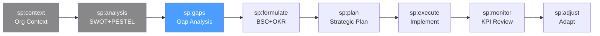

# /sp-gaps — Strategic Planning: Gap Analysis

> *"The gap between where you are and where you want to be is not a problem — it's a map. The art is understanding why the gap exists before deciding how to close it."*

Ejecuta el análisis de brechas estratégicas. Compara el estado actual (baseline de sp:analysis) con el estado futuro deseado, identifica y cuantifica las brechas, y prioriza las áreas de mayor impacto estratégico.

**THYROX Stage:** Stage 3 DIAGNOSE.

**Tollgate:** Brechas estratégicas cuantificadas y priorizadas, con causas raíz documentadas, antes de avanzar a sp:formulate.

---

## Ciclo SP — foco en Gaps



## Pre-condición

- **sp:analysis completado** — SWOT, PESTEL y baseline interno documentados.
- El estado futuro deseado (visión estratégica) debe estar definido en sp:context.
- Métricas de baseline disponibles para cuantificar brechas.

---

## Cuándo usar este paso

- Después de completar el análisis ambiental (sp:analysis) y antes de formular la estrategia
- Cuando la organización necesita priorizar entre múltiples áreas de mejora
- Para justificar la asignación de recursos estratégicos con evidencia de brechas
- Cuando hay desacuerdo sobre las prioridades — el análisis de brechas objetiviza la conversación

## Cuándo NO usar este paso

- Si el estado futuro deseado no está definido — primero clarificar la visión en sp:context
- Para brechas operacionales simples sin impacto estratégico → usar PDCA o DMAIC
- Si el baseline no existe — primero medir el estado actual antes de calcular brechas

---

## Actividades

### 1. Definir el estado futuro deseado

El estado futuro es la descripción concreta de dónde quiere estar la organización al final del horizonte estratégico. No es la visión genérica — es la articulación en métricas y capacidades.

| Dimensión | Estado actual (baseline) | Estado futuro deseado | Horizonte |
|-----------|--------------------------|----------------------|-----------|
| [Ej: Participación de mercado] | [15%] | [25%] | [3 años] |
| [Ej: Revenue recurrente (ARR)] | [$2M] | [$8M] | [3 años] |
| [Ej: NPS clientes] | [42] | [70+] | [2 años] |
| [Ej: Eficiencia operacional] | [Costo/unidad $45] | [Costo/unidad $30] | [2 años] |
| [Ej: Capacidad de innovación] | [1 producto/año] | [3 productos/año] | [3 años] |

> El estado futuro debe ser específico y medible. Frases como "ser el líder del mercado" no son estado futuro — son aspiraciones que deben traducirse a métricas.

### 2. Comparar estado actual vs. estado futuro — identificar brechas

Por cada dimensión, calcular la brecha absoluta y relativa:

```
Brecha absoluta = Estado futuro - Estado actual
Brecha relativa = (Estado futuro - Estado actual) / Estado actual × 100%
```

| Dimensión | Actual | Target | Brecha absoluta | Brecha % | Categoría |
|-----------|--------|--------|----------------|----------|-----------|
| [Participación de mercado] | 15% | 25% | +10pp | +67% | Crecimiento |
| [ARR] | $2M | $8M | +$6M | +300% | Crecimiento |
| [NPS] | 42 | 70 | +28 pts | +67% | Experiencia |
| [Costo/unidad] | $45 | $30 | -$15 | -33% | Eficiencia |

**Categorías de brecha:**
- **Crecimiento** — la organización necesita escalar en tamaño o alcance
- **Eficiencia** — la organización necesita mejorar la relación costo/output
- **Capacidad** — la organización necesita desarrollar nuevas habilidades o recursos
- **Experiencia** — la organización necesita mejorar la propuesta de valor percibida
- **Compliance** — la organización necesita alcanzar un estándar externo obligatorio

### 3. Cuantificar el impacto de cada brecha

No todas las brechas tienen el mismo peso estratégico. Cuantificar el impacto ayuda a priorizar.

| Dimensión | Brecha | Impacto si no se cierra | Valor en riesgo |
|-----------|--------|------------------------|----------------|
| [ARR] | +$6M | Pérdida de posición competitiva | [$X en oportunidad no capturada] |
| [NPS] | +28 pts | Churn acelerado | [X% de clientes en riesgo = $Y] |
| [Costo/unidad] | -$15 | Margen negativo en segmento clave | [$Z/año en margen comprimido] |

### 4. Análisis de causa raíz de brechas estratégicas

Para cada brecha de alta prioridad, identificar las causas raíz usando el framework de capacidades estratégicas:

**Framework de causas raíz estratégicas:**
| Categoría | Preguntas diagnósticas |
|-----------|----------------------|
| **Capacidades** | ¿Falta el know-how? ¿La organización sabe hacerlo pero no tiene los recursos? |
| **Procesos** | ¿El proceso actual impide alcanzar el target? ¿Hay pasos innecesarios o faltantes? |
| **Tecnología** | ¿La tecnología actual es un cuello de botella? ¿Hay herramientas que habilitarían el salto? |
| **Talento** | ¿Falta talento específico? ¿Es un problema de reclutamiento, retención o desarrollo? |
| **Estructura** | ¿La estructura organizacional frena la coordinación necesaria para cerrar la brecha? |
| **Estrategia pasada** | ¿Las decisiones anteriores crearon la brecha actual? ¿Hay inercia que superar? |
| **Mercado** | ¿La brecha es consecuencia de factores externos — competencia, regulación, macroeconomía? |

**Para cada brecha prioritaria:**
```
Brecha: [nombre]
Causa raíz primaria: [categoría + descripción]
Causas contribuyentes: [lista de factores secundarios]
¿Es la causa controlable?: Sí / Parcialmente / No
```

### 5. Matriz de priorización de brechas

Priorizar brechas combinando dos dimensiones: **impacto estratégico** y **urgencia de cierre**.

| Brecha | Impacto estratégico (1-5) | Urgencia (1-5) | Score (I×U) | Prioridad |
|--------|--------------------------|----------------|-------------|-----------|
| [Capacidad de innovación] | 5 | 3 | 15 | Alta |
| [NPS clientes] | 4 | 4 | 16 | Alta |
| [Costo/unidad] | 3 | 5 | 15 | Alta |
| [Market share] | 5 | 2 | 10 | Media |

**Clasificación de prioridad:**
- Score 16-25: **Crítica** — abordar en los primeros 6 meses
- Score 9-15: **Alta** — abordar en 6-12 meses
- Score 4-8: **Media** — roadmap 12-24 meses
- Score 1-3: **Baja** — monitorear, no invertir activamente

Ver template completo: [strategic-gap-analysis-template.md](./assets/strategic-gap-analysis-template.md)

---

## Artefacto esperado

`{wp}/analyze/strategic-gap-analysis.md` — usar template: [strategic-gap-analysis-template.md](./assets/strategic-gap-analysis-template.md)

---

## Red Flags — señales de gap analysis mal ejecutado

- **Estado futuro sin métricas** — "ser el líder del mercado" no es un target cuantificable; sin número, la brecha no se puede medir
- **Brechas sin causa raíz** — listar brechas sin entender por qué existen lleva a soluciones que no las cierran
- **Todas las brechas con prioridad "alta"** — si todo es crítico, nada es crítico; la priorización es el corazón del análisis
- **Baseline del estado actual no validado** — un baseline incorrecto produce brechas incorrectas y estrategias mal dimensionadas
- **Ignorar brechas de capacidad** — las organizaciones tienden a enfocarse en brechas de resultado (revenue, market share) e ignorar las de capacidad que las explican
- **Sin conexión al SWOT** — las fortalezas deben conectarse con qué brechas pueden cerrar; las debilidades con qué brechas agravan

---

## Estado en now.md

**Al INICIAR este step:**
```yaml
methodology_step: sp:gaps
flow: sp
```

**Al COMPLETAR** (brechas cuantificadas y priorizadas):
```yaml
methodology_step: sp:gaps  # completado → listo para sp:formulate
flow: sp
```

## Siguiente paso

Cuando las brechas están cuantificadas, con causa raíz documentada y priorizadas → `sp:formulate`

---

## Limitaciones

- La precisión del análisis de brechas depende directamente de la calidad del baseline — datos pobres producen brechas mal dimensionadas
- El análisis de causa raíz estratégica es inherentemente más complejo que el de procesos operacionales — las causas suelen ser multicausales e interrelacionadas
- La priorización (Score I×U) es una herramienta de apoyo, no un oráculo — el juicio estratégico del liderazgo debe validar la matriz
- Algunas brechas pueden ser interdependientes — cerrar la brecha de capacidad puede ser requisito para cerrar la de resultado

---

## Reference Files

### Assets
- [strategic-gap-analysis-template.md](./assets/strategic-gap-analysis-template.md) — Tabla completa: Dimensión | Estado actual | Estado target | Brecha | Causa raíz | Prioridad

### References
- [gap-analysis-guide.md](./references/gap-analysis-guide.md) — Guía para cuantificar brechas estratégicas: métricas, causa raíz y matriz de priorización
