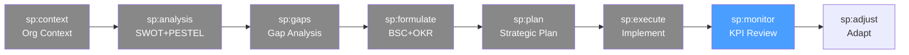

# /sp-monitor — Strategic Planning: Strategy Monitoring

> *"What gets measured gets managed. But what gets reviewed gets acted upon. The strategy review meeting is the most important meeting in the organization — if it doesn't happen, the strategy doesn't happen."*

Ejecuta el ciclo de monitoreo estratégico. Revisa los KPIs del BSC, realiza check-ins de OKRs, identifica iniciativas con desempeño por debajo del objetivo y activa señales de alerta temprana para sp:adjust.

**THYROX Stage:** Stage 11 TRACK/EVALUATE.

**Tollgate:** Al menos un ciclo completo de revisión estratégica (mensual o trimestral) completado, con iniciativas con RAG status documentado y acciones de corrección definidas para las rojas.

---

## Ciclo SP — foco en Monitor



## Pre-condición

- **sp:execute completado** — iniciativas en marcha, OKRs cascadeados, primer check-in realizado.
- KPIs con owners y fuentes de datos definidos (establecidos en sp:formulate).
- Cadencia de revisión acordada con el equipo de liderazgo.

---

## Cuándo usar este paso

- Después de las primeras 4-6 semanas de ejecución, cuando hay datos suficientes para un primer review significativo
- Al iniciar cada ciclo de revisión (mensual, trimestral, anual)
- Cuando hay señales de alerta de que una iniciativa no está progresando según el plan

## Cuándo NO usar este paso

- Sin datos reales — si los KPIs aún no tienen mediciones, documentar como "sin datos aún" y fijar fecha de primera medición
- Para revisiones operacionales day-to-day → usar el proceso de gestión del equipo, no el proceso de revisión estratégica
- En los primeros 30 días de ejecución — demasiado pronto para KPIs de resultado; enfocarse en indicadores de proceso

---

## Actividades

### 1. Revisión semanal de KPIs de proceso

En las primeras 8-12 semanas de ejecución, los KPIs de proceso son más útiles que los de resultado:
- ¿Se están realizando las actividades planificadas?
- ¿Los hitos de las iniciativas se están cumpliendo en tiempo?
- ¿Los owners están reportando según el proceso acordado?

**Dashboard semanal básico:**

| Iniciativa | Hito del mes | Estado (RAG) | % completado | Próximo hito | Bloqueante |
|-----------|-------------|-------------|-------------|-------------|-----------|
| | | 🟢 / 🟡 / 🔴 | | | |
| | | 🟢 / 🟡 / 🔴 | | | |

### 2. Check-in mensual de KPIs del BSC

El check-in mensual revisa los KPIs de las 4 perspectivas del BSC:

| KPI | Perspectiva | Target | Real | Varianza | RAG | Tendencia | Owner | Acción |
|-----|------------|--------|------|---------|-----|----------|-------|--------|
| ARR | Financiero | $3M | $2.4M | -20% | 🔴 | ↑ | CFO | Acelerar pipeline Q3 |
| NPS | Cliente | 55 | 58 | +5% | 🟢 | ↑ | CPO | Mantener programa CS |
| Cycle time | Procesos | 3 meses | 4.5 meses | -33% | 🟡 | → | CTO | Revisar bottleneck |
| eNPS | L&G | 45 | 42 | -7% | 🟡 | ↓ | CHRO | Encuesta de pulso |

**Criterios RAG:**
- 🟢 Verde: En o por encima del target
- 🟡 Amarillo: 10-25% por debajo del target — requiere plan de acción
- 🔴 Rojo: >25% por debajo del target — requiere intervención ejecutiva

Ver template completo: [strategy-review-template.md](./assets/strategy-review-template.md)

### 3. OKR check-in trimestral

El check-in trimestral de OKRs es la revisión más importante del ciclo:

**Para cada OKR, revisar:**

```
Objective: [Texto del objetivo]
Período: [Q? / Año]
Owner: [Nombre]

KR1: [Texto] → Baseline: X | Target: Y | Actual: Z | Progreso: N%
KR2: [Texto] → Baseline: X | Target: Y | Actual: Z | Progreso: N%
KR3: [Texto] → Baseline: X | Target: Y | Actual: Z | Progreso: N%

Confianza general: [%] — [Comentario]
¿Necesita ajuste? [Sí / No] → ¿Qué ajuste?
```

**Proceso del OKR check-in:**
1. Cada owner presenta el progreso de sus OKRs (5-7 min por OKR)
2. El equipo identifica dependencias bloqueadas y las escala
3. Se deciden ajustes de target solo si el contexto cambió sustancialmente (no si la ejecución fue floja)
4. Se documentan compromisos para el próximo trimestre

### 4. Revisión estratégica anual

La revisión anual es la más completa — evalúa el ciclo estratégico completo:

**Agenda de revisión estratégica anual (1 día):**

| Segmento | Duración | Contenido |
|---------|---------|-----------|
| Resultados financieros | 1h | Performance vs. plan — todas las perspectivas del BSC |
| Review de iniciativas | 1.5h | ¿Qué se completó? ¿Qué quedó incompleto? ¿Por qué? |
| Aprendizajes estratégicos | 1h | ¿Qué supuestos del Strategy Map resultaron correctos/incorrectos? |
| Entorno — ¿cambió algo? | 1h | Actualización rápida de PESTEL + Five Forces — ¿hay cambios materiales? |
| Decisiones estratégicas | 1.5h | ¿Seguimos con la estrategia? ¿Qué ajustes? ¿Nuevas iniciativas? |
| Próximo ciclo | 1h | ¿Cuáles son los OKRs para el próximo año? ¿Qué necesitamos cambiar? |

### 5. Identificar iniciativas con bajo rendimiento

Cuando una iniciativa está en 🔴 por dos períodos consecutivos, activar el proceso de revisión profunda:

1. **Diagnóstico** — ¿por qué está en rojo? ¿Es ejecución, supuesto erróneo o contexto cambiado?
2. **Opciones** — ¿replanificar (más recursos/tiempo), pivotar (cambiar enfoque), o discontinuar?
3. **Decisión** — el owner propone, el C-suite decide
4. **Comunicación** — documentar la decisión y comunicarla al equipo

### 6. Señales de alerta temprana

Definir indicadores leading (predictivos) además de los lagging (resultados):

| KPI lagging (resultado) | KPI leading (predictor) | Umbral de alerta |
|------------------------|------------------------|-----------------|
| ARR | Pipeline de ventas calificado | <3× el target mensual |
| NPS | Tasa de churn mensual | >3% mensual |
| Cycle time | # de PRs en revisión por >5 días | >10 PRs bloqueados |
| eNPS | Tasa de absentismo | >5% por encima de la media histórica |

---

## Artefacto esperado

`{wp}/track/strategy-review-[YYYY-QN].md` — usando template: [strategy-review-template.md](./assets/strategy-review-template.md)

---

## Red Flags — señales de monitoreo deficiente

- **Reviews sin decisiones** — si la reunión de revisión no produce ninguna acción o cambio de prioridad, es una reunión de reporte, no de gestión estratégica
- **Todas las iniciativas en verde siempre** — señal de objetivos poco ambiciosos o de RAG status manipulado políticamente
- **Sin KPIs leading** — solo medir resultados sin predictores lleva a reaccionar tarde, cuando el daño ya está hecho
- **Frecuencia de revisión insuficiente** — sin check-ins mensuales, los problemas escalan durante meses sin detección
- **Owners que no reportan** — si el proceso depende de que los owners inicien el reporte, el proceso falla cuando hay problemas (exactamente cuando más se necesita)
- **BSC con datos atrasados** — un dashboard con datos de hace 2 meses no permite gestión estratégica; los datos deben ser near-real-time para KPIs críticos

---

## Estado en now.md

**Al INICIAR este step:**
```yaml
methodology_step: sp:monitor
flow: sp
```

**Al COMPLETAR** (al menos un ciclo de revisión con RAG status y acciones):
```yaml
methodology_step: sp:monitor  # completado → listo para sp:adjust
flow: sp
```

## Siguiente paso

Cuando hay al menos un ciclo de revisión completo con iniciativas evaluadas y acciones definidas → `sp:adjust`

---

## Limitaciones

- Los primeros 90 días de ejecución raramente producen KPIs de resultado significativos — el monitoreo temprano es necesariamente cualitativo y de proceso
- Las revisiones estratégicas requieren disciplina sostenida — sin un owner del proceso de revisión (típicamente CEO/COO), se cancelan ante presiones del día a día
- El RAG status es una simplificación — una iniciativa puede ser 🟡 en KPIs pero estratégicamente critical; el contexto cualitativo es tan importante como el color
- El OKR check-in trimestral puede revelar que los OKRs eran demasiado ambiciosos o mal formulados — es aceptable ajustar una vez, con criterio documentado

---

## Reference Files

### Assets
- [strategy-review-template.md](./assets/strategy-review-template.md) — Tabla de revisión: Objetivo | KPI | Target | Actual | RAG | Owner | Acción

### References
- [strategic-review-cadence.md](./references/strategic-review-cadence.md) — Cadencia de revisiones: agendas tipo para revisiones semanales, mensuales, trimestrales y anuales
