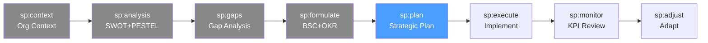

# /sp-plan — Strategic Planning: Strategic Plan

> *"A strategy without a plan is a dream. A plan without a strategy is a to-do list. The strategic plan is where ambition meets execution — initiatives with owners, budgets, and timelines."*

Crea el Plan Estratégico. Traduce los objetivos del BSC y los OKRs en iniciativas concretas con responsables, presupuesto, cronograma y criterios de éxito.

**THYROX Stage:** Stage 6 SCOPE.

**Tollgate:** Plan estratégico con todas las iniciativas priorizadas, con owner y presupuesto asignados, aprobado por el equipo directivo antes de avanzar a sp:execute.

---

## Ciclo SP — foco en Plan



## Pre-condición

- **sp:formulate completado** — BSC, Strategy Map y OKRs aprobados por el liderazgo.
- Presupuesto estratégico disponible o en proceso de aprobación.
- Owners potenciales identificados y disponibles para comprometerse.

---

## Cuándo usar este paso

- Después de formular la estrategia (sp:formulate) y antes de iniciar la ejecución
- Cuando hay múltiples iniciativas posibles y se necesita priorizar cuáles ejecutar primero
- Para traducir los OKRs en proyectos concretos con fechas y recursos

## Cuándo NO usar este paso

- Si los OKRs no están aprobados — planificar sin objetivos validados produce iniciativas desconectadas de la estrategia
- Para iniciativas operacionales de rutina sin impacto estratégico → usar el backlog del área, no el plan estratégico
- Si el presupuesto es completamente incierto — documentar supuestos y rangos, pero no fabricar cifras precisas

---

## Actividades

### 1. Identificar y traducir objetivos en iniciativas

Por cada objetivo estratégico del BSC/OKRs, identificar las iniciativas que lo habilitan:

| OKR / Objetivo BSC | Iniciativa | Descripción | Resultado esperado |
|--------------------|-----------|-------------|-------------------|
| [O1: ARR $8M] | Expansión enterprise | Programa de upsell a 20 cuentas clave | +$2M ARR desde cuentas existentes |
| [O1: ARR $8M] | Go-to-market SMB | Canal de ventas digital para SMB | 150 nuevas cuentas SMB |
| [O2: NPS 70] | Customer success | Equipo dedicado post-venta | Reducción de churn a <10% |
| [O3: Eficiencia] | Automatización QA | Implementar pipeline CI/CD completo | Cycle time 6m → 2m |

**Criterios para que una iniciativa sea estratégica:**
- Tiene impacto directo en al menos un KPI del BSC
- Requiere recursos o coordinación cross-funcional significativa
- No se haría sin la estrategia (no es BAU — Business As Usual)

### 2. Definir owner, presupuesto y timeline por iniciativa

Completar el template de plan estratégico para cada iniciativa:

| Iniciativa | Objetivo BSC | Owner | Presupuesto ($) | Inicio | Fin | KPI de éxito | Estado |
|-----------|-------------|-------|----------------|--------|-----|-------------|--------|
| [Nombre] | [Perspectiva → Obj] | [Nombre + rol] | [$X] | [Q/mes] | [Q/mes] | [Métrica + target] | Planificado |
| | | | | | | | |

> Owner = quien responde por los resultados, no quien ejecuta las tareas. Si no hay un owner claro, la iniciativa no tiene tracción.

### 3. Crear el roadmap de iniciativas

Organizar las iniciativas en tres horizontes temporales:

**Corto plazo — Quick Wins (≤90 días):**
Iniciativas que generan resultados visibles rápido, crean momentum y validan la dirección estratégica.

| Iniciativa | Resultado en 90 días | Por qué es quick win |
|-----------|---------------------|---------------------|
| [Ej: Lanzar base de conocimiento para soporte] | -30% tickets de nivel 1 | Bajo esfuerzo, alta visibilidad |
| [Ej: Repricing del plan básico] | +15% MRR nuevos | Cambio de configuración, no desarrollo |

**Mediano plazo — Iniciativas principales (3-12 meses):**
El núcleo del plan estratégico. Iniciativas de alto impacto que requieren inversión y coordinación.

| Iniciativa | Hito Q1 | Hito Q2 | Hito Q3 | Hito Q4 | KPI final |
|-----------|---------|---------|---------|---------|----------|
| | | | | | |

**Largo plazo — Capacidades (12-36 meses):**
Iniciativas de construcción de capacidades que habilitan la estrategia futura.

| Iniciativa | Objetivo estratégico | Capacidad que construye | Horizonte |
|-----------|---------------------|------------------------|-----------|
| | | | |

Ver template completo: [strategic-plan-template.md](./assets/strategic-plan-template.md)

### 4. Identificar Quick Wins (≤90 días)

Los quick wins son iniciativas que:
- Se pueden completar en 90 días o menos
- No requieren inversión significativa
- Producen resultados medibles y visibles
- Generan aprendizaje o validan una hipótesis estratégica

**Criterios de selección de quick wins:**

| Criterio | Bueno | Malo |
|----------|-------|------|
| Tiempo de implementación | <90 días | >90 días |
| Inversión requerida | <5% del presupuesto estratégico total | >15% |
| Impacto visible | Stakeholders lo ven en el siguiente review | Impacto solo a largo plazo |
| Riesgo de ejecución | Bajo — capacidades existentes | Alto — capacidades nuevas |

### 5. Definir requisitos de recursos

| Iniciativa | Headcount necesario | Presupuesto OPEX | Presupuesto CAPEX | Tecnología / herramientas | Dependencias externas |
|-----------|--------------------|-----------------|--------------------|--------------------------|----------------------|
| | | | | | |

**Plan de contratación (si aplica):**
| Rol | # | Inicio de búsqueda | Inicio esperado | Costo anual |
|-----|---|-------------------|----------------|------------|
| | | | | |

### 6. Plan de comunicación estratégica

La estrategia no ejecutada por falta de comunicación es una estrategia fallida. Definir cómo se comunica a todos los niveles:

| Audiencia | Mensaje clave | Canal | Frecuencia | Responsable |
|-----------|--------------|-------|-----------|-------------|
| Equipo directivo | BSC completo + OKRs | Off-site + dashboard | Trimestral | CEO |
| Managers | OKRs del área + iniciativas | Reunión all-hands | Mensual | Cada director |
| Equipos | OKRs individuales + cómo contribuyen | 1:1 + equipo | Quincenal | Cada manager |
| Inversores/Board | KPIs financieros + hitos clave | Reporte trimestral | Trimestral | CEO + CFO |

---

## Artefacto esperado

`{wp}/plan/strategic-plan.md` — usar template: [strategic-plan-template.md](./assets/strategic-plan-template.md)

También actualizar el ROADMAP.md del proyecto con los hitos estratégicos principales.

---

## Red Flags — señales de plan estratégico deficiente

- **Iniciativas sin owner** — una iniciativa sin responsable único es una iniciativa huérfana; se ejecutará parcialmente o no se ejecutará
- **Presupuesto distribuido uniformemente entre iniciativas** — señal de falta de priorización real; el presupuesto debe reflejar las prioridades
- **Sin quick wins identificados** — un plan que tarda 12 meses en mostrar resultados pierde tracción y apoyo organizacional
- **Más de 15 iniciativas simultáneas** — la organización no puede ejecutar bien tantas cosas a la vez; priorizar o secuenciar
- **Roadmap con todas las iniciativas en el mismo trimestre** — muestra falta de análisis de capacidad y dependencias
- **Plan sin plan de comunicación** — si los equipos no saben cómo su trabajo diario conecta con la estrategia, el cascadeo fracasa
- **Presupuesto sin contingencia** — planes estratégicos sin buffer (~10-15%) sistemáticamente se quedan sin recursos ante imprevistos

---

## Estado en now.md

**Al INICIAR este step:**
```yaml
methodology_step: sp:plan
flow: sp
```

**Al COMPLETAR** (plan estratégico aprobado con owners y presupuesto):
```yaml
methodology_step: sp:plan  # completado → listo para sp:execute
flow: sp
```

## Siguiente paso

Cuando el plan estratégico está aprobado con owners, presupuestos y roadmap → `sp:execute`

---

## Limitaciones

- El plan estratégico es una fotografía en el momento de planificación — debe revisarse ante cambios significativos del entorno
- La asignación de presupuesto es una hipótesis; el costo real puede variar y requiere seguimiento en sp:monitor
- La identificación de quick wins puede ser difícil si la organización está en un momento de transformación profunda donde todo requiere tiempo
- El plan de comunicación requiere disciplina sostenida — la comunicación estratégica no es un evento, es un proceso

---

## Reference Files

### Assets
- [strategic-plan-template.md](./assets/strategic-plan-template.md) — Tabla maestra: Iniciativa | Objetivo BSC | Owner | Presupuesto | Timeline | KPI | Status

### References
- [strategic-roadmap-guide.md](./references/strategic-roadmap-guide.md) — Guía para secuenciar iniciativas estratégicas: horizontes temporales, dependencias y quick wins
