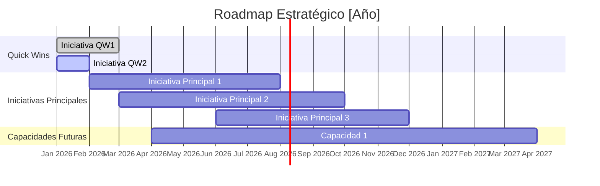

# Strategic Roadmap Guide — Secuenciación de Iniciativas Estratégicas

## ¿Qué es un roadmap estratégico?

El roadmap estratégico es la representación temporal de las iniciativas del plan estratégico. No es una Gantt chart operacional — es una vista de alto nivel que muestra:
- Cuándo empieza y termina cada iniciativa
- Las dependencias entre iniciativas
- Los hitos más importantes de cada período
- La distribución de recursos a lo largo del tiempo

**Diferencia entre roadmap estratégico y plan de proyecto:**
| | Roadmap estratégico | Plan de proyecto (Gantt) |
|-|--------------------|-----------------------|
| Nivel de detalle | Alto — hitos, no tareas | Bajo — tareas individuales |
| Horizonte | 12-36 meses | 1-6 meses típicamente |
| Audiencia | C-suite, Board | Equipo del proyecto |
| Actualización | Trimestral | Semanal |

---

## Horizontes temporales

### Horizonte 1 — Quick Wins (0-90 días)

**Propósito:** Generar momentum, validar supuestos de bajo riesgo, y demostrar que la estrategia produce resultados.

**Criterios de selección:**
1. Impacto visible para múltiples stakeholders
2. Costo de implementación bajo (< 5% del presupuesto estratégico)
3. No requiere capacidades nuevas — usa lo que ya existe
4. Resultado medible en <90 días

**Exemplos de quick wins comunes:**
- Optimización de un proceso existente con herramientas actuales
- Cambio de pricing en un segmento ya activo
- Lanzamiento de una feature ya desarrollada que estaba en backlog
- Rediseño de un documento/proceso de alta fricción con clientes
- Comunicación de la nueva estrategia y celebración de primeros logros

**Errores a evitar:**
- Comprometer quick wins que dependen de recursos no asegurados
- Quick wins que producen resultados en 6 meses (eso es iniciativa media, no quick win)
- Quick wins sin métrica clara — si no puedes medir el resultado en 90 días, no es un quick win

---

### Horizonte 2 — Iniciativas principales (3-12 meses)

**Propósito:** El núcleo de la estrategia. Iniciativas de alto impacto que construyen la posición competitiva.

**Criterios de secuenciación:**
1. **Impacto estratégico** — priorizar iniciativas con mayor puntaje en la matriz de impacto × urgencia
2. **Dependencias** — algunas iniciativas habilitan otras (las habilitadoras van primero)
3. **Capacidad organizacional** — no lanzar más iniciativas en paralelo de las que la organización puede ejecutar bien
4. **Presupuesto** — distribuir el presupuesto considerando el cashflow disponible

**Regla de capacidad:**
| Tamaño de organización | Iniciativas simultáneas recomendadas |
|-----------------------|-------------------------------------|
| <50 personas | 2-3 iniciativas estratégicas |
| 50-200 personas | 3-5 iniciativas |
| 200-500 personas | 5-8 iniciativas |
| >500 personas | 8-12 iniciativas (por área/BU) |

Superar estos límites produce iniciativas a medias, equipos agotados y resultados mediocres en todo.

---

### Horizonte 3 — Capacidades futuras (12-36 meses)

**Propósito:** Construir las capacidades que la organización necesitará para el siguiente ciclo estratégico.

**Características:**
- Inversiones en talento, tecnología, o cultura sin retorno inmediato
- Apuestan a un futuro que aún no es completamente predecible
- Son la diferencia entre una organización que solo reacciona y una que anticipa

**Tipos de capacidades futuras:**
| Tipo | Ejemplo | Horizonte típico |
|------|---------|-----------------|
| Talento crítico | Equipo de data science para analytics estratégico | 18-24 meses para ver impacto |
| Tecnología diferenciadora | Plataforma de ML para personalización | 24-36 meses |
| Cultura y procesos | Cultura de experimentación y aprendizaje rápido | 24-36 meses |
| Posicionamiento de mercado | Presencia en nuevo mercado geográfico | 18-30 meses |

---

## Cómo secuenciar iniciativas — Framework

### Paso 1: Identificar dependencias

```
Tipo A — Dependencia secuencial: B no puede empezar hasta que A termine
Tipo B — Dependencia de recurso: B y A necesitan el mismo recurso (no pueden ser simultáneas)
Tipo C — Dependencia de supuesto: B solo tiene sentido si A confirma el supuesto
```

**Mapa de dependencias (ejemplo):**
```
[Contratar data team] → [Implementar analytics dashboard] → [Decisiones basadas en datos]
        ↓
[Automatizar QA] → [Reducir cycle time] → [Lanzar 3 productos/año]
```

### Paso 2: Ordenar por impacto y dependencias

1. Primero: iniciativas sin dependencias previas y con mayor impacto
2. Segundo: iniciativas habilitadoras (cuyo output es input de otras)
3. Tercero: iniciativas de mayor duración que necesitan empezar pronto para entregar a tiempo
4. Último: iniciativas que pueden esperar sin costo estratégico

### Paso 3: Validar con capacidad disponible

Para cada trimestre, calcular la carga de las iniciativas planificadas vs. la capacidad del equipo:
```
Carga = Σ (FTEs × semanas) requeridos por todas las iniciativas activas en el período
Capacidad = FTEs disponibles × semanas del período × factor de dedicación real (~70%)
```
Si Carga > Capacidad → secuenciar más o reducir alcance de iniciativas.

---

## Presentación del roadmap

### Formato Mermaid para artefactos WP



### Lectura del roadmap — preguntas que debe responder

1. ¿Cuándo veremos los primeros resultados? → Quick Wins
2. ¿Cuál es el hito más importante del año? → Iniciativa con mayor impacto en el horizonte medio
3. ¿Hay períodos de sobrecarga? → Meses con demasiadas iniciativas simultáneas
4. ¿Están las dependencias reflejadas? → B empieza después de que A termina
5. ¿Hay hitos de decisión explícitos? → Puntos donde se revisa si continuar una iniciativa

---

## Errores comunes en el roadmap estratégico

| Error | Señal | Corrección |
|-------|-------|-----------|
| Todo en el mismo trimestre | El Q1 está lleno y el Q4 vacío | Distribuir según capacidad; los recursos no se crean de la noche a la mañana |
| Iniciativas sin hitos intermedios | Solo fecha de inicio y fecha fin | Añadir 2-3 hitos intermedios para permitir seguimiento |
| Roadmap que no cambia nunca | La misma versión del día 1 sigue vigente al final del año | Revisar y actualizar trimestralmente; un roadmap que no evoluciona es un roadmap olvidado |
| Sin buffers entre iniciativas | Una iniciativa termina el día que empieza la siguiente | Agregar 2-4 semanas de buffer entre iniciativas que comparten recursos |
| Horizonte de solo 12 meses | Sin vista de capacidades futuras | Añadir una sección de 12-36 meses aunque sea esquemática |
