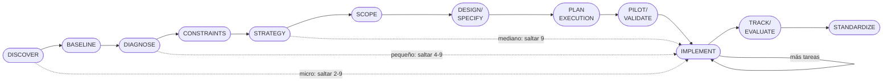

```yml
name: thyrox
description: "Sistema agentic THYROX con 12 stages propios (DISCOVER → STANDARDIZE). Usar este skill cuando el usuario quiera planificar, analizar, diseñar, organizar, trackear o gestionar CUALQUIER tipo de trabajo — features, bug fixes, refactoring, documentación, investigación o setup de proyecto. También usar cuando el usuario pregunte '¿qué hago primero?', '¿cómo organizo esto?', '¿cuál es el estado?', 'crea un plan para X', 'analiza X', 'descompón X en tareas', 'documenta esta decisión', o cualquier cosa relacionada con workflow de proyecto, tracking de trabajo, registros de decisiones o desarrollo estructurado. Siempre empezar con DISCOVER antes de planificar."
updated_at: 2026-04-20 13:08:54
```

# THYROX: Gestión de Proyectos

Sistema agentic para organizar trabajo de cualquier tamaño. Implementado actualmente sobre Claude Code (Anthropic); los Skills actúan como políticas de comportamiento del agente, no como APIs para desarrolladores. Sigue 12 stages propios (DISCOVER → STANDARDIZE) donde entender viene antes que planificar, y planificar viene antes que ejecutar.

**Principio core:** Analizar antes de actuar. Cada fase produce artefactos que alimentan la siguiente. Saltar fases produce trabajo sin fundamento.

**Nomenclatura:** "FASE" y "Phase" son niveles distintos — no confundir.
`FASE N` = número secuencial global del proyecto (cada WP ocupa una FASE).
`Phase N` = etapa interna del ciclo THYROX dentro de ese WP (1–12, se reinicia en cada FASE).
Ejemplo: "FASE 20 está en Phase 10" = el WP #20 del proyecto está ejecutándose.
Ver glosario completo en [CLAUDE.md](../../../CLAUDE.md#glosario).



---

## Catálogo de fases

Cada fase vive en su propio skill. Invocar directamente para ejecutar:

| Fase | Skill | Descripción |
|------|-------|-------------|
| Phase 1: DISCOVER | `/thyrox:discover` | Explorar contexto, stakeholders, síntomas. Crear WP + risk register. |
| Stage 2: BASELINE | `/thyrox:measure` | Recopilar datos, definir baseline + métricas de éxito. |
| Stage 3: DIAGNOSE | `/thyrox:analyze` | Análisis profundo de causa raíz. Sub-análisis por dominio. |
| Phase 4: CONSTRAINTS | `/thyrox:constraints` | Documentar restricciones técnicas, de negocio y de plataforma. |
| Phase 5: STRATEGY | `/thyrox:strategy` | Investigar alternativas. Key Ideas + Research + Decisions. |
| Stage 6: SCOPE | `/thyrox:plan` | Definir scope. Scope statement + in/out-of-scope + ROADMAP. |
| Phase 7: DESIGN/SPECIFY | `/thyrox:design` | Especificar. Requirements spec + design técnico (si complejo). |
| Phase 8: PLAN EXECUTION | `/thyrox:decompose` | Crear tareas atómicas. Task plan + DAG + trazabilidad. |
| Phase 9: PILOT/VALIDATE | `/thyrox:pilot` | Validar solución con PoC. Confirmar supuestos antes de ejecutar. |
| Stage 10: IMPLEMENT | `/thyrox:execute` | Ejecutar. Commits + actualizar task plan + gates async. |
| Phase 11: TRACK/EVALUATE | `/thyrox:track` | Evaluar resultados. Lessons learned + changelog + cierre WP. Usar /thyrox:audit antes de STANDARDIZE para gate de calidad. |
| Phase 12: STANDARDIZE | `/thyrox:standardize` | Documentar patrones. Propagar aprendizajes al sistema. |

## Herramientas de calidad

Herramientas transversales que no pertenecen al ciclo de 12 fases. Se invocan cuando el ejecutor necesita verificar o validar el trabajo.

| Herramienta | Skill | Cuándo usar |
|------------|-------|-------------|
| **AUDIT** | `/thyrox:audit` | Antes de Stage 12, o cuando el ejecutor quiere verificar calidad del WP. Produce `track/{wp}-audit-report.md` con score y action plan. |

**Escalabilidad** — cuántas fases usar según tamaño del WP:

| Tamaño | Fases | Descripción |
|--------|-------|-------------|
| Micro | 1, 10, 11 | Fix rápido, tarea puntual |
| Pequeño | 1, 3, 10, 11 | Feature simple con análisis |
| Mediano | 1, 3, 5, 6, 8, 10, 11 | Feature con estrategia y descomposición |
| Grande | 1–12 completo | Proyecto complejo multi-sesión |

> **Con `flow:` activo:** los stages donde el flow tiene methodology skills anclados
> son **no-saltables**, independientemente del tamaño del WP.
> Ver reglas detalladas en [scalability.md → Escalabilidad con flow activo](../workflow-discover/references/scalability.md).

---

## Herramientas de Ejecución Asincrónica

Guía para ejecutar procesos de larga duración con visibilidad de progreso.

### Monitor Tool: Streaming Observation

Use Monitor cuando necesitas **visibilidad en tiempo real** en un proceso de larga duración.
A diferencia de `bash run_in_background` (fire-and-forget), Monitor emite eventos mientras el proceso produce salida.

#### Árbol de Decisión: Cuándo Usar Monitor

¿El comando produce salida significativa?
├─ NO → Usa Bash `run_in_background`  
│       Por qué: No hay nada que observar. Fire-and-forget es correcto.
│
└─ SÍ → ¿Necesitas **visibilidad en tiempo real** del progreso?
         ├─ NO → Usa Bash `run_in_background`
         │       Por qué: Solo te importa el resultado final. No necesitas observar.
         │
         └─ SÍ → ¿El comando tiene un **punto de salida natural**?
                  │       (i.e., se completará y terminará por sí solo)
                  │
                  ├─ NO → Usa `persistent: true`
                  │       Por qué: El comando corre indefinidamente (e.g., `while true`, `tail -f`)
                  │       Monitor streamea eventos hasta timeout o que el usuario lo detenga.
                  │
                  └─ SÍ → Usa Monitor estándar con timeout
                          Por qué: El comando termina cuando se completa.
                          Monitor emite evento de finalización naturalmente.

#### Patrón A: Polling con Salida Condicional ✅

**Caso de uso:** Esperar a que se complete una compilación, aparezca un archivo, inicie un servidor, etc.

```bash
# ✅ CORRECTO: Salida natural cuando se cumple la condición
Monitor(
  description="esperar completación de compilación",
  command="until [ -f build/output.html ]; do sleep 2; done && echo 'Compilación completada'",
  timeout_ms=60000
)
```

Por qué funciona:
- Salida natural: El bucle `until` termina → comando termina → Monitor emite finalización
- Timeout: 60s es conservador (2.5x del tiempo esperado de compilación)
- Evento claro: Un evento de finalización cuando se cumple la condición
- Caso de uso: Bueno para Phase 9 PILOT/VALIDATE (esperar artefacto antes de continuar)

#### Patrón B: Log Tail con Filtrado ✅

**Caso de uso:** Monitorear logs de CI/CD, progreso de despliegue, detección de errores.

```bash
# ✅ CORRECTO: Bandera --line-buffered previene bloqueo de eventos
Monitor(
  description="monitoreo de pipeline CI",
  command="tail -f pipeline.log | grep --line-buffered 'ERROR|FAIL|SUCCESS'",
  timeout_ms=600000,
  persistent=false
)
```

Detalles clave:
- Bandera `--line-buffered`: OBLIGATORIA para grep en Monitor (previene buffering de salida)
- Estados terminales: Patrón cubre SUCCESS, FAIL, ERROR (todos los resultados posibles)
- Timeout: 600s = 10 minutos (razonable para trabajo CI)
- persistent: false → timeout matará el proceso después de 600s

**Lo que NO debes hacer:**
```bash
# ❌ INCORRECTO: Sin --line-buffered (eventos atrasados 60+ segundos)
Monitor(
  command="tail -f pipeline.log | grep 'SUCCESS'"
)
# Problema: grep hace buffering → Monitor no recibe nada por 60 segundos

# ❌ INCORRECTO: Sin cobertura de estado de error (falla silenciosa)
Monitor(
  command="tail -f pipeline.log | grep --line-buffered 'SUCCESS'"
)
# Problema: Si el pipeline falla, sin evento ERROR → Monitor queda en silencio
```

#### Patrón C: Monitoreo de Sistema de Archivos ✅

**Caso de uso:** Detectar cuando aparecen archivos (resultados de tests, artefactos de compilación, cambios de configuración).

```bash
# ✅ CORRECTO: Salida natural cuando se recopilan N archivos
Monitor(
  description="esperando resultados de tests",
  command="inotifywait -m --format '%f' /results | head -5",
  timeout_ms=300000
)
```

Por qué funciona:
- Salida natural: `head -5` se detiene después de 5 archivos → comando termina → Monitor se completa
- Eventos claros: 1 evento por archivo (5 eventos totales, luego salida)
- Timeout: 300s = 5 minutos (razonable para ejecución de tests)

#### Patrón D: Log Tail Sin Límite ❌

**Anti-patrón:** No uses Monitor para streaming de logs sin límites sin `persistent: true`.

```bash
# ❌ INCORRECTO: Comando sin límites → timeout kill después de 300s
Monitor(
  description="observando logs de aplicación",
  command="tail -f app.log",
  timeout_ms=300000
)
```

Qué sucede:
1. Monitor inicia, `tail -f` corre
2. Los logs streamean, Monitor emite eventos
3. Después de 300s (5 minutos), se activa timeout
4. `tail -f` es SIGKILL-ed (matado abruptamente, sin limpieza)
5. El usuario ve notificación de timeout pero **NO PUEDE DISTINGUIR** si sigue ejecutándose o fue matado
6. Estado ambiguo: ¿Sigue trabajando la aplicación? ¿Sigue escribiéndose el log?

**Solución:** Haz que los logs emitan un evento de finalización
```bash
# ✅ MEJOR: Tail logs hasta evento específico
Monitor(
  description="logs hasta shutdown de aplicación",
  command="tail -f app.log | grep --line-buffered 'Shutting down|Server stopped'",
  timeout_ms=600000
)
```

#### Patrón E: Sin Cobertura de Estado Terminal ❌

**Anti-patrón:** No filtres solo por un resultado positivo (éxito) sin cubrir fallos.

```bash
# ❌ INCORRECTO: Silencioso si la compilación falla
Monitor(
  description="esperando éxito de compilación",
  command="tail -f build.log | grep --line-buffered 'BUILD SUCCESS'",
  timeout_ms=300000
)
```

Qué sucede:
- Si compilación tiene éxito: Evento emitido ✅
- Si compilación falla: Sin evento ERROR → Monitor queda en silencio ❌
- El usuario espera 300s → timeout → ambiguo: "¿Falló?" o "¿Sigue ejecutándose?"

**La solución (cubre TODOS los estados terminales):**
```bash
# ✅ CORRECTO: Cubre éxito Y fallo
Monitor(
  description="monitoreo de compilación",
  command="tail -f build.log | grep -E --line-buffered 'BUILD SUCCESS|BUILD FAILURE|BUILD ERROR'",
  timeout_ms=300000
)
```

**Regla:** La salida de Monitor debe reflejar todos los **estados terminales** (éxito, fallo, error, timeout).
Si filtras salida, asegúrate de que el filtro cubre **TODAS** las formas en que la operación puede terminar.

#### Gotchas Críticos

##### Gotcha 1: Buffering de Pipe Bloquea Eventos

**Problema:**
```bash
tail -f log | grep "ERROR"
# → grep hace buffering de salida
# → Monitor no recibe nada por 60+ segundos (o hasta que el buffer se llene)
# → Los eventos se retrasan/pierden
```

**Solución:** Siempre usa la bandera `--line-buffered`:
```bash
tail -f log | grep --line-buffered "ERROR"  # ✅ Los eventos fluyen inmediatamente
```

**Por qué:** `--line-buffered` fuerza la salida después de cada línea, no cuando el buffer se llena.

---

##### Gotcha 2: Comandos Sin Límite = Estado Ambiguo

**Problema:** Comandos sin salida natural (e.g., `tail -f`, `while true`) → timeout mata → usuario no puede decir si tuvo éxito o fue matado.

**Solución:** Diseña para ejecución acotada o usa `persistent: true`.

---

##### Gotcha 3: Timeout es Destructivo (SIGKILL)

**Problema:** En el límite de timeout, el proceso se mata abruptamente con SIGKILL. Sin limpieza, sin shutdown gradual.

```bash
Monitor(command="slow_operation.sh", timeout_ms=30000)
# Si la operación se cuelga a los 25s, se mata a los 30s — sin limpieza
```

**Solución:** Usa timeout conservador (1.5x de la duración esperada).

##### Gotcha 4: Event Batching es Transparente

**Problema:** Salida dentro de 200ms → agrupada en 1 evento (no 1 por línea).

**Impacto:** Salidas rápidas (e.g., `find` resultados) → 1 evento grande. Salidas lentas → eventos separados.

**Solución:** No asumas correspondencia 1-a-1 línea/evento. Filtra/agrega en la fuente si necesitas tasa de eventos predecible.

##### Gotcha 5: Monitor Loop — Observar UI desde Filesystem

**Problema:** Monitorear cambios en archivo mientras el usuario modifica la aplicación en memoria → el evento nunca llega.

```bash
# ❌ INCORRECTO: User cancela tareas en UI, tú esperas cambio en .md
Monitor(
  description="esperar hasta que se cancelen todas las tareas",
  command="watch -n 2 'grep -c \"[ ]\" tasks-pending.md'",
  timeout_ms=60000
)
# El usuario cancela en la UI → cambios en memoria, NO en disk
# Archivo no cambia → Monitor emite el mismo valor cada 2s indefinidamente
# Sistema suprime notificaciones → Monitor timeout después de 30s
# Claude (yo) queda en "loop" esperando pasivamente, respondiendo "[...]"
```

**Raíz del problema:** UI state (botones, checkboxes) ≠ Filesystem persistence  
- User action → cambio en memoria  
- Pero el archivo .md no se actualiza hasta que se guarde/persista  
- Monitor ve filesystem → no ve cambios de UI

**Señales de que estás en un loop:**
- ✅ Recibiendo los mismos datos repetidamente
- ✅ Esperando >5 segundos sin cambios
- ✅ Sistema empieza a suprimir notificaciones
- ✅ Tú respondiendo `[...]` pasivamente

**Soluciones:**

**Opción A: Snapshot (1 antes → 1 después)**
```bash
# ✅ MEJOR: No uses Monitor. Verifica estado antes y después.
BEFORE=$(grep -c "[ ]" tasks.md)
# [user does work]
AFTER=$(grep -c "[ ]" tasks.md)
echo "Cambio: $(($BEFORE - $AFTER)) tareas completadas"
```

**Opción B: Event-Based (inotifywait)**
```bash
# ✅ MEJOR: Solo emite cuando el archivo realmente cambia
Monitor(
  description="esperar cambios en tasks.md",
  command="inotifywait -m -e modify tasks.md | while read; do echo 'Cambio detectado'; done",
  timeout_ms=60000
)
```

**Opción C: Timeout + Exit Condition**
```bash
# ✅ MEJOR: Límite de tiempo, salida cuando se cumple condición
Monitor(
  description="esperar completación (máximo 60s)",
  command="for i in {1..30}; do grep -c '[ ]' tasks.md; sleep 2; [ $(grep -c '[ ]' tasks.md) -eq 0 ] && break; done",
  timeout_ms=60000
)
```

**La lección:** Si la fuente de verdad es la UI (memoria), monitorear el filesystem es observar el lugar equivocado. Adapta la estrategia al donde realmente ocurren los cambios.

#### Solución de Problemas: Cuando las Cosas No Salen Bien

##### "¿Por qué mi Monitor no emite nada?"

```
1. ¿El comando funciona de forma independiente?
   → Ejecuta en terminal: `bash -c "tu comando"`
   
   ├─ NO (falla) → Corrige sintaxis del comando, intenta de nuevo
   │
   └─ SÍ (funciona) → Continúa

2. ¿Hay problema de buffering?
   → Verifica si estás usando pipe. Si sí, agrega bandera `--line-buffered`
   
   ├─ No puedo agregar bandera → Posiblemente el comando sea la herramienta incorrecta para Monitor
   │
   └─ Agregué bandera → Continúa

3. ¿El comando realmente produce salida?
   → Verifica: `tu_comando | head -1` (debe emitir 1 línea)
   
   ├─ Sin salida → El comando es silencioso. Monitor funciona (no hay nada que observar).
   │
   └─ Salida aparece → Continúa

4. ¿El timeout es razonable?
   → Default 300s (5 min). Para operaciones largas, aumenta timeout_ms.
   
   ├─ Timeout muy corto → Aumenta timeout, intenta de nuevo
   │
   └─ Timeout OK → El comando genuinamente está tomando un tiempo (está bien esperar)
```

##### "¿Por qué demasiados eventos?"

**Solución:** Pre-filtra en la fuente antes de Monitor

```bash
# ❌ Muy ruidoso (1000+ eventos)
tail -f log

# ✅ Filtrado (solo líneas importantes)
tail -f log | grep --line-buffered '^ERROR|^WARN|^INFO'

# ✅ Agregado (cuenta por intervalo de tiempo)
tail -f log | awk 'BEGIN{time=systime()} {if (systime()-time > 60) print "Batch at " systime() ": count=" count; count=0; time=systime()} /ERROR/ {count++}'
```

#### Integración con Herramientas THYROX

**Monitor + Toma de Decisiones (Phase 10 EXECUTE):**

```
[Monitor: tail pipeline.log] → detecta evento "FAILED"
                           ↓
                    Usuario toma decisión
                    ├─ ¿Rollback?
                    ├─ ¿Reintentar?
                    └─ ¿Continuar de todas formas?
                           ↓
                    [Agent responde a decisión]
```

**Monitor + Bash en Foreground (Feedback en Tiempo Real):**

```
[Monitor: tail app.log]     ← Background, streaming eventos
         ↓
[Bash: npm run build]       ← Foreground, ejecutando tarea
         ↓
El usuario ve ambos: progreso + salida de compilación simultáneamente
```

**Monitor + Agent en Paralelo:**

```
Agent 1: ejecutando deep-dive
Agent 2: validando código
Monitor: streaming metrics.log
         ↓
Las 3 salidas aparecen en conversación simultáneamente
```

### Bash Tool: `run_in_background`

Usa `run_in_background` para comandos que deben ejecutarse asincronamente pero no necesitas observarlos.

```bash
# Fire-and-forget: inicia la tarea, continúa inmediatamente
Bash(
  command="npm run build",
  description="building assets",
  run_in_background=true
)
# Bash retorna inmediatamente. El comando sigue ejecutándose en segundo plano.
```

**Caso de uso:** Tests de larga duración, indexación, operaciones de limpieza, etc.
Cuando tienes otras tareas que no dependen del resultado.

---

## Methodology skills

Cuando un WP requiere un marco metodológico específico, activar el skill de metodología
correspondiente **dentro** del workflow stage apropiado. Cada skill declara su
`THYROX Stage:` de anclaje.

| Namespace | Metodología | Skills | Stages de anclaje |
|-----------|------------|--------|-------------------|
| `pdca:` | PDCA (Deming) | pdca-plan, pdca-do, pdca-check, pdca-act | 3, 10, 11, 12 |
| `dmaic:` | DMAIC Six Sigma | dmaic-define, dmaic-measure, dmaic-analyze, dmaic-improve, dmaic-control | 2, 3, 10, 11, 12 |
| `rup:` | RUP | rup-inception, rup-elaboration, rup-construction, rup-transition | 1, 3, 5, 7, 10, 11, 12 |
| `rm:` | Requirements Management | rm-elicitation, rm-analysis, rm-specification, rm-validation, rm-management | 1, 3, 5, 7, 9, 10, 11 |
| `pm:` | PMBOK | pm-initiating, pm-planning, pm-executing, pm-monitoring, pm-closing | 1, 3, 5, 6, 7, 10, 11, 12 |
| `ba:` | BABOK / Business Analysis | ba-planning, ba-elicitation, ba-requirements-analysis, ba-requirements-lifecycle, ba-solution-evaluation, ba-strategy | 1, 2, 3, 5, 6, 7, 10, 11, 12 |
| `lean:` | Lean Six Sigma | lean-define, lean-measure, lean-analyze, lean-improve, lean-control | 2, 3, 10, 11 |
| `pps:` | Practical Problem Solving (Toyota TBP) | pps-clarify, pps-target, pps-analyze, pps-countermeasures, pps-implement, pps-evaluate | 1, 2, 3, 6, 10, 11 |
| `sp:` | Strategic Planning | sp-context, sp-analysis, sp-gaps, sp-formulate, sp-plan, sp-execute, sp-monitor, sp-adjust | 1, 2, 3, 5, 6, 10, 11, 12 |
| `cp:` | Consulting Process (McKinsey/BCG) | cp-initiation, cp-diagnosis, cp-structure, cp-recommend, cp-plan, cp-implement, cp-evaluate | 1, 2, 3, 5, 6, 10, 11 |
| `bpa:` | Business Process Analysis | bpa-identify, bpa-map, bpa-analyze, bpa-design, bpa-implement, bpa-monitor | 1, 2, 3, 5, 10, 11 |

> **Sistema extensible:** Los 11 namespaces implementados cubren las principales metodologías
> de mejora continua, gestión de proyectos, análisis de negocio, estrategia y consultoría.
> El sistema soporta incorporar cualquier marco metodológico adicional siguiendo el patrón
> `{metodología}-{paso}` con declaración de `THYROX Stage:` en su SKILL.md y anatomía completa
> (SKILL.md + assets/ + references/).
>
> SDLC no aplica como methodology skill: el ciclo de 12 stages de THYROX ya ES el ciclo
> de vida universal destilado del flujo crítico — SDLC waterfall está subsumed en la
> estructura del sistema; SDLC iterativo está cubierto por `rup:`.

**Cómo activar:** invocar directamente el skill del paso, ej. `/dmaic-define`.
El skill actualiza `now.md::flow` y `now.md::methodology_step`.

**Selección por necesidad:**
- Mejora continua con ciclos rápidos → `pdca-*`
- Reducción de variabilidad con datos estadísticos → `dmaic-*`
- Eliminación de desperdicios (TIMWOOD, VSM) → `lean-*`
- Resolución estructurada de problemas (Go-and-See, A3) → `pps-*`
- Desarrollo iterativo de software con milestones → `rup-*`
- Gestión formal de requisitos (elicitación→validación) → `rm-*`
- Gestión de proyectos PMI (grupos de proceso) → `pm-*`
- Análisis de negocio BABOK (knowledge areas) → `ba-*`
- Planificación estratégica (PESTEL/SWOT/BSC/OKR) → `sp-*`
- Resolución de problemas complejos estilo consultoría → `cp-*`
- Análisis y rediseño de procesos (BPMN/ESIA) → `bpa-*`

---

## Dónde viven los artefactos

| Fase | Artefacto | Ubicación | Template |
|------|-----------|-----------|----------|
| 1 DISCOVER | Síntesis | `work/.../discover/{nombre-wp}-analysis.md` | [introduction.md.template](../workflow-discover/assets/introduction.md.template) |
| 1 DISCOVER | Work package | `context/work/YYYY-MM-DD-HH-MM-SS-nombre/` | — |
| — | Registro de riesgos (transversal) | `work/../{nombre-wp}-risk-register.md` | [risk-register.md.template](../workflow-discover/assets/risk-register.md.template) |
| — | Gates de fases (mediano/grande) | `work/../{nombre-wp}-exit-conditions.md` | [exit-conditions.md.template](../workflow-discover/assets/exit-conditions.md.template) |
| — | Principios globales del proyecto | `constitution.md` (raíz) | [constitution.md.template](../workflow-discover/assets/constitution.md.template) |
| — | Decisiones arquitectónicas | `{adr_path}/adr-{tema}.md` (ver CLAUDE.md) | [adr.md.template](../workflow-discover/assets/adr.md.template) |
| 2 MEASURE | Baseline + métricas | `work/.../measure/*.md` | — |
| 3 ANALYZE | Sub-análisis por dominio | `work/.../analyze/{subdomain}/*.md` | — |
| 4 CONSTRAINTS | Restricciones | `work/.../constraints/*.md` | [constraints.md.template](../workflow-discover/assets/constraints.md.template) |
| 5 STRATEGY | Estrategia de solución | `work/.../strategy/{nombre-wp}-solution-strategy.md` | [solution-strategy.md.template](../workflow-strategy/assets/solution-strategy.md.template) |
| 6 PLAN | Scope del trabajo | `work/.../plan/{nombre-wp}-plan.md` | [plan.md.template](../workflow-scope/assets/plan.md.template) |
| 7 DESIGN/SPECIFY | Especificación de requisitos | `work/.../design/{nombre-wp}-requirements-spec.md` | [requirements-specification.md.template](../workflow-structure/assets/requirements-specification.md.template) |
| 7 DESIGN/SPECIFY | Diseño técnico (complejo) | `work/.../design/{nombre-wp}-design.md` | [design.md.template](../workflow-structure/assets/design.md.template) |
| 8 PLAN EXECUTION | Plan de tareas | `work/.../plan-execution/{nombre-wp}-task-plan.md` | [tasks.md.template](../workflow-decompose/assets/tasks.md.template) |
| 9 PILOT/VALIDATE | Resultados del PoC | `work/.../pilot/*.md` | — |
| 10 EXECUTE | Log de ejecución | `work/.../execute/{nombre-wp}-execution-log.md` | [execution-log.md.template](../workflow-implement/assets/execution-log.md.template) |
| 10 EXECUTE | Código | Repositorio (git) | — |
| 11 TRACK/EVALUATE | Lecciones aprendidas | `work/.../track/{nombre-wp}-lessons-learned.md` | [lessons-learned.md.template](../workflow-track/assets/lessons-learned.md.template) |
| 11 TRACK/EVALUATE | WP Changelog | `work/.../track/{nombre-wp}-changelog.md` | [wp-changelog.md.template](../workflow-track/assets/wp-changelog.md.template) |
| 11 TRACK/EVALUATE | TDs resueltos (si aplica) | `work/.../track/{nombre-wp}-technical-debt-resolved.md` | [technical-debt-resolved.md.template](../workflow-track/assets/technical-debt-resolved.md.template) |
| 12 STANDARDIZE | Patrones reutilizables | `work/.../standardize/{nombre-wp}-patterns.md` | [patterns.md.template](../workflow-standardize/assets/patterns.md.template) |
| 12 STANDARDIZE | Reporte final (grande) | `work/.../standardize/{nombre-wp}-final-report.md` | [final-report.md.template](../workflow-track/assets/final-report.md.template) |
| Con flow activo | Artefacto del methodology skill | `work/{wp}/{cajón-de-fase}/{methodology}-{step}.md` | Template del skill de metodología |
| — | Errores | `context/errors/{descripcion}.md` | [error-report.md.template](assets/error-report.md.template) |

## Estructura de un work package

Estructura plana por fase (flat-by-phase): cada cajón = una fase THYROX.
Los cajones se crean a medida que el WP avanza — no se crean vacíos por adelantado.

```
context/work/YYYY-MM-DD-HH-MM-SS-nombre/
│
│  ARTEFACTOS TRANSVERSALES (raíz — sin cajón)
├── {nombre}-risk-register.md         ← Riesgos vivos Phase 1→12 — REQUERIDO
├── {nombre}-exit-conditions.md       ← Gates de fases (mediano/grande)
│
│  CAJONES DE FASE (aparecen cuando la fase produce contenido)
├── discover/                         ← Phase 1: contexto, stakeholders, síntomas
│   └── {nombre}-analysis.md          ← Síntesis — REQUERIDO
├── measure/                          ← Phase 2: baseline + métricas
├── analyze/                          ← Phase 3: root cause
│   └── {subdomain}/                  ← Subdomains libres dentro del cajón
├── constraints/                      ← Phase 4: restricciones
├── strategy/                         ← Phase 5: decisión arquitectónica
│   └── {nombre}-solution-strategy.md
├── plan/                             ← Phase 6: scope + roadmap
│   └── {nombre}-plan.md
├── design/                           ← Phase 7: especificación técnica
│   ├── {nombre}-requirements-spec.md
│   └── {nombre}-design.md
├── plan-execution/                   ← Phase 8: tareas atómicas
│   └── {nombre}-task-plan.md
├── pilot/                            ← Phase 9: PoC + validación
├── execute/                          ← Phase 10: ejecución
│   └── {nombre}-execution-log.md
├── track/                            ← Phase 11: evaluación + lecciones
│   ├── {nombre}-lessons-learned.md
│   └── {nombre}-changelog.md
└── standardize/                      ← Phase 12: documentar + propagar
    └── {nombre}-final-report.md
```

## Naming

```
Archivos:        kebab-case.md
Work packages:   YYYY-MM-DD-HH-MM-SS-nombre/   ← timestamp real: `date +%Y-%m-%d-%H-%M-%S`
Cajones de fase: discover/ measure/ analyze/ constraints/ strategy/ plan/
                 design/ plan-execution/ pilot/ execute/ track/ standardize/
Commits:         type(scope): description
ADRs:            adr-{tema}.md  (sin números)
Tareas:          [T-NNN] Descripción (R-N)
Errores:         {descripcion}.md  (sin números)
```

**Artefactos principales del WP — patrón `{nombre-wp}-{tipo}.md`:**

```
{nombre-wp} = parte descriptiva del WP (sin timestamp)
{tipo}      = analysis | solution-strategy | plan | requirements-spec | design |
              task-plan | execution-log | lessons-learned | risk-register |
              exit-conditions | final-report | changelog | technical-debt-resolved

Excepción: CHANGELOG.md (raíz) — nombre global, actualizar SOLO en releases con bump de versión.
```

**Documentos en cajones** — nombre descriptivo libre (no requieren prefijo `{nombre-wp}`):
```
analyze/methodology-landscape/universal-pattern.md     ← subdomain + nombre descriptivo
constraints/technical-constraints.md                   ← cajón + nombre descriptivo
```

Ver [conventions](../../references/conventions.md) para detalles completos.

---

## Metadata de documentos

### Artefactos principales del WP (raíz)

```yml
```yml
project: [Nombre del proyecto]
work_package: YYYY-MM-DD-HH-MM-SS-nombre
created_at: YYYY-MM-DD HH:MM:SS
updated_at: YYYY-MM-DD HH:MM:SS   ← solo en documentos vivos (risk-register, exit-conditions)
current_phase: Phase N — PHASE_NAME
author: [Nombre]
```
```

### Síntesis de fase (`discover/{nombre}-analysis.md`)

```yml
```yml
created_at: YYYY-MM-DD HH:MM:SS
project: [Nombre del proyecto]
analysis_version: 1.0
author: [Nombre]
status: Borrador | En revisión | Aprobado
```
```

### Documentos en cajones (`{cajon}/{subdomain}/*.md`)

```yml
```yml
created_at: YYYY-MM-DD HH:MM:SS
project: [Nombre del proyecto]
work_package: YYYY-MM-DD-HH-MM-SS-nombre
phase: Phase N — PHASE_NAME
author: [Nombre]
status: Borrador | En revisión | Aprobado
```
```

**Reglas:**
- `created_at` siempre presente — timestamp completo `YYYY-MM-DD HH:MM:SS`
- `updated_at` **solo** en artefactos vivos (risk-register, exit-conditions) — NO en documentos de cajones
- `status` obligatorio: `Borrador` al crear, `Aprobado` cuando el gate de la fase lo valida
- Usar bloques ` ```yml ``` ` (no `---` YAML front matter)

---

## Arquitectura de orquestación

THYROX opera en dos niveles simultáneos:

**Nivel 1 — Workflow stages (ciclo THYROX):**
Los 12 stages definen el marco macro del WP. Implementados por los `workflow-*` skills.
Estado rastreado en `now.md::stage`.

**Nivel 2 — Methodology skills (opcional, anidado):**
Dentro de un workflow stage, se puede activar un methodology skill para aplicar
un marco metodológico específico. Implementados por `{metodología}-{paso}` skills.
Estado rastreado en `now.md::flow` + `now.md::methodology_step`.

El workflow stage no se interrumpe — el methodology skill opera como sub-proceso
dentro del stage activo.

**Ejemplo concreto:** WP con `flow: dmaic` en Stage 3 DIAGNOSE:
- `now.md::stage` → `Stage 3 — DIAGNOSE`
- `now.md::flow` → `dmaic`
- `now.md::methodology_step` → `dmaic:define`
- Artefacto producido → `analyze/dmaic-define.md` (del skill dmaic-define)

**Sistema patterns:**
Trabajo de mantenimiento del sistema (ej: completar anatomía de skills, auditorías de references)
se ejecuta como tareas del task-plan sin `flow:` declarado (`flow: null`). No requiere skill dedicado.

---

## Modelo de permisos

El sistema THYROX opera en dos planos independientes. Confundirlos genera fricción innecesaria o falsa sensación de seguridad.

### Plano A — Gates de decisión del SKILL (metodológico)

Puntos donde el humano decide si continuar. Definidos en cada `workflow-*/SKILL.md` como `⏸ STOP`.

| Gate | Momento | Propósito |
|------|---------|-----------|
| Phase 1 → 2 | Después de DISCOVER | Validar contexto antes de medir |
| Phase 2 → 3 | Después de MEASURE | Validar baseline antes de analizar |
| Phase 3 → 4 | Después de ANALYZE | Validar causas antes de documentar restricciones |
| Phase 4 → 5 | Después de CONSTRAINTS | Validar restricciones antes de diseñar estrategia |
| Phase 5 → 6 | Después de STRATEGY | Aprobar dirección antes de planificar scope |
| Phase 6 → 7 | Después de PLAN | Aprobar scope antes de especificar |
| Phase 7 → 8 | Después de DESIGN/SPECIFY | Aprobar spec antes de descomponer |
| Phase 8 → 9/10 | Antes de EXECUTE | Autorizar inicio (Phase 9 si hay riesgo alto, Phase 10 directo) |
| Phase 10 → 11 | Antes de TRACK/EVALUATE | Confirmar que la ejecución fue correcta |
| Phase 11 → 12 | Antes de STANDARDIZE | Confirmar cierre del WP antes de propagar |
| GATE OPERACION | Operación destructiva | Aprobar antes de acción irreversible |

Estos gates son **correctos e intencionales**. No se eliminan.

### Plano B — Permisos de herramienta de Claude Code (sistema)

Configurados en `.claude/settings.json`. Independientes de los gates del SKILL — aplican por llamada de herramienta, no por fase.

**Comportamiento por categoría de archivo/operación:**

| Categoría | Ejemplos | Comportamiento |
|-----------|---------|---------------|
| Artefactos WP | `context/work/**/*.md` | Auto (acceptEdits) |
| Estado de sesión | `now.md`, `focus.md` | Auto (acceptEdits) |
| Historial del proyecto | `CHANGELOG.md`, `ROADMAP.md` | Auto (acceptEdits) |
| Referencias de plataforma | `.claude/references/**` | Auto (allow) |
| ADRs | `.thyrox/context/decisions/**` | Prompt (ask) |
| Scripts del sistema | `bash .claude/scripts/*` | Auto (allow) |
| Scripts de validacion | `bash .claude/skills/*/scripts/*` | Auto (allow) |
| Scripts operacionales (edicion) | Write/Edit en `scripts/*.sh`, `skills/*/scripts/*.sh` | Prompt (ask) |
| Git rutinario | `git add/commit/push/status/log` | Auto (allow) |
| Configuracion del sistema | `SKILL.md`, `CLAUDE.md`, `settings.json` | Prompt (ask) |
| Operaciones destructivas | `git push --force`, `git reset --hard`, `rm -rf` | Bloqueado (deny) |

**Relacion entre planos:**
El gate Phase 6→7 (Plano A) es la aprobacion para todo Phase 7. Las operaciones de cierre
(update-state.sh, validate-session-close.sh, git add/commit/push) corren automaticamente
despues de ese gate — son consecuencia de la decision, no nuevas decisiones.

Ver [permission-model](../../references/permission-model.md) para la referencia completa y `.claude/settings.json` para la configuracion vigente.

---

## References por dominio

### Methodology skills (activar cuando hay un `flow:` en now.md)

Ver tabla completa en [Methodology skills](#methodology-skills) arriba.
Selección por namespace: `pdca-*` · `dmaic-*` · `rup-*` · `rm-*` · `pm-*` · `ba-*`
Cada namespace tiene su propio `references/` con guías del marco metodológico.

Entradas rápidas por namespace:
- `pdca:` → [pdca-plan](../pdca-plan/SKILL.md)
- `dmaic:` → [dmaic-define](../dmaic-define/SKILL.md)
- `rup:` → [rup-inception](../rup-inception/SKILL.md)
- `rm:` → [rm-elicitation](../rm-elicitation/SKILL.md)
- `pm:` → [pm-initiating](../pm-initiating/SKILL.md)
- `ba:` → [ba-planning](../ba-planning/SKILL.md)

### Phase 1: DISCOVER (leer cuando se explora el problema)
[introduction](../workflow-discover/references/introduction.md) · [requirements-analysis](../workflow-discover/references/requirements-analysis.md) · [use-cases](../workflow-discover/references/use-cases.md) · [quality-goals](../workflow-discover/references/quality-goals.md) · [stakeholders](../workflow-discover/references/stakeholders.md) · [basic-usage](../workflow-discover/references/basic-usage.md) · [constraints](../workflow-discover/references/constraints.md) · [context](../workflow-discover/references/context.md)

### Stage 3: DIAGNOSE (leer cuando se hace análisis profundo)
Ver references en `workflow-discover/references/` — introduction, requirements-analysis, use-cases, quality-goals, stakeholders, constraints, context

### Phase 5: STRATEGY (leer cuando se toman decisiones arquitectónicas)
[solution-strategy](../workflow-strategy/references/solution-strategy.md)

### Phase 7: DESIGN/SPECIFY (leer cuando se crean especificaciones complejas)
[spec-driven-development](../workflow-structure/references/spec-driven-development.md)

### Stage 10: IMPLEMENT (leer cuando se hacen commits)
[commit-helper](../workflow-implement/references/commit-helper.md) · [commit-convention](../workflow-implement/references/commit-convention.md)

### Phase 11: TRACK/EVALUATE (leer cuando se valida o corrige)
[reference-validation](../workflow-track/references/reference-validation.md) · [incremental-correction](../workflow-track/references/incremental-correction.md)

### Cross-phase (leer según necesidad)
[conventions](../../references/conventions.md) — Convenciones de archivos, commits, ROADMAP, ejecución paralela
[scalability](../workflow-discover/references/scalability.md) — Cómo escalar el framework según complejidad
[examples](../../references/examples.md) — 8 casos de uso reales
[agent-spec](../../references/agent-spec.md) — Spec formal de agentes nativos Claude Code (campos obligatorios/prohibidos, naming)
[skill-vs-agent](../../references/skill-vs-agent.md) — Cuándo crear un SKILL vs un agente nativo
[claude-code-components](../../references/claude-code-components.md) — Referencia oficial de Skills, Subagents y Context (docs oficiales)
[permission-model](../../references/permission-model.md) — Dos planos de aprobacion: gates de decision (SKILL) vs permisos de herramienta (settings.json)

### Plataforma Claude Code — arquitectura y extensión (leer cuando se trabaja con la plataforma)
[plugins](../../references/plugins.md) — Arquitectura de plugin: manifest plugin.json, namespace /name:cmd, distribución, seguridad de subagentes en plugins
[hook-output-control](../../references/hook-output-control.md) — Semántica de suppressOutput (stdout del hook, NO el tool result), additionalContext, updatedInput, permissionDecision
[subagent-patterns](../../references/subagent-patterns.md) — Patrones de aislamiento de contexto, worktree isolation, persistent memory, agent teams, background agents
[scheduled-tasks](../../references/scheduled-tasks.md) — /loop, CronCreate, cloud tasks persistentes, print mode (-p), CI/CD integration, auto mode
[memory-hierarchy](../../references/memory-hierarchy.md) — Sistema de 8 niveles de memoria CLAUDE.md, imports @path, auto-memory, managed settings enterprise
[mcp-integration](../../references/mcp-integration.md) — Servidores MCP (HTTP/stdio/SSE), OAuth, elicitation, canales push, límites de herramientas
[tool-execution-model](../../references/tool-execution-model.md) — Todos los flujos de Edit/Write: permission model (settings.json, allow/ask/deny, precedencia) vs context isolation (subagente, background, hook, worktree)
[command-execution-model](../../references/command-execution-model.md) — Flujo de ejecución de commands (parse→shell→LLM), fat vs thin wrapper, delegación explícita (context:fork) vs probabilística, restricciones plugin commands
[sdd](../../references/sdd.md) — Specification-Driven Development (TDD + DbC): collaborative tests vs contratos, ciclo SDD, amplificación de tests, cuándo usar cada tipo de spec

### Authoring — crear o modificar componentes Claude Code
[skill-authoring](../../references/skill-authoring.md) — Crear o mejorar skills (frontmatter completo, modos, variables, paths:)
[agent-authoring](../../references/agent-authoring.md) — Crear agentes nativos (GAP-007..012: skills:, memory:, background:, isolation:, permissionMode)
[claude-authoring](../../references/claude-authoring.md) — Cuándo y cómo crear CLAUDE.md (jerarquía, @imports, /init, anti-patrones)
[hook-authoring](../../references/hook-authoring.md) — Crear hooks (eventos, output control, patrones, errores comunes)
[component-decision](../../references/component-decision.md) — Flowchart SKILL vs CLAUDE.md vs Agent vs Hook vs Plugin vs Command

### Plataforma avanzada — features y CLI completo
[advanced-features](../../references/advanced-features.md) — Planning Mode, Extended Thinking, Auto Mode, Worktrees, Sandboxing, Agent Teams, Channels
[cli-reference](../../references/cli-reference.md) — Todos los flags, 30+ env vars, subcomandos claude auth/mcp/agents
[settings-reference](../../references/settings-reference.md) — Referencia exhaustiva de todas las keys de settings.json (scope, defaults, sandbox, hooks, MCP)
[slash-commands-reference](../../references/slash-commands-reference.md) — Catálogo de 60+ built-in commands, bundled skills, sintaxis de argumentos $ARGUMENTS/$0/$1
[glossary](../../references/glossary.md) — Glosario de 130+ términos Claude Code (sintaxis, modelos, patrones, seguridad, ecosistema)
[visual-reference](../../references/visual-reference.md) — 19 diagramas consolidados: Master Loop, context zones, permission modes, árboles de decisión

### Patrones — cómo implementar correctamente
[memory-patterns](../../references/memory-patterns.md) — Estado de sesión, @imports, auto-memory, memory: en subagents
[tool-patterns](../../references/tool-patterns.md) — Herramienta correcta por tarea, parallel calls, Edit vs Write
[testing-patterns](../../references/testing-patterns.md) — SDD práctico, CI/CD con claude -p, code review automation
[multimodal](../../references/multimodal.md) — Leer imágenes, PDFs, notebooks y screenshots con Read tool
[output-formats](../../references/output-formats.md) — --output-format, --json-schema, jq patterns, structured output

### Streaming y llamadas largas
[stream-resilience](../../references/stream-resilience.md) — CLAUDE_STREAM_IDLE_TIMEOUT_MS, TTFToken, --fallback-model, recovery patterns
[streaming-errors](../../references/streaming-errors.md) — Catálogo de errores con causas/fixes, matriz de diagnóstico rápido
[long-running-calls](../../references/long-running-calls.md) — --max-turns, background vs print mode, síntesis del padre, worktrees, checkpoints

### Avanzado (leer cuando Claude tiene dificultades)
[prompting-tips](../../references/prompting-tips.md) — Cuando Claude no entiende instrucciones
[long-context-tips](../../references/long-context-tips.md) — Documentos >5,000 palabras
