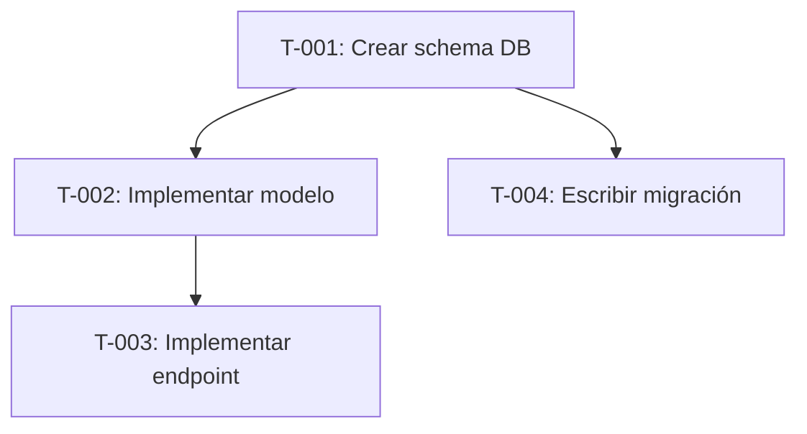

```yml
type: Metodología Phase 8 — PLAN EXECUTION
category: Descomposición en tareas atómicas
version: 1.0
purpose: Guía para crear tareas T-NNN con trazabilidad, dependencias y estimaciones.
goal: Que Phase 10 EXECUTE pueda operar sin ambigüedad — cada tarea con criterio de completitud.
updated_at: 2026-04-16
owner: workflow-decompose
```

# Task Decomposition

## Propósito

Convertir el diseño de Phase 7 en tareas ejecutables con dependencias claras y criterios de completitud.

> Una tarea bien definida no necesita interpretación — tiene un resultado verificable.

---

## Anatomía de una tarea atómica

```markdown
- [ ] [T-NNN] [Verbo imperativo + objeto concreto] (R-N)
```

| Campo | Descripción | Ejemplo |
|-------|-------------|---------|
| `T-NNN` | ID único secuencial | T-001, T-042 |
| Descripción | Verbo imperativo + resultado | "Crear índice en `users.email`" |
| `(R-N)` | Referencia al requisito de Phase 7 | (R-3), (R-7a) |

### Criterios para "atómica"

Una tarea es atómica si:
1. Puede completarse en una sesión de trabajo sin interrupciones
2. Tiene un resultado verificable (test pasa, archivo existe, endpoint responde)
3. Puede implementarse sin decisiones de diseño pendientes

**Anti-patrón**: "Implementar sistema de autenticación" — demasiado grande.
**Correcto**: "T-012 Implementar endpoint POST /auth/login con JWT (R-4)" — resultado claro.

---

## DAG de dependencias

Las tareas tienen dependencias — algunas no pueden empezar hasta que otra termine.
Documentar con Mermaid:



**Regla**: tareas sin dependencias pueden ejecutarse en paralelo si hay capacidad.
Identificar el camino crítico — la cadena más larga determina la duración mínima del WP.

---

## Trazabilidad SPEC → tarea

Cada tarea debe trazarse al requisito de Phase 7 que la genera.

| Tarea | Requisito (R-N) | Verificación |
|-------|----------------|-------------|
| T-001 | R-1 | `schema.sql` creado y migración pasa |
| T-002 | R-1, R-3 | Tests unitarios del modelo en verde |

**Por qué importa**: si se descubre que una tarea no tiene trazabilidad a ningún requisito, es scope creep.

---

## Estimación

Unidad recomendada: **puntos de esfuerzo** (no horas) para evitar falsa precisión.

| Puntos | Significado |
|--------|-------------|
| 1 | < 30 minutos, resultado completamente predecible |
| 2 | 30-90 minutos, una decisión menor |
| 3 | 1-3 horas, puede requerir investigación |
| 5 | > 3 horas — considerar descomponer más |

Tareas con estimación 5+ son señal de que la tarea no es atómica.

---

## Convenciones del task-plan

```markdown
## Tasks

### Grupo funcional

- [ ] [T-001] Tarea 1 — descripción (R-1)
- [ ] [T-002] Tarea 2 — descripción (R-2)
  - Depende de: T-001

### Otro grupo

- [ ] [T-003] Tarea 3 — descripción (R-3)
```

---

## Relación con otras fases

- **Phase 7 DESIGN/SPECIFY** produce los requisitos R-N que T-NNN referencian
- **Phase 9 PILOT/VALIDATE** puede marcar tareas como "requiere validación previa"
- **Phase 10 EXECUTE** consume el task-plan — cada `[ ]` es una unidad de trabajo

---

## Checklist de salida

- [ ] Todas las tareas tienen ID T-NNN único
- [ ] Todas las tareas tienen trazabilidad al requisito R-N
- [ ] DAG de dependencias documentado si hay ≥5 tareas con dependencias
- [ ] Camino crítico identificado
- [ ] Ninguna tarea con estimación > 5 puntos sin descomponer
- [ ] Gate 8→9/10 aprobado antes de iniciar ejecución
