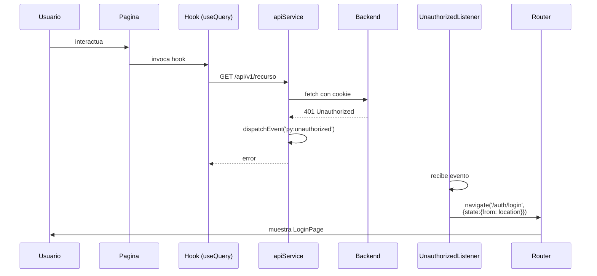

# Conceptos transversales

Patrones y mecanismos que cruzan varios bloques del codigo. Cuando un
concepto se materializa en multiples lugares y vale la pena explicarlo
una sola vez, vive aqui.

## Autenticacion y manejo de 401

| Pieza | Responsabilidad |
|-------|-----------------|
| Backend Django | Emite JWT como cookie httpOnly al login. Renueva con refresh token (cookie aparte). |
| `apiService` | Envia `credentials: 'include'` en cada peticion. Si recibe 401, dispara `window.dispatchEvent(new CustomEvent('py:unauthorized'))`. |
| `UnauthorizedListener` | Componente montado bajo `<App>`. Escucha `py:unauthorized`, limpia el estado de auth en Redux y redirige a `/auth/login` preservando la ruta de origen en `state.from`. |
| `LoginPage` | Tras login exitoso, lee `state.from` y redirige de vuelta. |
| `ProtectedRoute` / `AdminRoute` | Bloquean acceso a rutas privadas si `isAuthenticated` es `false` o si el rol no es admin. |

### Diagrama de secuencia: 401 durante uso

Este listener se introdujo en la rama pendiente
`claude/resume-ecommerce-project-Dm3ab` (commit `7129b8d`). Antes, una
sesion invalidada en una pestana abandonada quedaba en pantallas
"logueadas" pero con cada peticion fallando silenciosamente.

## Mock-first via feature flags

| Aspecto | Detalle |
|---------|---------|
| Granularidad | Por dominio (`PY_AUTH_SOURCE`, `PY_CATALOG_SOURCE`, `PY_CART_SOURCE`, `PY_PAYMENTS_SOURCE`). |
| Punto de decision | `src/mocks/mockInterceptor.js` consulta el flag y devuelve respuesta mock o pasa la llamada al fetch real. |
| Default en desarrollo | Todos en `mock`. |
| Default en produccion | Todos en `real` (el `.env.production.example` no los define, el fallback de `apiService` apunta al backend real). |

**Costo conocido.** Mantener mocks coherentes con el contrato real
del backend es trabajo manual. Cualquier cambio de respuesta en el
backend invalida el mock sin que ningun test lo detecte. Esta deuda
esta declarada.

## Manejo de errores

El UI tipifica los errores en `src/services/utils/apiErrors.js`:

| Clase | Cuando se lanza |
|-------|-----------------|
| `TimeoutError` | El `AbortController` cancela por exceder 30 segundos. |
| `NetworkError` | `fetch` rechaza (DNS, red caida). |
| Subtipos por status | `createErrorFromResponse` mapea `400`, `401`, `403`, `404`, `409`, `422`, `5xx` a clases especificas. |

`isRetryableError(err)` decide si el `apiService` reintenta. Los
estados `408, 429, 500, 502, 503, 504` se reintentan hasta tres veces
con backoff lineal de 1 segundo.

`src/utils/serializeApiError` (mencionado en commits `19f493a`,
`d-010` de la rama PR #2) es el patron canonico para llevar errores de
la capa de servicios al estado Redux sin perder informacion.

`redux/middleware/errorHandling.js` captura errores que cruzan thunks
y los normaliza en `errorSlice`.

`components/shared/ErrorBoundary` cubre errores de renderizado de
React; muestra un fallback en lugar de pantalla en blanco.

## Pipeline de estilos SCSS endurecido

Tres iniciativas consecutivas (PRs #3 y #4) llevaron el sistema de
estilos de fragil a endurecido. Ver `decisiones-de-arquitectura/` para
el registro de cada decision.

| Guarda | Donde | Que bloquea |
|--------|-------|-------------|
| `stylelint-scss` + `stylelint-config-standard-scss` | `.stylelintrc.json` | Reglas de SCSS sintacticas y de estilo. |
| `color-no-hex` con allowlist documentada | `.stylelintrc.json` | Literales `#hex` fuera de los tokens, excepto allowlist con justificacion (ver `scss-pipeline.md`). |
| `scripts/check-scss.mjs` | `npm run lint:scss-compile` | El SCSS realmente compila a CSS valido (Jest no lo verifica). |
| Husky pre-push | `.husky/pre-push` | Corre `lint:style` + `lint:scss-compile` antes de empujar. |

Resultado: bajaron de 525 literales `#hex` a 17 (los 17 estan en
allowlist con justificacion documentada).

## Pipeline de "no lazy imports" (rama pendiente)

`scripts/check-no-lazy-imports.mjs` (rama
`claude/resume-ecommerce-project-Dm3ab`) bloquea dos formas de bug:

1. `require('...')` dentro de funciones, metodos o callbacks.
2. `import('...')` dinamico **excepto** el patron canonico de React
   code splitting: `const X = lazy(() => import('./Y'));`.

| Modo | Comando | Cuando |
|------|---------|--------|
| CI / auditoria | `node scripts/check-no-lazy-imports.mjs` | Audita todo `src/`. |
| Pre-commit | Llamado desde `.githooks/pre-commit` con la lista de archivos staged | Solo los archivos modificados, en `.js/.jsx/.ts/.tsx`. |

Exit codes: `0` limpio, `1` violaciones, `2` error de parseo.

## Code splitting por ruta

Toda pagina en `pages/` se carga con `React.lazy`. `AppRouter.jsx`
envuelve las rutas en `<Suspense fallback={<PageLoader/>}>`.

Cada `lazy(() => import('@pages/...'))` produce un chunk webpack
independiente con `contenthash`, permitiendo cache aggressive (un
deploy nuevo solo invalida los chunks que cambiaron).

## Sistema de tokens Yoruba

Paleta y reglas de espaciado centralizadas en
`src/styles/abstracts/_variables.scss`. Los principales:

| Token | Valor | Uso |
|-------|-------|-----|
| `$primary-color` | `#B8860B` | CTA, botones, highlights |
| `$secondary-color` | `#3D1F0D` | Headers, texto oscuro |
| `$accent-color` | `#CC4A1B` | Badges, urgencia, descuentos |
| `$bg-page` | `#FAFAF7` | Fondo de pagina |

Mas escalas de gris, ambar e indigo introducidas en TASK-2.4 del PR #4.
Estados (success/danger/warning/info) tienen variantes
`strong`/`deep`/`soft` desde TASK-2.2.

`src/styles/abstracts/_mixins.scss` expone mixins de media queries
(`media-down-md`, etc.) que reemplazaron los breakpoints crudos en
TASK-1.3.

## Convencion de identificadores de caso de uso

Los UCs (`UC-AUTH-01`, `UC-CART-04`, etc.) son **compartidos con el
backend**. Aparecen:

- En mensajes de commit (`feat(auth): UC-AUTH-16 ...`).
- En comentarios JSDoc al inicio de paginas (`* UC-AUTH-16: Dar de
  Baja la Propia Cuenta.`).
- En las rutas de admin (`/admin/audit` corresponde a UC-ADM-03).

Esto permite trazabilidad entre repos sin un sistema central.
