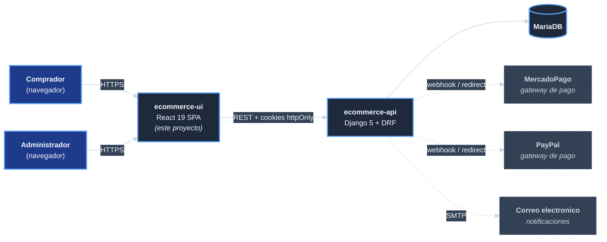

# Contexto y alcance del sistema

Este documento delimita **que entra y que sale** del sistema. El UI no
existe solo: es una pieza dentro de un sistema mayor (`ecommerce-ui`)
que incluye backend, base de datos, servidor web y proveedores externos
de pagos.

## Contexto de negocio

El UI es la **cara visible** del e-commerce de productos del catálogo.
Su responsabilidad de negocio es:

- Ofrecer al comprador una experiencia de busqueda, compra y postventa.
- Ofrecer al administrador un panel operativo para gestionar el catalogo, ordenes, devoluciones, soporte y configuracion del sistema.
- Mediar entre el comprador final y el backend, sin manejar dinero ni informacion sensible directamente.

## Diagrama de contexto

## Interfaces externas del UI

### Interfaces de entrada (lo que el UI recibe)

| Origen | Forma | Detalle |
|--------|-------|---------|
| Navegador del comprador | HTTPS | Carga de `index.html`, bundle JS+CSS desde Apache. Cookies httpOnly enviadas automaticamente. |
| Navegador del administrador | HTTPS | Igual que comprador, mas acceso a rutas `/admin/*` segun rol. |
| Backend Django (respuestas HTTP) | JSON | Cuerpos de respuesta a peticiones REST iniciadas por el UI. |
| Eventos `app:unauthorized` | `CustomEvent` interno | `apiService` dispara este evento cuando una respuesta es 401; `UnauthorizedListener` lo escucha y redirige al login (introducido en rama pendiente `claude/resume-ecommerce-project-Dm3ab`). |

### Interfaces de salida (lo que el UI produce)

| Destino | Forma | Detalle |
|---------|-------|---------|
| Backend Django | HTTP REST | Peticiones a `${API_URL}/api/v1/*` con cookies httpOnly. Sin Authorization header propio del UI. |
| Navegador (DOM) | HTML + CSS | Renderizado del estado actual de la SPA. |
| Console del navegador | Logs en desarrollo | Errores tipados (`TimeoutError`, `NetworkError`, etc) en console; desactivados en produccion. |
| Bundle analyzer | Reporte HTML | `npm run build:analyze` produce un reporte de composicion del bundle. |

## Lo que no es responsabilidad del UI

- **Persistir datos.** Toda persistencia es del backend.
- **Procesar pagos.** El UI redirige al gateway (MP o PayPal); el callback va al backend, no al UI. El UI solo refleja el estado.
- **Enviar correo.** El UI nunca llama servicios SMTP; los correos los emite el backend tras eventos de negocio.
- **Autorizar.** El UI **muestra u oculta** rutas segun `user.role`, pero la autoridad es el backend: si el UI muestra algo que el usuario no debe ver, el backend devuelve 403 al pedir el recurso.
- **Almacenar JWT.** Las cookies httpOnly son inaccesibles para JS; el UI nunca tiene el token en memoria.

## Alcance del codigo en este repositorio

| Dentro del repo | Fuera del repo |
|-----------------|----------------|
| Codigo fuente React/Redux/SCSS | Codigo backend (`ecommerce-api`) |
| Configuracion Webpack/Babel/Jest | Configuracion Apache, fail2ban, acme.sh (`ecommerce-server`) |
| Hooks de cliente (husky) | Esquemas de BD MariaDB |
| Mocks locales para desarrollo | Cuentas reales en MercadoPago/PayPal |
| Provisioner de Node para el host de build (`scripts/install.sh`) | Aprovisionamiento del servidor de produccion |
