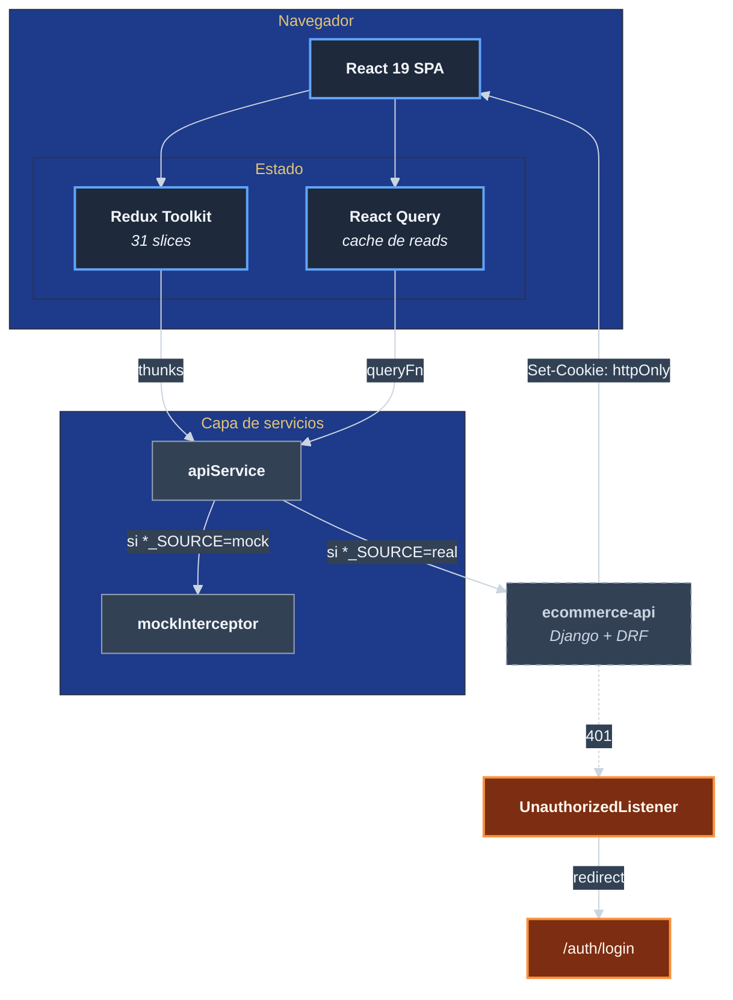

# Estrategia de solucion

Este documento condensa las **cinco decisiones fundamentales** que dan
forma al sistema. No son detalles de implementacion: son las elecciones
que, si se cambian, obligan a reescribir partes grandes del codigo.

## Decision uno: SPA client-side rendering con React 19

| Aspecto | Decision |
|---------|----------|
| Renderizado | 100% client-side. Sin SSR, sin SSG. |
| Hidratacion inicial | El servidor entrega un `index.html` minimal mas el bundle JS. |
| Routing | `react-router-dom@6` con `BrowserRouter` (history API). |
| Code splitting | Por ruta, con `React.lazy(() => import(...))`. |

**Por que.** El proyecto es una tienda con catalogo medio, no un sitio
de marketing con SEO critico. La complejidad operativa de SSR
(servidor Node de produccion, hidratacion, double rendering) no se
justifica. El bundle splitting por ruta es suficiente para tiempos de
carga razonables.

**Consecuencia.** El SEO publico depende de meta tags y de un futuro
prerender, no esta resuelto en este repo. Tampoco hay First Contentful
Paint optimizado para crawlers — esto es deuda asumida.

## Decision dos: Redux Toolkit como estado global + React Query para reads

| Aspecto | Decision |
|---------|----------|
| Estado global (UI, sesion, dominio escritura) | Redux Toolkit 2 (`@reduxjs/toolkit`) |
| Cache de reads remotos | React Query 5 (`@tanstack/react-query`) |
| Selectores | `reselect@4` |
| Store | Configurado en `src/redux/store.js` con 31 slices |

**Por que dos sistemas.** Redux maneja estado de UI (sidebar abierta,
modal activo) y datos que el usuario edita localmente (carrito antes
de checkout, formularios multi-paso). React Query maneja la cache
**vs el servidor**: invalidacion, refetch, retries — donde Redux
seria reinventar la rueda.

**Convencion observada.** Los hooks de dominio en `src/hooks/domain/`
(32 hooks: `useAdminProducts`, `useReturns`, `useNotifications`, etc.)
usan `useQuery` para reads y disparan thunks de Redux para writes que
afectan estado local.

## Decision tres: mock-first via feature flags por dominio

| Aspecto | Decision |
|---------|----------|
| Mecanismo | Variables de entorno `PY_<DOMINIO>_SOURCE` con valor `mock` o `real` |
| Dominios cubiertos | `AUTH`, `CATALOG`, `CART`, `PAYMENTS` (declarados en `.env.example`) |
| Implementacion | `src/mocks/mockInterceptor.js` invocado por `apiService` antes de la peticion HTTP real |

**Por que.** Permite construir y testear el UI sin depender del backend.
Cada desarrollador puede tener `AUTH_SOURCE=mock` y trabajar offline
en el catalogo, mientras otro tiene `CATALOG_SOURCE=real` validando
contratos contra el Django de staging.

**Consecuencia.** Hay dos verdades por dominio: la del mock y la del
contrato real. Cualquier cambio de contrato en backend requiere
actualizar el mock — esto es un riesgo conocido (ver
`riesgos-y-deuda-tecnica`).

## Decision cuatro: JWT solo en cookie httpOnly, jamas en JS

| Aspecto | Decision |
|---------|----------|
| Almacenamiento del token | Cookie httpOnly emitida por el backend |
| Envio en cada peticion | Automatico por el navegador (`credentials: 'include'`) |
| Estado de sesion en el UI | Reducido a `isAuthenticated: boolean` + perfil de usuario, **sin** el JWT |
| Manejo de expiracion | Backend devuelve 401 -> `apiService` dispara `app:unauthorized` -> `UnauthorizedListener` redirige a `/auth/login` |

**Por que.** XSS no puede robar lo que no esta en `document.cookie` ni
en `localStorage`. El UI no tiene control sobre el token, solo sobre
si se considera "logueado" hasta recibir un 401.

**Consecuencia.** Sin acceso al token no se puede:
- Decodificar el `exp` para mostrar un timer de sesion.
- Refresh proactivo: solo reactivo (al 401).

Esto es aceptado.

## Decision cinco: build-time vs runtime para configuracion

| Aspecto | Decision |
|---------|----------|
| `API_URL` | Inyectada en build time via `DefinePlugin` |
| Feature flags `*_SOURCE` | Inyectadas en build time |
| Resultado | El bundle es un artefacto inmutable por entorno |
| Cambio de URL | Requiere rebuild + redeploy |

**Por que.** No hay runtime de Node en produccion; no hay forma natural
de leer variables de entorno desde el navegador. Inyectarlas en el
bundle es honesto: si quieres cambiar `API_URL`, reconstruyes y
redespliegas.

**Hallazgo de la rama pendiente.** En la rama
`claude/resume-ecommerce-project-Dm3ab`, el commit `c9c3465` corrige
un bug donde `process.env.API_URL` se leia **fuera** del callback de
modo de webpack y por eso se ignoraba `.env.production`. Ahora se lee
**dentro** del callback, en el momento correcto del ciclo de webpack.
Este detalle esta documentado en `decisiones-de-arquitectura/`.

## Diagrama de bloques de la estrategia

