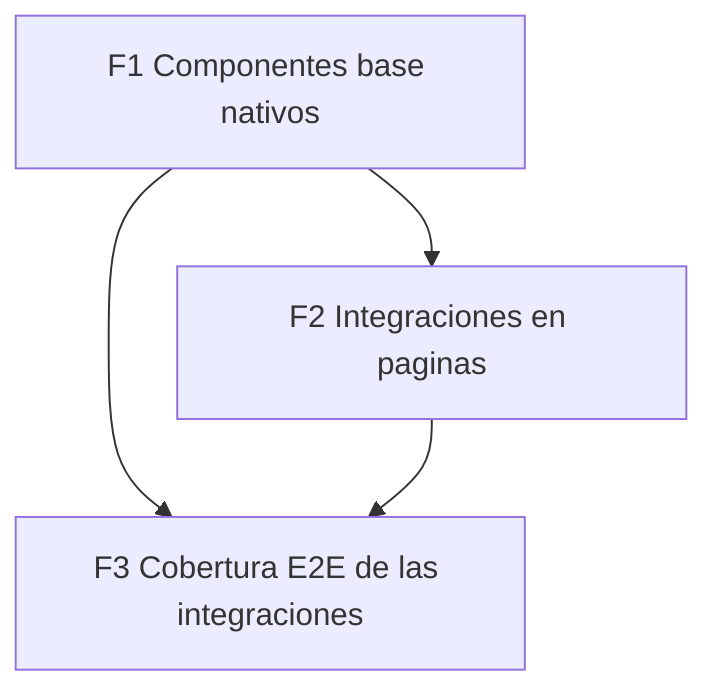

# Plan — componentes nativos (adaptar-componentes-kno-react)

**Creado:** 2026-06-02
**Estrategia:** un componente nativo por UC, con test, espejando las
convenciones del template (SCSS `@use '@styles/abstracts'`, tokens `--ec-*`,
JSX plano). Integración incremental por página. Verificación: jest + check-scss
+ build:demo antes de cerrar cada fase.

## FASE 1 — Componentes base nativos (HECHA)

Cuatro componentes propios bajo `src/components/common/`, con unit tests y
SCSS que compila. Construidos en paralelo (un agente por componente).

- [x] ProductGallery (UC-CAT-GAL) — 12 tests
- [x] FileUpload (UC-ADM-IMG) — 6 tests
- [x] GanttChart (UC-LOG-GANTT) — 9 tests
- [x] PdfViewer (UC-ORD-PDF) — 6 tests

Verificado: suite 1385 passed / 0 fallos; check-scss 153 entries clean;
`npm run build:demo` OK.

## FASE 2 — Integraciones en páginas (EN CURSO)

- [x] F2-T1 — ProductGallery en `ProductPage` (reemplaza la galería manual;
  estado `activeImg` eliminado).
- [ ] F2-T2 — FileUpload en `AdminProductDetailPage` (imágenes de producto) y
  `ProfilePage` (avatar).
- [ ] F2-T3 — GanttChart en una vista de logística/pedido del panel admin
  (requiere definir el origen de las etapas/fechas de fulfillment).
- [ ] F2-T4 — PdfViewer en `OrderDetailPage` (factura). **Bloqueado** por la
  decisión de la fuente del PDF (cliente vs mock MSW vs backend) — ver
  `ucs-componentes-nativos.md` UC-ORD-PDF.

## FASE 3 — Cobertura E2E de las integraciones (PENDIENTE)

- [ ] F3-T1 — Añadir checks en `tests/e2e/checks/` para las integraciones
  (galería en ficha; upload/gantt/pdf cuando estén integrados).

## Criterios de cierre

- [ ] UCs integrados en sus páginas (o documentada la razón de diferir).
- [x] Cada componente con unit tests verdes.
- [x] `node scripts/check-scss.mjs` clean.
- [x] `npm run build:demo` sin errores.
- [ ] Commit + push.
